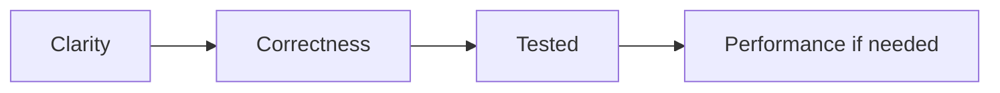
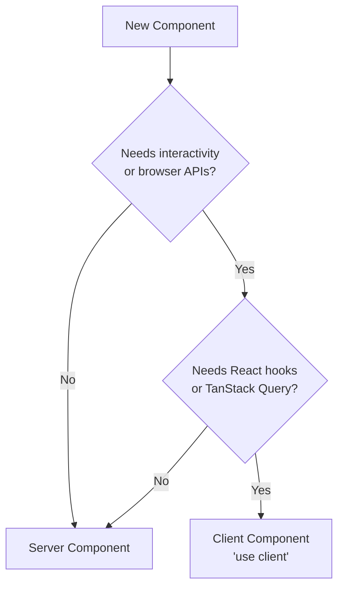
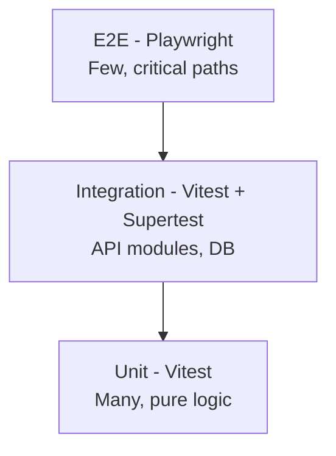
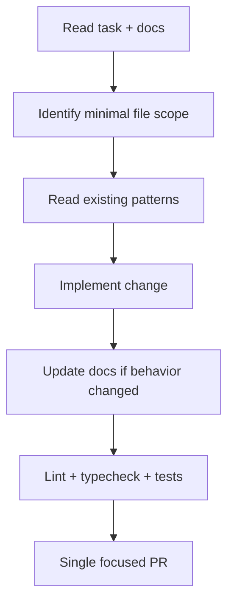

# Coding Standards

> **Document Type:** Engineering Standards  
> **Version:** 2.0.0  
> **Status:** Draft  
> **Owner:** Project Architecture Team  
> **Last Updated:** 2026  
> **Audience:** Frontend Developers, Backend Developers, DevOps Engineers, Open Source Contributors, AI Coding Assistants

---

## Table of Contents

1. [General Principles](#1-general-principles)
2. [TypeScript Standards](#2-typescript-standards)
3. [File Organization](#3-file-organization)
4. [Naming Conventions](#4-naming-conventions)
5. [React Standards](#5-react-standards)
6. [NestJS Standards](#6-nestjs-standards)
7. [Prisma Standards](#7-prisma-standards)
8. [API Standards](#8-api-standards)
9. [Error Handling](#9-error-handling)
10. [Logging](#10-logging)
11. [Security](#11-security)
12. [Performance](#12-performance)
13. [Testing](#13-testing)
14. [Documentation](#14-documentation)
15. [Git Standards](#15-git-standards)
16. [AI Coding Rules](#16-ai-coding-rules)
17. [Code Review Checklist](#17-code-review-checklist)
18. [Best Practices Summary](#18-best-practices-summary)

---

This document defines the **mandatory coding standards** for the entire AI Tool CMS v2 repository. All contributors—human and AI—must follow these rules when writing, reviewing, or generating code.

The goals are:

- **Consistency** across apps and packages in a large monorepo
- **Readability** for reviewers and future maintainers
- **Maintainability** over years of automated content growth
- **AI-friendly development** so assistants produce code aligned with project architecture

When standards conflict with an urgent fix, document the exception in the pull request and follow up with a standards update if the pattern should become permanent.

---

# 1. General Principles

These principles apply to every language, framework, and module in the repository.

### Readability Over Cleverness

Code is read far more often than it is written. Prefer clear control flow, descriptive names, and straightforward logic over dense one-liners, nested ternaries, or implicit behavior. If a reviewer needs more than a few seconds to understand intent, simplify.

### Consistency Over Personal Preference

Follow existing patterns in the file and module you are editing. Do not introduce alternate styles (different error shapes, naming schemes, or folder layouts) without team agreement and documentation update. Personal preference yields to repository conventions.

### Small Reusable Modules

Functions, components, and services should do one thing well. Extract shared logic into `packages/` when two or more apps need it. Avoid copy-paste across `apps/web` and `apps/admin`.

### Single Responsibility Principle

Each module, class, and function has one reason to change. Controllers route HTTP; services orchestrate use cases; repositories access data; DTOs validate input. Mixing concerns creates untestable blobs.

### Composition Over Inheritance

Prefer composing behavior from small units (hooks, services, utility functions) over deep inheritance hierarchies. React and NestJS both favor composition; inheritance is reserved for rare framework extension points.

### Prefer Explicit Code

Make dependencies, side effects, and failure modes visible. Explicit imports, typed return values, and named parameters (when arity is high) beat magic globals and implicit context.

### Avoid Premature Optimization

Measure before optimizing. Write correct, clear code first. Optimize hot paths—search queries, render loops, crawler batches—only when profiling or metrics justify it. Document optimization decisions in pull requests.



---

# 2. TypeScript Standards

The monorepo uses **TypeScript 5.x** with **strict mode** enabled via `tsconfig.base.json`. All apps and packages extend this configuration.

### Compiler and Type Rules

| Rule | Requirement | Rationale |
|---|---|---|
| **Strict mode** | `"strict": true` always | Catches null, implicit any, and unsafe operations at compile time |
| **No `any`** | Forbidden except documented escape hatches | `any` disables the primary safety benefit of TypeScript; use `unknown` and narrow |
| **Prefer `interface`** | For object shapes and public contracts | Interfaces are extensible and read well for DTOs and component props |
| **Use `type` for utilities** | Unions, intersections, mapped types, tuples | `type` is appropriate for compositional type algebra |
| **`readonly` whenever possible** | Props, config objects, returned arrays that must not mutate | Prevents accidental mutation; documents immutability intent |
| **No `enum`** | Use `const` objects + union types | Enums generate runtime code and have awkward interop; const assertions are tree-shakeable |
| **Const assertion** | `as const` for literal unions and config maps | Produces narrow literal types without enums |
| **Avoid `namespace`** | Use ES modules | Namespaces conflict with module bundlers and modern tooling |

### Enum Alternative Pattern

Use a const object with a derived union type instead of TypeScript `enum`:

| Avoid | Prefer |
|---|---|
| `enum ToolStatus { DRAFT, PUBLISHED }` | `const ToolStatus = { Draft: 'DRAFT', Published: 'PUBLISHED' } as const` + `type ToolStatus = typeof ToolStatus[keyof typeof ToolStatus]` |

Prisma schema enums are an exception—they are database-level and generated into the client.

### Import Standards

- Use **explicit named imports**; avoid `import * as`.
- Prefer **type-only imports**: `import type { Foo } from './foo'`.
- Workspace packages: `import { buildMetadata } from '@ai-tool-cms/seo'`.
- No circular dependencies between packages; resolve by extracting shared types to `@ai-tool-cms/types`.

### Null and Undefined

- Prefer **optional chaining** and **nullish coalescing** over manual null checks when readability improves.
- API boundaries must **normalize** optional fields—do not leak ambiguous `null | undefined` shapes to clients without documentation.

---

# 3. File Organization

Predictable file structure reduces navigation cost and enables automated tooling.

### Size Limits

| Artifact | Soft Limit | Hard Limit | Action When Exceeded |
|---|---|---|---|
| **File length** | 300 lines | 500 lines | Split by responsibility into submodules |
| **Function length** | 30 lines | 50 lines | Extract helpers or private methods |
| **Class length** | 200 lines | 350 lines | Split into focused services or use composition |
| **Component length** | 150 lines | 250 lines | Extract subcomponents and hooks |

Limits are guidelines, not dogma. A 60-line function with a clear single purpose is acceptable; a 30-line function with nested conditionals is not.

### Folder Organization

| Location | Convention |
|---|---|
| **Apps** | Feature-first under `src/`: `tools/`, `categories/`, `auth/` |
| **Packages** | Flat `src/` with domain files or `src/{domain}/` for larger packages |
| **Tests** | Colocated `*.spec.ts` / `*.test.ts` or parallel `test/` directory per app convention |
| **DTOs** | `dto/` subdirectory inside each NestJS feature module |

### Index Files and Barrel Exports

- Each package exposes a **single public entry**: `src/index.ts`.
- **Barrel exports** (`export * from './foo'`) are allowed only at package boundaries—not deep inside feature folders.
- Avoid barrel files in `apps/` that re-export entire trees; they harm tree-shaking and obscure dependency graphs.
- Deep imports into package internals (`@ai-tool-cms/seo/dist/metadata`) are **forbidden**—use documented `exports` in `package.json`.

### Feature-First Organization

Organize by **business capability**, not technical layer:

| Prefer | Avoid |
|---|---|
| `apps/api/src/tools/tools.controller.ts` | `apps/api/src/controllers/tool.controller.ts` |
| `apps/web/src/app/tools/[slug]/page.tsx` | `apps/web/src/pages/tool-detail.tsx` (Pages Router legacy) |

Shared technical layers belong in `packages/`, not duplicated per app.

---

# 4. Naming Conventions

Consistent naming enables search, codegen, and AI assistants to infer correct patterns.

### Summary Table

| Category | Convention | Example |
|---|---|---|
| **Variables** | camelCase | `toolCount`, `isPublished` |
| **Functions** | camelCase, verb prefix | `getToolBySlug()`, `buildMetadata()` |
| **Interfaces** | PascalCase, no `I` prefix | `ToolResponse`, `PaginatedResult` |
| **Types** | PascalCase | `ToolStatus`, `SeoPageInput` |
| **Enums (if required)** | PascalCase name, PascalCase or SCREAMING members per domain | Avoid TS enums; Prisma enums: `ToolStatus` |
| **React Components** | PascalCase | `ToolCard`, `JsonLd` |
| **Hooks** | camelCase, `use` prefix | `useToolSearch()`, `useAuth()` |
| **Services** | PascalCase + `Service` suffix | `ToolsService`, `AuthService` |
| **Controllers** | PascalCase + `Controller` suffix | `ToolsController` |
| **Repositories** | PascalCase + `Repository` suffix (if used) | `ToolRepository` |
| **DTOs** | PascalCase + `Dto` suffix | `CreateToolDto`, `QueryToolsDto` |
| **Entities** | PascalCase, matches Prisma model | `Tool`, `Category` |
| **Constants** | SCREAMING_SNAKE_CASE | `MAX_PAGE_SIZE`, `DEFAULT_LOCALE` |
| **Environment variables** | SCREAMING_SNAKE_CASE | `DATABASE_URL`, `JWT_SECRET` |
| **Database tables** | snake_case, plural | `tools`, `tool_categories` |
| **Prisma models** | PascalCase singular | `Tool`, `ToolCategory` with `@@map("tools")` |

### Files and Directories

| Type | Convention | Example |
|---|---|---|
| **Directories** | kebab-case | `crawler-core`, `online-tools` |
| **TypeScript files** | kebab-case or dot-suffix | `tools.service.ts`, `create-tool.dto.ts` |
| **React component files** | kebab-case or PascalCase (match team default in app) | `tool-card.tsx` or `ToolCard.tsx`—be consistent within app |
| **Test files** | same base + `.spec.ts` / `.test.ts` | `tools.service.spec.ts` |

### Boolean Naming

Prefix with `is`, `has`, `can`, `should`:

- `isActive`, `hasPermission`, `canPublish`, `shouldIndex`

### API and URL Naming

- REST paths: **kebab-case**, plural nouns: `/tools`, `/tool-categories`
- Query params: **camelCase** in JSON bodies; **snake_case** acceptable in query strings if documented

---

# 5. React Standards

Applies to `apps/web`, `apps/admin`, and `apps/docs`.

### Component Model

| Rule | Detail |
|---|---|
| **Functional components only** | No class components |
| **Server Components first** | Default in Next.js App Router; no `'use client'` unless needed |
| **Client Components only when needed** | Interactivity, browser APIs, hooks, event handlers |
| **One component per file** | Named export matching filename (default export allowed for Next.js pages) |

### Server vs Client Decision



### Custom Hooks

- Prefix with `use`; return stable shapes (objects with named fields).
- Hooks contain **reusable stateful logic**, not JSX.
- Do not call hooks conditionally or inside loops.

### TanStack Query (Admin)

- Use for **client-side server state** in Admin: lists, detail fetches, mutations.
- Query keys as **arrays** with hierarchical structure: `['tools', 'list', filters]`.
- Invalidate related queries after mutations.
- Prefer `staleTime` and `gcTime` configuration over manual cache hacking.

### Suspense and Lazy Loading

- Wrap async Server Components in `<Suspense>` with meaningful fallbacks.
- `dynamic()` import for heavy Client Components (charts, rich editors).
- Do not lazy-load above-the-fold critical content on public Web pages.

### Memoization Rules

| Use | Avoid |
|---|---|
| `useMemo` / `useCallback` when profiling shows benefit | Memoizing every callback by default |
| `React.memo` on expensive pure list items | Memo on tiny components |
| Stable query keys and server-side caching | Client-side duplication of SSR data |

**Default: no memoization.** Add when React DevTools or profiling proves unnecessary re-renders.

### Styling

- **Tailwind CSS** utility classes; avoid inline styles except dynamic values.
- Use `@ai-tool-cms/ui` and shadcn/ui primitives in Admin.
- Design tokens via Tailwind config—no hardcoded hex in components when a token exists.

---

# 6. NestJS Standards

Applies to `apps/api` and backend-oriented modules.

### Layer Responsibilities

| Layer | Responsibility | Must Not |
|---|---|---|
| **Controller** | HTTP routing, status codes, guard application | Contain business logic or direct Prisma calls |
| **Service** | Use case orchestration, transactions, domain rules | Know about HTTP request/response objects |
| **Repository** | Data access abstraction (optional; Prisma often in service) | Contain HTTP or validation logic |
| **DTO** | Input/output shape + validation decorators | Contain behavior |
| **Module** | Wire providers, imports, exports | Become a god-module importing everything |

### Module Structure

```
apps/api/src/tools/
├── tools.module.ts
├── tools.controller.ts
├── tools.service.ts
├── dto/
│   ├── create-tool.dto.ts
│   ├── update-tool.dto.ts
│   └── query-tools.dto.ts
└── tools.service.spec.ts
```

### Validation

- All request bodies use **DTO classes** with `class-validator` decorators.
- Enable **global ValidationPipe** with `whitelist: true` and `forbidNonWhitelisted: true`.
- Transform query params with `class-transformer` where types are non-string.

### Dependency Injection

- Register services in module `providers`; export only what other modules need.
- Inject via constructor—no property injection.
- Use interfaces for test doubles only when abstraction adds value; avoid over-engineering.

### Error Handling

- Throw **NestJS HTTP exceptions** (`NotFoundException`, `BadRequestException`) from services.
- Use a **global exception filter** for consistent error response shape.
- Never expose stack traces or internal errors to clients in production.

### Logging

- Inject logger per service class context (`ToolsService`).
- Log at `info` for successful mutations, `warn` for expected failures, `error` for unexpected exceptions.

### Swagger

- Every public endpoint documents `@ApiTags`, `@ApiOperation`, `@ApiResponse`.
- DTOs use `@ApiProperty` for schema generation.
- Keep `/docs` in sync with controllers—undocumented endpoints are incomplete.

---

# 7. Prisma Standards

Database access is centralized in `prisma/schema.prisma` and consumed via `@ai-tool-cms/database`.

### Model Naming

| Element | Convention |
|---|---|
| **Model name** | PascalCase singular: `Tool`, `Category` |
| **Table name** | snake_case plural via `@@map("tools")` |
| **Field name** | camelCase in schema with `@map("snake_case")` for columns |
| **Relation fields** | camelCase, descriptive: `categories`, `tools` |

### Relations

- Define **both sides** of relations with explicit `onDelete` behavior.
- Use junction models for many-to-many: `ToolCategory`, `ToolTag`.
- Avoid implicit many-to-many except for simple prototypes—explicit junction tables support metadata and timestamps.

### Indexes

- **Unique indexes** on `slug`, `email`, and natural keys.
- **Composite indexes** for common query patterns: `(status, published_at)`, `(tool_id, category_id)`.
- Document index rationale in migration PR description.

### Migrations

- One logical change per migration when possible.
- Migration names descriptive: `add_tool_pricing_enum`, not `migration_2`.
- Never edit applied production migrations—create a new migration to fix.
- Review generated SQL in PRs for destructive operations.

### Transactions

- Use `prisma.$transaction()` for multi-step writes that must succeed or fail together.
- Keep transactions **short**—no external API calls inside transactions.
- Prefer interactive transactions only when read-then-write consistency is required.

### Soft Delete

- Prefer **status enums** (`DRAFT`, `PUBLISHED`, `ARCHIVED`) over `deleted_at` unless audit requirements demand soft delete.
- If soft delete is used, add partial indexes excluding deleted rows for hot queries.

### Seed Strategy

- `prisma/seed.ts` is **idempotent**—safe to run multiple times.
- Seeds provide: RBAC baseline, admin user (dev only), reference categories.
- No production secrets in seed files; use environment-specific seed guards.

---

# 8. API Standards

All HTTP APIs follow RESTful conventions documented in `docs/03-api/` (planned).

### RESTful Conventions

| Method | Usage | Example |
|---|---|---|
| `GET` | Read resource or collection | `GET /tools`, `GET /tools/:id` |
| `POST` | Create resource | `POST /tools` |
| `PUT` | Full replace | `PUT /tools/:id` |
| `PATCH` | Partial update (if supported) | `PATCH /tools/:id` |
| `DELETE` | Remove or archive | `DELETE /tools/:id` |

- Nouns in paths, not verbs: `/tools`, not `/getTools`.
- Nested resources limited to one level: `/tools/:id/categories`—avoid deep nesting.

### Pagination

Standard query parameters:

| Param | Type | Default | Max |
|---|---|---|---|
| `page` | number | 1 | — |
| `limit` | number | 20 | 100 |
| `sort` | string | `createdAt` | whitelisted fields only |
| `order` | `asc` \| `desc` | `desc` | — |

Response envelope:

| Field | Description |
|---|---|
| `data` | Array of items |
| `meta.page` | Current page |
| `meta.limit` | Page size |
| `meta.total` | Total count |
| `meta.totalPages` | Computed page count |

### Filtering

- Whitelist filterable fields per endpoint.
- Document supported filters in OpenAPI.
- Reject unknown filter keys with `400 Bad Request`.

### Sorting

- Whitelist sortable columns—never pass user input directly to `orderBy`.
- Default sort documented per endpoint.

### Error Format

Consistent JSON error body:

| Field | Description |
|---|---|
| `statusCode` | HTTP status code |
| `message` | Human-readable summary |
| `error` | Error class name |
| `details` | Optional validation field errors array |
| `requestId` | Correlation ID for support |

### Versioning

- URL prefix: `/v1/tools`.
- Breaking changes require new major version; deprecate old version with `Sunset` header and minimum 90-day window.

### HTTP Status Code Usage

| Code | When to Use |
|---|---|
| `200 OK` | Successful GET, PUT, PATCH |
| `201 Created` | Successful POST creating a resource; include `Location` header |
| `204 No Content` | Successful DELETE with no response body |
| `400 Bad Request` | Validation failure, malformed input |
| `401 Unauthorized` | Missing or invalid authentication |
| `403 Forbidden` | Authenticated but insufficient permissions |
| `404 Not Found` | Resource does not exist or is not visible to caller |
| `409 Conflict` | Unique constraint violation, state conflict |
| `422 Unprocessable Entity` | Semantic validation failure (optional; `400` also acceptable if consistent) |
| `429 Too Many Requests` | Rate limit exceeded |
| `500 Internal Server Error` | Unexpected server failure |

### Authentication Headers

| Header | Usage |
|---|---|
| `Authorization: Bearer <token>` | JWT access token for Admin and API clients |
| `X-Request-Id` | Client may supply; server generates if absent |
| `Accept-Language` | Locale negotiation for localized error messages (future) |

### Idempotency

- `PUT` and `DELETE` must be idempotent.
- `POST` create operations return `409` on duplicate unique keys.
- Worker and webhook handlers that replay must use idempotency keys stored in Redis or database.

### Webhooks (Planned)

- Outbound webhooks sign payloads with HMAC-SHA256.
- Retry with exponential backoff; dead-letter after configured attempts.
- Subscribers documented in OpenAPI extension or dedicated `docs/03-api/webhooks.md`.

---

# 9. Error Handling

Errors must be **predictable, loggable, and safe** for clients.

### Backend

| Scenario | Handling |
|---|---|
| Validation failure | `400` with field-level `details` |
| Unauthorized | `401` without leaking whether email exists |
| Forbidden | `403` with generic message |
| Not found | `404`—do not reveal existence of protected resources |
| Conflict | `409` for unique constraint violations |
| Unexpected | `500` logged with full context; client sees generic message |

- Catch Prisma errors (`P2002`, etc.) and map to appropriate HTTP exceptions.
- Never swallow errors silently.

### Frontend

- Display user-friendly messages; log technical details to console only in development.
- TanStack Query: use `onError` for toast notifications; avoid duplicate error UI per component.
- Form errors map server `details` to field-level messages.

### Global Error Boundary

- Admin and Web Client trees include **error boundaries** for unexpected render failures.
- `error.tsx` and `global-error.tsx` in Next.js App Router for route-level recovery.

### Retry Strategy

| Context | Strategy |
|---|---|
| Idempotent GET | TanStack Query retry 1–3 times with backoff |
| Mutations | No automatic retry unless idempotent by design |
| Background jobs | BullMQ retry with exponential backoff; dead-letter queue after max attempts |
| AI provider calls | Circuit breaker + fallback provider per `@ai-tool-cms/ai` config |

### Logging

Every caught exception logs: `requestId`, user ID (if authenticated), error name, message, stack (server only).

---

# 10. Logging

Structured logging via **Pino** through `@ai-tool-cms/logger`.

### Log Levels

| Level | Usage |
|---|---|
| `fatal` | Process cannot continue |
| `error` | Unexpected failure requiring attention |
| `warn` | Expected failure, deprecation, retry |
| `info` | Significant business events: login, publish, crawl complete |
| `debug` | Development diagnostics |
| `trace` | Verbose tracing (disabled in production) |

### Request ID

- Every HTTP request receives a **unique correlation ID** (`X-Request-Id` header).
- Propagate through service calls and worker jobs originating from the request.

### Trace ID

- Future OpenTelemetry integration will align `traceId` with `requestId` for distributed tracing.
- Background jobs inherit parent trace context when enqueued from HTTP handlers.

### Background Jobs

Log at job start, completion, duration, and failure with:

- `jobId`, `queueName`, `attempt`, `payload` summary (no secrets)

### Audit Logs

Security-sensitive actions require audit records:

- User login/logout, role changes, permission grants
- Content publish/unpublish, bulk deletes
- API key creation and revocation

Audit logs are **append-only**, stored separately from application debug logs, retained per compliance policy.

---

# 11. Security

Security is mandatory, not optional. See also [TechStack.md](./TechStack.md#12-security).

### Controls Summary

| Area | Standard |
|---|---|
| **JWT** | Short-lived access tokens; refresh rotation; revoke on logout |
| **RBAC** | Permission checks on every protected route; never trust client-side checks alone |
| **Input validation** | DTO + Zod at boundaries; reject unknown fields |
| **Output encoding** | React escapes by default; sanitize rich HTML if rendered |
| **SQL injection** | Prisma parameterized queries only; no string-concatenated SQL |
| **XSS** | CSP headers via Helmet; avoid `dangerouslySetInnerHTML` except JSON-LD with serialized schema |
| **CSRF** | SameSite cookies; CSRF tokens for cookie-based Admin flows |
| **Rate limiting** | Redis-backed throttling on auth, search, and AI endpoints |
| **Secrets** | Environment variables or secrets manager—never in git |
| **Environment variables** | Validated at startup via `@ai-tool-cms/config`; fail fast if required vars missing |

### Dependency Security

- Dependabot enabled; patch-level security updates merged after CI pass.
- No packages with known critical CVEs in production dependencies.

---

# 12. Performance

Performance targets are defined in [TechStack.md](./TechStack.md#13-performance-targets). Code standards support those targets.

### React

- Avoid unnecessary re-renders (see memoization rules).
- Prefer Server Components to reduce client bundle size.
- Split code with `dynamic()` for admin analytics and heavy editors.

### Database

- Select only required fields—no `findMany()` without `select` on large tables in hot paths.
- Use pagination always for list endpoints.
- Add indexes before deploying queries that scan large tables.
- Use `explain analyze` in development for suspicious queries.

### Caching

| Layer | Use |
|---|---|
| **Redis** | Session, rate limits, hot tool records, computed aggregates |
| **CDN** | Static assets, ISR pages, optimized images |
| **TanStack Query** | Admin client cache with explicit invalidation |
| **HTTP cache headers** | Public read-only endpoints where appropriate |

### Lazy Loading, Streaming, Compression

- Next.js **streaming** for slow Server Component subtrees.
- **gzip/brotli** at reverse proxy (nginx).
- Images via CDN with WebP/AVIF and responsive `srcset`.

### Image Optimization

- Use Next.js `Image` component on Web.
- Store originals in object storage; serve transformed variants from CDN.
- Explicit `width`/`height` or aspect ratio to prevent CLS.

---

# 13. Testing

Testing strategy aligns with [TechStack.md](./TechStack.md#10-testing).

### Test Pyramid



### Unit Tests

- Pure functions, validators, SEO builders, auth helpers, AI output parsers.
- Fast, no network, no database.
- File naming: `*.spec.ts` adjacent to source or in `__tests__/`.

### Integration Tests

- NestJS modules with test database (testcontainers or dedicated test DB).
- Verify HTTP status, response shape, and database state.
- Run migrations before suite.

### E2E Tests

- Playwright for Web and Admin: login, tool list, create tool, public page render.
- Run against staging or ephemeral preview environment in CI.

### Coverage Targets

| Package / App | Minimum Line Coverage |
|---|---|
| `@ai-tool-cms/auth`, `@ai-tool-cms/seo` | 80% |
| `apps/api` services | 70% |
| `apps/web`, `apps/admin` | 50% (UI); critical paths E2E covered |
| New packages | 70% from introduction |

Coverage is a floor, not a ceiling. Meaningful assertions matter more than percentage gaming.

### Test Data Management

- Use **factories or builders** for test entities—avoid copy-paste fixture objects.
- Reset database state between integration tests via transaction rollback or dedicated test schema.
- Never run tests against production or shared staging databases.

### CI Test Execution

| Stage | Tests Run |
|---|---|
| Pull request | Lint, typecheck, unit tests, build |
| Merge to main | Full unit + integration suite |
| Nightly / pre-release | E2E Playwright against staging |
| Release tag | Smoke tests on production after deploy |

### Flaky Tests

- Flaky tests are **bugs**—fix or quarantine with tracked issue; do not retry indefinitely in CI without investigation.
- Avoid time-dependent assertions; use fixed clocks or wait utilities in Playwright.

---

# 14. Documentation

Documentation is part of the definition of done.

### Requirements

| Artifact | When Required |
|---|---|
| **Public API documented** | Every new or changed endpoint has Swagger decorators |
| **Package README** | Every `packages/*` has README with purpose, install, and public API summary |
| **Architecture Decision Records** | Significant technical forks documented in `.ai/decisions/` or `docs/01-architecture/adr/` |
| **Inline comments** | Only for non-obvious business rules, security constraints, or external system quirks |
| **Behavior changes** | Update relevant `docs/` and `spec/` in the same PR as code |

### What Not to Document in Code

- Obvious code behavior (`// increment counter`)
- Git blame history (the code should be self-explanatory)
- Commented-out code—delete it; git retains history

### Cross-References

Link to [FolderStructure.md](./FolderStructure.md), [TechStack.md](./TechStack.md), and domain specs in `spec/` from package READMEs where relevant.

---

# 15. Git Standards

### Commits

| Rule | Detail |
|---|---|
| **Small commits** | One logical change per commit; easier review and revert |
| **Conventional Commits** | `feat:`, `fix:`, `docs:`, `chore:`, `refactor:`, `test:` prefixes |
| **Scope optional** | `feat(api):`, `fix(web):`, `docs(project):` |
| **Imperative mood** | `add tool CRUD`, not `added` or `adds` |
| **No direct push to production** | All changes via PR to `main`; production deploy from tagged releases |

### Branch Naming

| Pattern | Example |
|---|---|
| `cursor/{description}-c760` | Cloud agent branches |
| `feat/{short-description}` | Feature work |
| `fix/{short-description}` | Bug fixes |
| `docs/{short-description}` | Documentation only |

Use **kebab-case**, lowercase, no abbreviations.

### Pull Request Requirements

- Linked issue or task reference when applicable
- Description: what, why, how to test
- Screenshots for UI changes
- Migration notes for database changes
- Checklist completed (see Section 17)
- At least one approval before merge (project policy)
- CI green: lint, typecheck, test, build

---

# 16. AI Coding Rules

These rules apply to **Cursor, Claude Code, GitHub Copilot**, and any automated code generation.

### Mandatory Rules

| Rule | Detail |
|---|---|
| **Never rewrite unrelated files** | Change only files required for the task |
| **Never rename modules without approval** | Renames break imports across the monorepo |
| **Always preserve architecture** | Respect apps vs packages boundaries and dependency rules |
| **Always generate production-ready code** | No placeholders, TODO stubs, or `// rest of code` omissions |
| **Always update documentation when changing behavior** | Same PR as code changes |
| **Always write deterministic code** | No random behavior in business logic; seed test randomness |
| **Follow existing patterns** | Read neighboring files before generating new code |
| **No `any` types** | Unless explicitly approved with comment |
| **No new dependencies without justification** | Prefer existing stack; document new packages in PR |
| **No secrets in generated code** | Use environment variables |
| **Run lint and typecheck mentally** | Generated code must compile under strict TypeScript |
| **Respect file size limits** | Split large generated files into modules |
| **Do not delete tests** to make CI pass—fix tests or code |
| **Do not disable lint rules** globally—fix violations or narrow disable scope with reason |
| **Prefer editing over creating** | Extend existing modules before adding parallel implementations |

### AI Workflow



### Context Files AI Should Load

Before structural changes, consult:

- `docs/00-project/FolderStructure.md`
- `docs/00-project/TechStack.md`
- `docs/00-project/CodingStandards.md` (this document)
- Relevant `spec/` file for the domain
- `.cursor/rules/` for scoped conventions

---

# 17. Code Review Checklist

Reviewers and authors use this checklist before merge.

### Build and Quality

- [ ] Code compiles (`pnpm build`)
- [ ] Typecheck passes (`pnpm typecheck`)
- [ ] Lint passes (`pnpm lint`)
- [ ] Tests pass (`pnpm test`)
- [ ] New/changed behavior has tests
- [ ] No dead code, commented-out blocks, or unused imports

### Architecture

- [ ] Changes respect apps/packages dependency rules
- [ ] No business logic added to shared packages inappropriately
- [ ] Feature follows existing module structure
- [ ] No circular dependencies introduced

### API and Data

- [ ] API changes documented in Swagger
- [ ] DTO validation on all inputs
- [ ] Pagination/filtering follows standards
- [ ] Prisma migration reviewed (if applicable)
- [ ] Seed updated if reference data changed

### Security

- [ ] Authentication and authorization applied to new endpoints
- [ ] No secrets or credentials in code
- [ ] User input validated and sanitized
- [ ] Rate limiting considered for public endpoints

### Performance

- [ ] Database queries indexed and paginated
- [ ] No N+1 queries introduced
- [ ] Heavy operations moved to worker queues
- [ ] Client bundle impact considered for new dependencies

### Documentation

- [ ] `docs/` or `spec/` updated for behavior changes
- [ ] Package README updated for new public APIs
- [ ] CHANGELOG entry if user-facing (project policy)

### UX and Accessibility (Frontend)

- [ ] Accessible labels and keyboard navigation (Admin)
- [ ] Loading and error states handled
- [ ] No layout shift regressions on public pages

---

# 18. Best Practices Summary

Twenty golden rules for AI Tool CMS v2 development:

1. **Readability beats cleverness**—write code for the next maintainer.
2. **Strict TypeScript always**—no `any`, no implicit untyped escape hatches.
3. **One responsibility per module**—controllers route, services orchestrate, packages encapsulate.
4. **Server Components first**—add `'use client'` only with justification.
5. **Validate every boundary**—DTOs on API, Zod on forms, Prisma at persistence.
6. **Never skip pagination** on list endpoints and large queries.
7. **Log with correlation IDs**—every request and job is traceable.
8. **Fail closed on auth**—deny by default; explicit permission grants only.
9. **Document in the same PR** as behavior changes.
10. **Small, focused commits** with conventional commit messages.
11. **Test behavior, not implementation**—meaningful assertions over coverage gaming.
12. **Queue slow work**—AI, crawls, and bulk SEO updates belong in workers.
13. **Index before scale**—add database indexes when query patterns are known.
14. **No secrets in git**—environment variables and secrets managers only.
15. **Respect package boundaries**—apps do not import other apps.
16. **OpenAPI is the API contract**—undocumented endpoints are incomplete.
17. **Prefer composition** over inheritance and god-classes.
18. **Optimize when measured**—profile before micro-optimizing renders or queries.
19. **AI-generated code gets human review**—same standards as hand-written code.
20. **When in doubt, follow existing patterns** in the nearest neighboring file.

---

## Related Documents

- [Project Overview](./README.md) — Entry point for AI Tool CMS v2 documentation
- [Folder Structure](./FolderStructure.md) — Repository layout and dependency rules
- [Technology Stack](./TechStack.md) — Technology decisions and rationale
- [Product Vision](./Vision.md) — Long-term product vision and guiding principles

---

**Document Version**

| Field | Value |
|---|---|
| Version | 2.0.0 |
| Status | Draft |
| Owner | Project Architecture Team |
| Last Updated | 2026 |
