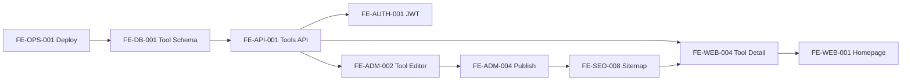
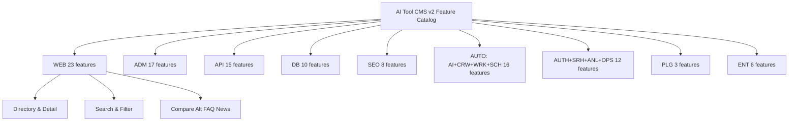
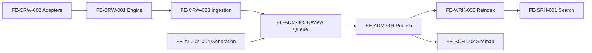
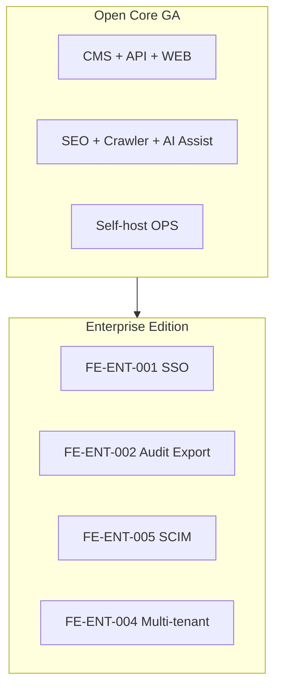

# Feature Catalog

> **Document Type:** Enterprise Feature Matrix (Master Index)  
> **Version:** 2.0.0  
> **Status:** Draft  
> **Owner:** Product Architecture Team  
> **Last Updated:** 2026  
> **Audience:** Product Managers, Software Architects, Developers, QA Engineers, Open Source Contributors, AI Coding Assistants

---

## Table of Contents

1. [Purpose](#purpose)
2. [How to Use This Catalog](#how-to-use-this-catalog)
3. [Conventions](#conventions)
4. [Master Feature Matrix](#master-feature-matrix)
5. [Module Feature Details](#module-feature-details)
6. [API Registry](#api-registry)
7. [Data Model Registry](#data-model-registry)
8. [Traceability Matrix](#traceability-matrix)
9. [Test Coverage Strategy](#test-coverage-strategy)
10. [Mermaid Diagrams](#mermaid-diagrams)

---

## Purpose

This document is the **authoritative Feature Catalog** for AI Tool CMS v2—the single master index that development, testing, documentation, and AI-assisted implementation must reference. Unlike a flat feature checklist, each entry traces a capability through:

| Dimension | What It Answers |
|---|---|
| **Feature ID** | Stable identifier for PRs, issues, and test plans |
| **Module** | Monorepo ownership (`apps/*`, `packages/*`) |
| **Version** | MVP, GA (v2.0 open core), or Enterprise |
| **Priority** | Release sequencing |
| **Dependencies** | Build order and integration risk |
| **User Stories** | Link to [UserStories.md](./UserStories.md) BDD requirements |
| **APIs** | REST contract surface |
| **Data Models** | Prisma entities and relationships |
| **SEO Impact** | Indexability and structured-data obligations |
| **AI Automation** | Crawler, worker, and generation involvement |
| **Test Coverage** | Required verification layers |

Related documents: [Scope.md](./Scope.md), [UserStories.md](./UserStories.md), [FolderStructure.md](./FolderStructure.md), [NamingConvention.md](./NamingConvention.md), [ReleaseStrategy.md](./ReleaseStrategy.md).

**Business and architectural requirements only**—no implementation code.

---

## How to Use This Catalog

| Role | Workflow |
|---|---|
| **Product** | Prioritize by `Priority` + `Version`; validate scope via Feature ID in roadmap items |
| **Architecture** | Map Feature ID → module boundary; resolve `Dependencies` before design review |
| **Development** | Reference Feature ID in commit messages (`feat(web): FE-WEB-004 tool detail page`) |
| **QA** | Derive test suites from `Test Coverage` column + linked User Story BDD scenarios |
| **Docs** | Cross-link API and data model docs using Feature ID anchors |
| **AI Assistants** | Implement only documented features; cite `FE-*` ID in generated PR descriptions |

### Reference Syntax

```
Feature: FE-API-001
Story:   US-ED-001, US-DV-007
API:     GET /v1/tools
Model:   Tool, ToolCategory
```

---

## Conventions

### Feature ID Format

```
FE-{MODULE}-{NNN}
```

| Module Code | Owner | Description |
|---|---|---|
| `WEB` | `apps/web` | Public visitor surfaces |
| `ADM` | `apps/admin` | Admin CMS UI |
| `API` | `apps/api` | REST API and OpenAPI |
| `DB` | `packages/database`, `prisma/` | Persistence layer |
| `SEO` | `packages/seo` | Metadata, sitemap, JSON-LD |
| `AUTH` | `packages/auth` | Identity and RBAC |
| `SRH` | Search integration | Meilisearch indexing and query |
| `AI` | `packages/ai` | LLM provider abstraction |
| `CRW` | `apps/crawler` | Multi-source ingestion |
| `WRK` | `apps/worker` | Background jobs |
| `SCH` | `apps/scheduler` | Cron and scheduled tasks |
| `ANL` | Analytics module | Traffic and catalog metrics |
| `PLG` | Plugin runtime | Extension system |
| `ENT` | Enterprise edition | SSO, audit, compliance |
| `OPS` | DevOps / platform | Deploy, backup, health |

### Version Tier

| Tier | Meaning | Target Release |
|---|---|---|
| **MVP** | Minimum viable loop; platform unusable without it | v1.0 / initial open core |
| **GA** | General Availability in open core v2.0 | v2.0 stable |
| **Enterprise** | Commercial or compliance edition | Enterprise / Cloud |

### Priority

| Level | Definition |
|---|---|
| **Critical** | Blocker for tier delivery |
| **High** | Core value; expected in tier |
| **Medium** | Important; deferrable within tier |
| **Low** | Future, plugin, or nice-to-have |

### SEO Impact

| Level | Meaning |
|---|---|
| **Critical** | Public indexable URL; sitemap + metadata mandatory |
| **High** | Affects crawl budget or rich results |
| **Medium** | Indirect SEO (internal links, schema support) |
| **Low** | Minimal or noindex surfaces |
| **None** | Admin, API, or operational only |

### AI Automation

| Level | Meaning |
|---|---|
| **Full-Auto** | Runs without human gate (e.g., sitemap regen) |
| **Semi-Auto** | AI/crawler produces draft; human publishes |
| **Assisted** | AI suggests; human accepts/edits |
| **None** | Manual or rule-based only |

### Test Coverage Codes

| Code | Layer |
|---|---|
| **U** | Unit tests |
| **I** | Integration tests (DB, Redis, queue) |
| **E** | End-to-end (Playwright/Cypress) |
| **C** | API contract / OpenAPI conformance |
| **S** | Security (auth, injection, rate limit) |
| **A** | Accessibility (WCAG 2.1 AA) |
| **P** | Performance (LCP, API p95) |

---

## Master Feature Matrix

**Total features: 88**

### Matrix — Identity & Release

| Feature ID | Feature Name | Module | Version | Priority | Dependencies |
|---|---|---|---|---|---|
| FE-WEB-001 | Homepage | WEB | MVP | Critical | FE-API-001, FE-SEO-001 |
| FE-WEB-002 | Category Browse | WEB | MVP | Critical | FE-API-002, FE-SEO-003 |
| FE-WEB-003 | Tag Browse | WEB | GA | High | FE-API-003, FE-SEO-003 |
| FE-WEB-004 | Tool Detail Page | WEB | MVP | Critical | FE-API-001, FE-SEO-002 |
| FE-WEB-005 | Search UI | WEB | GA | Critical | FE-SRH-001, FE-API-005 |
| FE-WEB-006 | Filter & Sort | WEB | GA | High | FE-WEB-005 |
| FE-WEB-007 | Compare Page | WEB | GA | High | FE-API-001, FE-SEO-004 |
| FE-WEB-008 | Alternatives Page | WEB | GA | High | FE-API-001, FE-SEO-004 |
| FE-WEB-009 | Reviews Display | WEB | GA | Medium | FE-API-008 |
| FE-WEB-010 | FAQ Display | WEB | GA | High | FE-API-007, FE-SEO-005 |
| FE-WEB-011 | Collections Browse | WEB | GA | Medium | FE-API-006 |
| FE-WEB-012 | Tutorials | WEB | GA | Medium | FE-API-009 |
| FE-WEB-013 | News & Blog | WEB | GA | Medium | FE-API-009 |
| FE-WEB-014 | Online Tools Host | WEB | GA | High | FE-PLG-003 |
| FE-WEB-015 | Bookmark (Client) | WEB | GA | Medium | FE-WEB-004 |
| FE-WEB-016 | Share Actions | WEB | GA | Medium | FE-WEB-004, FE-SEO-002 |
| FE-WEB-017 | Newsletter Signup | WEB | GA | Low | FE-WRK-004 |
| FE-WEB-018 | Locale Routing | WEB | GA | High | FE-SEO-006 |
| FE-WEB-019 | Breadcrumbs | WEB | GA | Medium | FE-SEO-007 |
| FE-WEB-020 | Pagination | WEB | MVP | Critical | FE-API-001 |
| FE-WEB-021 | Report Incorrect Info | WEB | GA | Medium | FE-API-001 |
| FE-WEB-022 | RSS Discovery Link | WEB | GA | Low | FE-SEO-008 |
| FE-WEB-023 | Tool Media Gallery | WEB | GA | High | FE-API-014 |
| FE-ADM-001 | Admin Dashboard | ADM | MVP | Critical | FE-AUTH-001, FE-API-004 |
| FE-ADM-002 | Tool Editor UI | ADM | MVP | Critical | FE-API-001 |
| FE-ADM-003 | Taxonomy Manager | ADM | MVP | Critical | FE-API-002, FE-API-003 |
| FE-ADM-004 | Publish Workflow UI | ADM | MVP | Critical | FE-API-013 |
| FE-ADM-005 | Review Queue | ADM | GA | High | FE-CRW-003, FE-WRK-002 |
| FE-ADM-006 | User Management | ADM | MVP | Critical | FE-AUTH-002 |
| FE-ADM-007 | Role & Permission UI | ADM | MVP | Critical | FE-AUTH-003 |
| FE-ADM-008 | Crawler Console | ADM | GA | High | FE-CRW-001 |
| FE-ADM-009 | AI Provider Settings | ADM | GA | High | FE-AI-001 |
| FE-ADM-010 | SEO Settings UI | ADM | GA | High | FE-SEO-001 |
| FE-ADM-011 | Analytics Dashboard | ADM | GA | High | FE-ANL-001 |
| FE-ADM-012 | System Configuration | ADM | MVP | Critical | FE-OPS-001 |
| FE-ADM-013 | Job Queue Monitor | ADM | GA | High | FE-WRK-001 |
| FE-ADM-014 | API Key Management UI | ADM | GA | High | FE-AUTH-004 |
| FE-ADM-015 | Webhook Configuration | ADM | GA | Medium | FE-API-011 |
| FE-ADM-016 | Audit Log Viewer | ADM | Enterprise | Medium | FE-ENT-002 |
| FE-ADM-017 | Rate Limit Settings | ADM | GA | High | FE-API-012 |
| FE-API-001 | Tools REST API | API | MVP | Critical | FE-DB-001 |
| FE-API-002 | Categories REST API | API | MVP | Critical | FE-DB-002 |
| FE-API-003 | Tags REST API | API | MVP | Critical | FE-DB-003 |
| FE-API-004 | Authentication API | API | MVP | Critical | FE-AUTH-001 |
| FE-API-005 | Public Search API | API | GA | Critical | FE-SRH-001 |
| FE-API-006 | Collections REST API | API | GA | Medium | FE-DB-004 |
| FE-API-007 | FAQ REST API | API | GA | High | FE-DB-005 |
| FE-API-008 | Reviews REST API | API | GA | Medium | FE-DB-006 |
| FE-API-009 | Articles REST API | API | GA | Medium | FE-DB-007 |
| FE-API-010 | OpenAPI Documentation | API | MVP | Critical | FE-API-001 |
| FE-API-011 | Webhooks API | API | GA | Medium | FE-WRK-003 |
| FE-API-012 | Health & Rate Limit API | API | MVP | Critical | FE-OPS-002 |
| FE-API-013 | Publish State Transitions | API | MVP | Critical | FE-API-001 |
| FE-API-014 | Media Upload API | API | GA | High | FE-DB-008 |
| FE-API-015 | Prompt Library API | API | GA | Medium | FE-DB-009 |
| FE-DB-001 | Tool Entity & Relations | DB | MVP | Critical | — |
| FE-DB-002 | Category Entity | DB | MVP | Critical | FE-DB-001 |
| FE-DB-003 | Tag Entity | DB | MVP | Critical | FE-DB-001 |
| FE-DB-004 | Collection Entity | DB | GA | Medium | FE-DB-001 |
| FE-DB-005 | FAQ Entity | DB | GA | High | FE-DB-001 |
| FE-DB-006 | Review Entity | DB | GA | Medium | FE-DB-001 |
| FE-DB-007 | Article Entity | DB | GA | Medium | — |
| FE-DB-008 | Media Asset Entity | DB | GA | High | FE-DB-001 |
| FE-DB-009 | Prompt Template Entity | DB | GA | Medium | — |
| FE-DB-010 | Audit Event Entity | DB | Enterprise | Medium | FE-AUTH-002 |
| FE-SEO-001 | Site Metadata & Robots | SEO | MVP | Critical | — |
| FE-SEO-002 | Tool Page Metadata | SEO | MVP | Critical | FE-DB-001 |
| FE-SEO-003 | Taxonomy Page Metadata | SEO | MVP | Critical | FE-DB-002, FE-DB-003 |
| FE-SEO-004 | Compare & Alternatives SEO | SEO | GA | High | FE-DB-001 |
| FE-SEO-005 | FAQ Schema | SEO | GA | High | FE-DB-005 |
| FE-SEO-006 | hreflang & Locale SEO | SEO | GA | High | FE-WEB-018 |
| FE-SEO-007 | Breadcrumb JSON-LD | SEO | GA | Medium | FE-WEB-019 |
| FE-SEO-008 | Sitemap & RSS Generation | SEO | MVP | Critical | FE-SCH-002 |
| FE-AUTH-001 | JWT Authentication | AUTH | MVP | Critical | FE-DB-011 |
| FE-AUTH-002 | User Management | AUTH | MVP | Critical | FE-DB-011 |
| FE-AUTH-003 | RBAC Permissions | AUTH | MVP | Critical | FE-DB-012 |
| FE-AUTH-004 | API Key Scopes | AUTH | GA | High | FE-AUTH-001 |
| FE-SRH-001 | Search Index & Query | SRH | GA | Critical | FE-DB-001, FE-WRK-005 |
| FE-AI-001 | AI Provider Router | AI | GA | High | — |
| FE-AI-002 | Tool Description Generation | AI | GA | High | FE-AI-001, FE-WRK-002 |
| FE-AI-003 | FAQ Generation | AI | GA | High | FE-AI-001, FE-WRK-002 |
| FE-AI-004 | Compare & Alternatives Generation | AI | GA | High | FE-AI-001, FE-WRK-002 |
| FE-CRW-001 | Crawler Engine | CRW | GA | High | FE-CRW-002 |
| FE-CRW-002 | Source Adapters | CRW | GA | High | — |
| FE-CRW-003 | Draft Ingestion Pipeline | CRW | GA | High | FE-API-001, FE-WRK-002 |
| FE-WRK-001 | Job Queue Infrastructure | WRK | GA | High | — |
| FE-WRK-002 | AI Generation Worker | WRK | GA | High | FE-AI-001 |
| FE-WRK-003 | Webhook Delivery Worker | WRK | GA | Medium | FE-API-011 |
| FE-WRK-004 | Newsletter Worker | WRK | GA | Low | — |
| FE-WRK-005 | Search Reindex Worker | WRK | GA | High | FE-SRH-001 |
| FE-SCH-001 | Scheduled Crawl Jobs | SCH | GA | High | FE-CRW-001 |
| FE-SCH-002 | Sitemap Refresh Job | SCH | MVP | Critical | FE-SEO-008 |
| FE-SCH-003 | Scheduled Publish | SCH | GA | Medium | FE-API-013 |
| FE-ANL-001 | Analytics Aggregation | ANL | GA | High | FE-DB-013 |
| FE-PLG-001 | Plugin Manifest Loader | PLG | GA | Medium | — |
| FE-PLG-002 | Crawler Adapter Plugin | PLG | GA | Medium | FE-CRW-002, FE-PLG-001 |
| FE-PLG-003 | Online Tool Plugin Host | PLG | GA | Medium | FE-PLG-001, FE-WEB-014 |
| FE-ENT-001 | SSO (SAML/OIDC) | ENT | Enterprise | Medium | FE-AUTH-001 |
| FE-ENT-002 | Audit Log Export | ENT | Enterprise | Medium | FE-DB-010 |
| FE-ENT-003 | Private Deployment Guide | ENT | Enterprise | High | FE-OPS-001 |
| FE-ENT-004 | Multi-tenancy | ENT | Enterprise | Low | FE-DB-001 |
| FE-ENT-005 | SCIM Provisioning | ENT | Enterprise | Low | FE-ENT-001 |
| FE-ENT-006 | Data Residency Documentation | ENT | Enterprise | Medium | FE-OPS-001 |
| FE-OPS-001 | Docker Compose Deploy | OPS | MVP | Critical | — |
| FE-OPS-002 | Health Endpoints | OPS | MVP | Critical | — |
| FE-OPS-003 | Database Backup Runbook | OPS | GA | High | FE-DB-001 |
| FE-OPS-004 | Database Restore Runbook | OPS | GA | High | FE-OPS-003 |

### Matrix — Traceability & Quality

| Feature ID | User Stories | Primary APIs | Data Models | SEO Impact | AI Automation | Test Coverage |
|---|---|---|---|---|---|---|
| FE-WEB-001 | US-V-001 | — (SSR) | Tool, Category | Critical | None | E, A, P |
| FE-WEB-002 | US-V-002 | `GET /v1/categories`, `GET /v1/categories/:id/tools` | Category, Tool | Critical | None | E, A, P |
| FE-WEB-003 | US-V-003 | `GET /v1/tags`, `GET /v1/tags/:id/tools` | Tag, Tool | High | None | E, A |
| FE-WEB-004 | US-V-007, US-V-019, US-V-025 | `GET /v1/tools/:slug` | Tool, MediaAsset | Critical | None | E, A, P |
| FE-WEB-005 | US-V-004 | `GET /v1/search` | Tool (index) | High | None | E, P |
| FE-WEB-006 | US-V-005, US-V-006 | `GET /v1/tools?filters` | Tool | Medium | None | E, I |
| FE-WEB-007 | US-V-008 | — (SSR compare route) | Tool | High | Assisted | E, A |
| FE-WEB-008 | US-V-009 | — (SSR alternatives route) | Tool | High | Assisted | E, A |
| FE-WEB-009 | US-V-010 | `GET /v1/tools/:id/reviews` | Review | Medium | Semi-Auto | E |
| FE-WEB-010 | US-V-011 | `GET /v1/tools/:id/faqs` | Faq | High | Semi-Auto | E, A |
| FE-WEB-011 | US-V-016 | `GET /v1/collections` | Collection | Medium | None | E |
| FE-WEB-012 | US-V-017 | `GET /v1/articles?type=TUTORIAL` | Article | Medium | Assisted | E |
| FE-WEB-013 | US-V-018 | `GET /v1/articles?type=NEWS` | Article | Medium | Semi-Auto | E |
| FE-WEB-014 | US-V-015 | `GET /v1/online-tools` | OnlineTool | Medium | None | E, S |
| FE-WEB-015 | US-V-012 | — (localStorage) | — | None | None | E |
| FE-WEB-016 | US-V-013 | — | Tool | Low | None | E |
| FE-WEB-017 | US-V-014 | `POST /v1/newsletter/subscribe` | Subscriber | Low | Full-Auto | I, S |
| FE-WEB-018 | US-V-020 | — | — | High | None | E, A |
| FE-WEB-019 | US-V-022 | — | Category, Tool | Medium | None | E, A |
| FE-WEB-020 | US-V-024 | `GET /v1/tools?page&limit` | Tool | Critical | None | E, I, P |
| FE-WEB-021 | US-V-023 | `POST /v1/reports` | ContentReport | None | None | I, S |
| FE-WEB-022 | US-V-021 | `GET /feed/tools.xml` | Tool, Article | Low | Full-Auto | I, C |
| FE-WEB-023 | US-V-025 | `GET /v1/tools/:id/media` | MediaAsset | Medium | Semi-Auto | E, P |
| FE-ADM-001 | US-AD-008 | `GET /v1/admin/dashboard` | — | None | None | E, I |
| FE-ADM-002 | US-ED-001, US-ED-002 | `POST/PATCH /v1/tools` | Tool | None | Assisted | E, I |
| FE-ADM-003 | US-ED-013, US-ED-014 | `CRUD /v1/categories`, `/v1/tags` | Category, Tag | Medium | None | E, I |
| FE-ADM-004 | US-ED-004, US-ED-005 | `PATCH /v1/tools/:id` | Tool | High | None | E, I |
| FE-ADM-005 | US-ED-006–008 | `GET /v1/review-queue` | Tool, CrawlJob | None | Semi-Auto | E, I |
| FE-ADM-006 | US-AD-001 | `CRUD /v1/users` | User | None | None | E, S |
| FE-ADM-007 | US-AD-002, US-AD-003 | `CRUD /v1/roles` | Role, Permission | None | None | E, S |
| FE-ADM-008 | US-AD-004, US-AD-012 | `POST /v1/crawler/jobs` | CrawlJob, CrawlSource | None | Full-Auto | I, E |
| FE-ADM-009 | US-AD-005 | `PATCH /v1/settings/ai` | AiProviderConfig | None | None | I, S |
| FE-ADM-010 | US-AD-006 | `PATCH /v1/settings/seo` | SeoSettings | High | None | I |
| FE-ADM-011 | US-AD-007 | `GET /v1/analytics/*` | AnalyticsEvent | None | None | I, E |
| FE-ADM-012 | US-AD-008 | `GET /v1/settings/system` | SystemConfig | None | None | I |
| FE-ADM-013 | US-AD-011 | `GET /v1/jobs` | JobRecord | None | None | I, E |
| FE-ADM-014 | US-AD-015, US-DV-001 | `CRUD /v1/api-keys` | ApiKey | None | None | I, S, C |
| FE-ADM-015 | US-AD-016, US-DV-009 | `CRUD /v1/webhooks` | Webhook | None | None | I, C |
| FE-ADM-016 | US-AD-017, US-EN-002 | `GET /v1/audit-logs` | AuditEvent | None | None | I, S |
| FE-ADM-017 | US-AD-018 | `PATCH /v1/settings/rate-limits` | RateLimitConfig | None | None | I, S |
| FE-API-001 | US-ED-001–003, US-DV-007–008 | `GET/POST/PATCH/DELETE /v1/tools` | Tool | High | Semi-Auto | C, I, S |
| FE-API-002 | US-ED-013 | `CRUD /v1/categories` | Category | High | None | C, I |
| FE-API-003 | US-ED-014 | `CRUD /v1/tags` | Tag | High | None | C, I |
| FE-API-004 | US-DV-001 | `POST /v1/auth/login`, `POST /v1/auth/refresh` | User, RefreshToken | None | None | C, S |
| FE-API-005 | US-V-004, US-AD-013 | `GET /v1/search` | Tool (index) | High | None | C, I, P |
| FE-API-006 | US-ED-015 | `CRUD /v1/collections` | Collection | Medium | None | C, I |
| FE-API-007 | US-ED-011 | `CRUD /v1/faqs`, nested on tools | Faq | High | Assisted | C, I |
| FE-API-008 | US-V-010 | `CRUD /v1/reviews` | Review | Medium | Semi-Auto | C, I |
| FE-API-009 | US-ED-018, US-ED-019 | `CRUD /v1/articles` | Article | Medium | Assisted | C, I |
| FE-API-010 | US-DV-002 | `GET /docs` (OpenAPI) | — | None | None | C, E |
| FE-API-011 | US-DV-009 | `CRUD /v1/webhooks` | Webhook | None | Full-Auto | C, I |
| FE-API-012 | US-AD-014, US-DV-005 | `GET /health`, `GET /ready` | — | None | None | C, I, P |
| FE-API-013 | US-ED-004, US-ED-016 | `PATCH /v1/tools/:id` (status) | Tool | High | None | C, I |
| FE-API-014 | US-ED-020 | `POST /v1/media` | MediaAsset | Low | Semi-Auto | C, I, S |
| FE-API-015 | US-ED-012 | `CRUD /v1/prompts` | PromptTemplate | Low | Assisted | C, I |
| FE-DB-001 | US-ED-001, US-ED-021 | — | Tool, ToolCategory, ToolTag | Critical | Semi-Auto | U, I |
| FE-DB-002 | US-ED-013 | — | Category | Critical | None | U, I |
| FE-DB-003 | US-ED-014 | — | Tag | Critical | None | U, I |
| FE-DB-004 | US-ED-015 | — | Collection, CollectionTool | Medium | None | U, I |
| FE-DB-005 | US-ED-011 | — | Faq | High | Assisted | U, I |
| FE-DB-006 | US-V-010 | — | Review | Medium | Semi-Auto | U, I |
| FE-DB-007 | US-ED-018, US-ED-019 | — | Article | Medium | Assisted | U, I |
| FE-DB-008 | US-ED-020 | — | MediaAsset | Medium | Semi-Auto | U, I |
| FE-DB-009 | US-ED-012 | — | PromptTemplate | Low | Assisted | U, I |
| FE-DB-010 | US-EN-002 | — | AuditEvent | None | Full-Auto | U, I, S |
| FE-SEO-001 | US-AD-006 | — | SeoSettings | Critical | Full-Auto | U, E |
| FE-SEO-002 | US-ED-009 | — | Tool | Critical | Assisted | U, E |
| FE-SEO-003 | US-ED-009 | — | Category, Tag | Critical | None | U, E |
| FE-SEO-004 | US-ED-009 | — | Tool | High | Assisted | U, E |
| FE-SEO-005 | US-ED-011 | — | Faq | High | Assisted | U, E |
| FE-SEO-006 | US-V-020 | — | — | High | None | U, E |
| FE-SEO-007 | US-V-022 | — | — | Medium | None | U, E |
| FE-SEO-008 | US-V-021 | — | Tool, Article | Critical | Full-Auto | U, I, C |
| FE-AUTH-001 | US-DV-001 | `POST /v1/auth/*` | User, RefreshToken | None | None | U, S, C |
| FE-AUTH-002 | US-AD-001 | — | User | None | None | U, S |
| FE-AUTH-003 | US-AD-002, US-AD-003 | — | Role, Permission, RolePermission | None | None | U, S |
| FE-AUTH-004 | US-AD-015 | — | ApiKey | None | None | U, S, C |
| FE-SRH-001 | US-V-004, US-AD-013 | `GET /v1/search` | Tool (Meilisearch doc) | High | Full-Auto | I, P, C |
| FE-AI-001 | US-AD-005 | — | AiProviderConfig | None | None | U, I |
| FE-AI-002 | US-ED-010 | — | Tool | High | Semi-Auto | U, I |
| FE-AI-003 | US-ED-010, US-ED-011 | — | Faq | High | Semi-Auto | U, I |
| FE-AI-004 | US-ED-010 | — | Tool | High | Semi-Auto | U, I |
| FE-CRW-001 | US-AD-004, US-AD-012 | `POST /v1/crawler/jobs` | CrawlJob | None | Full-Auto | I, U |
| FE-CRW-002 | US-PD-002 | — | CrawlSource | None | Full-Auto | U, I |
| FE-CRW-003 | US-ED-006 | — | Tool (draft) | Medium | Semi-Auto | I |
| FE-WRK-001 | US-AD-011 | — | JobRecord | None | Full-Auto | U, I |
| FE-WRK-002 | US-ED-010 | — | Tool, Faq | Medium | Semi-Auto | U, I |
| FE-WRK-003 | US-DV-009 | — | WebhookDelivery | None | Full-Auto | I, C |
| FE-WRK-004 | US-V-014 | — | Subscriber | None | Full-Auto | I |
| FE-WRK-005 | US-AD-013 | — | Tool (index) | High | Full-Auto | I |
| FE-SCH-001 | US-AD-004 | — | CrawlJob | None | Full-Auto | I |
| FE-SCH-002 | US-AD-006 | — | — | Critical | Full-Auto | I |
| FE-SCH-003 | US-ED-005 | — | Tool | Medium | Full-Auto | I |
| FE-ANL-001 | US-AD-007 | `GET /v1/analytics/*` | AnalyticsEvent | None | Full-Auto | U, I |
| FE-PLG-001 | US-PD-001, US-DV-003 | — | PluginManifest | None | None | U, I |
| FE-PLG-002 | US-PD-002 | — | CrawlSource | None | Full-Auto | I |
| FE-PLG-003 | US-PD-003 | — | OnlineTool | Medium | None | E, S |
| FE-ENT-001 | US-EN-001 | `POST /v1/auth/sso/*` | User, SsoConfig | None | None | S, C |
| FE-ENT-002 | US-EN-002 | `GET /v1/audit-logs/export` | AuditEvent | None | None | S, C |
| FE-ENT-003 | US-EN-003, US-EN-008 | — | — | None | None | E (smoke) |
| FE-ENT-004 | US-EN-004 | — | Tenant | None | None | U, S |
| FE-ENT-005 | US-EN-005 | `SCIM /v1/scim/*` | User | None | Full-Auto | C, S |
| FE-ENT-006 | US-EN-006 | — | — | None | None | — (docs) |
| FE-OPS-001 | US-DV-006 | — | — | None | None | E |
| FE-OPS-002 | US-AD-014 | `GET /health` | — | None | None | C, I |
| FE-OPS-003 | US-AD-009 | — | — | None | None | I (runbook) |
| FE-OPS-004 | US-AD-010 | — | — | None | None | I (runbook) |

*Note: `FE-DB-011` (User), `FE-DB-012` (Role/Permission), and `FE-DB-013` (AnalyticsEvent) are implicit schema modules referenced by AUTH and ANL features—documented in [Data Model Registry](#data-model-registry).*

---

## Module Feature Details

Each feature below expands the master matrix with narrative context. For features not listed individually, the master matrix is authoritative.

### WEB — Public Website (`apps/web`)

#### FE-WEB-004 — Tool Detail Page

| Field | Value |
|---|---|
| **Module** | `apps/web` |
| **Version** | MVP |
| **Priority** | Critical |
| **User Stories** | US-V-007, US-V-019, US-V-025 |
| **Dependencies** | FE-API-001, FE-SEO-002, FE-DB-001 |

**Description:** Canonical public page per AI tool at `/tools/{slug}`. Renders description, pricing model, website link, media, FAQ block, and structured data. Primary conversion surface for outbound clicks.

**APIs:** `GET /v1/tools/:slug` (public, published only)

**Data Models:** `Tool`, `ToolCategory`, `ToolTag`, `MediaAsset`, `Faq`, `Review`

**SEO Impact:** **Critical** — `SoftwareApplication` JSON-LD, meta title/description, canonical, OpenGraph.

**AI Automation:** Content may originate from crawler + AI draft pipeline; display requires human publish.

**Test Coverage:** E2E page render; accessibility audit; LCP performance budget; schema validation against visible content.

```gherkin
Feature: Tool Detail Page
  Scenario: Visitor views published tool
    Given tool "chatgpt" is PUBLISHED
    When the visitor opens "/tools/chatgpt"
    Then tool name, description, and pricing are visible
    And JSON-LD SoftwareApplication is present
```

---

#### FE-WEB-005 — Search UI

| Field | Value |
|---|---|
| **Module** | `apps/web` |
| **Version** | GA |
| **Priority** | Critical |
| **User Stories** | US-V-004 |
| **Dependencies** | FE-SRH-001, FE-API-005 |

**Description:** Global search input with results page. Delegates ranking to Meilisearch via API. Supports empty-state suggestions and mobile layout.

**APIs:** `GET /v1/search?q={query}&page&limit`

**Data Models:** Meilisearch `tools` index document (denormalized from `Tool`)

**SEO Impact:** **High** — search results pages may be noindex per policy; search drives internal linking.

**AI Automation:** **None** at UI layer; index updated by FE-WRK-005.

**Test Coverage:** E2E search flow; API contract; p95 latency under load.

---

#### FE-WEB-007 — Compare Page

| Field | Value |
|---|---|
| **Module** | `apps/web` |
| **Version** | GA |
| **Priority** | High |
| **User Stories** | US-V-008 |
| **Dependencies** | FE-API-001, FE-SEO-004, FE-AI-004 |

**Description:** Side-by-side comparison of 2–4 tools across pricing, features, and use cases. May be programmatically generated from AI templates.

**APIs:** SSR composes multiple `GET /v1/tools/:slug` calls or `GET /v1/compare?slugs=a,b,c`

**Data Models:** `Tool`, comparison content stored as `Article` or computed view

**SEO Impact:** **High** — long-tail comparison keywords; unique meta per comparison pair.

**AI Automation:** **Assisted** — FE-AI-004 generates draft comparison copy for editor approval.

**Test Coverage:** E2E multi-tool render; SEO metadata uniqueness; accessibility of comparison table.

---

### ADM — Admin Dashboard (`apps/admin`)

#### FE-ADM-004 — Publish Workflow UI

| Field | Value |
|---|---|
| **Module** | `apps/admin` |
| **Version** | MVP |
| **Priority** | Critical |
| **User Stories** | US-ED-004, US-ED-005, US-ED-016 |
| **Dependencies** | FE-API-013, FE-SEO-002, FE-SCH-003 |

**Description:** State transitions for tools: DRAFT → IN_REVIEW → PUBLISHED → ARCHIVED. Supports immediate publish and scheduled publish datetime.

**APIs:** `PATCH /v1/tools/:id` with `{ status, publishedAt }`

**Data Models:** `Tool.status`, `Tool.publishedAt`, `Tool.scheduledAt`

**SEO Impact:** **High** — publish triggers sitemap inclusion and public URL availability.

**AI Automation:** **None** in UI; downstream sitemap job is Full-Auto.

**Test Coverage:** E2E publish flow; integration with permission `tools:publish`; scheduled job verification.

---

#### FE-ADM-005 — Review Queue

| Field | Value |
|---|---|
| **Module** | `apps/admin` |
| **Version** | GA |
| **Priority** | High |
| **User Stories** | US-ED-006, US-ED-007, US-ED-008 |
| **Dependencies** | FE-CRW-003, FE-WRK-002 |

**Description:** Queue of crawler-imported and AI-generated drafts awaiting editor approve/reject with diff view.

**APIs:** `GET /v1/review-queue`, `POST /v1/tools/:id/approve`, `POST /v1/tools/:id/reject`

**Data Models:** `Tool`, `CrawlJob`, `ContentRevision`

**SEO Impact:** **None** until publish.

**AI Automation:** **Semi-Auto** — drafts enter queue from crawler and AI workers.

**Test Coverage:** E2E approve/reject; audit trail; permission `content:review`.

---

### API — REST Platform (`apps/api`)

#### FE-API-001 — Tools REST API

| Field | Value |
|---|---|
| **Module** | `apps/api` |
| **Version** | MVP |
| **Priority** | Critical |
| **User Stories** | US-ED-001–003, US-ED-017, US-ED-021–022, US-DV-007–008 |
| **Dependencies** | FE-DB-001, FE-AUTH-003 |

**Description:** Versioned CRUD and query for tool entities. Single contract for Admin, Web SSR, integrations, and workers.

**APIs:**

| Method | Path | Auth |
|---|---|---|
| `GET` | `/v1/tools` | Public (published) / Admin (all) |
| `GET` | `/v1/tools/:id` | Public / Admin |
| `POST` | `/v1/tools` | `tools:create` |
| `PATCH` | `/v1/tools/:id` | `tools:update` |
| `DELETE` | `/v1/tools/:id` | `tools:delete` |
| `PUT` | `/v1/tools/:toolId/categories` | `tools:update` |
| `PUT` | `/v1/tools/:toolId/tags` | `tools:update` |

**Data Models:** `Tool`, `ToolCategory`, `ToolTag`, `ContentRevision`

**SEO Impact:** **High** — API responses feed public pages and sitemap generation.

**AI Automation:** **Semi-Auto** — tools may be created by crawler pipeline before human edit.

**Test Coverage:** Contract tests per OpenAPI; auth scope matrix; validation error shapes (US-DV-005).

---

### DB — Data Layer (`packages/database`, `prisma/`)

#### FE-DB-001 — Tool Entity & Relations

| Field | Value |
|---|---|
| **Module** | `packages/database`, `prisma/` |
| **Version** | MVP |
| **Priority** | Critical |
| **User Stories** | US-ED-001, US-ED-021, US-V-007 |
| **Dependencies** | — (foundational) |

**Description:** Core `tools` table with slug, name, description, website, pricing enum, status, SEO fields, timestamps. Many-to-many with categories and tags.

**Schema (conceptual):**

| Table | Key Columns |
|---|---|
| `tools` | `id`, `slug`, `name`, `description`, `website`, `pricing`, `status`, `meta_title`, `meta_description`, `published_at` |
| `tool_categories` | `tool_id`, `category_id` |
| `tool_tags` | `tool_id`, `tag_id` |

**SEO Impact:** **Critical** — source of truth for all tool page SEO.

**AI Automation:** **Semi-Auto** — fields populated by crawler/AI, finalized by editor.

**Test Coverage:** Unit tests for constraints (unique slug); migration tests; seed integrity.

---

### SEO — Distribution (`packages/seo`)

#### FE-SEO-008 — Sitemap & RSS Generation

| Field | Value |
|---|---|
| **Module** | `packages/seo`, `apps/web` |
| **Version** | MVP |
| **Priority** | Critical |
| **User Stories** | US-V-021, US-AD-006 |
| **Dependencies** | FE-SCH-002, FE-DB-001 |

**Description:** XML sitemap for tools, categories, tags, articles. RSS feeds for tools and news. Regenerated on publish and on schedule.

**APIs:** `GET /sitemap.xml`, `GET /feed/tools.xml` (Web routes)

**Data Models:** Denormalized from `Tool`, `Category`, `Article`

**SEO Impact:** **Critical**

**AI Automation:** **Full-Auto**

**Test Coverage:** XML validity; URL inclusion rules; cache headers; incremental update after publish.

---

### AUTH — Identity (`packages/auth`)

#### FE-AUTH-003 — RBAC Permissions

| Field | Value |
|---|---|
| **Module** | `packages/auth` |
| **Version** | MVP |
| **Priority** | Critical |
| **User Stories** | US-AD-002, US-AD-003 |
| **Dependencies** | FE-DB-011, FE-DB-012 |

**Description:** Role-based access control with granular permissions (`tools:create`, `tools:publish`, `users:manage`, etc.). Enforced in API guards and Admin UI.

**Data Models:** `Role`, `Permission`, `RolePermission`, `UserRole`

**SEO Impact:** **None**

**AI Automation:** **None**

**Test Coverage:** Unit tests for permission matrix; security tests for horizontal privilege escalation; E2E role-restricted routes.

---

### CRW / AI / WRK — Automation Pipeline

#### FE-CRW-003 — Draft Ingestion Pipeline

| Field | Value |
|---|---|
| **Module** | `apps/crawler`, `apps/worker` |
| **Version** | GA |
| **Priority** | High |
| **User Stories** | US-ED-006 |
| **Dependencies** | FE-CRW-001, FE-API-001, FE-ADM-005 |

**Description:** Normalized crawler output creates or updates DRAFT tools. Never auto-publishes without review gate.

**Data Models:** `CrawlJob`, `Tool` (status=DRAFT), `CrawlSource`

**SEO Impact:** **Medium** — indirect; only affects SEO after publish.

**AI Automation:** **Semi-Auto**

**Test Coverage:** Integration tests with fixture HTML; deduplication by website URL; job failure retry.

---

#### FE-AI-002 — Tool Description Generation

| Field | Value |
|---|---|
| **Module** | `packages/ai`, `apps/worker` |
| **Version** | GA |
| **Priority** | High |
| **User Stories** | US-ED-010 |
| **Dependencies** | FE-AI-001, FE-WRK-002 |

**Description:** LLM generates tool summary and description from seed data and prompts. Output stored as draft revision for editor approval.

**Data Models:** `Tool`, `ContentRevision`, `PromptTemplate`

**SEO Impact:** **High** — generated copy becomes meta description when approved.

**AI Automation:** **Semi-Auto**

**Test Coverage:** Mock provider unit tests; cost/token limits; content policy filters; human approval required before publish.

---

### ENT — Enterprise Edition

#### FE-ENT-001 — SSO (SAML/OIDC)

| Field | Value |
|---|---|
| **Module** | `packages/auth`, `apps/api` |
| **Version** | Enterprise |
| **Priority** | Medium |
| **User Stories** | US-EN-001 |
| **Dependencies** | FE-AUTH-001 |

**Description:** Enterprise identity provider login for Admin users. Optional JIT provisioning. Local admin fallback documented.

**APIs:** `GET /v1/auth/sso/login`, `POST /v1/auth/sso/callback`

**Data Models:** `SsoConfig`, `User` (external_id mapping)

**SEO Impact:** **None**

**AI Automation:** **None**

**Test Coverage:** Security review; SAML/OIDC conformance tests; session isolation.

---

### OPS — Platform Operations

#### FE-OPS-001 — Docker Compose Deploy

| Field | Value |
|---|---|
| **Module** | `docker/`, root `docker-compose.yml` |
| **Version** | MVP |
| **Priority** | Critical |
| **User Stories** | US-DV-006, US-EN-003 |
| **Dependencies** | — |

**Description:** One-command local and self-hosted production deploy: web, admin, api, postgres, redis, meilisearch, minio.

**SEO Impact:** **None**

**AI Automation:** **None**

**Test Coverage:** E2E smoke deploy in CI; health checks pass; migration runs cleanly.

---

## API Registry

Consolidated REST surface referenced by Feature Catalog. Full specification lives in `docs/03-api/` (planned).

| API Group | Base Path | Features | Auth |
|---|---|---|---|
| Tools | `/v1/tools` | FE-API-001, FE-API-013 | JWT / API Key |
| Categories | `/v1/categories` | FE-API-002 | JWT |
| Tags | `/v1/tags` | FE-API-003 | JWT |
| Auth | `/v1/auth` | FE-API-004, FE-ENT-001 | Public / SSO |
| Search | `/v1/search` | FE-API-005, FE-SRH-001 | Public |
| Collections | `/v1/collections` | FE-API-006 | JWT / Public read |
| FAQs | `/v1/faqs` | FE-API-007 | JWT / Public read |
| Reviews | `/v1/reviews` | FE-API-008 | JWT / Public read |
| Articles | `/v1/articles` | FE-API-009 | JWT / Public read |
| Media | `/v1/media` | FE-API-014 | JWT |
| Prompts | `/v1/prompts` | FE-API-015 | JWT |
| Webhooks | `/v1/webhooks` | FE-API-011 | JWT |
| Crawler | `/v1/crawler` | FE-CRW-001 | JWT |
| Jobs | `/v1/jobs` | FE-WRK-001 | JWT |
| Analytics | `/v1/analytics` | FE-ANL-001 | JWT |
| Settings | `/v1/settings` | FE-ADM-009, FE-ADM-010 | JWT (admin) |
| Audit | `/v1/audit-logs` | FE-ENT-002 | JWT (enterprise) |
| Health | `/health`, `/ready` | FE-OPS-002 | Public |
| Docs | `/docs` | FE-API-010 | Public |

---

## Data Model Registry

Prisma entities and primary Feature ownership. Detailed ERD in `docs/02-database/` (planned).

| Model | Table | Primary Features | Key Relationships |
|---|---|---|---|
| `Tool` | `tools` | FE-DB-001, FE-WEB-004 | categories, tags, faqs, reviews, media |
| `Category` | `categories` | FE-DB-002 | tools (M:N) |
| `Tag` | `tags` | FE-DB-003 | tools (M:N) |
| `Collection` | `collections` | FE-DB-004 | tools (M:N via collection_tools) |
| `Faq` | `faqs` | FE-DB-005 | tool (optional FK) |
| `Review` | `reviews` | FE-DB-006 | tool |
| `Article` | `articles` | FE-DB-007 | tools (M:N), type enum |
| `MediaAsset` | `media_assets` | FE-DB-008 | tool |
| `PromptTemplate` | `prompt_templates` | FE-DB-009 | — |
| `ContentRevision` | `content_revisions` | FE-ADM-005 | tool |
| `User` | `users` | FE-AUTH-002, FE-DB-011 | roles (M:N) |
| `Role` | `roles` | FE-AUTH-003, FE-DB-012 | permissions (M:N) |
| `Permission` | `permissions` | FE-AUTH-003, FE-DB-012 | roles (M:N) |
| `RefreshToken` | `refresh_tokens` | FE-AUTH-001 | user |
| `ApiKey` | `api_keys` | FE-AUTH-004 | user |
| `CrawlJob` | `crawl_jobs` | FE-CRW-001 | crawl_source |
| `CrawlSource` | `crawl_sources` | FE-CRW-002 | — |
| `Webhook` | `webhooks` | FE-API-011 | — |
| `WebhookDelivery` | `webhook_deliveries` | FE-WRK-003 | webhook |
| `AuditEvent` | `audit_events` | FE-DB-010, FE-ENT-002 | user (actor) |
| `AnalyticsEvent` | `analytics_events` | FE-ANL-001, FE-DB-013 | tool (optional) |
| `Subscriber` | `subscribers` | FE-WRK-004 | — |
| `ContentReport` | `content_reports` | FE-WEB-021 | — |
| `Tenant` | `tenants` | FE-ENT-004 | — (Enterprise) |

---

## Traceability Matrix

### Feature ↔ User Story Coverage

| Persona | User Stories | Feature Count |
|---|---|---|
| Visitor | US-V-001 – US-V-025 (25) | 23 WEB + 2 shared |
| Content Editor | US-ED-001 – US-ED-022 (22) | 12 ADM + 10 API/DB/AI |
| Administrator | US-AD-001 – US-AD-018 (18) | 17 ADM + 8 OPS/CRW/SRH |
| Developer | US-DV-001 – US-DV-012 (12) | 10 API + 2 OPS/PLG |
| Plugin Developer | US-PD-001 – US-PD-005 (5) | 5 PLG |
| Enterprise | US-EN-001 – US-EN-008 (8) | 6 ENT + 2 OPS |

Every user story maps to **at least one** Feature ID. Some features (e.g., FE-WRK-001) support multiple stories.

### User Story → Feature Reverse Index

| Story ID | Feature IDs |
|---|---|
| US-V-001 | FE-WEB-001, FE-SEO-001 |
| US-V-002 | FE-WEB-002, FE-SEO-003 |
| US-V-003 | FE-WEB-003 |
| US-V-004 | FE-WEB-005, FE-API-005, FE-SRH-001 |
| US-V-005 | FE-WEB-006 |
| US-V-006 | FE-WEB-006 |
| US-V-007 | FE-WEB-004, FE-DB-001 |
| US-V-008 | FE-WEB-007, FE-AI-004, FE-SEO-004 |
| US-V-009 | FE-WEB-008, FE-AI-004 |
| US-V-010 | FE-WEB-009, FE-API-008, FE-DB-006 |
| US-V-011 | FE-WEB-010, FE-API-007, FE-SEO-005 |
| US-V-012 | FE-WEB-015 |
| US-V-013 | FE-WEB-016 |
| US-V-014 | FE-WEB-017, FE-WRK-004 |
| US-V-015 | FE-WEB-014, FE-PLG-003 |
| US-V-016 | FE-WEB-011, FE-API-006 |
| US-V-017 | FE-WEB-012, FE-API-009 |
| US-V-018 | FE-WEB-013, FE-API-009 |
| US-V-019 | FE-WEB-004, FE-DB-001 |
| US-V-020 | FE-WEB-018, FE-SEO-006 |
| US-V-021 | FE-WEB-022, FE-SEO-008 |
| US-V-022 | FE-WEB-019, FE-SEO-007 |
| US-V-023 | FE-WEB-021 |
| US-V-024 | FE-WEB-020, FE-API-001 |
| US-V-025 | FE-WEB-023, FE-API-014 |
| US-ED-001 | FE-ADM-002, FE-API-001, FE-DB-001 |
| US-ED-002 | FE-ADM-002, FE-API-001 |
| US-ED-003 | FE-API-001 |
| US-ED-004 | FE-ADM-004, FE-API-013, FE-SEO-002 |
| US-ED-005 | FE-ADM-004, FE-SCH-003 |
| US-ED-006 | FE-ADM-005, FE-CRW-003 |
| US-ED-007 | FE-ADM-005 |
| US-ED-008 | FE-ADM-005 |
| US-ED-009 | FE-SEO-002, FE-SEO-003, FE-SEO-004, FE-ADM-010 |
| US-ED-010 | FE-AI-002, FE-AI-003, FE-AI-004, FE-WRK-002 |
| US-ED-011 | FE-API-007, FE-DB-005, FE-AI-003 |
| US-ED-012 | FE-API-015, FE-DB-009 |
| US-ED-013 | FE-ADM-003, FE-API-002, FE-DB-002 |
| US-ED-014 | FE-ADM-003, FE-API-003, FE-DB-003 |
| US-ED-015 | FE-API-006, FE-DB-004 |
| US-ED-016 | FE-ADM-004, FE-API-013 |
| US-ED-017 | FE-API-001 |
| US-ED-018 | FE-API-009, FE-DB-007 |
| US-ED-019 | FE-API-009, FE-DB-007 |
| US-ED-020 | FE-API-014, FE-DB-008, FE-WEB-023 |
| US-ED-021 | FE-DB-001, FE-API-001 |
| US-ED-022 | FE-API-001, FE-API-013 |
| US-AD-001 | FE-ADM-006, FE-AUTH-002 |
| US-AD-002 | FE-ADM-007, FE-AUTH-003 |
| US-AD-003 | FE-ADM-007, FE-AUTH-003 |
| US-AD-004 | FE-ADM-008, FE-CRW-001, FE-SCH-001 |
| US-AD-005 | FE-ADM-009, FE-AI-001 |
| US-AD-006 | FE-ADM-010, FE-SEO-001, FE-SEO-008 |
| US-AD-007 | FE-ADM-011, FE-ANL-001 |
| US-AD-008 | FE-ADM-012, FE-OPS-001 |
| US-AD-009 | FE-OPS-003 |
| US-AD-010 | FE-OPS-004 |
| US-AD-011 | FE-ADM-013, FE-WRK-001 |
| US-AD-012 | FE-ADM-008, FE-CRW-001 |
| US-AD-013 | FE-API-005, FE-SRH-001, FE-WRK-005 |
| US-AD-014 | FE-OPS-002, FE-API-012 |
| US-AD-015 | FE-ADM-014, FE-AUTH-004 |
| US-AD-016 | FE-ADM-015, FE-API-011, FE-WRK-003 |
| US-AD-017 | FE-ADM-016, FE-DB-010 |
| US-AD-018 | FE-ADM-017, FE-API-012 |
| US-DV-001 | FE-API-004, FE-AUTH-001, FE-AUTH-004, FE-ADM-014 |
| US-DV-002 | FE-API-010 |
| US-DV-003 | FE-PLG-001 |
| US-DV-004 | — (SDK package; maps to FE-API-001 contract) |
| US-DV-005 | FE-API-012 |
| US-DV-006 | FE-OPS-001 |
| US-DV-007 | FE-API-001 |
| US-DV-008 | FE-API-001 |
| US-DV-009 | FE-API-011, FE-WRK-003 |
| US-DV-010 | FE-DB-001 (migrations) |
| US-DV-011 | — (process; all FE-* in scope) |
| US-DV-012 | — (theme; future FE-PLG) |
| US-PD-001 | FE-PLG-001 |
| US-PD-002 | FE-PLG-002, FE-CRW-002 |
| US-PD-003 | FE-PLG-003, FE-WEB-014 |
| US-PD-004 | FE-PLG-001 |
| US-PD-005 | — (v3 marketplace; deferred) |
| US-EN-001 | FE-ENT-001 |
| US-EN-002 | FE-ENT-002, FE-ADM-016, FE-DB-010 |
| US-EN-003 | FE-ENT-003, FE-OPS-001 |
| US-EN-004 | FE-ENT-004 |
| US-EN-005 | FE-ENT-005 |
| US-EN-006 | FE-ENT-006 |
| US-EN-007 | — (managed cloud SLA; deferred) |
| US-EN-008 | FE-ENT-003, FE-OPS-001 |

### Version Delivery Summary

| Version Tier | Feature Count | % of Catalog |
|---|---|---|
| MVP | 28 | 32% |
| GA | 52 | 59% |
| Enterprise | 8 | 9% |

### Critical Path (MVP)



---

## Test Coverage Strategy

### Coverage Requirements by Version Tier

| Tier | Minimum Coverage |
|---|---|
| **MVP** | All Critical features: C + I; public WEB: E smoke; AUTH: S |
| **GA** | All High features: C + I + E; SRH/AI: I + P; SEO: E schema validation |
| **Enterprise** | ENT features: S + C; audit immutability tests |

### Feature Test Matrix (Critical & High only)

| Feature ID | Unit | Integration | E2E | Contract | Security | A11y | Perf |
|---|---|---|---|---|---|---|---|
| FE-WEB-001 | — | ○ | ● | — | — | ● | ● |
| FE-WEB-004 | — | ○ | ● | ○ | — | ● | ● |
| FE-WEB-005 | — | ● | ● | ● | — | ○ | ● |
| FE-API-001 | ○ | ● | ○ | ● | ● | — | ○ |
| FE-API-004 | ● | ● | ○ | ● | ● | — | — |
| FE-AUTH-003 | ● | ● | ● | ○ | ● | — | — |
| FE-SEO-008 | ● | ● | ○ | ● | — | — | ○ |
| FE-SRH-001 | ○ | ● | ● | ● | ○ | — | ● |
| FE-CRW-003 | ○ | ● | ○ | — | — | — | — |
| FE-AI-002 | ● | ● | ○ | — | — | — | — |
| FE-ENT-001 | ○ | ● | ● | ● | ● | — | — |

● = required | ○ = recommended | — = not applicable

### BDD Traceability

Each Feature ID links to one or more Gherkin scenarios in [UserStories.md](./UserStories.md). QA derives automated tests:

```
FE-WEB-005 → UserStories.md → US-V-004 → Feature: Search AI Tools
```

---

## Mermaid Diagrams

### Feature Hierarchy by Module



### Automation Pipeline Features



### Enterprise vs Open Core Boundary



---

## Document Relationships

| Document | Relationship |
|---|---|
| [UserStories.md](./UserStories.md) | Behavioral requirements per Feature ID |
| [Scope.md](./Scope.md) | In/out of scope per version tier |
| [Personas.md](./Personas.md) | Persona beneficiaries in User Stories |
| [FolderStructure.md](./FolderStructure.md) | Module code → repository path |
| [NamingConvention.md](./NamingConvention.md) | API and schema naming |
| [ReleaseStrategy.md](./ReleaseStrategy.md) | MVP / GA / Enterprise release trains |
| [Goals.md](./Goals.md) | Business value alignment |

---

**Document Version**

| Field | Value |
|---|---|
| Version | 2.0.0 |
| Status | Draft |
| Owner | Product Architecture Team |
| Feature Count | 88 |
| Last Updated | 2026 |
