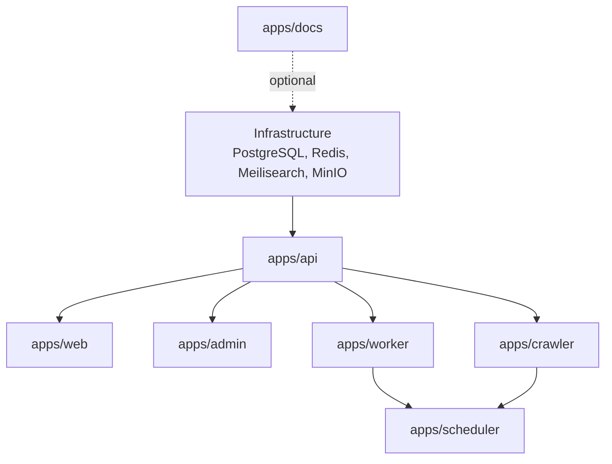
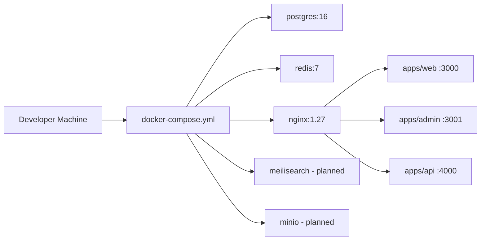
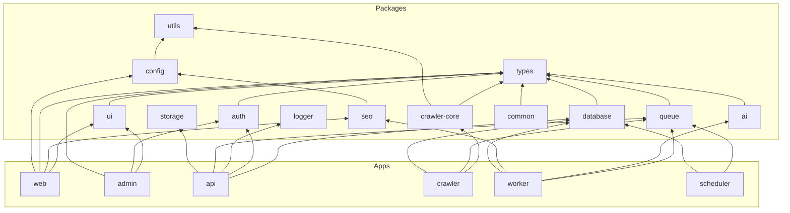
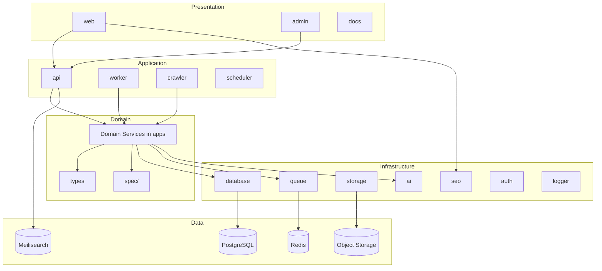
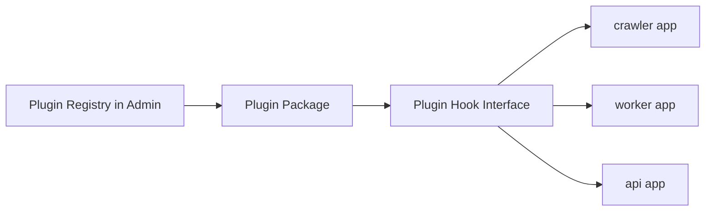

# Project Folder Structure

> **Document Type:** Repository Architecture  
> **Version:** 2.0.0  
> **Status:** Draft  
> **Owner:** Project Architecture Team  
> **Last Updated:** 2026

---

## Table of Contents

1. [Overview](#overview)
2. [Repository Layout](#repository-layout)
3. [apps/](#apps)
4. [packages/](#packages)
5. [docs/](#docs)
6. [spec/](#spec)
7. [prisma/](#prisma)
8. [scripts/](#scripts)
9. [docker/](#docker)
10. [.github/](#github)
11. [.cursor/](#cursor)
12. [.ai/](#ai)
13. [Folder Naming Convention](#folder-naming-convention)
14. [Dependency Rules](#dependency-rules)
15. [Layer Architecture](#layer-architecture)
16. [Future Expansion](#future-expansion)

---

## Overview

AI Tool CMS v2 is organized as a **pnpm + Turborepo monorepo**. The repository separates **deployable applications** (`apps/`), **shared libraries** (`packages/`), **documentation** (`docs/`), **business specifications** (`spec/`), **infrastructure configuration** (`docker/`), and **automation** (`scripts/`, `.github/`).

This separation enforces clear boundaries: applications orchestrate user-facing and operational workflows; packages encapsulate reusable, testable capabilities; documentation and specifications precede implementation; infrastructure is defined as code and version-controlled alongside application source.

The structure is designed for:

- **Independent deployment** of Web, Admin, API, Worker, Crawler, and Scheduler
- **Shared type safety** across frontend, backend, and background services
- **Contributor onboarding** through predictable folder conventions
- **Future plugin and package extraction** without repository reorganization

---

## Repository Layout

```
/
├── apps/                    # Deployable applications
│   ├── web/                 # Public website (Next.js)
│   ├── admin/               # Admin dashboard (Next.js)
│   ├── api/                 # REST API (NestJS)
│   ├── crawler/             # Crawler service
│   ├── worker/              # Background job processors
│   ├── scheduler/           # Cron and scheduled tasks
│   └── docs/                # Documentation website (optional)
├── packages/                # Shared libraries
│   ├── ui/                  # UI component library
│   ├── config/              # Shared configuration
│   ├── database/            # Prisma client and DB utilities
│   ├── types/               # Shared TypeScript types
│   ├── utils/               # Pure utility functions
│   ├── logger/              # Structured logging
│   ├── auth/                # Authentication and RBAC helpers
│   ├── storage/             # Object storage abstraction
│   ├── queue/               # BullMQ queue definitions
│   ├── seo/                 # SEO metadata and structured data
│   ├── ai/                  # AI provider abstraction
│   ├── crawler-core/        # Crawler engine and adapters
│   └── common/              # Cross-cutting shared modules
├── docs/                    # Project documentation (Markdown)
├── spec/                    # Business specifications and content schemas
├── scripts/                 # Automation and maintenance scripts
├── docker/                  # Dockerfiles and service configuration
├── prisma/                  # Database schema, migrations, seeds
├── .github/                 # GitHub Actions, templates, release config
├── .cursor/                 # Cursor IDE rules and agent configuration
├── .ai/                     # AI-first development artifacts
├── package.json             # Root workspace scripts and dependencies
├── turbo.json               # Turborepo task pipeline configuration
├── pnpm-workspace.yaml      # pnpm workspace package globs
├── docker-compose.yml       # Local development service orchestration
├── tsconfig.base.json       # Shared TypeScript compiler options
└── README.md                # Repository entry point
```

### Top-Level Files

| File | Purpose |
|---|---|
| `package.json` | Root workspace scripts (`build`, `dev`, `db:migrate`), shared devDependencies, Prisma seed configuration |
| `turbo.json` | Defines build/lint/test/typecheck task dependencies and caching across apps and packages |
| `pnpm-workspace.yaml` | Declares `apps/*` and `packages/*` as workspace members |
| `docker-compose.yml` | Brings up PostgreSQL, Redis, Meilisearch, MinIO, and reverse proxy for local development |
| `tsconfig.base.json` | Base TypeScript strict mode settings extended by all apps and packages |
| `.env.example` | Documented environment variable template—never commit secrets |
| `README.md` | Quick start, links to `docs/00-project/`, and high-level repository map |

---

## apps/

The `apps/` directory contains **independently deployable applications**. Each app has its own `package.json`, build output, Dockerfile (or shared base image), and deployment configuration. Apps consume shared packages but must not be imported by other apps—communication happens through HTTP APIs, message queues, or shared database state.

### Application Summary

| Application | Status | Port (default) | Stack |
|---|---|---|---|
| `web` | Implemented | 3000 | Next.js 15, React 19, Tailwind |
| `admin` | Implemented | 3001 | Next.js 15, shadcn/ui |
| `api` | Implemented | 4000 | NestJS, Prisma, Swagger |
| `crawler` | Planned | — | Node.js, `@ai-tool-cms/crawler-core` |
| `worker` | Planned | — | Node.js, BullMQ |
| `scheduler` | Planned | — | Node.js, cron |
| `docs` | Planned | 3002 | Next.js or Nextra |

### apps/web — Public Website

**Purpose:** The visitor-facing website for discovering, comparing, and using AI tools. This is the primary SEO and GEO surface—every public URL must be indexable and structured for both traditional and AI search engines.

**Responsibilities:**

- Render tool directory, detail pages, category/tag listings, compare/alternatives surfaces
- Host online tools (browser-based utilities) under unified CMS management
- Generate metadata, OpenGraph, Twitter Cards, canonical URLs, sitemaps, and JSON-LD via `@ai-tool-cms/seo`
- Server-side rendering and static generation for performance and crawlability
- Internationalized routes (`/en/`, `/zh-CN/`, etc.)

**Dependencies:**

| Package | Usage |
|---|---|
| `@ai-tool-cms/seo` | Metadata, robots, sitemap, JSON-LD builders |
| `@ai-tool-cms/ui` | Shared layout and component primitives |
| `@ai-tool-cms/types` | Shared DTOs and content type definitions |
| `@ai-tool-cms/config` | Site URL, locale, feature flags |

**Startup Order:** Requires `api` (or cached static data) and infrastructure services. Can start independently in SSR mode once API is healthy.

**Deployment Strategy:** Containerized Next.js standalone output behind CDN. Static assets and ISR pages cached at edge. Horizontal scaling via stateless replicas.

```
apps/web/
├── src/
│   ├── app/                 # App Router pages and layouts
│   │   ├── layout.tsx
│   │   ├── page.tsx
│   │   ├── robots.ts
│   │   ├── sitemap.ts
│   │   ├── tools/           # Tool listing and detail routes
│   │   ├── categories/
│   │   └── online-tools/    # Browser-based utilities
│   ├── components/          # Web-specific components
│   │   └── seo/             # JsonLd and SEO components
│   └── lib/                 # Web-specific helpers
├── public/                  # Static assets
├── next.config.ts
├── tailwind.config.ts
└── package.json
```

---

### apps/admin — Admin Dashboard

**Purpose:** The content management interface for operators, editors, SEO teams, and administrators. All CMS mutations flow through this application to the API.

**Responsibilities:**

- Tool, category, tag, FAQ, prompt, collection, and news CRUD
- Editorial review workflows (draft → review → publish)
- User, role, and permission management (RBAC)
- Crawler job monitoring and manual override triggers
- Analytics dashboards and indexing health views
- AI generation review and approval queues

**Dependencies:**

| Package | Usage |
|---|---|
| `@ai-tool-cms/ui` | shadcn/ui-based Admin components |
| `@ai-tool-cms/auth` | Client-side auth helpers and permission checks |
| `@ai-tool-cms/types` | Form schemas and API response types |

**Startup Order:** Requires `api` to be running. Does not require `web`, `worker`, or `crawler`.

**Deployment Strategy:** Containerized Next.js behind authentication gateway. Internal network or VPN access recommended for production Admin deployments.

```
apps/admin/
├── src/
│   ├── app/
│   │   ├── (dashboard)/     # Authenticated layout group
│   │   ├── login/
│   │   └── layout.tsx
│   ├── components/
│   │   ├── layout/          # Sidebar, header, breadcrumb
│   │   └── ui/              # shadcn/ui components
│   └── lib/
├── components.json          # shadcn/ui configuration
└── package.json
```

---

### apps/api — REST API

**Purpose:** The central backend service exposing REST (and optionally GraphQL) endpoints for Web, Admin, Worker, Crawler, and external integrators.

**Responsibilities:**

- Authentication (JWT), authorization (RBAC), and session management
- CRUD operations for all content entities
- Search proxy to Meilisearch
- File upload orchestration via `@ai-tool-cms/storage`
- Webhook dispatch for external integrations
- OpenAPI documentation at `/docs`
- Health and readiness endpoints

**Dependencies:**

| Package | Usage |
|---|---|
| `@ai-tool-cms/database` | Prisma client singleton |
| `@ai-tool-cms/auth` | Password hashing, JWT payload types, RBAC helpers |
| `@ai-tool-cms/logger` | Structured request and error logging |
| `@ai-tool-cms/queue` | Enqueue background jobs |
| `@ai-tool-cms/storage` | Object storage operations |

**Startup Order:** **First application service to start.** Requires PostgreSQL and Redis to be healthy. Meilisearch required for search endpoints.

**Deployment Strategy:** Stateless NestJS containers behind load balancer. Horizontal scaling with shared PostgreSQL and Redis. Database connection pooling via PgBouncer in production.

```
apps/api/
├── src/
│   ├── main.ts
│   ├── app.module.ts
│   ├── auth/                # Login, JWT, guards
│   ├── tools/               # Tool CRUD module
│   ├── categories/
│   ├── tags/
│   ├── search/
│   └── health/
├── nest-cli.json
└── package.json
```

---

### apps/crawler — Crawler Service

**Purpose:** Discovers and ingests AI tool data from external sources—GitHub, Product Hunt, Hugging Face, official websites, RSS feeds, and provider APIs.

**Responsibilities:**

- Execute crawl jobs dispatched by Scheduler or triggered manually from Admin
- Parse and normalize heterogeneous source payloads into canonical tool records
- Detect changes (pricing, features, logos) and emit update events
- Respect rate limits, robots.txt, and configurable politeness policies
- Report crawl status, errors, and coverage metrics

**Dependencies:**

| Package | Usage |
|---|---|
| `@ai-tool-cms/crawler-core` | Source adapters, parsers, entity resolution |
| `@ai-tool-cms/database` | Persist crawl state and tool records |
| `@ai-tool-cms/queue` | Consume and produce crawl jobs |
| `@ai-tool-cms/logger` | Structured crawl logging |
| `@ai-tool-cms/storage` | Download and store logos/screenshots |

**Startup Order:** After `api`, PostgreSQL, Redis, and `@ai-tool-cms/crawler-core` package. Does not require `web` or `admin`.

**Deployment Strategy:** Horizontally scalable worker pool. CPU and network bound—scale replicas based on crawl queue depth. Runs as long-lived process or Kubernetes Job for batch crawls.

---

### apps/worker — Background Jobs

**Purpose:** Processes asynchronous tasks that must not block HTTP request/response cycles—AI generation, SEO updates, index synchronization, email, and screenshot rendering.

**Responsibilities:**

- Consume jobs from BullMQ queues (Redis-backed)
- Execute AI content generation pipelines via `@ai-tool-cms/ai`
- Sync PostgreSQL records to Meilisearch index
- Regenerate sitemaps and ping search engines
- Send notification emails and webhooks
- Retry failed jobs with exponential backoff and dead-letter handling

**Dependencies:**

| Package | Usage |
|---|---|
| `@ai-tool-cms/queue` | Queue definitions and job processors |
| `@ai-tool-cms/ai` | LLM provider calls for content enrichment |
| `@ai-tool-cms/seo` | Metadata and sitemap regeneration |
| `@ai-tool-cms/database` | Read/write content records |
| `@ai-tool-cms/logger` | Job lifecycle logging |

**Startup Order:** After PostgreSQL, Redis, and optionally Meilisearch. Can start before or in parallel with `crawler`.

**Deployment Strategy:** Multiple worker replicas consuming shared Redis queues. Scale based on queue depth metrics. No HTTP port exposed—health via process supervisor or sidecar.

---

### apps/scheduler — Cron Jobs

**Purpose:** Orchestrates time-based automation—scheduled crawls, content refresh, sitemap updates, analytics aggregation, and search engine pings.

**Responsibilities:**

- Define and execute cron schedules for recurring platform tasks
- Dispatch jobs to Worker and Crawler queues
- Coordinate maintenance windows (index rebuilds, cache warming)
- Report schedule execution history and failures

**Dependencies:**

| Package | Usage |
|---|---|
| `@ai-tool-cms/queue` | Enqueue scheduled jobs |
| `@ai-tool-cms/database` | Read schedule configuration and write execution logs |
| `@ai-tool-cms/logger` | Schedule execution logging |

**Startup Order:** After Redis and Worker infrastructure. Typically a single instance (leader) to avoid duplicate cron execution—or uses distributed lock via Redis.

**Deployment Strategy:** Single replica with Redis-based leader election, or Kubernetes CronJob resources invoking scheduler CLI commands.

---

### apps/docs — Documentation Website

**Purpose:** Optional dedicated documentation site rendering `docs/` and `spec/` content for contributors and operators—separate from the public Web property.

**Responsibilities:**

- Render Markdown documentation with search and navigation
- Host API reference generated from OpenAPI specs
- Provide versioned documentation for releases

**Dependencies:**

| Package | Usage |
|---|---|
| `@ai-tool-cms/ui` | Shared styling and layout (optional) |
| `@ai-tool-cms/config` | Site configuration |

**Startup Order:** Independent—no backend required if serving static Markdown.

**Deployment Strategy:** Static site generation or Next.js deployment. Can be hosted on GitHub Pages, Vercel, or internal infrastructure.

---

### Application Startup Order



| Order | Service | Dependency |
|---|---|---|
| 1 | PostgreSQL, Redis, Meilisearch, MinIO | Docker Compose / cloud infrastructure |
| 2 | `apps/api` | Database + Redis healthy |
| 3 | `apps/worker` | API + Redis queues |
| 4 | `apps/web`, `apps/admin` | API healthy |
| 5 | `apps/crawler` | API + Worker queues |
| 6 | `apps/scheduler` | Worker + Crawler queues |
| 7 | `apps/docs` | Optional, independent |

---

## packages/

The `packages/` directory contains **shared libraries** consumed by one or more applications. Packages are versioned internally (`0.0.0` workspace versions) and published via pnpm workspace protocol (`workspace:*`).

Packages must be **framework-agnostic where possible**, expose a clear public API through `package.json` `exports`, and contain no business orchestration logic—that belongs in apps.

### Package Summary

| Package | Status | Primary Consumers |
|---|---|---|
| `ui` | Planned | `web`, `admin`, `docs` |
| `config` | Planned | All apps |
| `database` | Implemented | `api`, `worker`, `crawler` |
| `types` | Planned | All apps and packages |
| `utils` | Planned | All packages |
| `logger` | Planned | All apps |
| `auth` | Implemented | `api`, `admin` |
| `storage` | Planned | `api`, `worker`, `crawler` |
| `queue` | Planned | `api`, `worker`, `scheduler`, `crawler` |
| `seo` | Implemented | `web`, `worker` |
| `ai` | Planned | `worker`, `api` |
| `crawler-core` | Planned | `crawler` |
| `common` | Planned | All apps |

---

### ui

| Attribute | Detail |
|---|---|
| **Purpose** | Shared UI component library built on shadcn/ui and Tailwind CSS |
| **Public API** | Exported React components: buttons, forms, tables, modals, layout primitives |
| **Dependencies** | React, Tailwind CSS, Radix UI primitives, `@ai-tool-cms/types` |
| **Usage** | Import components in Web and Admin; ensures visual consistency across surfaces |

---

### config

| Attribute | Detail |
|---|---|
| **Purpose** | Centralized configuration loading from environment variables with validation |
| **Public API** | `getConfig()`, typed config objects for site URL, database, Redis, AI providers, storage |
| **Dependencies** | Zod for schema validation |
| **Usage** | All apps call `getConfig()` at startup; prevents scattered `process.env` access |

---

### database

| Attribute | Detail |
|---|---|
| **Purpose** | Prisma Client singleton and database connection lifecycle management |
| **Public API** | `prisma` client instance, connection helpers, transaction utilities |
| **Dependencies** | `@prisma/client`, generated from root `prisma/schema.prisma` |
| **Usage** | Imported by API services, workers, and crawlers for all database operations |

```
packages/database/
├── src/
│   └── index.ts             # Prisma singleton export
├── package.json
└── tsconfig.json
```

---

### types

| Attribute | Detail |
|---|---|
| **Purpose** | Shared TypeScript interfaces, enums, and DTO types used across apps and packages |
| **Public API** | `Tool`, `Category`, `Tag`, `PaginatedResponse`, `ApiError`, content status enums |
| **Dependencies** | None (pure types) |
| **Usage** | Ensures frontend forms, API responses, and worker payloads share identical shapes |

---

### utils

| Attribute | Detail |
|---|---|
| **Purpose** | Pure utility functions with no side effects or framework dependencies |
| **Public API** | Slug generation, date formatting, URL normalization, string truncation |
| **Dependencies** | None |
| **Usage** | Imported by any package or app needing shared pure functions |

---

### logger

| Attribute | Detail |
|---|---|
| **Purpose** | Structured logging via Pino with consistent log format, levels, and correlation IDs |
| **Public API** | `createLogger(name)`, `Logger` interface, request context binding |
| **Dependencies** | Pino |
| **Usage** | All apps and packages log through this module for aggregatable JSON output |

---

### auth

| Attribute | Detail |
|---|---|
| **Purpose** | Authentication utilities—password hashing, JWT payload types, RBAC permission helpers |
| **Public API** | `hashPassword()`, `verifyPassword()`, `JwtAccessPayload`, `hasPermission()`, `flattenPermissions()` |
| **Dependencies** | bcryptjs |
| **Usage** | API auth module for login/ guards; Admin for client-side permission checks |

---

### storage

| Attribute | Detail |
|---|---|
| **Purpose** | Provider-agnostic object storage abstraction (Local, MinIO, S3, Cloudflare R2) |
| **Public API** | `upload()`, `download()`, `delete()`, `getSignedUrl()`, `StorageProvider` interface |
| **Dependencies** | AWS SDK (S3-compatible) |
| **Usage** | API file uploads; Worker/Crawler logo and screenshot persistence |

---

### queue

| Attribute | Detail |
|---|---|
| **Purpose** | BullMQ queue definitions, job types, and processor registration helpers |
| **Public API** | Named queues (`ai-generation`, `crawler`, `seo-update`, `index-sync`), job payload types |
| **Dependencies** | BullMQ, Redis, `@ai-tool-cms/types` |
| **Usage** | API enqueues jobs; Worker and Crawler consume them |

---

### seo

| Attribute | Detail |
|---|---|
| **Purpose** | SEO and GEO infrastructure—metadata builders, robots, sitemap, JSON-LD structured data |
| **Public API** | `buildMetadata()`, `buildRobots()`, `buildSitemap()`, `buildBreadcrumbJsonLd()`, `buildSoftwareApplicationJsonLd()`, `getSiteConfig()` |
| **Dependencies** | Next.js Metadata types (peer dependency) |
| **Usage** | Web layouts and pages; Worker for sitemap regeneration |

---

### ai

| Attribute | Detail |
|---|---|
| **Purpose** | Unified AI provider abstraction with model routing, prompt templates, and cost tracking |
| **Public API** | `AiService.complete()`, `AiService.stream()`, `AiService.embed()`, provider adapters, prompt template registry |
| **Dependencies** | Provider SDKs (OpenAI, Anthropic, etc.), Zod for output validation |
| **Usage** | Worker for content generation; API for on-demand AI endpoints |

---

### crawler-core

| Attribute | Detail |
|---|---|
| **Purpose** | Crawler engine, source adapters, HTML/JSON parsers, and entity resolution logic |
| **Public API** | `CrawlerAdapter` interface, built-in adapters (GitHub, Product Hunt, RSS, generic HTML), `normalizeToolRecord()` |
| **Dependencies** | `@ai-tool-cms/types`, `@ai-tool-cms/utils`, HTTP client |
| **Usage** | Crawler app registers adapters and executes crawl pipelines |

---

### common

| Attribute | Detail |
|---|---|
| **Purpose** | Cross-cutting shared modules that do not fit a single domain package |
| **Public API** | Error classes, pagination helpers, constants, feature flags |
| **Dependencies** | `@ai-tool-cms/types` |
| **Usage** | Imported when functionality spans multiple domain packages |

---

## docs/

Documentation follows a **Documentation First** philosophy: specifications and architecture precede implementation. All documentation lives in version-controlled Markdown under `docs/`, organized by domain.

### Documentation Philosophy

| Principle | Description |
|---|---|
| **Single entry point** | `docs/00-project/README.md` is the root document—all other docs reference it |
| **Numbered directories** | Prefix numbers enforce reading order and stable cross-references |
| **English for architecture** | Technical architecture docs written in English for global contributors |
| **Living documents** | Docs updated in the same PR as code changes that affect behavior |
| **No duplication** | Cross-link instead of copying content between documents |

### Documentation Directories

| Directory | Contents |
|---|---|
| `00-project/` | Project overview, vision, tech stack, folder structure, glossary |
| `01-architecture/` | System architecture, module boundaries, data flow, deployment topology |
| `02-database/` | Entity-relationship diagrams, table definitions, indexing strategy, migration policy |
| `03-api/` | REST endpoint specifications, authentication flows, error codes, pagination conventions |
| `04-web/` | Public website routing, rendering strategy, SEO integration, i18n URL structure |
| `05-admin/` | Admin dashboard modules, RBAC matrix, editorial workflows |
| `06-crawler/` | Source adapters, crawl policies, entity resolution, change detection |
| `07-worker/` | Job types, queue topology, retry policies, dead-letter handling |
| `08-ai/` | Provider abstraction, prompt templates, model routing, cost controls |
| `09-seo/` | Metadata generation, structured data schemas, sitemap strategy, hreflang |
| `10-geo/` | AI search optimization, citation-ready content structure, entity linking |
| `11-devops/` | Docker, CI/CD, deployment, monitoring, backup, disaster recovery |
| `12-testing/` | Testing strategy, coverage targets, fixture conventions, E2E scenarios |
| `13-roadmap/` | Milestones, release planning, feature prioritization |

```
docs/
├── 00-project/
│   ├── README.md            # Project entry point
│   ├── Vision.md            # Product vision and guiding principles
│   ├── TechStack.md         # Technology decisions
│   └── FolderStructure.md   # This document
├── 01-architecture/         # (planned)
├── 02-database/             # (planned)
└── ...
```

---

## spec/

The `spec/` directory contains **business specifications**—formal definitions of content types, validation rules, and editorial policies. Specs are the contract between product intent and implementation. Code must conform to specs; specs are updated before code changes.

### Specification Files

| Specification | Description |
|---|---|
| **Tool** | Core entity: slug, name, description, website, logo, pricing model, status lifecycle, category/tag associations |
| **Category** | Hierarchical or flat taxonomy for organizing tools by domain, use case, or industry |
| **Review** | User or editorial reviews with rating, pros/cons, verification status |
| **Pricing** | Pricing model enumeration (free, freemium, paid, contact), tier definitions, price change tracking |
| **FAQ** | Question/answer pairs attached to tools or standalone pages; FAQ Schema generation rules |
| **Prompt** | Prompt library entries with template variables, model compatibility, and usage examples |
| **Release** | Product release notes linked to tools; version history and changelog structure |
| **Compare** | Comparison page specification: entity pairs, comparison dimensions, scoring rules |
| **Alternative** | Alternatives page specification: similarity scoring, replacement recommendations |
| **Collection** | Curated sets of tools/prompts/workflows with editorial narrative |
| **News** | News article schema: headline, source, publication date, related entities |

```
spec/
├── tool.md
├── category.md
├── review.md
├── pricing.md
├── faq.md
├── prompt.md
├── release.md
├── compare.md
├── alternative.md
├── collection.md
└── news.md
```

Specs define **what** the system manages. `docs/` defines **how** it is built. `prisma/schema.prisma` implements the persistent representation.

---

## prisma/

Database schema and migration files live at the repository root in `prisma/`—not inside any app or package. This ensures a **single source of truth** for the data model consumed by all services through `@ai-tool-cms/database`.

### prisma/schema.prisma

The Prisma schema defines all PostgreSQL models, enums, relations, and indexes. Key model groups:

| Model Group | Models |
|---|---|
| **Auth / RBAC** | `User`, `Role`, `Permission`, `UserRole`, `RolePermission`, `RefreshToken` |
| **Content** | `Tool`, `Category`, `Tag`, `ToolCategory`, `ToolTag` |
| **Future** | `Review`, `Faq`, `Prompt`, `Collection`, `News`, `Release` |

Generator output targets `node_modules/@prisma/client` at the monorepo root. All apps import the client via `@ai-tool-cms/database`.

### prisma/migrations/

Timestamped SQL migration files created by `prisma migrate dev`. Migrations are:

- **Forward-only** in production (no `migrate reset`)
- **Reviewed** in pull requests alongside schema changes
- **Applied** via `pnpm db:migrate` (development) or `pnpm db:migrate:deploy` (production)

```
prisma/
├── schema.prisma
├── migrations/
│   ├── 20260101000000_init/
│   │   └── migration.sql
│   └── ...
└── seed.ts
```

### prisma/seed.ts

Seed script executed via `pnpm db:seed`. Populates:

- Default roles and permissions (admin, editor, viewer)
- Initial admin user account
- Sample categories and tags (development only)
- Reference data required for application startup

Seeds are **idempotent**—safe to re-run without duplicating records.

---

## scripts/

The `scripts/` directory contains **automation scripts** for operations that do not belong in application code—one-off maintenance, deployment helpers, and CLI utilities.

### Script Categories

| Category | Examples | Purpose |
|---|---|---|
| **Database** | `db-reset.sh`, `db-backup.sh`, `migrate-production.sh` | Database lifecycle operations |
| **Deployment** | `build-images.sh`, `deploy-staging.sh`, `rollback.sh` | Container build and deployment automation |
| **Maintenance** | `reindex-search.sh`, `purge-cache.sh`, `rotate-secrets.sh` | Operational maintenance tasks |
| **Crawler** | `trigger-crawl.sh`, `import-tools-csv.ts` | Manual crawl triggers and bulk imports |
| **SEO** | `regenerate-sitemap.sh`, `ping-search-engines.sh` | SEO maintenance and search engine notification |

Scripts should:

- Be executable and documented with `--help` or header comments
- Load configuration from environment variables (never hardcode secrets)
- Exit with non-zero status codes on failure for CI integration
- Prefer TypeScript (`tsx`) for complex logic; shell for simple orchestration

```
scripts/
├── database/
├── deployment/
├── maintenance/
├── crawler/
└── seo/
```

---

## docker/

Infrastructure service configuration and Dockerfiles for local development and production container builds.

### Docker Organization

| Directory / File | Purpose |
|---|---|
| `docker/Dockerfile` | Multi-stage base image for Node.js applications (API, Worker, Crawler) |
| `docker/postgres/` | PostgreSQL initialization scripts (`init.sql`), custom configuration |
| `docker/redis/` | Redis configuration (`redis.conf`) with persistence and memory policies |
| `docker/nginx/` | Reverse proxy configuration for routing Web, Admin, and API in local/production |
| `docker/meilisearch/` | Meilisearch configuration (planned) |
| `docker-compose.yml` (root) | Orchestrates all infrastructure services for local development |

### Service Topology (Local Development)



| Service | Image | Port | Volume |
|---|---|---|---|
| PostgreSQL | `postgres:16-alpine` | 5432 | `postgres_data`, init SQL |
| Redis | `redis:7-alpine` | 6379 | `redis_data`, custom config |
| Nginx | `nginx:1.27-alpine` | 80 | config mounts |
| Meilisearch | `getmeili/meilisearch` (planned) | 7700 | `meili_data` |
| MinIO | `minio/minio` (planned) | 9000 | `minio_data` |

Application containers (Web, Admin, API, Worker) are started via `pnpm dev` during development—not always containerized locally. Production uses dedicated Dockerfiles per app.

---

## .github/

GitHub-specific automation, templates, and release configuration.

### GitHub Actions

| Workflow | Trigger | Purpose |
|---|---|---|
| `ci.yml` | Pull request, push to main | Lint (Biome), typecheck, unit tests, build |
| `e2e.yml` | Push to main, nightly | Playwright end-to-end tests against staging |
| `deploy-staging.yml` | Merge to main | Build Docker images, deploy to staging |
| `deploy-production.yml` | Release tag | Production deployment with smoke tests |
| `dependabot-auto-merge.yml` | Dependabot PR | Auto-merge patch-level dependency updates after CI pass |

### Issue Templates

| Template | Purpose |
|---|---|
| `bug_report.md` | Structured bug reports with reproduction steps |
| `feature_request.md` | Feature proposals with use case and acceptance criteria |
| `documentation.md` | Documentation improvement requests |

### Pull Request Template

Standard PR checklist: linked issue, documentation updated, tests added, breaking changes noted, migration included (if applicable).

### Releases

GitHub Releases tagged with SemVer. Release notes auto-generated from conventional commits. Docker images tagged `v{major}.{minor}.{patch}`.

```
.github/
├── workflows/
│   ├── ci.yml
│   ├── e2e.yml
│   └── deploy-staging.yml
├── ISSUE_TEMPLATE/
│   ├── bug_report.md
│   └── feature_request.md
├── PULL_REQUEST_TEMPLATE.md
└── dependabot.yml
```

---

## .cursor/

Cursor IDE configuration for AI-assisted development within the repository.

### Purpose

Cursor rules encode project conventions so AI coding assistants produce code aligned with architecture decisions—without requiring contributors to restate conventions in every prompt.

### Contents

| Path | Purpose |
|---|---|
| `.cursor/rules/` | Project-specific rules (coding standards, module boundaries, naming conventions) |
| `.cursor/rules/*.mdc` | Rule files scoped to file patterns (e.g., NestJS modules, Next.js pages) |

### Why Project Rules Exist

| Reason | Benefit |
|---|---|
| **Consistency** | AI-generated code follows the same patterns as human-written code |
| **Boundary enforcement** | Rules prevent apps from importing other apps, or packages from containing business logic |
| **Onboarding acceleration** | New contributors get correct suggestions without reading all docs first |
| **Architecture preservation** | Long-term structure is maintained even as team composition changes |

Rules complement—not replace—`docs/` and `spec/`. They are the **executable subset** of documented conventions.

---

## .ai/

The `.ai/` directory supports **AI-first development**—structured artifacts that guide both human developers and AI agents through complex, multi-step implementation work.

### Directory Structure

```
.ai/
├── tasks/                   # Task definitions for AI agents (e.g., Commit-0010)
├── prompts/                 # Reusable prompt templates for code generation
├── architecture/            # Architecture decision snapshots for agent context
├── standards/               # Coding and documentation standards for agents
└── decisions/               # Architecture Decision Records (ADRs) for agent reference
```

### tasks/

Structured task files defining scope, acceptance criteria, and constraints for AI agent execution. Each task references relevant `docs/` and `spec/` files. Example: `Commit-0010-seo-foundation.md`.

### prompts/

Versioned prompt templates for recurring AI operations—content generation, code review, migration authoring, test generation. Templates use variable placeholders and are validated against output schemas.

### architecture/

Condensed architecture summaries optimized for LLM context windows. Agents load these before making structural changes to ensure alignment with module boundaries and dependency rules.

### standards/

Machine-readable and human-readable standards: naming conventions, file structure templates, commit message format, PR checklist. Agents validate output against these standards.

### decisions/

Architecture Decision Records (ADRs) documenting significant technical choices—why PostgreSQL over MySQL, why Meilisearch over Elasticsearch. Agents consult ADRs before proposing alternative approaches.

---

## Folder Naming Convention

Consistent naming reduces cognitive load and enables automated tooling (linters, generators, CI checks).

### Rules

| Rule | Example | Anti-pattern |
|---|---|---|
| **Lowercase only** | `crawler-core/` | `CrawlerCore/` |
| **kebab-case for directories and files** | `tool-category/` | `toolCategory/`, `tool_category/` |
| **No abbreviations** | `scheduler/` | `sched/`, `sch/` |
| **Singular for entity specs** | `spec/tool.md` | `spec/tools.md` |
| **Plural for collections** | `migrations/` | `migration/` |
| **Numeric prefix for ordered docs** | `docs/09-seo/` | `docs/seo/` |
| **No business logic in shared packages** | Logic in `apps/api/src/tools/` | Tool CRUD inside `packages/common/` |

### Application Internal Structure

```
apps/{app-name}/
├── src/
│   ├── {domain}/            # Domain module (tools, auth, categories)
│   │   ├── {domain}.module.ts
│   │   ├── {domain}.controller.ts
│   │   ├── {domain}.service.ts
│   │   └── dto/               # Data transfer objects
│   └── main.ts
├── test/
└── package.json
```

NestJS apps use `{domain}.module.ts` convention. Next.js apps use App Router directory conventions (`app/`, `components/`, `lib/`).

---

## Dependency Rules

Strict dependency rules prevent circular imports, hidden coupling, and architectural erosion.

### Allowed Dependencies

| From | May Depend On |
|---|---|
| `apps/*` | `packages/*`, external npm packages |
| `packages/*` | other `packages/*` (lower layers only), external npm packages |
| `docs/`, `spec/` | Nothing (documentation only) |
| `scripts/` | `packages/*` (via tsx import), external CLI tools |
| `prisma/` | Nothing (schema only) |

### Forbidden Dependencies

| Rule | Reason |
|---|---|
| `apps/*` → `apps/*` | Apps communicate via API/queue, not direct imports |
| `packages/*` → `apps/*` | Packages must be app-agnostic |
| Business logic in `packages/common/` | Common is for cross-cutting utilities, not domain logic |
| `docs/` imported by code | Documentation is not a runtime dependency |

### Dependency Diagram



### Package Layer Order

Packages form a directed acyclic graph. Lower layers must not import higher layers:

```
Layer 0: types, utils, config
Layer 1: logger, database, auth, storage, seo
Layer 2: queue, ai, crawler-core, common
Layer 3: ui
Layer 4: apps/*
```

---

## Layer Architecture

The platform follows a **layered architecture** adapted for monorepo modularity. Each layer has distinct responsibilities and dependency constraints.

### Layers

| Layer | Location | Responsibility |
|---|---|---|
| **Presentation** | `apps/web`, `apps/admin`, `apps/docs` | UI rendering, user interaction, client-side state |
| **Application** | `apps/api`, `apps/worker`, `apps/crawler`, `apps/scheduler` | Use case orchestration, request handling, job processing |
| **Domain** | `packages/types`, `spec/`, service modules in apps | Business entities, validation rules, domain logic |
| **Infrastructure** | `packages/database`, `packages/queue`, `packages/storage`, `packages/ai`, `packages/logger` | External system adapters and cross-cutting services |
| **Data** | `prisma/`, PostgreSQL, Redis, Meilisearch, S3 | Persistent storage and caching |

### Layer Diagram



### Layer Rules

- **Presentation** never accesses Data directly—all data flows through Application (API).
- **Application** contains use case logic but delegates persistence to Infrastructure packages.
- **Domain** defines contracts (types, specs) consumed by all layers.
- **Infrastructure** implements technical capabilities without business policy decisions.
- **Data** is accessed exclusively through `@ai-tool-cms/database` (Prisma)—never raw SQL in apps.

---

## Future Expansion

The repository structure supports growth without reorganization. New capabilities are added by creating new apps or packages following established conventions.

### Adding a New Package

1. Create `packages/{package-name}/` with `package.json`, `tsconfig.json`, `src/index.ts`
2. Register in `pnpm-workspace.yaml` (already covered by `packages/*` glob)
3. Add `build`, `typecheck`, `clean` scripts; Turborepo picks up tasks automatically
4. Define public API via `package.json` `exports` field
5. Document purpose in this file and relevant `docs/` section
6. Ensure dependency layer rules are respected

### Adding a New App

1. Create `apps/{app-name}/` with standard app scaffolding
2. Add to root `package.json` scripts (`dev:{app-name}`)
3. Create Dockerfile or extend shared `docker/Dockerfile`
4. Add CI workflow job for build and test
5. Document startup order, port, and dependencies in this file
6. Register health check endpoint if HTTP-based

### Plugin Strategy

Future plugins extend the platform without modifying core code:



| Plugin Type | Extension Point | Location |
|---|---|---|
| Crawler adapter | `CrawlerAdapter` interface | `@ai-tool-cms/crawler-core` |
| AI provider | `AiProvider` interface | `@ai-tool-cms/ai` |
| Storage backend | `StorageProvider` interface | `@ai-tool-cms/storage` |
| Online tool | Tool runtime module | `apps/web/src/app/online-tools/` |
| SEO enricher | Post-publish hook | `@ai-tool-cms/seo` |
| Admin widget | Dashboard plugin slot | `apps/admin/src/plugins/` |

Plugins are distributed as separate npm packages or monorepo packages under `packages/plugins/{plugin-name}/`. They register via configuration in Admin and are loaded at application startup.

### Extraction to Standalone Repositories

Any package designed with clear boundaries can be extracted to its own repository and published to npm:

1. `@ai-tool-cms/crawler-core` → standalone open-source crawler framework
2. `@ai-tool-cms/seo` → standalone Next.js SEO utility library
3. `@ai-tool-cms/ai` → standalone multi-provider AI abstraction

Extraction requires no API changes if `exports` and semver are maintained.

---

## Related Documents

- [Project Overview](./README.md) — Entry point for AI Tool CMS v2 documentation
- [Product Vision](./Vision.md) — Long-term product vision and guiding principles
- [Technology Stack](./TechStack.md) — Technology decisions and rationale
- `docs/01-architecture/` — Detailed system architecture (planned)
- `docs/02-database/` — Database design (planned)

---

**Document Version**

| Field | Value |
|---|---|
| Version | 2.0.0 |
| Status | Draft |
| Owner | Project Architecture Team |
| Last Updated | 2026 |
