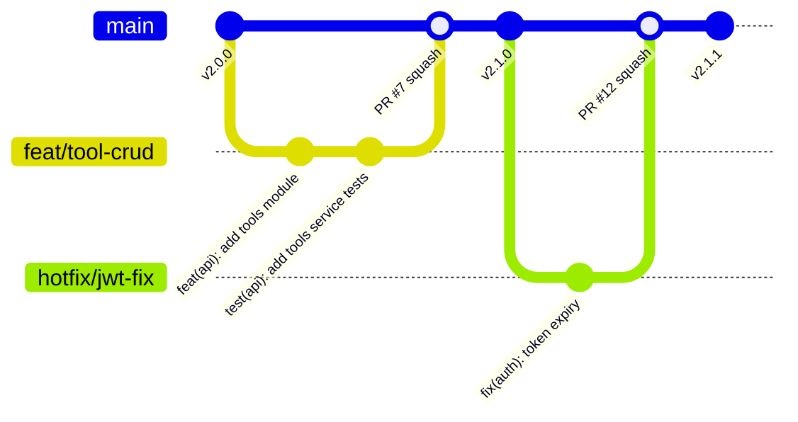
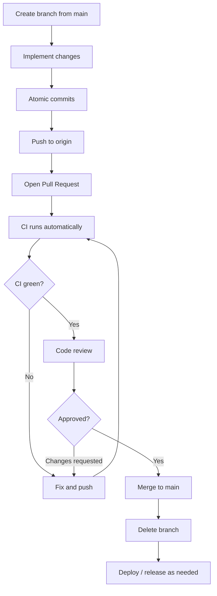
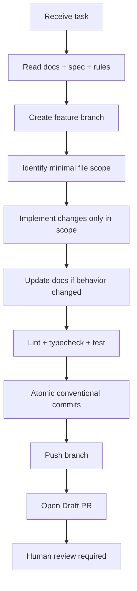
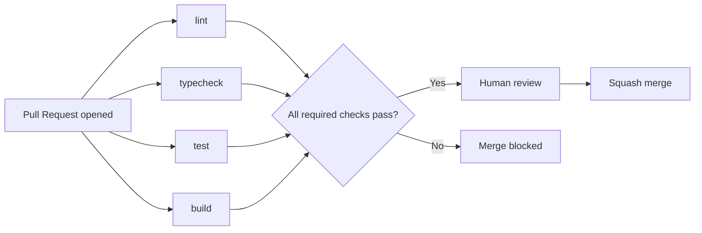
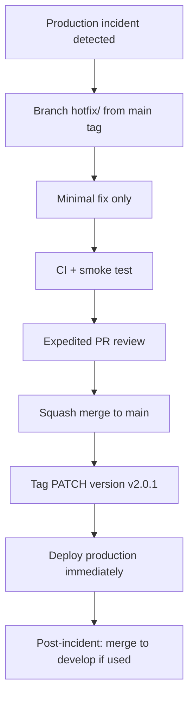
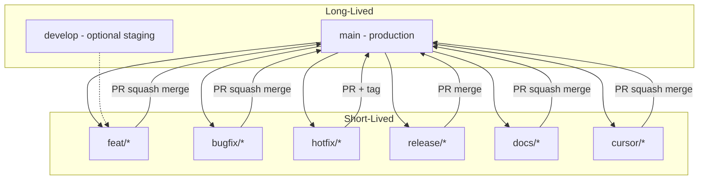
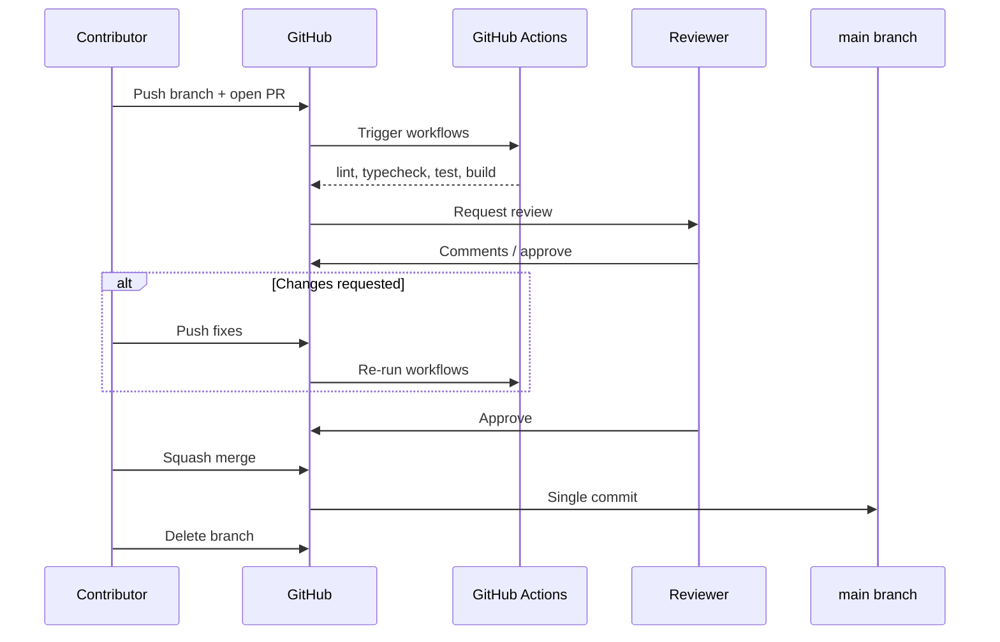
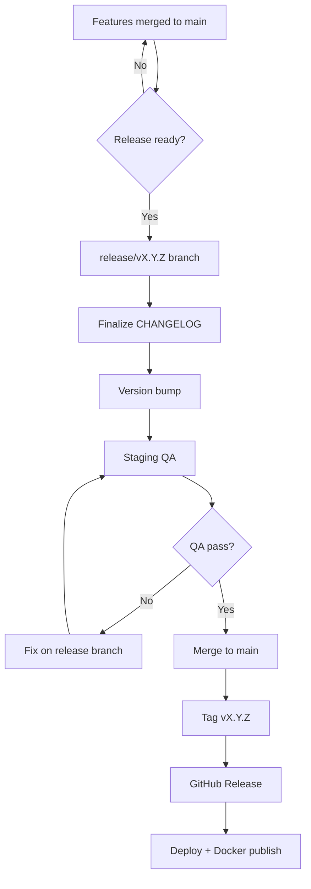

# Git Workflow

> **Document Type:** Engineering Process  
> **Version:** 2.0.0  
> **Status:** Draft  
> **Owner:** Project Architecture Team  
> **Last Updated:** 2026  
> **Audience:** Developers, Open Source Contributors, Maintainers, AI Coding Assistants (Cursor, Claude Code, GitHub Copilot)

---

## Table of Contents

1. [Purpose](#purpose)
2. [Branch Strategy](#1-branch-strategy)
3. [Commit Strategy](#2-commit-strategy)
4. [Commit Size](#3-commit-size)
5. [Pull Request Workflow](#4-pull-request-workflow)
6. [Merge Strategy](#5-merge-strategy)
7. [Release Workflow](#6-release-workflow)
8. [AI Development Workflow](#7-ai-development-workflow)
9. [Code Review Checklist](#8-code-review-checklist)
10. [GitHub Actions Integration](#9-github-actions-integration)
11. [Repository Protection Rules](#10-repository-protection-rules)
12. [Changelog Policy](#11-changelog-policy)
13. [Emergency Process](#12-emergency-process)
14. [Best Practices](#13-best-practices)
15. [Mermaid Diagrams](#14-mermaid-diagrams)

---

## Purpose

Git is the coordination layer for AI Tool CMS v2—a Turborepo monorepo with multiple deployable applications, shared packages, database migrations, documentation, and AI-assisted contributions. Without a standardized Git workflow, the repository quickly accumulates inconsistent branch names, oversized commits, broken main builds, and untraceable changes across dozens of concurrent pull requests.

A disciplined workflow is critical for:

| Concern | Why Git Workflow Matters |
|---|---|
| **Large monorepos** | Changes in `packages/seo` can break `apps/web`; atomic PRs and CI gates catch cross-package regressions |
| **AI-assisted development** | Agents produce high-volume diffs; conventions constrain scope and make human review feasible |
| **Team collaboration** | Predictable branch and commit patterns reduce merge conflicts and communication overhead |
| **Open source contributions** | External contributors need clear rules for branches, commits, and review expectations |
| **Long-term maintainability** | `git log`, `CHANGELOG.md`, and release tags tell the story of architectural evolution |

This document defines the **mandatory Git workflow** for all contributors. It complements [CodingStandards.md](./CodingStandards.md), [NamingConvention.md](./NamingConvention.md), and [FolderStructure.md](./FolderStructure.md).

**Golden rule:** `main` is always deployable. No direct pushes of unreviewed work to `main`.

---

## 1. Branch Strategy

### Long-Lived Branches

| Branch | Purpose | Who Merges | Deploy Target |
|---|---|---|---|
| **`main`** | Production-ready code; tagged releases cut from here | Maintainers after approved PR + green CI | Production |
| **`develop`** *(optional)* | Integration branch for multi-release cycles; not required for early phases | Maintainers when used | Staging |

For AI Tool CMS v2 early development, **`main` alone** may suffice. Introduce `develop` only when parallel release trains (e.g., v2.1 stabilization while v2.2 features land) justify the overhead.

### Short-Lived Branches

| Prefix | Purpose | Base Branch | Example |
|---|---|---|---|
| **`feat/`** | New features or enhancements | `main` (or `develop`) | `feat/tool-compare-pages` |
| **`bugfix/`** | Non-urgent bug fixes | `main` | `bugfix/sitemap-canonical-url` |
| **`hotfix/`** | Urgent production fixes | `main` (release tag) | `hotfix/jwt-expiry-validation` |
| **`release/`** | Release preparation (version bumps, changelog) | `main` | `release/v2.0.0` |
| **`docs/`** | Documentation-only changes | `main` | `docs/git-workflow` |
| **`refactor/`** | Behavior-preserving structural changes | `main` | `refactor/extract-search-package` |
| **`experiment/`** | Spikes and prototypes; may not merge | `main` | `experiment/meilisearch-federation` |
| **`cursor/`** | Cloud agent branches (project convention) | `main` | `cursor/implement-seo-foundation-c760` |
| **`chore/`** | Tooling, deps, config (alternative to commit-only chore) | `main` | `chore/upgrade-prisma-6` |

### Branch Naming Rules

| Rule | Detail |
|---|---|
| **Lowercase** | `feat/tool-crud`, not `feat/ToolCRUD` |
| **kebab-case** | Words separated by hyphens |
| **No spaces or underscores** | Hyphens only |
| **Descriptive** | `feat/category-tag-crud`, not `feat/update` |
| **No abbreviations** | `refactor/authentication`, not `refactor/auth` (scope in commit message is fine) |
| **Short but meaningful** | 3–6 words typical |

### Branch Responsibilities



| Branch Type | Lifetime | Merge Target | Delete After Merge |
|---|---|---|---|
| `feat/*` | Days to weeks | `main` | Yes |
| `bugfix/*` | Days | `main` | Yes |
| `hotfix/*` | Hours to days | `main` + tag | Yes |
| `release/*` | Days | `main` | Yes |
| `docs/*` | Hours to days | `main` | Yes |
| `experiment/*` | Variable | Often abandoned | When done |

### Syncing With Upstream

Before opening a PR, sync your branch with `main`:

```bash
git fetch origin
git rebase origin/main
# or: git merge origin/main
```

Resolve conflicts locally—do not merge conflict markers into `main`.

---

## 2. Commit Strategy

All commits follow **[Conventional Commits](https://www.conventionalcommits.org/)** specification.

### Format

```
<type>(<scope>): <subject>

[optional body]

[optional footer(s)]
```

| Part | Rules |
|---|---|
| **type** | Required; see table below |
| **scope** | Optional; package or app: `api`, `web`, `admin`, `seo`, `prisma`, `project` |
| **subject** | Imperative mood, lowercase, no period, ≤ 72 characters |
| **body** | Explain what and why—not how (code shows how) |
| **footer** | `BREAKING CHANGE:`, `Closes #123`, `Refs #456` |

### Supported Prefixes

| Prefix | When to Use | Example |
|---|---|---|
| **`feat`** | New user-facing or API capability | `feat(api): add category CRUD endpoints` |
| **`fix`** | Bug fix | `fix(web): correct canonical URL in metadata` |
| **`docs`** | Documentation only | `docs(project): add git workflow document` |
| **`style`** | Formatting, whitespace—no logic change | `style(admin): apply biome formatting` |
| **`refactor`** | Code change without feature or fix | `refactor(auth): extract permission flattening` |
| **`perf`** | Performance improvement | `perf(api): add index for tool slug lookup` |
| **`test`** | Add or update tests | `test(seo): add buildMetadata unit tests` |
| **`build`** | Build system, dependencies | `build: upgrade next to 15.1.0` |
| **`ci`** | CI/CD configuration | `ci: add playwright e2e workflow` |
| **`chore`** | Maintenance, tooling | `chore: update pnpm lockfile` |
| **`revert`** | Revert previous commit | `revert: feat(api): add category CRUD` |

### Scope Examples

| Scope | Applies To |
|---|---|
| `api` | `apps/api` |
| `web` | `apps/web` |
| `admin` | `apps/admin` |
| `seo` | `packages/seo` |
| `prisma` | `prisma/schema.prisma`, migrations |
| `docker` | `docker/`, `docker-compose.yml` |
| `project` | Root config, docs in `docs/00-project/` |

Omit scope when change spans entire monorepo: `chore: sync workspace dependencies`.

### Breaking Changes

```
feat(api)!: rename tool status enum values

BREAKING CHANGE: ToolStatus values changed from lowercase to
SCREAMING_SNAKE_CASE. Clients must update filter queries.
```

Or use `!` after type/scope: `feat(api)!: ...`

### Multi-Package Commits

Prefer **one logical change per commit**. If a feature requires API + web + package changes, use related commits in one PR:

```
feat(api): add tools list endpoint
feat(web): add tools listing page
feat(seo): add tool detail metadata builder
```

Not: `feat: everything for tools` in a single commit.

---

## 3. Commit Size

### Atomic Commits

Each commit should represent **one reversible logical unit**:

- Compiles and passes tests at that point (when feasible)
- Can be cherry-picked or reverted independently
- Has a single Conventional Commit subject

| Atomic | Not Atomic |
|---|---|
| Add Prisma model + migration in one commit | Model in one commit, unrelated admin UI fix in same commit |
| Fix typo in docs only | Fix typo + refactor entire auth module |
| `feat(api): add POST /tools` | `feat: add tools, categories, tags, and fix unrelated bug` |

### One Feature Per Commit (Within a PR)

A pull request may contain multiple commits, each addressing a slice of the feature:

1. `feat(prisma): add Tool model and migration`
2. `feat(api): implement tools CRUD module`
3. `test(api): add tools service integration tests`
4. `docs(api): document tools endpoints in OpenAPI`

### Maximum Recommended Changed Files

| Change Type | Soft Limit | Guidance |
|---|---|---|
| Focused feature | ≤ 15 files | Ideal for review |
| Large feature (new app) | ≤ 40 files | Split into stacked PRs if possible |
| Monorepo-wide tooling | ≤ 100 files | Lockfile/formatting only; announce in PR |
| Auto-generated | Migrations, lockfile | Review content, not every line |

Exceeding limits requires PR description justification and maintainer approval.

### Commit Checklist

Before each commit:

- [ ] `git diff --staged` reviewed—only intended files included
- [ ] No secrets, `.env`, or credentials
- [ ] No unrelated formatting-only changes mixed with logic
- [ ] Conventional Commit message follows format
- [ ] `pnpm lint` and `pnpm typecheck` pass (or run before push)
- [ ] Migrations included if schema changed
- [ ] Docs updated if behavior changed

---

## 4. Pull Request Workflow

### End-to-End Flow



### Step-by-Step

| Step | Action | Details |
|---|---|---|
| **1. Create branch** | `git checkout -b feat/my-feature main` | Follow [branch naming rules](#branch-naming-rules) |
| **2. Commit** | Atomic conventional commits | See [Commit Strategy](#2-commit-strategy) |
| **3. Push** | `git push -u origin feat/my-feature` | Never force-push to shared branches without agreement |
| **4. Open PR** | GitHub Pull Request against `main` | Use template; link issues |
| **5. Code review** | At least one maintainer approval | Address all comments or explain deferral |
| **6. CI** | All required checks pass | Lint, typecheck, test, build |
| **7. Merge** | Squash merge (default) | See [Merge Strategy](#5-merge-strategy) |
| **8. Delete branch** | Remove remote and local branch | Keeps branch list clean |

### Pull Request Title

PR title = **squash commit title**. Use Conventional Commits format:

```
feat(api): implement category and tag CRUD
```

Not: `Update stuff` or `WIP`.

### Pull Request Description Template

| Section | Content |
|---|---|
| **Summary** | What changed and why (2–4 sentences) |
| **Related issues** | `Closes #123` or `Refs #456` |
| **Test plan** | Steps reviewer can follow |
| **Screenshots** | UI changes (Web, Admin) |
| **Migration notes** | Database or env var changes |
| **Checklist** | Link to [Code Review Checklist](#8-code-review-checklist) |

### Draft Pull Requests

- Use **Draft PR** for work-in-progress visible to team
- Mark **Ready for review** only when CI-ready and self-reviewed
- AI cloud agents may open Draft PRs by default until human promotion

---

## 5. Merge Strategy

### Options Compared

| Strategy | Result on `main` | Pros | Cons |
|---|---|---|---|
| **Squash merge** | Single commit per PR | Clean linear history; one revert per PR | Loses intra-PR commit granularity on main |
| **Merge commit** | Merge commit + all PR commits | Preserves full branch history | Noisy log on busy repos |
| **Rebase merge** | Linear commits replayed | Linear history without squash | Rewrites SHAs; harder for multi-commit PRs |

### Preferred Strategy: Squash Merge

AI Tool CMS v2 **defaults to squash merge** for all PRs into `main`.

| Reason | Explanation |
|---|---|
| Clean history | `git log main` shows one commit per merged PR |
| Simple revert | `git revert <squash-sha>` undoes entire feature |
| Review alignment | Squash message = PR title = conventional commit |
| AI contributions | Agents often produce many small commits; squash normalizes |

### When to Use Merge Commit

- Release branch merges where preserving individual commits matters for audit
- Long-lived `develop` → `main` integration (if `develop` is adopted)
- Maintainer explicit decision documented in PR

### When to Use Rebase Merge

- Single-commit PRs already atomic (squash equivalent)
- Rare; maintainers only

### Rebase Before Merge (Contributor)

Contributors should rebase onto latest `main` before final approval to ensure CI runs against current HEAD—not as substitute for squash merge policy.

---

## 6. Release Workflow

### Semantic Versioning

Releases follow **[SemVer](https://semver.org/)**: `MAJOR.MINOR.PATCH`

| Bump | When |
|---|---|
| **MAJOR** | Breaking API or schema changes incompatible with previous version |
| **MINOR** | New features backward-compatible |
| **PATCH** | Bug fixes backward-compatible |

Platform version aligns with `docs/00-project/README.md` (currently v2.0.0).

### Release Flow



```mermaid
flowchart LR
    A[main stable] --> B[Create release/ branch]
    B --> C[Update CHANGELOG.md]
    C --> D[Bump version in package.json]
    D --> E[Final QA on staging]
    E --> F[Merge release PR to main]
    F --> G[Tag vX.Y.Z on main]
    G --> H[GitHub Release + notes]
    H --> I[Deploy production]
    I --> J[Docker images tagged vX.Y.Z]
```

### Git Tags

| Rule | Example |
|---|---|
| Annotated tags for releases | `git tag -a v2.0.0 -m "Release 2.0.0"` |
| Format | `v{major}.{minor}.{patch}` |
| Pre-release | `v2.1.0-alpha.1`, `v2.1.0-rc.1` |
| Push tags | `git push origin v2.0.0` |

Never move or force-update release tags without maintainer consensus and announcement.

### Release Notes

- Generated from `CHANGELOG.md` section for the version
- GitHub Release includes highlights, breaking changes, migration guide link
- Docker images: `ai-tool-cms-api:2.0.0`, `ai-tool-cms-web:2.0.0`

### Changelog

See [Changelog Policy](#11-changelog-policy). Release PR must update `CHANGELOG.md` before tag.

---

## 7. AI Development Workflow

AI assistants (Cursor Cloud Agents, Claude Code, GitHub Copilot) are first-class contributors but operate under **stricter guardrails** than typical human sessions because they can modify many files rapidly.

### AI Workflow Diagram



### Mandatory Rules for AI Assistants

| Rule | Detail |
|---|---|
| **Never modify unrelated files** | No drive-by refactors, formatting sweeps, or renames outside task scope |
| **Never force push** | Especially not to `main`, `develop`, or another contributor's branch |
| **Never rewrite project architecture** | No moving apps to packages, renaming monorepo roots, or changing dependency rules without explicit task |
| **Always update documentation** | Behavior changes require `docs/` or `spec/` updates in same PR |
| **Always keep commits atomic** | One logical change per commit; conventional message format |
| **Always run formatting before commit** | Biome lint/format; ensure build and typecheck pass |
| **Create dedicated branches** | Pattern: `cursor/{description}-c760` for cloud agents |
| **Open Draft PRs by default** | Human promotes to ready for review |
| **No secrets in commits** | Never commit `.env`, API keys, or tokens |
| **Preserve existing patterns** | Read neighboring files before generating new code |
| **Push after each iteration** | Cloud agents commit and push before testing and PR updates |
| **Do not delete tests** | Fix code or tests—never remove coverage to pass CI |

### AI Branch Convention

```
cursor/implement-seo-foundation-c760
cursor/add-project-docs-c760
```

Suffix `-c760` identifies cloud agent branches for batch review and cleanup.

### Human Oversight

All AI-generated PRs require **human maintainer approval** before merge to `main`. AI must not self-merge.

---

## 8. Code Review Checklist

Reviewers and authors verify before approval.

### Architecture

- [ ] Respects apps/packages dependency rules ([FolderStructure.md](./FolderStructure.md))
- [ ] No business logic in wrong layer (e.g., Prisma in React components)
- [ ] Feature module structure matches NestJS/Next.js conventions
- [ ] No circular dependencies introduced

### Naming

- [ ] Follows [NamingConvention.md](./NamingConvention.md)
- [ ] Branch and commit messages follow Conventional Commits
- [ ] API paths, DTOs, and database names consistent

### Security

- [ ] Auth guards on new protected endpoints
- [ ] Input validation on all request bodies and params
- [ ] No secrets or credentials in diff
- [ ] Rate limiting considered for public endpoints
- [ ] SQL injection/XSS risks addressed

### Performance

- [ ] Database queries paginated and indexed
- [ ] No N+1 queries
- [ ] Heavy work queued to workers, not HTTP handlers
- [ ] Client bundle impact acceptable for new dependencies

### Tests

- [ ] New behavior has unit or integration tests
- [ ] Existing tests updated for changed contracts
- [ ] CI test jobs pass

### Documentation

- [ ] `docs/` or `spec/` updated for behavior changes
- [ ] OpenAPI/Swagger updated for API changes
- [ ] Package README updated for new public exports
- [ ] `CHANGELOG.md` updated for user-facing releases

### Backward Compatibility

- [ ] API changes backward-compatible or versioned (`/v2/`)
- [ ] Database migrations safe for production (no destructive drops without plan)
- [ ] Breaking changes documented with `BREAKING CHANGE` footer
- [ ] Environment variables added to `.env.example`

---

## 9. GitHub Actions Integration

CI runs on every pull request and push to `main`. No merge without required checks passing.

### Required Checks

| Job | Command | Purpose |
|---|---|---|
| **Lint** | `pnpm lint` | Biome rules, code style |
| **Typecheck** | `pnpm typecheck` | TypeScript strict mode across monorepo |
| **Test** | `pnpm test` | Vitest unit and integration tests |
| **Build** | `pnpm build` | Turborepo build all apps and packages |

### Optional / Scheduled Jobs

| Job | Trigger | Purpose |
|---|---|---|
| **E2E** | Nightly, pre-release | Playwright against staging |
| **Dependency audit** | Weekly | Security vulnerability scan |
| **OpenAPI export** | PR touching `apps/api` | Verify schema artifact |

### CI Requirements Before Merge



| Requirement | Policy |
|---|---|
| All required jobs | Must pass on latest commit |
| Stale reviews | Dismissed if new commits change substantive code |
| Force push after review | Re-triggers CI; reviewer re-approval if substantial |

### Caching

Turborepo and GitHub Actions cache `node_modules` and Turbo artifacts to keep PR feedback under 10 minutes target.

---

## 10. Repository Protection Rules

Applied to `main` (and `develop` if used) via GitHub repository settings.

### Protected Branch Settings

| Rule | Setting |
|---|---|
| **Require pull request** | Yes—no direct push |
| **Required approvals** | Minimum 1 maintainer |
| **Dismiss stale approvals** | Enabled when new commits pushed |
| **Require status checks** | `lint`, `typecheck`, `test`, `build` |
| **Require branches up to date** | Yes—must merge or rebase latest `main` |
| **Require conversation resolution** | All review threads resolved |
| **Restrict push** | Maintainers only; bots excepted for merge |
| **Allow force push** | Disabled on `main` |
| **Allow deletions** | Disabled on `main` |

### Signed Commits (Optional)

- **Recommended** for maintainers; not required for all contributors initially
- Enable `Require signed commits` when team GPG or SSH signing adoption is complete
- AI agents use bot accounts; signing policy may exempt bot merges

### CODEOWNERS (Planned)

```
/apps/api/          @ai-tool-cms/api-maintainers
/prisma/            @ai-tool-cms/data-maintainers
/docs/00-project/   @ai-tool-cms/architects
```

Automatic review request for sensitive paths.

---

## 11. Changelog Policy

`CHANGELOG.md` at repository root follows **[Keep a Changelog](https://keepachangelog.com/)** format.

### Structure

```markdown
# Changelog

## [Unreleased]

### Added
### Changed
### Deprecated
### Removed
### Fixed
### Security

## [2.0.0] - 2026-06-01
...
```

### Maintenance Rules

| Rule | Detail |
|---|---|
| **Update on every user-facing PR** | Add entry under `[Unreleased]` |
| **Categories** | Added, Changed, Deprecated, Removed, Fixed, Security |
| **Release PR** | Rename `[Unreleased]` to `[X.Y.Z] - YYYY-MM-DD` |
| **Link to compare** | `https://github.com/zhshg/ai-tool-cms/compare/v2.0.0...v2.1.0` |
| **No implementation detail** | User and operator facing changes only |
| **Breaking changes** | Prominent subsection with migration instructions |

### What Belongs in Changelog

| Include | Exclude |
|---|---|
| New API endpoints | Internal refactor with no behavior change |
| Breaking schema migrations | Typo fixes in code comments |
| New environment variables | Test-only changes |
| Security patches | Version bumps with no functional change |

### Semantic Link to Commits

Conventional Commits feed changelog generation (manual or via `release-please` / similar tool in future).

---

## 12. Emergency Process

### Hotfix Workflow

For production incidents requiring immediate fix:



| Step | Action |
|---|---|
| 1 | Branch `hotfix/{description}` from latest production tag on `main` |
| 2 | Minimal fix—no feature scope creep |
| 3 | Expedited review (one maintainer sufficient for P0) |
| 4 | Merge to `main`, tag `vX.Y.(Z+1)` |
| 5 | Deploy; verify incident resolved |
| 6 | Document in `CHANGELOG.md` under **Fixed** and **Security** if applicable |

### Rollback Strategy

| Method | When |
|---|---|
| **Revert commit** | `git revert <squash-sha>` on `main`; new PR, fast-track merge |
| **Redeploy previous tag** | `v2.0.0` images still available; switch deployment pointer |
| **Database** | Forward-only migrations; write compensating migration, never `migrate reset` in prod |

### Release Recovery

| Scenario | Response |
|---|---|
| Bad release tagged | Tag must not be deleted; publish `v2.0.2` with fix |
| Broken Docker image | Yank tag in registry docs; publish patched image |
| Failed migration | Stop deploy; restore DB backup; ship fix migration |

### Communication

- GitHub Issue or Discussion for incident tracking
- Release notes amended if user-facing impact
- Post-mortem document in `docs/11-devops/` for Sev-1 incidents (planned)

---

## 13. Best Practices

Twenty-five Git and collaboration best practices for AI Tool CMS v2:

1. **Keep `main` deployable** at all times—feature flags over long-lived broken branches.
2. **Branch from latest `main`** before starting work.
3. **Pull before push**—`git fetch origin` daily on active branches.
4. **Use Conventional Commits** for every commit message.
5. **One logical change per commit**—atomic and revertible.
6. **Keep PRs small and focused**—under 400 lines changed when possible.
7. **Write PR descriptions** that explain why, not only what.
8. **Link issues** with `Closes #123` for traceability.
9. **Never commit secrets**—use `.env` locally, `.env.example` in git.
10. **Never commit generated artifacts** unless policy requires (Prisma client is generated in CI).
11. **Review your own diff** before requesting review.
12. **Respond to review comments** within 2 business days or explain delay.
13. **Resolve conversations** in GitHub before merge.
14. **Delete merged branches** locally and on remote.
15. **Prefer squash merge** for clean `main` history.
16. **Tag releases** with annotated SemVer tags.
17. **Update CHANGELOG** with every user-facing change.
18. **Rebase or merge `main`** before final approval—not days stale.
19. **Do not force-push** shared branches without explicit agreement.
20. **Use Draft PRs** for work in progress.
21. **Run lint and typecheck locally** before push—do not rely only on CI.
22. **Separate formatting commits** from logic commits when changes are large.
23. **Document breaking changes** in commit footer and changelog.
24. **Cherry-pick hotfixes** carefully—verify migration compatibility.
25. **Treat AI PRs like human PRs**—same review, CI, and documentation standards.

---

## 14. Mermaid Diagrams

### Git Branching Model (Overview)



### Pull Request Review Flow



### Release Flow



---

## Related Documents

- [Coding Standards](./CodingStandards.md) — Engineering standards and AI coding rules
- [Naming Convention](./NamingConvention.md) — Branch, commit, and symbol naming
- [Folder Structure](./FolderStructure.md) — Repository layout
- [Project Overview](./README.md) — Documentation entry point

---

**Document Version**

| Field | Value |
|---|---|
| Version | 2.0.0 |
| Status | Draft |
| Owner | Project Architecture Team |
| Last Updated | 2026 |
