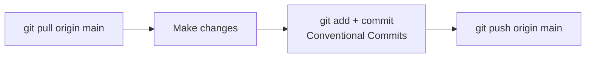

# Git Workflow Update — Single-Main Development

> **Document Type:** Process Change Notice  
> **Version:** 1.0.0  
> **Status:** Active  
> **Owner:** Lead Git Maintainer  
> **Last Updated:** 2026  
> **Supersedes (in part):** [GitWorkflow.md](./GitWorkflow.md) branch/PR sections for early-stage development  
> **Audience:** Maintainers, Contributors, AI Coding Assistants (Cursor, Claude Code, GitHub Copilot)

---

## Table of Contents

1. [Summary](#summary)
2. [Why We Stopped Using Cursor-Generated Feature Branches](#why-we-stopped-using-cursor-generated-feature-branches)
3. [Why Single-Main Workflow](#why-single-main-workflow)
4. [Current Rules (Effective Immediately)](#current-rules-effective-immediately)
5. [How to Work Day to Day](#how-to-work-day-to-day)
6. [When Pull Requests Will Return](#when-pull-requests-will-return)
7. [Release Management](#release-management)
8. [Semantic Versioning](#semantic-versioning)
9. [Legacy Branches and Draft PRs](#legacy-branches-and-draft-prs)
10. [Related Documents](#related-documents)

---

## Summary

AI Tool CMS v2 is transitioning from **many parallel Cursor-generated feature branches and Draft Pull Requests** to a **single-main development workflow** during early-stage consolidation.

| Before | After (early stage) |
|---|---|
| `cursor/*-c760` branches per task | Work on **`main`** (or one agreed integration branch) |
| Automatic Draft PR creation | **No automatic PRs** |
| Fragmented history across branches | **Linear, atomic commits** on current branch |
| Hard to see full monorepo on `main` | **`main` reflects the real codebase** |

This document is the **active policy** for Git operations until the project explicitly graduates to team-scale PR workflow (see [When Pull Requests Will Return](#when-pull-requests-will-return)).

Cursor agents must follow [.cursor/rules/git-workflow.mdc](../../.cursor/rules/git-workflow.mdc).

---

## Why We Stopped Using Cursor-Generated Feature Branches

The repository accumulated numerous Cloud Agent branches, for example:

| Branch | Typical content |
|---|---|
| `cursor/initialize-applications-c760` | `apps/web`, `admin`, `api` scaffold |
| `cursor/initialize-prisma-c760` | Prisma schema |
| `cursor/implement-authentication-c760` | JWT / RBAC |
| `cursor/implement-tool-crud-c760` | Tool API |
| `cursor/implement-seo-foundation-c760` | `@ai-tool-cms/seo` |
| `cursor/add-techstack-docs-c760` | Project documentation |

### Problems observed

| Problem | Impact |
|---|---|
| **Fragmented `main`** | GitHub default branch showed only `docs/` and `docker/` while application code lived on unmerged branches |
| **Draft PR sprawl** | Many open Draft PRs (#2–#11) with unclear merge order and dependency chains |
| **Duplicate conventions** | `cursor/<task>-c760` naming conflicted with documented `feat/` / `docs/` prefixes |
| **Review fatigue** | Small incremental changes spread across branches were harder to integrate than atomic commits on one line of history |
| **Agent autonomy risk** | Automatic branch creation, PR opening, and merge attempts bypassed maintainer intent |

These branches were **useful for exploration** but **harmful as the default operating model** for a young monorepo that needs one coherent tree.

---

## Why Single-Main Workflow

During **early-stage development** (pre–v1.0 stable), a single-main workflow is preferred because:

| Benefit | Explanation |
|---|---|
| **One source of truth** | Cloners and contributors see `apps/`, `packages/`, `prisma/`, and `docs/` together on `main` |
| **Simpler mental model** | `git pull` + commit + `git push`—no branch matrix |
| **Faster integration** | No waiting for PR approval to land dependent changes (auth before CRUD, schema before API) |
| **Atomic history** | Conventional Commits on `main` tell a clear story for `CHANGELOG.md` and releases |
| **AI agent safety** | Explicit rules prevent agents from spawning branches/PRs that maintainers did not request |

Single-main does **not** mean “no discipline.” It means:

- **Atomic commits** (one logical change per commit)
- **Conventional Commits** (`feat:`, `fix:`, `docs:`, etc.)
- **Green CI** before push when CI exists
- **No force-push** to shared branches

When the team grows or v1.0 ships, we reintroduce **short-lived feature branches + PRs** with stricter protection (see below).

---

## Current Rules (Effective Immediately)

### Maintainers and humans

| Rule | Detail |
|---|---|
| **Default branch** | `main` |
| **Work location** | Commit to the **currently checked-out branch** (expected: `main`) |
| **Branch creation** | Only when explicitly requested by a maintainer—not by default |
| **Pull Requests** | Not required for early-stage work; do not open Draft PRs routinely |
| **Commit style** | [Conventional Commits](https://www.conventionalcommits.org/) |
| **Commit size** | Atomic—one concern per commit |
| **History** | No force-push to `main`; no rebasing shared branches without coordination |

### AI coding assistants (Cursor, etc.)

| Prohibited | Required |
|---|---|
| Create new branches automatically | Work only on **current checked-out branch** |
| Create or update Pull Requests automatically | **Commit locally** with Conventional Commits |
| Merge, rebase, or delete branches automatically | **Push** only when task explicitly includes push |
| Force-push or rewrite published history | Ask maintainer before any exceptional Git operation |

Full machine-readable rules: [.cursor/rules/git-workflow.mdc](../../.cursor/rules/git-workflow.mdc).

---

## How to Work Day to Day



### Commit message format

```
<type>(<optional scope>): <description>

[optional body]
```

| Type | Use |
|---|---|
| `feat` | New capability |
| `fix` | Bug fix |
| `docs` | Documentation only |
| `chore` | Tooling, deps (no production logic) |
| `refactor` | Behavior-preserving code change |
| `test` | Tests only |
| `ci` | CI configuration |

**Examples:**

```
feat(api): add GET /v1/tools pagination
docs: add GitWorkflowUpdate for single-main policy
fix(web): correct canonical URL on tool detail
```

### Scope guidance (monorepo)

Use package or app name as scope: `feat(api)`, `docs(seo)`, `fix(admin)`.

See [NamingConvention.md](./NamingConvention.md) and [GitWorkflow.md](./GitWorkflow.md) for extended conventions (still valid for commit format and release tags).

---

## When Pull Requests Will Return

Pull Requests become **mandatory** again when **any** of the following is true:

| Trigger | Rationale |
|---|---|
| **v1.0.0 released** | Stable baseline; changes need review gates |
| **2+ human maintainers** active | Coordination via PR review |
| **External contributors** | Fork + PR is standard open source flow |
| **`main` branch protection** enabled | GitHub requires PR to merge |
| **Production deployments** from tags | Risk reduction |

### Future PR workflow (preview)

| Element | Policy |
|---|---|
| Branch naming | `feat/`, `fix/`, `docs/`—**not** `cursor/*-c760` |
| PR state | **Ready for review**—avoid long-lived Draft PRs |
| Base branch | `main` |
| Merge strategy | Squash or merge commit per maintainer choice (documented in [GitWorkflow.md](./GitWorkflow.md)) |
| Required checks | CI green + 1 approval (when team exists) |

Until then, **direct commits to `main`** (with discipline above) are the norm.

---

## Release Management

Releases are cut from **`main`** at tagged commits. See [ReleaseStrategy.md](./ReleaseStrategy.md).

### Early-stage release cadence

| Phase | Cadence | Tag format |
|---|---|---|
| Pre–v1.0 | Irregular; tag meaningful milestones | `v0.x.y` optional |
| v1.0+ | Semantic versioning strictly | `vMAJOR.MINOR.PATCH` |

### Release steps (maintainer)

1. Ensure `main` is deployable and documented
2. Update `CHANGELOG.md` (Keep a Changelog format)
3. Bump version in root `package.json` / workspace packages as needed
4. Create annotated tag: `git tag -a v1.0.0 -m "v1.0.0"`
5. Push tag: `git push origin v1.0.0`
6. Publish GitHub Release with notes from changelog

**Agents must not** create tags or GitHub Releases unless explicitly instructed.

---

## Semantic Versioning

AI Tool CMS v2 follows **[Semantic Versioning 2.0.0](https://semver.org/)**: `MAJOR.MINOR.PATCH`.

| Component | When to increment |
|---|---|
| **MAJOR** | Breaking API, breaking config, incompatible migrations requiring operator action |
| **MINOR** | Backward-compatible features |
| **PATCH** | Backward-compatible fixes |

### Monorepo versioning

| Approach | Early stage | Post–v1.0 |
|---|---|---|
| Platform version | Single version in root `package.json` / git tags | Same |
| Workspace packages | `0.0.0` or aligned with platform | Aligned with releases |

Pre-release tags: `v2.0.0-alpha.1`, `v2.0.0-beta.1`, `v2.0.0-rc.1`.

Detail: [ReleaseStrategy.md](./ReleaseStrategy.md) § Versioning Policy.

---

## Legacy Branches and Draft PRs

### What to do with existing `cursor/*` branches

| Action | Owner |
|---|---|
| **Merge** valuable work into `main` in dependency order | Lead maintainer |
| **Close** obsolete Draft PRs after merge or abandonment | Lead maintainer |
| **Delete** remote branches after merge | Lead maintainer (manual—not automated by agents) |
| **Do not** continue new work on `cursor/*-c760` | All contributors |

Suggested merge order (if consolidating):

1. Infrastructure / apps scaffold  
2. Prisma / database  
3. Auth  
4. Core API features  
5. SEO and packages  
6. Documentation (can merge anytime)

Agents **must not** perform this consolidation unless a maintainer task explicitly says so.

---

## Related Documents

| Document | Relationship |
|---|---|
| [GitWorkflow.md](./GitWorkflow.md) | Full workflow reference; branch/PR sections apply **after** graduation from single-main |
| [ReleaseStrategy.md](./ReleaseStrategy.md) | Release channels, CI/CD, LTS |
| [.cursor/rules/git-workflow.mdc](../../.cursor/rules/git-workflow.mdc) | Cursor agent Git rules |
| [CodingStandards.md](./CodingStandards.md) | Code quality alongside Git discipline |

---

**Document Version**

| Field | Value |
|---|---|
| Version | 1.0.0 |
| Status | Active |
| Owner | Lead Git Maintainer |
| Effective | 2026 |
