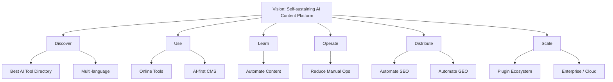
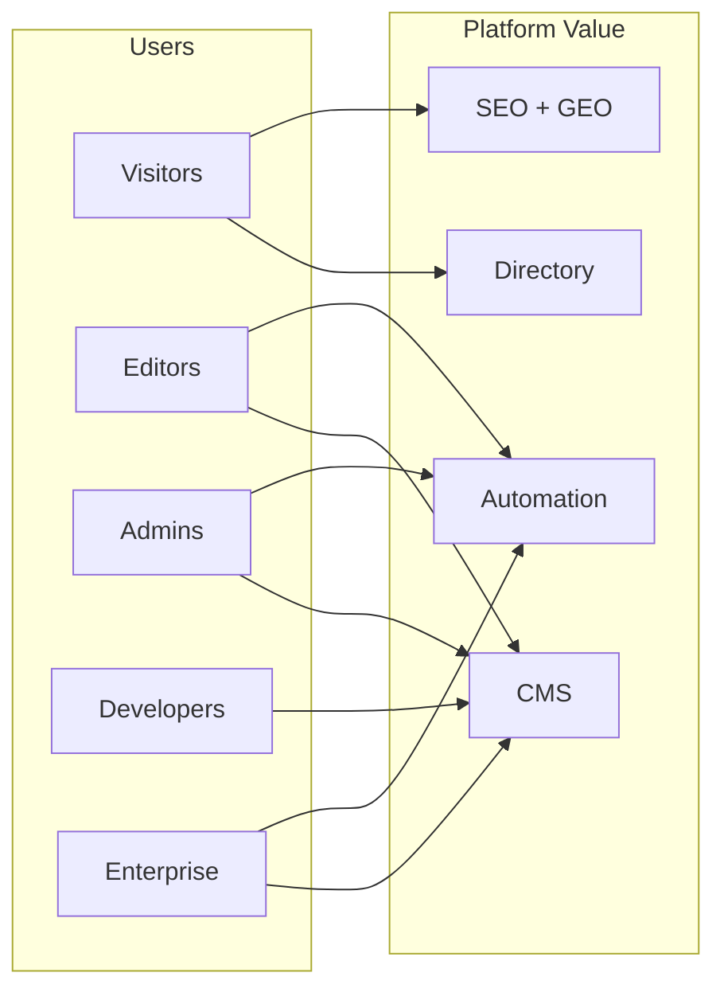
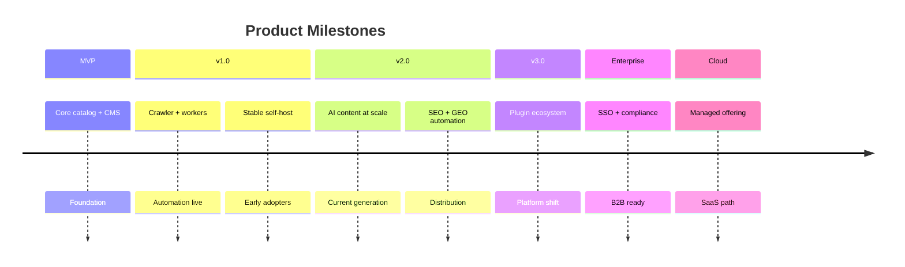
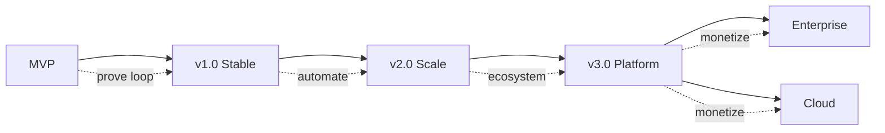
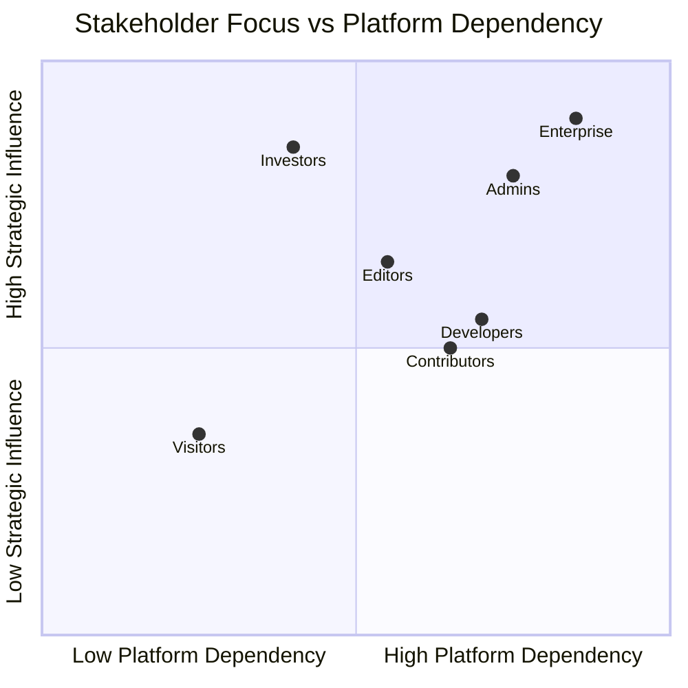

# Product Goals

> **Document Type:** Product Strategy  
> **Version:** 2.0.0  
> **Status:** Draft  
> **Owner:** Product Architecture Team  
> **Last Updated:** 2026  
> **Audience:** Product Managers, Software Architects, Developers, Open Source Contributors, Investors, AI Coding Assistants

---

## Table of Contents

1. [Purpose](#purpose)
2. [Vision Alignment](#1-vision-alignment)
3. [Primary Goals](#2-primary-goals)
4. [Business Goals](#3-business-goals)
5. [Technical Goals](#4-technical-goals)
6. [User Goals](#5-user-goals)
7. [Success Metrics](#6-success-metrics)
8. [Milestones](#7-milestones)
9. [Priority Matrix](#8-priority-matrix)
10. [Risks](#9-risks)
11. [Guiding Principles](#10-guiding-principles)
12. [Mermaid Diagrams](#11-mermaid-diagrams)

---

## Purpose

This document defines the **strategic product goals** of AI Tool CMS v2. It answers **what** the project aims to achieve for users, operators, contributors, and the broader AI software ecosystem.

Goals here are outcomes and intentions—not implementation plans. Technical execution belongs in [TechStack.md](./TechStack.md), [FolderStructure.md](./FolderStructure.md), and domain-specific `docs/`. The long-term narrative lives in [Vision.md](./Vision.md); this document translates vision into measurable, prioritized product objectives.

| This Document Defines | This Document Does Not Define |
|---|---|
| Target outcomes and user value | Database schemas, API endpoints, or code structure |
| Success metrics and milestones | Sprint plans or engineering task breakdowns |
| Business and community objectives | Vendor selection or infrastructure configuration |
| Priority and risk posture | Detailed SEO algorithms or crawler parsers |

All product decisions—roadmap prioritization, feature acceptance, and release scope—should trace back to goals in this document.

---

# 1. Vision Alignment

[Vision.md](./Vision.md) describes a self-sustaining AI content platform that discovers, structures, enriches, and distributes knowledge about AI products at scale. Every product goal below exists to advance that vision—not to replicate a static directory or a single-purpose marketing site.

### Goal-to-Vision Mapping

| Vision Pillar | Supporting Product Goals |
|---|---|
| **Discover** — tools, agents, APIs, collections | Best AI Tool Directory; multi-language; extensible plugin ecosystem |
| **Use** — online tools, prompts, workflows | Reusable Online Tools; AI-first CMS |
| **Learn** — tutorials, news, compare/alternatives | Automate content generation; content growth metrics |
| **Operate** — CMS, crawler, automation, analytics | Reduce manual operations; automation rate KPIs |
| **Distribute** — SEO, GEO, structured data | Automate SEO; Automate GEO; organic traffic growth |
| **Scale** — languages, plugins, enterprise, cloud | Enterprise readiness; scalability technical goals; Cloud Edition milestone |

### Alignment Principle

A proposed feature is in scope when it **compounds platform value**: it either grows catalog depth, improves discovery quality, reduces operator labor, strengthens distribution, or enables ecosystem extension. Features that add manual burden without automation path or distribution benefit require explicit justification against this alignment test.

---

# 2. Primary Goals

Nine primary goals define the product's core ambitions. Each is an outcome statement—success is measured in [Success Metrics](#6-success-metrics) and staged in [Milestones](#7-milestones).

---

### Build the Best AI Tool Directory

**Goal:** Become the most comprehensive, accurate, and useful directory for discovering AI software—surpassing link lists through depth, freshness, and structured comparison—not merely volume of URLs.

**Intended outcomes:**

- Catalog breadth across categories, pricing models, and use cases
- Tool records that answer: what it does, who it is for, how it is priced, and what alternatives exist
- Discovery paths via search, browse, collections, and programmatic compare/alternatives surfaces
- Trust through transparent sourcing, update timestamps, and editorial policy visibility

**Not in scope for this goal alone:** Becoming a generic software directory unrelated to AI; optimizing for affiliate clicks without user value.

---

### Build an AI-First CMS

**Goal:** Operate a content management system where AI is embedded in creation, enrichment, classification, and review workflows—not bolted on as an optional plugin.

**Intended outcomes:**

- Operators manage tools, categories, prompts, news, collections, and online tools from one admin surface
- AI assists drafting, summarizing, and tagging while humans retain approval authority
- Content types share a unified data model enabling cross-linking and automation
- CMS policies govern quality, tone, and publication gates

**Distinction:** An AI-first CMS prioritizes machine-assisted throughput with human governance; a traditional CMS with an AI sidebar does not meet this goal.

---

### Automate Content Generation

**Goal:** Produce descriptions, summaries, FAQs, comparisons, alternatives, tutorials, and news coverage with minimal manual writing—while maintaining editorial standards.

**Intended outcomes:**

- High-percentage of first-draft content generated automatically from structured inputs
- Multi-format content (short summary, long description, FAQ blocks) from single tool records
- Human review queues for high-traffic or sensitive pages
- Measurable reduction in words-per-tool written manually by operators

---

### Automate SEO

**Goal:** Every public page ships index-ready metadata, canonical URLs, sitemaps, robots rules, and structured data without per-page manual SEO work.

**Intended outcomes:**

- Programmatic generation of titles, descriptions, OpenGraph, Twitter Cards, and JSON-LD at scale
- Sitemap and index health suitable for millions of URLs
- SEO team focuses on strategy and exceptions—not hand-tagging thousands of pages
- Organic search as primary sustainable acquisition channel

---

### Automate GEO

**Goal:** Structure content so AI search engines (ChatGPT, Gemini, Claude, Perplexity, and successors) can cite the platform accurately and frequently.

**Intended outcomes:**

- Citation-ready factual statements, FAQ blocks, comparison tables, and entity definitions
- Measurable AI search citation rate growth over time
- Content shaped for generative retrieval—not only traditional crawler SEO
- GEO and SEO goals reinforce each other without duplicate conflicting copy

---

### Build Reusable Online Tools

**Goal:** Offer browser-based utilities (text, image, PDF, SEO, developer, marketing) unified under CMS management—extending the platform from directory to destination.

**Intended outcomes:**

- Visitors complete tasks on-site, not only click outbound
- Online tools drive engagement, return visits, and brand recall
- Tools share authentication, analytics, and CMS publishing with directory content
- Library of utilities grows without one-off microsite fragmentation

---

### Reduce Manual Operations

**Goal:** Minimize headcount required to operate a large AI property—automation handles ingestion, updates, enrichment, publishing, and distribution.

**Intended outcomes:**

- Crawler-driven discovery and refresh of tool metadata, logos, pricing signals
- Background pipelines for SEO updates, index sync, and scheduled republication
- Operators intervene on exceptions, policy, and quality—not routine data entry
- Automation rate KPI rises while content volume grows

---

### Support Multi-Language

**Goal:** Serve global audiences with localized content, URLs, and metadata—enabling indexable presence in priority markets beyond English.

**Intended outcomes:**

- Localized tool pages, categories, and editorial content in priority languages
- hreflang and locale-aware SEO without duplicate-content penalties
- AI-assisted translation with human review for strategic pages
- Language expansion as multiplier on addressable search volume

**Priority languages (directional):** English (global default), Chinese Simplified (large AI adoption market), Japanese, Korean—expanding to ten or more locales by v3.0 per [Vision.md](./Vision.md).

---

### Build an Extensible Plugin Ecosystem

**Goal:** Enable third parties and operators to extend crawlers, enrichers, renderers, online tools, and integrations without forking core code.

**Intended outcomes:**

- Documented extension points and marketplace path (future)
- Community and commercial plugins increase catalog coverage and vertical depth
- Open source core remains forkable; extensions capture long-tail needs
- Developer adoption measured by plugin installs and SDK usage

---

# 3. Business Goals

Business goals describe market and organizational outcomes. They assume ethical monetization aligned with user trust—not dark patterns or stale affiliate farms.

| Business Goal | Description | Success Indicators |
|---|---|---|
| **Organic Traffic Growth** | Sustainable visitor acquisition via search and AI discovery—not paid dependency | YoY organic sessions; keyword footprint expansion |
| **Content Growth** | Catalog and page count grow faster than operator headcount | Published tools, indexed pages, automation rate |
| **AI Search Visibility** | Platform cited and surfaced in generative AI answers | AI citation rate; branded query presence in AI tools |
| **Monetization Readiness** | Architecture supports ethical revenue without compromising UX | Sponsored placement APIs; premium listings; affiliate disclosure hooks; enterprise licensing path |
| **Community Growth** | Active contributors, stars, forks, plugins, and discourse | GitHub contributors; plugin count; forum/Discord activity (future) |
| **Enterprise Readiness** | Self-hosted and supported deployments for organizations with compliance needs | SSO, audit, SLA modules; LTS releases; reference customers |

### Monetization Philosophy (Goals Only)

Monetization is a **readiness goal**, not an immediate mandate for open source core. The platform should support future models—sponsored tools, premium collections, enterprise support, managed cloud—without locking catalog data or polluting organic quality signals.

### Business Goal Detail

**Organic traffic growth** means becoming a default search destination for AI tool discovery queries—not buying traffic that evaporates when spend stops. Success is measured by durable keyword rankings, branded search volume, and referral patterns from organic channels.

**Content growth** must outpace manual capacity. The business wins when page inventory and catalog depth compound through automation while cost-per-page decreases quarter over quarter.

**AI search visibility** recognizes that a growing share of discovery happens inside ChatGPT, Perplexity, Gemini, and similar products. The business goal is to be **cited as a source**—not only ranked as a blue link.

**Monetization readiness** ensures optional revenue layers—sponsorship, affiliate with disclosure, enterprise licenses, cloud hosting—can activate without re-architecting the catalog or compromising editorial independence.

**Community growth** builds a moat around the open source project: contributors, plugin authors, translators, and advocates who extend coverage faster than any single team.

**Enterprise readiness** unlocks B2B revenue and long-term deployments where compliance, SSO, and support SLAs are prerequisites—not nice-to-haves.

---

# 4. Technical Goals

Technical goals enable product goals. They state quality bars—not specific tools (see [TechStack.md](./TechStack.md)).

| Technical Goal | Product Enabler | Target Posture |
|---|---|---|
| **Scalability** | Millions of tools and pages without architectural rewrite | Horizontal scaling; partitioned data; search index separation |
| **Performance** | SEO rankings and user retention depend on speed | Core Web Vitals compliance; sub-100ms API reads on hot paths |
| **Reliability** | Operators trust automation pipelines | High availability targets; graceful degradation; job retry policies |
| **Maintainability** | Open source longevity and contributor velocity | Modular monorepo; documented boundaries; low coupling |
| **Security** | Trust for enterprise and public users | RBAC, audit, secret hygiene, vulnerability response SLAs |
| **Observability** | Debug automation at scale | Correlated logs, metrics, tracing path; job visibility |
| **Developer Experience** | Contributor and AI-assistant productivity | Fast local setup; clear docs; consistent conventions |

Technical goals fail the product when met in isolation—e.g., perfect performance with empty catalog. Product and technical goals must advance together.

---

# 5. User Goals

Different stakeholders derive distinct value from the same platform.

### Visitors

| Goal | Outcome |
|---|---|
| Find the right AI tool quickly | Search, filters, comparisons, alternatives |
| Understand trade-offs | Pricing, features, limitations, fit |
| Act without leaving | Online tools, prompts, tutorials |
| Trust information | Freshness, sources, neutral tone |

### Content Editors

| Goal | Outcome |
|---|---|
| Publish efficiently | CMS workflows, bulk operations, AI drafts |
| Maintain quality | Review queues, style guides, approval states |
| Curate collections | Editorial narratives and featured sets |
| Fix errors fast | Override AI output; audit history |

### Administrators

| Goal | Outcome |
|---|---|
| Control access | RBAC, roles, permissions |
| Monitor health | Crawler status, index coverage, automation failures |
| Configure policy | AI models, crawl sources, publication rules |
| Scale operations | Without linear headcount growth |

### Developers

| Goal | Outcome |
|---|---|
| Extend platform | Plugins, APIs, SDK |
| Self-host confidently | Docker, docs, migrations, LTS |
| Integrate externally | OpenAPI, webhooks |
| Contribute upstream | Clear standards, good first issues |

### Enterprise Customers

| Goal | Outcome |
|---|---|
| Deploy on-prem or VPC | Air-gapped option; data sovereignty |
| Meet compliance | Audit logs, SSO, retention policies |
| Receive support | SLAs, security advisories, LTS |
| Customize branding | White-label paths (future) |

---

# 6. Success Metrics

Key performance indicators translate goals into measurable progress. Targets are directional; exact numbers adjust per [Vision.md](./Vision.md) year horizons.

### Primary KPI Table

| Metric | Definition | MVP Target | v2.0 Target | v3.0 Target |
|---|---|---|---|---|
| **Monthly Active Users (MAU)** | Unique visitors per month | 10K | 250K | 2M+ |
| **Indexed Pages** | URLs indexed by major search engines | 5K | 100K | 2M+ |
| **Organic Traffic** | Monthly sessions from unpaid search | 5K | 150K | 1M+ |
| **Average Page Speed (LCP p75)** | Largest Contentful Paint on tool pages | ≤ 3.0s | ≤ 2.5s | ≤ 2.0s |
| **AI Citation Rate** | Tracked references in AI-generated answers | Baseline | +50% YoY | Top quartile in niche |
| **Published Tools** | Live tool records in catalog | 500 | 10K | 100K+ |
| **Crawler Success Rate** | Successful crawl jobs / attempted | 70% | 85% | 92% |
| **Automation Rate** | Pages updated without manual edit | 50% | 75% | 85% |
| **Content Quality Score** | Composite: freshness, completeness, human override rate | Baseline | Improving | Stable high band |

### Secondary KPI Table

| Metric | Definition | Purpose |
|---|---|---|
| **Compare / Alternatives Coverage** | % tools with generated comparison surfaces | Discovery depth |
| **Online Tool Sessions** | Monthly utility completions | Engagement beyond directory |
| **Editorial Override Rate** | % AI content manually edited pre-publish | Quality vs automation balance |
| **API Consumers** | External integrations using API | Ecosystem health |
| **Plugin Installs** | Active plugins per deployment | Extension goal |
| **Contributor Count** | Unique contributors per quarter | Open source vitality |
| **Time to Publish (new tool)** | Median crawl detection → live page | Automation efficiency |
| **Uptime (API)** | Monthly availability | Reliability goal |

### Metric Review Cadence

| Cadence | Activity |
|---|---|
| **Weekly** | Crawler success, automation failures, publish throughput |
| **Monthly** | MAU, organic traffic, published tools, quality score |
| **Quarterly** | KPI targets vs actuals; roadmap reprioritization |
| **Per release** | Indexed pages, performance budgets, changelog outcomes |

---

# 7. Milestones

Milestones stage goals over product generations. Dates are directional, not commitments.

### MVP

**Focus:** Prove core loop—catalog, CMS, API, public web, basic automation.

| Goal Area | MVP Outcome |
|---|---|
| Directory | Hundreds of tools; category/tag taxonomy |
| CMS | Admin auth; tool CRUD; draft/publish |
| Automation | Manual + seed data; crawler prototype |
| SEO | Metadata, sitemap, robots on all pages |
| GEO | Structured content foundation |
| Operations | Docker local deploy; single-language (EN + zh-CN path) |

### Version 1.0

**Focus:** Production-ready self-hosted platform for early adopters.

| Goal Area | v1.0 Outcome |
|---|---|
| Directory | Thousands of tools; search; detail/compare basics |
| CMS | Full editorial workflow; RBAC |
| Automation | Crawler production; worker jobs; scheduler |
| SEO | JSON-LD; programmatic compare/alternatives |
| GEO | FAQ blocks; citation-oriented templates |
| Online Tools | Initial utility set (10–25) |
| Community | Public docs; contribution guides; stable releases |

### Version 2.0

**Focus:** Scale content and automation—current strategic generation ([README.md](./README.md) platform version).

| Goal Area | v2.0 Outcome |
|---|---|
| Directory | 10K+ tools; agents/APIs directories begin |
| CMS | Prompts, collections, news content types |
| Automation | AI generation pipelines; 75% automation target |
| SEO | Million-page architecture readiness |
| GEO | Measurable AI citation program |
| Multi-language | 3+ locales indexable |
| Plugins | Extension API alpha |

### Version 3.0

**Focus:** Platform maturity and ecosystem.

| Goal Area | v3.0 Outcome |
|---|---|
| Directory | 100K+ records; full content domain coverage |
| Ecosystem | Plugin marketplace; SDK |
| Enterprise | SSO, audit, multi-workspace |
| Performance | Global CDN; search at scale |
| Languages | 10+ locales |
| Online Tools | 200+ utilities |

### Enterprise Edition

**Focus:** Paid or supported tier for organizations.

| Goal Area | Enterprise Outcome |
|---|---|
| Compliance | Audit, retention, SSO/SCIM |
| Support | SLA, security advisory priority |
| Deployment | Hardened images; air-gap guides |
| Customization | White-label; private plugins |

### Cloud Edition

**Focus:** Managed SaaS for teams avoiding ops burden.

| Goal Area | Cloud Outcome |
|---|---|
| Operations | Hosted infra; automated backups |
| Billing | Subscription tiers |
| Tenancy | Multi-tenant isolation |
| Same codebase | Parity with self-hosted releases |

---

# 8. Priority Matrix

MoSCoW prioritization for **Version 2.0** scope. Priorities shift per milestone; this reflects current generation focus.

### Must Have

| Item | Rationale |
|---|---|
| Tool directory with search and detail pages | Core value proposition |
| Admin CMS with RBAC | Operational control |
| REST API with authentication | Web, Admin, integrations |
| Automated SEO metadata and sitemaps | Distribution foundation |
| Crawler + worker automation | Reduce manual ops goal |
| PostgreSQL + migrations | Data integrity |
| Docker self-hosted deploy | Open source adoption |
| Documentation (`docs/00-project/`) | Contributor and AI alignment |

### Should Have

| Item | Rationale |
|---|---|
| AI content generation with review | AI-first CMS goal |
| Compare and alternatives pages | Discovery depth |
| GEO-structured FAQs and entities | AI search visibility |
| Multi-language (EN, zh-CN minimum) | Global growth |
| Meilisearch integration | Search quality at scale |
| Online tools (initial set) | Use-case expansion |
| Analytics dashboards | Measure KPIs |

### Could Have

| Item | Rationale |
|---|---|
| Plugin system alpha | Ecosystem seed |
| Agent and API directories | Catalog breadth |
| Prompt and workflow libraries | Content domain expansion |
| Browser extension | Distribution experiment |
| Advanced affiliate/sponsorship modules | Monetization readiness |

### Won't Have (Current Version)

| Item | Rationale |
|---|---|
| Social network / messaging | Out of vision ([Vision.md](./Vision.md) non-goals) |
| AI model training | Not a platform goal |
| Video hosting platform | Scope exclusion |
| Large community forum | Deferred; may link externally |
| Full marketplace payments | Post v3.0 ecosystem milestone |
| Kubernetes-required deploy | Docker Compose sufficient for v2.0 |

---

# 9. Risks

Product goals face external and internal risks. Acknowledging them informs roadmap honesty and mitigation investment.

### Technology Risks

| Risk | Impact | Mitigation Goal |
|---|---|---|
| Automation produces low-quality content | SEO penalty; trust loss | Human review gates; quality score KPI |
| Scale bottlenecks at millions of pages | Slow site; failed crawls | Scalability technical goals; phased architecture |
| AI provider outages or price spikes | Pipeline stalls | Multi-provider abstraction; cost controls |
| Search engine algorithm changes | Traffic volatility | Diversify GEO + direct engagement |

### Competition Risks

| Risk | Impact | Mitigation Goal |
|---|---|---|
| Established directories dominate SEO | Slow organic growth | Depth, freshness, GEO differentiation |
| New AI-native directories launch | Audience fragmentation | Open source + extensibility moat |
| Tool vendors build own hubs | Outbound traffic loss | Online tools + unique data |

### SEO Risks

| Risk | Impact | Mitigation Goal |
|---|---|---|
| Thin or duplicate programmatic pages | Deindexing | Quality thresholds; canonical discipline |
| Over-automation without editorial policy | Manual actions | Content quality score; override tracking |

### AI Model Changes

| Risk | Impact | Mitigation Goal |
|---|---|---|
| Model behavior drift | Generation quality swings | Prompt versioning; eval harness |
| GEO best practices evolve | Citation rate drops | Dedicated GEO goal; monitoring |
| Regulatory constraints on AI content | Publication limits | Disclosure; human review; regional policy |

### Maintenance Risks

| Risk | Impact | Mitigation Goal |
|---|---|---|
| Contributor burnout | Stale project | Clear docs; modular codebase; LTS releases |
| Dependency churn | Security debt | Automated updates; [ReleaseStrategy.md](./ReleaseStrategy.md) |
| Documentation drift | AI/human misalignment | Documentation-first culture |

### Open Source Community Risks

| Risk | Impact | Mitigation Goal |
|---|---|---|
| Low contributor uptake | Slow feature velocity | Good first issues; plugin path |
| Fork fragmentation | Ecosystem split | Stable API; governance transparency |
| Support burden exceeds capacity | Burnout | Enterprise tier; community self-service docs |

---

# 10. Guiding Principles

Twenty product principles guide prioritization when goals conflict.

1. **User value before vanity metrics**—traffic that does not help users decide is hollow.
2. **Automation with accountability**—machines draft; humans govern policy and exceptions.
3. **Freshness is a feature**—stale directories lose to competitors in weeks.
4. **SEO and GEO are product surfaces**, not marketing afterthoughts.
5. **Open source core stays open**—enterprise layers extend, do not hostage catalog data.
6. **One canonical record per tool**—duplicates erode trust and SEO.
7. **Compare and context beat lists**—depth wins over raw link count.
8. **Quality scales with gates**, not only with volume.
9. **Operators should manage exceptions**, not routine rows.
10. **Global by design**—English-first, not English-only.
11. **Extensibility beats fork pressure**—plugins retain community unity.
12. **Trust signals are visible**—sources, dates, and policies are public.
13. **Monetization must not corrupt rankings**—sponsored content is labeled and optional.
14. **Enterprise needs are real**—SSO and audit are goals, not distractions.
15. **Developers are users too**—API and docs quality is product quality.
16. **Measure what matters**—KPIs in section 6, not vanity page count alone.
17. **Say no often**—MoSCoW exists to protect focus.
18. **AI models will change**—provider abstraction is a product resilience goal.
19. **Community growth is long-term**—invest in contributors before marketplace revenue.
20. **Every release should advance automation or distribution**—or explain why not.

---

# 11. Mermaid Diagrams

### Goal Hierarchy

```mermaid
flowchart TB
    PG[Product Goals]
    PG --> PRIMARY[Primary Goals]
    PG --> BUSINESS[Business Goals]
    PG --> TECH[Technical Goals]
    PG --> USER[User Goals]

  PRIMARY --> P1[Best Directory]
  PRIMARY --> P2[AI-first CMS]
  PRIMARY --> P3[Automate Content]
  PRIMARY --> P4[Automate SEO]
  PRIMARY --> P5[Automate GEO]
  PRIMARY --> P6[Online Tools]
  PRIMARY --> P7[Reduce Manual Ops]
  PRIMARY --> P8[Multi-language]
  PRIMARY --> P9[Plugin Ecosystem]

  BUSINESS --> B1[Organic Traffic]
  BUSINESS --> B2[Content Growth]
  BUSINESS --> B3[AI Visibility]
  BUSINESS --> B4[Monetization Ready]
  BUSINESS --> B5[Community]
  BUSINESS --> B6[Enterprise Ready]

  TECH --> T1[Scale + Performance]
  TECH --> T2[Security + Reliability]
  TECH --> T3[DX + Observability]
```

### Roadmap Overview

### Stakeholder Relationship

*Quadrant chart illustrates relative influence and dependency—informing roadmap communication, not resource allocation formulas.*

---

## Related Documents

- [Product Vision](./Vision.md) — Long-term vision and narrative
- [Project Overview](./README.md) — Documentation entry point
- [Release Strategy](./ReleaseStrategy.md) — How releases deliver milestones
- [Roadmap](../../ROADMAP.md) — Engineering phase checklist (repository root)

---

**Document Version**

| Field | Value |
|---|---|
| Version | 2.0.0 |
| Status | Draft |
| Owner | Product Architecture Team |
| Last Updated | 2026 |
