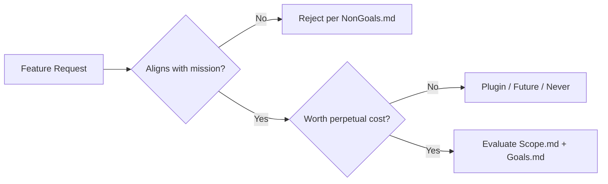
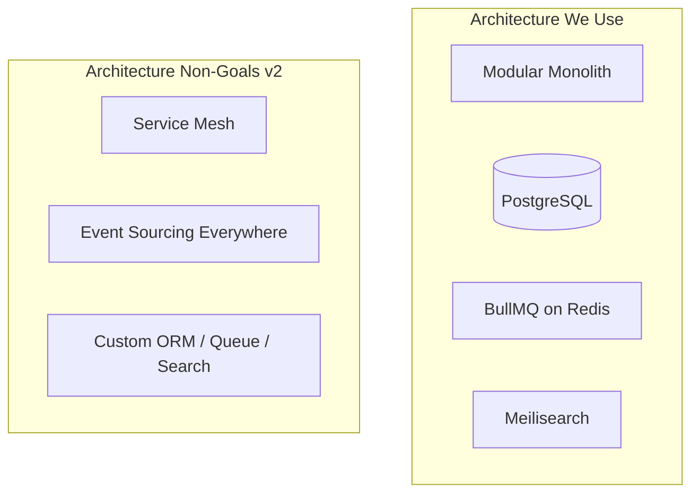
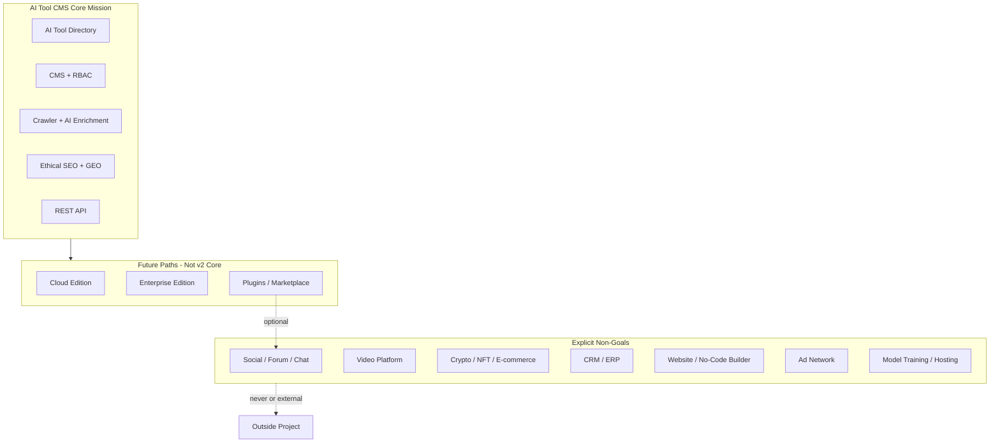
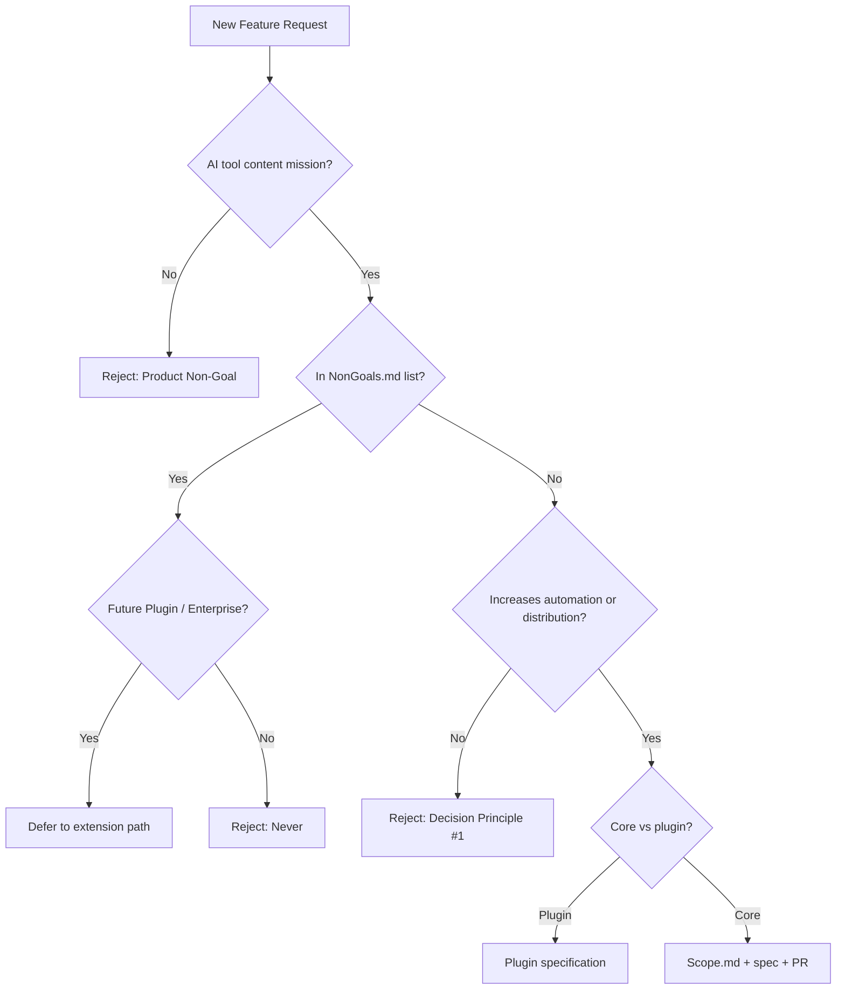
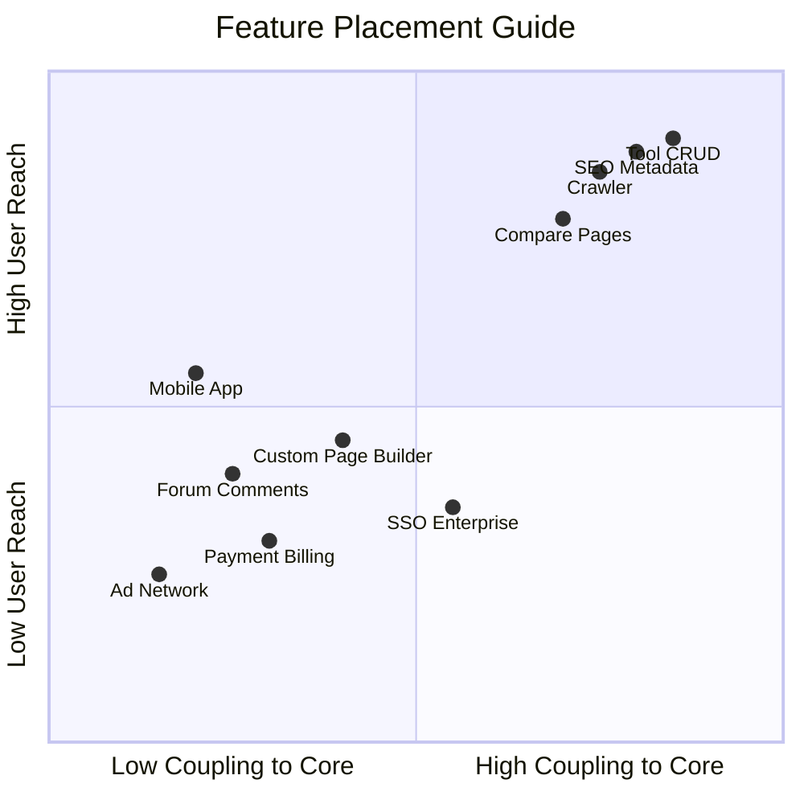

# Non-Goals

> **Document Type:** Product Boundaries  
> **Version:** 2.0.0  
> **Status:** Draft  
> **Owner:** Product Architecture Team  
> **Last Updated:** 2026  
> **Audience:** Product Managers, Software Architects, Developers, Open Source Contributors, AI Coding Assistants

---

## Table of Contents

1. [Purpose](#purpose)
2. [Philosophy](#1-philosophy)
3. [Product Non-Goals](#2-product-non-goals)
4. [Technical Non-Goals](#3-technical-non-goals)
5. [Architecture Non-Goals](#4-architecture-non-goals)
6. [UI/UX Non-Goals](#5-uiux-non-goals)
7. [Business Non-Goals](#6-business-non-goals)
8. [AI Non-Goals](#7-ai-non-goals)
9. [SEO Non-Goals](#8-seo-non-goals)
10. [Future Considerations](#9-future-considerations)
11. [Decision Principles](#10-decision-principles)
12. [Mermaid Diagrams](#11-mermaid-diagrams)

---

## Purpose

This document defines what **AI Tool CMS v2 will not build**—intentionally, persistently, and by design. While [Goals.md](./Goals.md) and [Scope.md](./Scope.md) describe what the project includes, non-goals describe what it **refuses** to become.

Clear non-goals exist to:

| Question | Answered Here |
|---|---|
| Which features are intentionally excluded? | [Product Non-Goals](#2-product-non-goals), [Future Considerations](#9-future-considerations) |
| Which technologies are intentionally avoided? | [Technical](#3-technical-non-goals), [Architecture](#4-architecture-non-goals) non-goals |
| Which business models are not supported? | [Business Non-Goals](#6-business-non-goals) |
| Which product directions are out of scope? | Entire document; cross-ref [Vision.md](./Vision.md) |

Feature requests that violate this document should be **declined** or redirected to plugins, enterprise editions, or external tools—unless a formal scope amendment is approved with maintainer consensus.

**For AI coding assistants:** Do not implement capabilities listed here without explicit task authorization and documentation update.

---

## 1. Philosophy

Defining non-goals is as important as defining goals. Ambitious projects fail as often from **doing too much** as from doing too little. Every excluded feature is a decision to protect focus, quality, and the contributors who maintain the platform for years.

### Focus

AI Tool CMS v2 targets **AI software knowledge operations**—discovery, cataloging, enrichment, publishing, and distribution. Non-goals draw a hard line around that mission. Without them, well-intentioned requests ("add a forum," "build a page builder," "host models") fragment the roadmap into a generic platform that excels at nothing.

### Maintainability

Each feature carries perpetual cost: code, tests, documentation, security surface, and support burden. Non-goals reject categories where maintenance cost grows faster than user value—especially social graphs, payment systems, and custom infrastructure that mature vendors already operate better.

### Engineering Cost

Engineering cost is not only headcount—it is cognitive load. Supporting multiple databases, microservices, and visual builders simultaneously multiplies decision fatigue and slows every unrelated change. Non-goals preserve a **single coherent stack** until scale objectively demands more.

### Product Positioning

The platform competes as an **open, AI-native CMS for AI tool content**—not as Salesforce, WordPress, YouTube, or OpenAI. Non-goals protect positioning clarity for users evaluating self-hosted alternatives to directories like Toolify or Futurepedia.

### Long-Term Sustainability

Open source sustainability requires a core that contributors can understand and extend. A monolith that tries to be everything becomes unmaintainable and un-forkable. Non-goals keep the core **legible**—automation, CMS, SEO, GEO, API—while pushing long-tail needs to plugins and editions.

### Comparison: Goals vs Non-Goals

| Dimension | Goals ([Goals.md](./Goals.md)) | Non-Goals (this document) |
|---|---|---|
| **Focus** | What we must achieve | What we refuse to become |
| **Audience** | Roadmap prioritization | Feature request triage |
| **Stability** | Evolves with milestones | Core exclusions stable across versions |
| **Tone** | Aspirational outcomes | Explicit boundaries |

Non-goals are not "weak goals"—they are **protective constraints** that make ambitious goals achievable.

---

## 2. Product Non-Goals

The following product categories are **not** what AI Tool CMS v2 builds. Each exclusion includes reasoning—not arbitrary restriction.

### Exclusion Summary Table

| Non-Goal | Reasoning |
|---|---|
| **Social Network** | User graphs, feeds, and follows require moderation, abuse handling, and engagement algorithms unrelated to catalog quality. External communities (Discord, X) suffice. |
| **Community Forum** | Threaded discussion platforms are mature products (Discourse, etc.). Hosting forums distracts from automation and SEO core loops. |
| **Chat Application** | Real-time messaging is a different reliability and moderation domain. Support chat belongs in external tools. |
| **AI Model Training Platform** | Training requires GPU fleets, datasets, and MLOps—orthogonal to content cataloging. Platform **consumes** models; it does not train them. |
| **AI Model Hosting Platform** | Inference hosting competes with OpenAI, Anthropic, and cloud providers. Out of mission and capital reach. |
| **Video Platform** | Video upload, transcode, CDN, and copyright are enormous scope. Tutorials may **embed** video; platform does not host streaming. |
| **CRM** | Sales pipelines, leads, and opportunities belong in HubSpot/Salesforce. Integrate via API if needed—not rebuild. |
| **ERP** | Inventory, procurement, and accounting systems are unrelated to AI tool discovery. |
| **CMS for All Industries** | Scope is **AI software content**—not hospitals, restaurants, or real estate generic CMS. Vertical expansion dilutes data model. |
| **Website Builder** | Drag-and-drop site construction competes with Webflow and WordPress. Public Web templates are fixed product surfaces—not arbitrary sites. |
| **No-Code Platform** | General workflow automation for any domain is Zapier territory. Workflow library documents AI steps; not visual programming for everything. |
| **Blockchain Platform** | Ledger, wallets, and on-chain identity add complexity without catalog value. |
| **Cryptocurrency Platform** | Tokens, trading, and custody are regulated financial products—explicitly out of vision. |
| **NFT Marketplace** | NFT listings and auctions unrelated to AI tool mission. |
| **Advertising Network** | Ad serving, auction, and fraud detection are AdTech scope. Ethical **sponsored placement hooks** may exist; not a full ad network. |
| **E-commerce Platform** | Shopping carts, checkout, tax, and fulfillment are Shopify scope. Pricing **information** is in scope; **transactions** are not. |

### Social Network

AI Tool CMS will **not** build follower graphs, activity feeds, direct messaging between users, likes, reposts, or profile pages designed for social engagement. Tool discovery does not require a social graph; introducing one creates moderation obligations (spam, harassment, bot networks) and product expectations around notification systems and ranking algorithms that rival standalone social products.

**Acceptable alternative:** Share buttons linking to external networks; "save to collection" for authenticated visitors (future, in scope as bookmarking—not social graph).

### Community Forum

Threaded discussion, sub-forums, moderation queues, and reputation systems are **out of scope**. Mature forum software exists; operating a forum competes for maintainer attention with crawler reliability and SEO quality.

**Acceptable alternative:** Link to Discord, GitHub Discussions, or Discourse hosted separately.

### Chat Application

Real-time chat (WebSocket rooms, support chat widgets with operator routing) is **not built**. Latency, presence, and chat history storage are distinct engineering domains.

**Acceptable alternative:** External Intercom/Crisp for enterprise sites; mailto support links in open core.

### AI Model Training Platform

The platform will **not** offer dataset labeling, training pipelines, hyperparameter tuning, GPU cluster management, or model registry for custom fine-tunes. Operators who need fine-tuning use external MLOps tools.

### AI Model Hosting Platform

Self-hosted inference endpoints, model weight distribution, and GPU autoscaling are **non-goals**. `@ai-tool-cms/ai` calls external APIs.

### Video Platform

Upload, transcode, adaptive bitrate streaming, DRM, and video CDN are **excluded**. Video metadata and embeds for tutorials are **in scope**.

### CRM and ERP

Customer relationship management (leads, deals, pipelines) and enterprise resource planning (inventory, HR, accounting) are **never** core scope. AI Tool CMS catalogs **products**, not **sales processes**.

### CMS for All Industries / Website Builder / No-Code Platform

The content model targets **AI tools and related assets**—not arbitrary business websites. Visual builders and general no-code automation duplicate WordPress, Webflow, and Zapier without strengthening the catalog mission.

### Blockchain, Cryptocurrency, NFT Marketplace

Web3 features introduce regulatory, security, and ideological complexity unrelated to catalog quality. **Never** goals for this project.

### Advertising Network and E-commerce Platform

Operating an ad exchange or full checkout (cart, tax, shipping) is **out of scope**. Sponsored listings with clear disclosure and affiliate outbound links may exist as **ethical monetization hooks**—not AdTech or Shopify replacements.

---

## 3. Technical Non-Goals

Technical choices are deliberately narrow. The project optimizes for **one excellent path**, not universal optionality.

| Non-Goal | Rationale |
|---|---|
| **Multiple backend frameworks simultaneously** | NestJS is the API framework. Adding Fastify/Django/Go APIs splits conventions and duplicates auth, validation, and OpenAPI. |
| **Multiple databases simultaneously** | PostgreSQL is the system of record. Supporting MySQL/MongoDB in core doubles migration and query testing burden. |
| **Microservices in initial release** | Modular monolith (`apps/` + `packages/`) delivers boundaries without network partitions, distributed tracing mandates, and deploy complexity. |
| **Build a custom search engine** | Meilisearch (and PostgreSQL FTS fallback) suffice. Writing inverted indexes is not differentiating work. |
| **Build a custom AI model** | Foundation model research is a non-goal. Use provider APIs via `@ai-tool-cms/ai` abstraction. |
| **Replace existing LLM providers** | Platform routes to OpenAI, Claude, Gemini, etc.—does not compete as a model vendor. |
| **Support every cloud platform from day one** | Docker Compose first; AWS/GCP/Azure guides over time. Kubernetes not required for v2.0. |
| **Optimize for every browser before MVP** | Modern evergreen browsers first. IE11 and legacy mobile browsers are non-goals for MVP. |

### Acceptable Technical Evolution

| Evolution | When |
|---|---|
| Extract worker/crawler to separate deploy units | Scale requires independent scaling—not day-one microservices |
| Add read replicas | Database load justifies |
| Kubernetes Helm charts | Enterprise demand; optional path |
| Second search backend via abstraction | Meilisearch limits hit at scale |

---

## 4. Architecture Non-Goals

Architectural patterns that add complexity without proportional benefit for v2.0 are **rejected by default**.

| Architectural Non-Goal | Why Avoided |
|---|---|
| **Event sourcing everywhere** | Audit trails use append logs where needed; full ES-CQRS for all entities is overkill for CMS CRUD. |
| **CQRS everywhere** | Read models for hot paths only (materialized views, cache)—not mandatory split for every module. |
| **Service mesh** | Istio/Linkerd overhead unjustified until many independently deployed services exist. |
| **Distributed transactions (2PC)** | Saga patterns and idempotent jobs preferred; avoid cross-service atomic commits in v2.0. |
| **Multi-region active-active deployment** | Single-region + CDN for v2.0; multi-region is enterprise future consideration. |
| **Custom ORM** | Prisma is the data access layer. Custom ORM is never a goal. |
| **Custom message queue** | Redis + BullMQ standard. Building RabbitMQ/Kafka alternative is non-goal. |
| **Plugin sandbox OS-level isolation day one** | Plugin API first; WASM/containers for untrusted plugins is future hardening. |

### Preferred Architecture Posture

---

## 5. UI/UX Non-Goals

Public Web and Admin UX prioritize **clarity, speed, and SEO**—not visual extravagance or infinite customization.

| UI/UX Non-Goal | Rationale |
|---|---|
| **Heavy animations** | Framer Motion used sparingly; excessive motion hurts CLS and accessibility. |
| **Complex dashboards** | Admin shows operational health—not BI supersets rivaling Tableau. |
| **Unnecessary customization** | Theming via design tokens; not per-tenant arbitrary CSS in open core. |
| **Visual page builders** | Operators do not drag-drop arbitrary layouts. Content types drive pages. |
| **Drag-and-drop CMS** | Structure from schema and templates—not freeform canvas editing. |
| **Widget marketplace in Admin UI** | Dashboard plugins deferred; fixed purposeful layouts first. |
| **Gamification** | Points, badges, leaderboards—social engagement non-goal. |
| **Infinite theme skins** | Light/dark and brand config sufficient for v2.0. |

### In-Scope UX

- Fast, accessible Admin (shadcn/ui, keyboard navigation)
- Readable public pages optimized for Core Web Vitals
- Consistent design system via `@ai-tool-cms/ui`
- Clear editorial workflows—not creative unlimited layout freedom

---

## 6. Business Non-Goals

Commercial activity may exist around the project; these **business models are not built into the open core v2.0 product**.

| Business Non-Goal | Clarification |
|---|---|
| **Managed hosting as open core default** | Self-host first. **Cloud Edition** is future commercial scope—not v2.0 open source deliverable. |
| **Customer support platform** | No built-in Zendesk replacement. GitHub Issues/Discussions + external helpdesk for enterprise. |
| **Consulting business as product feature** | Services may exist around project; not encoded in software scope. |
| **Ad network** | No programmatic ad auction, fill rate optimization, or advertiser portal. |
| **Payment gateway** | No Stripe/PayPal integration for collecting money inside CMS. |
| **Subscription billing engine** | No invoicing, proration, or tax in open core. Cloud Edition future. |
| **Affiliate network management** | Track outbound links; not operate affiliate aggregation network. |
| **Data brokerage** | Catalog data is not sold as raw feed without operator policy—platform does not facilitate data brokering. |

### Business Models That May Exist (Outside Core)

| Model | Posture |
|---|---|
| Enterprise support contracts | Future Enterprise Edition |
| Managed SaaS hosting | Future Cloud Edition |
| Sponsored tool listings | Ethical hooks in core; not ad network |
| Professional services | Community/commercial partners—not product module |

---

## 7. AI Non-Goals

AI is central to the product—but within **content operations**, not **AI research or model competition**.

| AI Non-Goal | Explanation |
|---|---|
| **Train foundation models** | No pretraining, fine-tuning infrastructure, or dataset curation pipelines at scale. |
| **Compete with OpenAI** | No general chat product replacing ChatGPT for end users. |
| **Replace Claude** | No anthropic-model replication or consumer assistant UX. |
| **Replace Gemini** | No Google AI product parity. |
| **Become an AI research platform** | No benchmark leaderboards, paper reproduction, or experiment tracking as core mission. |
| **Run inference cheaper than providers** | Cost optimization via routing—not building custom inference clusters. |
| **Guarantee factual correctness of AI output** | Human review and policies required; platform does not claim infallible generation. |
| **Autonomous publishing without gates** | Full auto-publish without review is non-goal for quality and SEO risk. |

### In-Scope AI

- Multi-provider text generation for descriptions, FAQs, summaries
- Classification and tagging assistance
- Translation drafts with review
- Prompt template management
- Cost and usage observability per provider

---

## 8. SEO Non-Goals

SEO is a **first-class product capability**—but **black-hat and quality-degrading practices** are explicit non-goals. The platform automates ethical, scalable SEO—not spam.

| SEO Non-Goal | Why Rejected |
|---|---|
| **Keyword stuffing** | Damages readability and risks penalties; templates enforce natural language limits. |
| **Spam pages** | Mass low-value URLs without unique utility are forbidden by quality gates. |
| **Auto-generated low-quality content** | Automation must meet content quality score thresholds; thin pages blocked from publish. |
| **Black-hat SEO** | Hidden tactics violating search guidelines—never a feature. |
| **Doorway pages** | Pages existing only to funnel queries to other pages—excluded. |
| **Hidden text** | Invisible keyword blocks—excluded. |
| **Cloaking** | Different content for crawlers vs users—excluded. |
| **Link farms** | Automated reciprocal link schemes—excluded. |
| **Parasite SEO patterns** | Exploiting unrelated high-authority patterns—excluded. |
| **Misleading structured data** | JSON-LD must reflect visible page content—no schema spam. |

### Quality Gates vs Spam

The platform automates page generation at scale—that power requires **explicit rejection** of spam tactics. Non-goals here protect:

- **Brand reputation** — Penalized domains hurt entire catalog
- **Operator trust** — Self-hosters rely on ethical defaults
- **Open source credibility** — Community will not promote black-hat tooling
- **Long-term indexability** — Short-term traffic hacks destroy durable growth

Operators may override noindex for experimental pages; defaults must not encourage abuse.

### Ethical SEO In Scope

- Programmatic metadata from structured records
- Canonical URLs, hreflang, sitemaps, robots
- FAQ and SoftwareApplication schema where content supports it
- GEO-aligned factual blocks for AI citation
- Editorial override and noindex for low-confidence pages

---

## 9. Future Considerations

Excluded features are not all **never**—some may return via editions, plugins, or community extensions. This table classifies disposition.

### Decision Table

| Excluded Feature | Never | Maybe | Future Enterprise | Future Plugin | Community Extension |
|---|---|---|---|---|---|
| Social Network | ● | | | ○ | ○ |
| Community Forum | ● | | | ○ | ○ |
| Chat Application | ● | | ○ | ○ | |
| AI Model Training | ● | | | | |
| AI Model Hosting | ● | | | | |
| Video Platform | ● | | | ○ | ○ |
| CRM | ● | | ○ | ○ | ○ |
| ERP | ● | | | | |
| Generic CMS / Website Builder | ● | | | | |
| No-Code Platform | ● | | ○ | ○ | |
| Blockchain / Crypto / NFT | ● | | | | |
| Ad Network | ● | | ○ | ○ | |
| E-commerce Checkout | ● | | ○ | ○ | |
| Managed Hosting (Cloud) | | | ● | | |
| SSO / Advanced Audit | | | ● | | |
| Plugin Marketplace | | ○ | ● | ● | |
| Workflow Builder | | ○ | ● | ● | |
| Browser Extension | | ○ | | ○ | ○ |
| Mobile App | | ○ | ● | ○ | ○ |
| Microservices | | ○ | ● | | |
| Multi-region Active-Active | | | ● | | |
| Visual Page Builder | ● | | | ○ | ○ |
| Comments on tools | | ○ | | ● | ● |
| Payment / Billing | | | ● | ○ | |

**Legend:** ● = primary disposition | ○ = possible secondary path

### Disposition Definitions

| Label | Meaning |
|---|---|
| **Never** | Contradicts mission; do not revisit without project fork |
| **Maybe** | Revisit if market proof and maintainer capacity; no commitment |
| **Future Enterprise** | Commercial edition may add for paying customers |
| **Future Plugin** | Core provides hooks; official or marketplace plugin |
| **Community Extension** | Third-party integration; not maintained in core repo |

---

## 10. Decision Principles

Twenty principles for **rejecting or deferring** feature requests. Apply in order during roadmap and PR review.

1. **If a feature increases complexity without improving automation, reject it.**
2. **If a feature benefits less than 5% of users, consider a plugin**—not core.
3. **If a feature can live outside the core, move it to an extension.**
4. **If a mature open source or SaaS product solves it well, integrate—do not rebuild.**
5. **If it requires 24/7 human moderation at scale, reject unless automation exists.**
6. **If it dilutes AI tool content focus, reject** (generic CMS, e-commerce, social).
7. **If it adds a second source of truth for data, reject** (duplicate stores without sync story).
8. **If it cannot be tested in CI reasonably, defer** until test strategy exists.
9. **If it violates SEO non-goals, reject** regardless of traffic promise.
10. **If it trains or hosts models, reject**—consume providers only.
11. **If it needs payment processing, defer to Cloud/Enterprise**—not open core v2.
12. **If it expands admin UI faster than operator value, simplify first.**
13. **If it requires microservices day one, reject**—modular monolith first.
14. **If documentation and spec cannot explain it in one page, scope is too big**—split or defer.
15. **If AI assistants cannot implement it within existing patterns, redesign request**—not bypass standards.
16. **If it forks the data model for one customer, reject**—generalize or plugin.
17. **If security review cannot complete in release window, defer**—no rushed auth/payment features.
18. **If it competes with project positioning as "another X", reject**—clarify unique value.
19. **If maintainers cannot support it for one year minimum, do not merge.**
20. **When in doubt, default to no**—prove inclusion against [Goals.md](./Goals.md), not enthusiasm.

### Feature Request Response Template

| Outcome | Response Pattern |
|---|---|
| **Reject** | "Non-goal per NonGoals.md §[section]. Alternative: [external tool / plugin]." |
| **Defer** | "Future [Enterprise / Plugin]. Tracked when [condition]." |
| **Accept** | "In scope per Scope.md. Requires spec + Goals alignment." |

---

## 11. Mermaid Diagrams

### Scope Boundary (Core vs Non-Goals)

### Feature Decision Tree

### Core vs Extension

High reach + high coupling → **core**. High reach + low coupling → **first-party plugin or edition**. Low reach → **community extension or never**.

---

## Maintaining This Document

| Event | Action |
|---|---|
| Feature rejected in issue/PR | Link to relevant Non-Goals section |
| Scope amendment approved | Update Non-Goals disposition table if exclusion changes |
| New plugin category emerges | Add row to Future Considerations table |
| AI assistant asked to build excluded feature | Refuse; cite this document |

---

## Related Documents

- [Project Scope](./Scope.md) — What is included in v2.0
- [Product Goals](./Goals.md) — What the project aims to achieve
- [Product Vision](./Vision.md) — Long-term narrative
- [Priority Matrix in Goals.md](./Goals.md#8-priority-matrix) — MoSCoW for v2.0

---

**Document Version**

| Field | Value |
|---|---|
| Version | 2.0.0 |
| Status | Draft |
| Owner | Product Architecture Team |
| Last Updated | 2026 |
