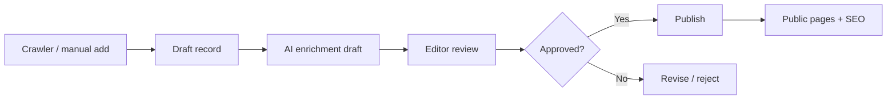
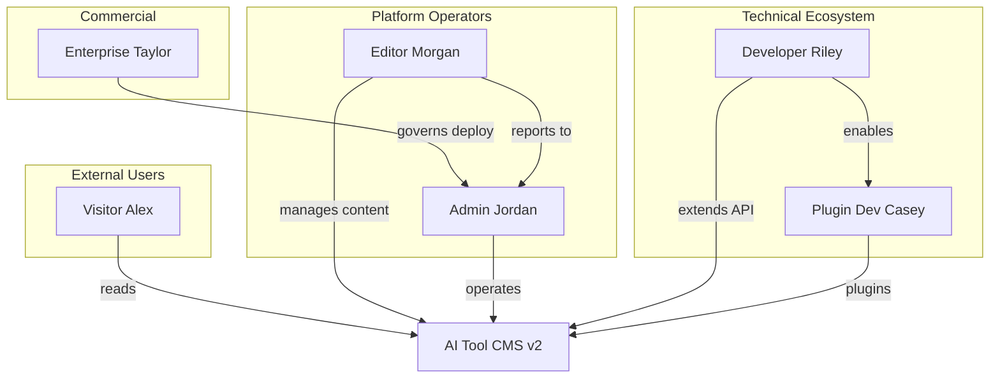
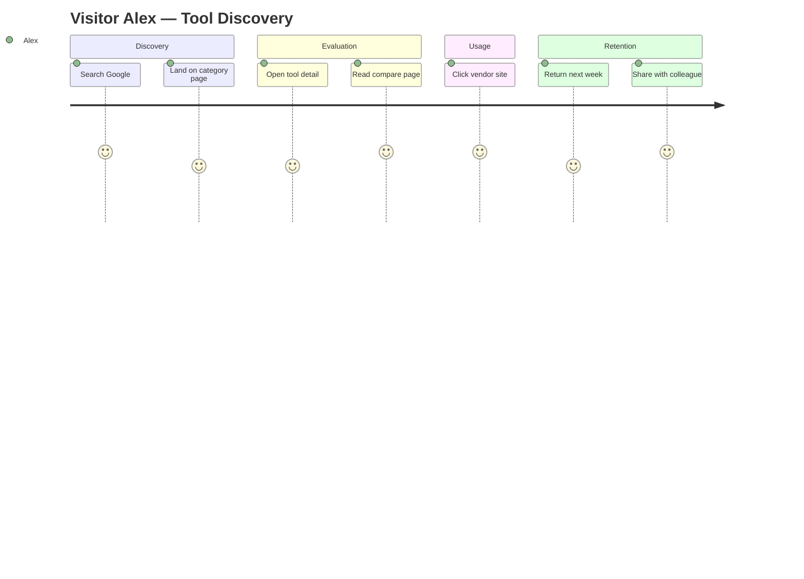
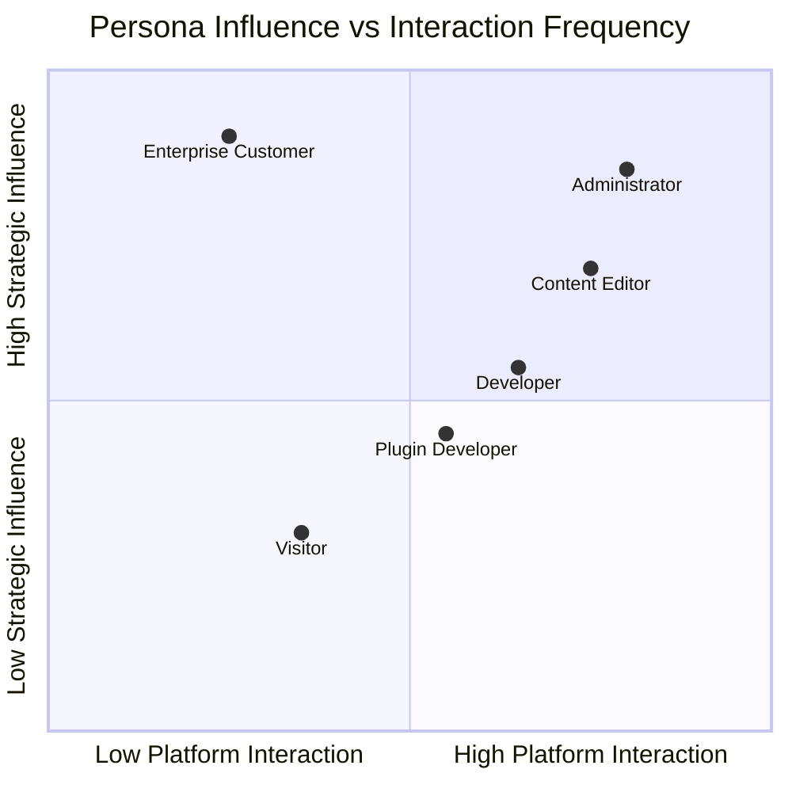
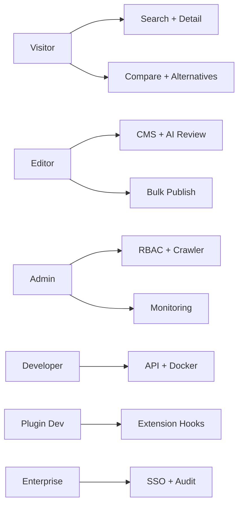

# User Personas

> **Document Type:** Product & UX Research  
> **Version:** 2.0.0  
> **Status:** Draft  
> **Owner:** Product Architecture Team  
> **Last Updated:** 2026  
> **Audience:** Product Managers, UX Designers, Software Architects, Developers, Open Source Contributors, AI Coding Assistants

---

## Table of Contents

1. [Introduction](#1-introduction)
2. [Persona Overview](#2-persona-overview)
3. [Visitor](#3-visitor)
4. [Content Editor](#4-content-editor)
5. [Administrator](#5-administrator)
6. [Developer](#6-developer)
7. [Enterprise Customer](#7-enterprise-customer)
8. [Plugin Developer](#8-plugin-developer)
9. [User Journey](#9-user-journey)
10. [Persona Comparison Matrix](#10-persona-comparison-matrix)
11. [Pain Points](#11-pain-points)
12. [Future Personas](#12-future-personas)
13. [Mermaid Diagrams](#13-mermaid-diagrams)

---

## 1. Introduction

User personas are **research-backed archetypes** representing the people who interact with AI Tool CMS v2—directly or indirectly. They are not marketing fiction; they are decision tools that keep product, UX, and engineering aligned when trade-offs arise.

### Why Personas Matter

| Without Personas | With Personas |
|---|---|
| Features built for imaginary "users" | Features mapped to concrete goals and pain points |
| Admin UI grows unbounded | Workflows tuned for Editor and Administrator needs |
| API designed for internal convenience only | Developer persona drives OpenAPI completeness |
| SEO treated as marketing afterthought | Visitor search behavior informs information architecture |
| RBAC becomes a flat admin flag | Permission model reflects real role separation |

Personas answer: **Who are we building for, what do they need, and how do we know we succeeded?**

### Influence on Product and Architecture

Personas guide decisions across the platform lifecycle:

| Domain | Persona Influence |
|---|---|
| **Product design** | Prioritize compare pages for Visitors; bulk edit for Editors |
| **UX decisions** | Admin density vs clarity; public page speed over animation |
| **Feature priorities** | MoSCoW in [Goals.md](./Goals.md) maps to persona value |
| **Permission model** | Editor vs Administrator vs API key scopes |
| **SEO strategy** | Visitor search intent; programmatic page types |
| **Content generation** | Editor review queues; AI draft quality for Editors |
| **AI automation** | Administrator monitors crawler; Editor approves output |

When a feature proposal cannot name its primary persona and success criterion, it should be deferred until clarified.

### Persona-Driven Design Principles

| Principle | Application |
|---|---|
| **Design for the primary persona first** | Visitor and Editor paths before edge admin settings |
| **Do not merge personas in one UI** | Admin power tools separate from editorial simplicity |
| **Measure per persona** | KPIs in [Goals.md](./Goals.md) map to Alex, Morgan, Jordan—not "users" |
| **Respect permission boundaries** | Editors must not require superadmin for daily work |
| **Document persona in specs** | `spec/` features note primary beneficiary |

Personas are **not user stories**—they are stable reference characters. User stories are written *from* personas: "As Morgan, I want to bulk-approve crawler drafts so that I can publish 50 tools per day."

Related documents: [Goals.md](./Goals.md), [Scope.md](./Scope.md), [Vision.md](./Vision.md), [NonGoals.md](./NonGoals.md).

---

## 2. Persona Overview

### Primary and Secondary Personas

| Persona | Type | Priority |
|---|---|---|
| **Visitor** | Primary | P0 — volume and mission validation |
| **Content Editor** | Primary | P0 — content quality and throughput |
| **Administrator** | Primary | P0 — security and automation health |
| **Developer** | Primary | P1 — ecosystem and self-host adoption |
| **Enterprise Customer** | Secondary | P1 — commercial and compliance path |
| **Plugin Developer** | Secondary | P2 — extension ecosystem (v2 alpha → v3 scale) |

### Summary Table

| Persona Name | Description | Primary Goals | Technical Level | Frequency of Use | Priority |
|---|---|---|---|---|---|
| **Alex — Visitor** | Professional seeking AI tools for work | Find, compare, trust, act | Low–Medium | Daily–Weekly | P0 |
| **Morgan — Content Editor** | Editorial operator managing catalog | Publish accurate, fresh content efficiently | Medium | Daily | P0 |
| **Jordan — Administrator** | Platform owner or lead operator | Secure, automated, observable operations | Medium–High | Daily | P0 |
| **Riley — Developer** | Integrator or open source contributor | Extend, deploy, debug, integrate | High | Weekly–Daily | P1 |
| **Taylor — Enterprise Customer** | IT/compliance buyer for organization | Compliant private deployment with support | Medium (evaluator) | Monthly (governance) | P1 |
| **Casey — Plugin Developer** | Third-party extension author | Ship plugins safely; reach users | High | Weekly | P2 |

---

## 3. Visitor

**Archetype:** Alex — knowledge worker, founder, or developer exploring AI software options.

### Background

Alex works in marketing, product, engineering, or operations. They encounter AI tool recommendations through search, social links, newsletters, or colleague referrals. They are time-constrained and skeptical of hype—they want **signal over noise**.

| Attribute | Detail |
|---|---|
| Age range | 25–45 (representative, not exclusive) |
| Context | Evaluating tools for personal productivity or team adoption |
| Relationship to platform | Anonymous or casual; may create account later for collections (future) |

### Goals

- Discover tools relevant to a specific task (writing, image, coding, research)
- Compare options on pricing, capabilities, and fit
- Understand alternatives when a tool is too expensive or limited
- Trust that information is current and not purely affiliate-driven
- Use lightweight online utilities without installing software (when available)

### Pain Points

| Pain Point | Current Market Failure |
|---|---|
| Directories go stale | Outdated pricing and dead links |
| Shallow listings | Name + link without comparison context |
| SEO spam pages | Low-trust thin content |
| Fragmented research | Ten tabs across Google, Reddit, and vendor sites |
| No neutral compare view | Vendor marketing only |

### Typical Journey

1. **Land** via Google query ("best AI writing tool 2026") or referral
2. **Scan** category or search results
3. **Open** tool detail page; read summary, pricing, FAQ
4. **Compare** with 1–2 alternatives
5. **Click out** to vendor site or use on-site online tool
6. **Return** later if bookmarked or if site ranks for related queries

### Most Used Features

- Search and category browse
- Tool detail pages
- Compare and alternatives pages
- Collections and tutorials (as depth increases)
- Online tools (subset of visitors)

### Success Criteria

| Criterion | Measurement |
|---|---|
| Finds relevant tool in < 3 clicks from landing | Task success in UX tests |
| Trusts page enough to click outbound | Low bounce on detail pages |
| Returns within 30 days | Repeat visitor rate |
| Shares link with colleague | Referral traffic |

### Preferred Devices

| Device | Usage Pattern |
|---|---|
| **Desktop** | Primary for research and compare tables |
| **Mobile** | Discovery and quick lookup; responsive required |
| **Tablet** | Secondary browse |

### Search Behavior

| Behavior | Implication for Product |
|---|---|
| Long-tail queries ("ChatGPT alternative for legal docs") | Programmatic alternatives pages |
| Branded + category ("Notion AI pricing") | Strong detail pages + structured data |
| Comparison queries ("X vs Y") | Compare page templates |
| Growing AI chat referrals | GEO-structured factual blocks |

### Visitor Scenarios

| Scenario | Alex's Need | Product Response |
|---|---|---|
| **Solo founder picking stack** | Compare 3 writing assistants under budget | Compare + pricing filter |
| **Engineer evaluating APIs** | API pricing and rate limits | API directory (future), detail metadata |
| **Marketer finding image tools** | Category browse + collections | Category pages, curated collections |
| **Student seeking free tools** | Free/freemium filter | Pricing enum filter |
| **Returning user** | "What's new this week?" | News, release notes, RSS |

---

## 4. Content Editor

**Archetype:** Morgan — editorial operator, community manager, or domain specialist curating AI tool knowledge.

### Background

Morgan may be solo blogger, media team member, or internal curator at a company running an AI tool property. They are not necessarily an engineer—they need **efficient workflows** and **quality guardrails**.

### Daily Responsibilities

- Review crawler-suggested new tools
- Edit AI-generated drafts for accuracy and tone
- Assign categories and tags
- Curate collections and featured lists
- Coordinate publication timing with announcements
- Flag incorrect pricing or broken links for re-crawl

### Workflow

### Content Approval

- Default: AI-generated content stays **draft** until human publish
- High-traffic tools may require second reviewer (policy per deployment)
- Reject spam or low-quality crawler candidates before enrichment spend

### SEO Tasks

- Override meta title/description when programmatic defaults insufficient
- Mark pages `noindex` when quality below threshold
- Request compare/alternatives regeneration after major tool updates
- Review FAQ blocks for accuracy (GEO + SEO)

### AI Generation

- Trigger regeneration for description, summary, FAQ
- Select language variant for translation draft
- Accept, edit, or reject AI output with diff visibility
- Never required to write from blank page for routine tools

### Publishing

- Bulk publish after batch review (with safeguards)
- Schedule publish for coordinated launches (future)
- Unpublish or archive deprecated tools

### Revision Management

- View history of edits and AI generations
- Revert to prior approved version
- See last crawl verification timestamp

### Success Criteria

| Criterion | Indicator |
|---|---|
| Publishes 20+ tools/day with review | Throughput metric |
| < 15% AI drafts require major rewrite | Quality score |
| Zero critical factual errors post-publish | Incident count |
| SEO overrides < 30% of pages | Automation health |

### Editor Persona Variants

| Variant | Emphasis |
|---|---|
| **Solo curator** | Speed; minimal approval layers; AI trust after calibration |
| **Media team editor** | Style guide compliance; collaborative review (future) |
| **Domain specialist** | Deep accuracy on niche tools; more manual override |

All variants share Morgan core workflow; RBAC may add reviewer role in larger teams.

---

## 5. Administrator

**Archetype:** Jordan — technical owner, DevOps-adjacent lead, or founder responsible for platform health.

### Background

Jordan deploys self-hosted instances or oversees managed deployment. They care about **security**, **uptime**, **cost**, and **automation reliability** more than individual tool copy.

### Permissions

- Full RBAC management: roles, permissions, user assignment
- System configuration: env-backed settings exposed in Admin
- Cannot be conflated with Editor—separation of duties in enterprise setups

### System Management

- View service health (API, DB, Redis, search, workers)
- Trigger manual crawl jobs and reindex
- Configure rate limits and crawl politeness
- Manage storage and backup reminders (runbook-linked)

### User Management

- Create/disable admin accounts
- Assign Editor vs Administrator roles
- Rotate API keys for integrations
- Review audit log for sensitive actions (enterprise)

### Crawler Configuration

- Enable/disable source adapters
- Set concurrency and schedules
- Blocklist noisy or low-quality domains
- Review crawler success rate dashboard

### AI Configuration

- Configure provider keys and model routing policy
- Set cost budgets and alerts
- Approve prompt template changes
- Disable generation globally in emergency

### Security

- Enforce password policy; plan SSO (enterprise)
- Review failed login attempts
- Approve dependency upgrade windows
- Respond to security advisories

### Monitoring

- Queue depth, job failures, API latency
- Index freshness and sitemap last generation
- Error tracking integration status
- Disk and AI token spend trends

### Success Criteria

| Criterion | Indicator |
|---|---|
| 99.5%+ API uptime (self-hosted target) | Monitoring |
| Crawler success rate ≥ 85% | Dashboard |
| No unresolved critical CVEs > 30 days | Security process |
| Automation runs without daily manual fixes | Operator time saved |

---

## 6. Developer

**Archetype:** Riley — backend/frontend engineer, integrator, or open source contributor.

### Background

Riley extends the platform, embeds catalog data elsewhere, or contributes PRs. They read docs first and expect **predictable APIs** and **reproducible local setup**.

### API Usage

- Consume REST API with JWT or service tokens
- Rely on OpenAPI for client generation
- Expect pagination, filtering, consistent error shapes
- Webhook consumption for publish events (future)

### Plugin Development

- Implement crawler adapters, enrichers, or online tool modules (future plugin API)
- Follow [CodingStandards.md](./CodingStandards.md) and [FolderStructure.md](./FolderStructure.md)

### Customization

- Theme Admin within design token limits
- Add custom renderers via extension hooks—not fork core
- Configure site URL, locale, SEO defaults via env

### Deployment

- Docker Compose for local and production
- Run migrations and seeds from documented commands
- Pin image tags to SemVer releases

### Debugging

- Structured logs with request IDs
- Health endpoints for dependency checks
- Reproduce worker jobs in isolation

### CI/CD

- Run lint, typecheck, test before PR
- Follow [GitWorkflow.md](./GitWorkflow.md)
- Contribute docs with code changes

### Success Criteria

| Criterion | Indicator |
|---|---|
| Local setup < 1 hour from clone | Onboarding tests |
| API matches OpenAPI 100% for documented routes | Contract tests |
| First PR merged within 2 weeks of contributor start | Community health |
| Plugin prototype without core fork | Extension goal |

### Developer Sub-Personas

| Sub-Persona | Focus |
|---|---|
| **Contributor** | Upstream PRs to core monorepo |
| **Integrator** | Consumes API from external app |
| **Self-hoster** | Deploys for own team; light customization |
| **Agency builder** | Fork or plugin for client sites (future) |

Riley represents the union; roadmap prioritizes contributor and self-hoster in v2.0.

---

**Archetype:** Taylor — IT director, security officer, or procurement lead evaluating self-hosted AI catalog for organization.

### Background

Taylor represents a company that wants **private catalog**, **compliance**, and **support**—not public community scale. They may never use Admin daily; they govern adoption.

### Requirements

| Requirement | Enterprise Expectation |
|---|---|
| Data residency | Deploy in customer VPC or on-prem |
| Access control | SSO, SCIM, fine-grained RBAC |
| Auditability | Immutable audit logs for admin actions |
| Support | SLA, security advisory priority |
| Upgrade path | LTS releases, migration guides |

### Security

- Penetration test remediation SLAs
- Secret management integration (Vault, etc.)
- Network isolation documentation

### Private Deployment

- Air-gapped install option (future enterprise guide)
- No mandatory outbound telemetry
- Optional disable of external AI providers

### High Availability

- Documented HA patterns (DB replicas, redundant workers)
- RTO/RPO guidance—not guaranteed in open core v2.0

### SSO

- SAML/OIDC for Admin access (Enterprise Edition future)
- No shared passwords across team

### Audit Logs

- Who published, changed roles, rotated keys, modified crawl policy
- Export for SIEM (future)

### Success Criteria

| Criterion | Indicator |
|---|---|
| Passes internal security review | Deal closure |
| Upgrade within maintenance window | Operational fit |
| Meets compliance checklist | Audit pass |

---

## 8. Plugin Developer

**Archetype:** Casey — independent developer or agency building extensions for AI Tool CMS marketplace (future).

### Background

Casey fills long-tail needs—vertical crawlers, regional tool sources, custom online tools—without waiting for core roadmap.

### Extension System

- Register plugins via manifest and hooks
- Sandboxed execution path (hardening over time)
- Access public extension APIs only—not private app internals

### SDK Usage

- TypeScript SDK for crawl adapters and enrichers (future)
- Versioned contracts aligned with platform SemVer

### Marketplace

- Publish plugin listing with README, compatibility matrix
- Revenue share model (future)—not v2.0 open core

### Version Compatibility

- Declare supported platform versions: `^2.0.0`
- CI test against platform release candidates
- Deprecation notice before breaking hook changes

### Success Criteria

| Criterion | Indicator |
|---|---|
| Plugin installs without core modification | Extension architecture |
| 10+ active plugins in ecosystem (v3 target) | Marketplace health |
| Documented upgrade path per release | Maintainer trust |

---

## 9. User Journey

### Visitor Journey

| Stage | Actions | Touchpoints | Emotions |
|---|---|---|---|
| **Discovery** | Search, land on category or tool page | Web, SEO, GEO citations | Curious, skeptical |
| **Evaluation** | Read detail, compare, check pricing | Detail, compare, FAQ | Analytical |
| **Usage** | Click vendor or use online tool | Outbound link, utility | Decisive |
| **Retention** | Bookmark, return for new tools | RSS, search (future newsletter) | Satisfied if accurate |
| **Feedback** | Report error via link (future) | Form, GitHub issue | Helpful if heard |

### Content Editor Journey

| Stage | Actions | Touchpoints |
|---|---|---|
| **Discovery** | Crawler queue, manual tip, competitor monitoring | Admin inbox |
| **Evaluation** | Preview draft, check sources | Admin tool editor |
| **Usage** | Edit, tag, approve AI content | CMS workflows |
| **Retention** | Daily queue habit; dashboards | Admin home |
| **Feedback** | Flag bad crawl; suggest features | Internal channel |

### Administrator Journey

| Stage | Actions | Touchpoints |
|---|---|---|
| **Discovery** | Deploy from docs; monitor alerts | Docker, GitHub |
| **Evaluation** | Staging smoke test | CI, staging |
| **Usage** | Configure crawl, AI, users | Admin settings |
| **Retention** | Weekly health review | Monitoring |
| **Feedback** | Security reports; upgrade PRs | GitHub |

### Developer Journey

| Stage | Actions | Touchpoints |
|---|---|---|
| **Discovery** | GitHub, docs, API docs | README, OpenAPI |
| **Evaluation** | Local docker up; sample API calls | Dev environment |
| **Usage** | Build integration or plugin | API, packages |
| **Retention** | Track releases; upgrade deps | CHANGELOG |
| **Feedback** | Issues, PRs, discussions | GitHub |

### Enterprise Customer Journey

| Stage | Actions | Touchpoints |
|---|---|---|
| **Discovery** | RFP, peer reference, GitHub | Sales doc, case study |
| **Evaluation** | Security questionnaire, POC deploy | Enterprise guide |
| **Usage** | SSO rollout, operator training | Support |
| **Retention** | LTS renewals, upgrade planning | Account manager |
| **Feedback** | Feature requests via contract channel | Roadmap input |

---

## 10. Persona Comparison Matrix

| Dimension | Visitor | Editor | Admin | Developer | Enterprise | Plugin Dev |
|---|---|---|---|---|---|---|
| **Primary goal** | Find tools | Publish content | Run platform | Extend/deploy | Comply & scale | Ship extensions |
| **Permissions** | Public read | Content CRUD | Full system | API + code | Governance | Plugin API |
| **Frequency** | Weekly | Daily | Daily | Weekly+ | Monthly | Weekly |
| **Devices** | Desktop/mobile | Desktop | Desktop | Desktop | N/A | Desktop |
| **Content creation** | None | High | Low | Docs/code | Policy | Plugin metadata |
| **Administration** | None | Low | High | Self-host | Oversight | None |
| **Customization** | None | Editorial | Config | Code/plugins | Policy/SSO | Plugins |
| **SEO impact** | Consumer | Co-author | Policy | Schema/API | Brand/compliance | Indirect |
| **AI interaction** | Reads output | Reviews drafts | Configures | Integrates | Policies | May use AI APIs |

---

## 11. Pain Points

### Cross-Persona Pain Points and Platform Responses

| Pain Point | Affected Personas | How AI Tool CMS Addresses |
|---|---|---|
| Stale tool data | Visitor, Editor | Crawler + scheduled refresh |
| Manual SEO per page | Editor, Admin | Automated metadata, sitemap, JSON-LD |
| Low-quality AI spam risk | Visitor, Editor | Review gates; quality score; NonGoals on black-hat SEO |
| Scaling catalog without headcount | Editor, Admin | Automation pipelines; worker jobs |
| Unsafe admin access | Admin, Enterprise | RBAC; audit (enterprise); JWT |
| Integration friction | Developer | OpenAPI REST API |
| Compliance uncertainty | Enterprise | Private deploy; future SSO/audit |
| Long-tail feature gaps | Developer, Visitor | Plugin ecosystem (future) |
| Fragmented compare research | Visitor | Compare/alternatives pages |
| AI search invisibility | Visitor, Editor | GEO templates, FAQ, entities |
| Operator burnout | Admin, Editor | Monitoring; automation rate KPIs |
| Fork pressure | Developer | Modular packages; plugin hooks |

---

## 12. Future Personas

These personas are **not primary in v2.0** but inform roadmap and plugin opportunities.

### Marketing Team

| Attribute | Detail |
|---|---|
| Goals | Campaign landing pages, sponsored placements, conversion tracking |
| Needs | Ethical sponsorship modules; UTM analytics; not full ad network |
| Disposition | Future plugin + analytics depth |

### SEO Specialist

| Attribute | Detail |
|---|---|
| Goals | Keyword strategy, index coverage, crawl budget, SERP monitoring |
| Needs | Search Console integration; programmatic page controls; override dashboards |
| Disposition | Should have in v2.x—Admin SEO module |

### Translator

| Attribute | Detail |
|---|---|
| Goals | Localize tool pages at scale with quality |
| Needs | Translation queue; AI draft + human approve; glossary |
| Disposition | v2.0 multi-language path |

### Community Moderator

| Attribute | Detail |
|---|---|
| Goals | Moderate comments or submissions if ever enabled |
| Needs | Queue, report, ban—**only if plugin adds social layer** |
| Disposition | Non-goal in core per [NonGoals.md](./NonGoals.md); plugin only |

### Agency

| Attribute | Detail |
|---|---|
| Goals | Run white-label AI directories for clients |
| Needs | Multi-site, branding, client RBAC |
| Disposition | Enterprise / Cloud future |

### Future Persona Priority

| Persona | v2.0 | v2.x | v3+ / Enterprise |
|---|---|---|---|
| SEO Specialist | Partial | ● | ● |
| Translator | Partial | ● | ● |
| Marketing Team | ○ | ○ | ● |
| Agency | ○ | ○ | ● |
| Community Moderator | — | ○ (plugin) | ○ |

---

## 13. Mermaid Diagrams

### Persona Relationship Diagram

### User Journey Flow (Visitor)

### Stakeholder Map

### Persona → Feature Priority Map

---

## Using Personas in Practice

| Activity | Persona Application |
|---|---|
| PR review | "Primary persona? Success criterion?" |
| UX mock | Label flows with persona name |
| RBAC design | Map roles to Editor vs Admin personas |
| Roadmap | Rank by P0 persona impact |
| AI prompt design | Optimize for Editor review time |
| SEO template design | Optimize for Visitor search intent |

---

## Related Documents

- [Product Goals](./Goals.md) — Strategic outcomes personas serve
- [Project Scope](./Scope.md) — Feature boundaries per persona needs
- [Product Vision](./Vision.md) — Long-term platform narrative
- [NonGoals.md](./NonGoals.md) — Features personas do not need in core

---

**Document Version**

| Field | Value |
|---|---|
| Version | 2.0.0 |
| Status | Draft |
| Owner | Product Architecture Team |
| Last Updated | 2026 |
