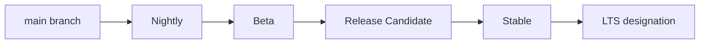
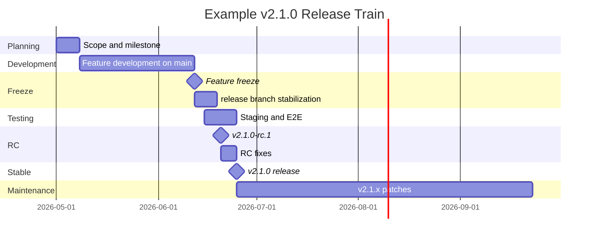
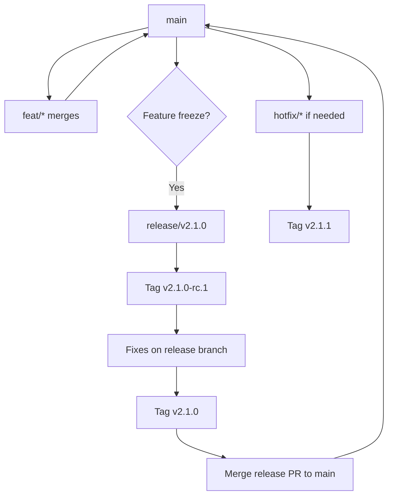
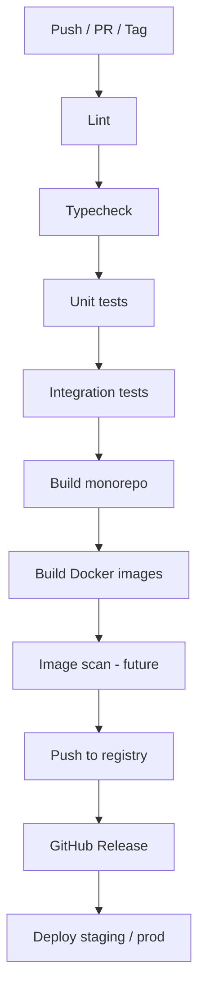
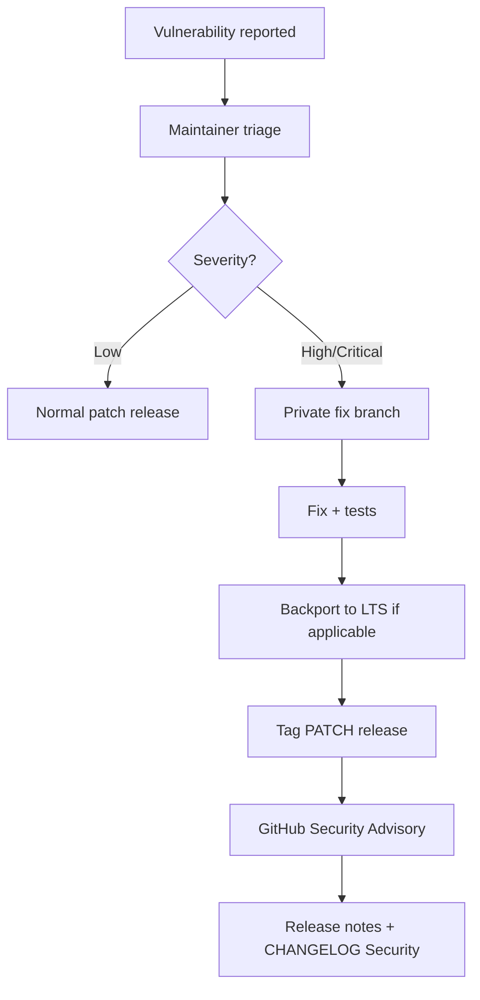
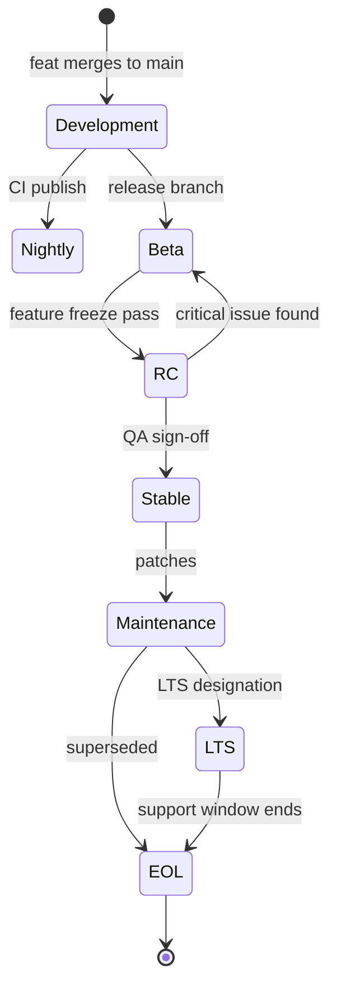
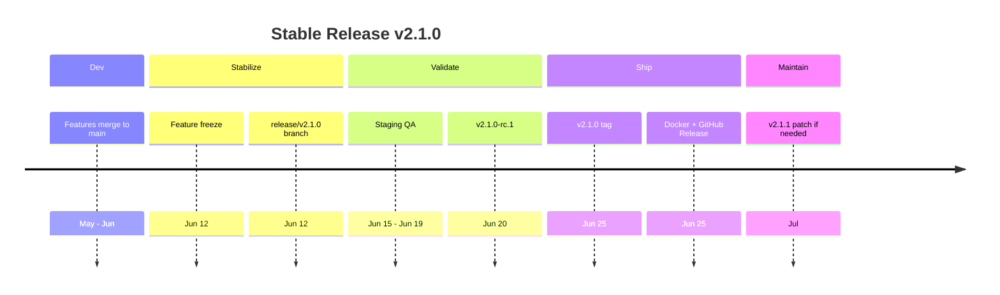
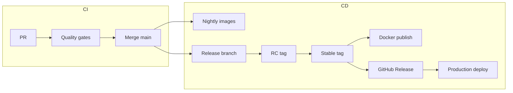

# Release Strategy

> **Document Type:** Release & Operations Process  
> **Version:** 2.0.0  
> **Status:** Draft  
> **Owner:** Project Architecture Team  
> **Last Updated:** 2026  
> **Audience:** Developers, Maintainers, DevOps Engineers, Open Source Contributors, AI Coding Assistants

---

## Table of Contents

1. [Goal](#goal)
2. [Release Philosophy](#1-release-philosophy)
3. [Versioning Policy](#2-versioning-policy)
4. [Release Channels](#3-release-channels)
5. [Release Lifecycle](#4-release-lifecycle)
6. [Branch Strategy](#5-branch-strategy)
7. [CI/CD Pipeline](#6-cicd-pipeline)
8. [Docker Release](#7-docker-release)
9. [Database Migration](#8-database-migration)
10. [API Compatibility](#9-api-compatibility)
11. [Changelog Policy](#10-changelog-policy)
12. [Security Release](#11-security-release)
13. [Long-Term Support](#12-long-term-support)
14. [Release Checklist](#13-release-checklist)
15. [Mermaid Diagrams](#14-mermaid-diagrams)
16. [Best Practices](#15-best-practices)

---

## Goal

This document defines the **complete release lifecycle** for AI Tool CMS v2—a Turborepo platform spanning Web, Admin, API, Worker, Crawler, and Scheduler applications with shared packages, PostgreSQL schema, Docker images, and public APIs.

The release strategy must support:

| Stakeholder Need | How Releases Address It |
|---|---|
| **Open source development** | Transparent versioning, public changelog, tagged artifacts, reproducible builds |
| **Enterprise deployment** | LTS channels, migration safety, rollback paths, signed images (future) |
| **Continuous delivery** | Automated CI/CD gates, frequent patch releases, staging validation |
| **Long-term maintenance** | Support windows, deprecation policy, security patch backports |
| **AI-assisted development** | Predictable release trains so agent-generated PRs merge into known baselines |

Releases are coordinated events—not merely Git tags. Each stable release includes versioned application binaries, Docker images, database migration set, API contract, documentation snapshot, and release notes.

Related documents: [GitWorkflow.md](./GitWorkflow.md), [TechStack.md](./TechStack.md), [CodingStandards.md](./CodingStandards.md).

---

# 1. Release Philosophy

### Stability First

`main` must remain deployable. Features merge only after review and green CI. Releases are cut from known-good commits—not from branches with failing tests or incomplete migrations. Production users and self-hosters depend on stable artifacts.

### Backward Compatibility

Minor and patch releases preserve API contracts, environment variable names, and database forward-compatibility. Breaking changes are reserved for major versions with migration guides and deprecation windows.

### Small Frequent Releases

Prefer **incremental patch releases** (bug fixes, security) and **regular minor releases** (features) over rare monolithic drops. Smaller releases reduce risk, simplify rollback, and shorten feedback loops for open source adopters.

### Automation First

Build, test, Docker image publish, and GitHub Release creation are automated via GitHub Actions. Manual steps are limited to approval gates, QA sign-off, and communication—not copying artifacts by hand.

### Documentation First

No release ships without updated `CHANGELOG.md`, migration notes, and relevant `docs/` changes. Version bumps align with [NamingConvention.md](./NamingConvention.md) and platform version in [README.md](./README.md).

---

# 2. Versioning Policy

AI Tool CMS v2 follows **[Semantic Versioning 2.0.0](https://semver.org/)**: `MAJOR.MINOR.PATCH`.

### Version Components

| Component | When to Increment | Example |
|---|---|---|
| **MAJOR** | Breaking API, breaking config, incompatible schema requiring operator action | `1.x.x` → `2.0.0` |
| **MINOR** | New backward-compatible features, new optional env vars, additive schema | `2.0.x` → `2.1.0` |
| **PATCH** | Backward-compatible bug fixes, security patches, doc-only release tags (rare) | `2.1.0` → `2.1.1` |

### Pre-Release Versions

| Type | Format | Purpose |
|---|---|---|
| **Alpha** | `2.1.0-alpha.1` | Early internal or brave-tester builds; unstable |
| **Beta** | `2.1.0-beta.1` | Feature-complete for cycle; wider testing |
| **Release Candidate** | `2.1.0-rc.1` | Release-quality; only critical fixes before stable |
| **Stable** | `2.1.0` | Production-recommended |

Pre-release identifiers sort before release: `2.1.0-alpha.1` < `2.1.0-beta.1` < `2.1.0-rc.1` < `2.1.0`.

### Nightly Build

| Attribute | Detail |
|---|---|
| **Version format** | `2.1.0-nightly.20260628` or `main-{short-sha}` |
| **Source** | Latest `main` after CI pass |
| **Channel** | `nightly` Docker tag |
| **Audience** | Developers, staging, automated smoke tests |
| **Support** | No SLA; may be broken briefly |

### Development Build

| Attribute | Detail |
|---|---|
| **Version format** | `0.0.0` in workspace packages; `2.0.0-dev` optional image tag |
| **Source** | Local or PR preview builds |
| **Support** | None—not for production |

### Version Examples

| Scenario | Version |
|---|---|
| Initial v2 platform launch | `v2.0.0` |
| Add category API (compatible) | `v2.1.0` |
| Fix sitemap bug | `v2.1.1` |
| Rename public API field (breaking) | `v3.0.0` |
| RC before 2.1 | `v2.1.0-rc.1` |
| Nightly from main | `v2.1.0-nightly.20260628` |

### Monorepo Versioning

The **platform version** is the single customer-facing version. Internal packages remain `0.0.0` workspace versions until independently published. Docker images and GitHub Releases use platform SemVer only.

---

# 3. Release Channels

Multiple channels serve different risk tolerances and deployment models.

### Channel Comparison

| Channel | Stability | Update Frequency | Audience | Docker Tag Example |
|---|---|---|---|---|
| **Nightly** | Low | Daily (main CI green) | Developers, CI staging | `ai-tool-cms-api:nightly` |
| **Beta** | Medium | Per minor pre-release | Early adopters, community testers | `ai-tool-cms-api:2.1.0-beta.1` |
| **RC** | High | Per release candidate | Production pilots | `ai-tool-cms-api:2.1.0-rc.1` |
| **Stable** | Highest | Minor ~6–8 weeks; patch as needed | All production users | `ai-tool-cms-api:2.1.0` |
| **LTS** | Maintained | Security patches only | Enterprises, slow movers | `ai-tool-cms-api:2.0-lts` |
| **Enterprise** | Contractual | Per agreement | Paid support customers | `ai-tool-cms-api:2.0.0-ee.1` (future) |

### Channel Promotion Flow



### Nightly

- Automated publish from `main` on successful nightly workflow
- Not recommended for production
- Used for integration testing and contributor validation

### Beta

- Cut from `release/vX.Y.0` branch during feature freeze
- Community testing period (typically 2 weeks)
- Breaking changes from beta to stable not allowed without new major

### RC (Release Candidate)

- Feature freeze enforced; only bug and doc fixes
- Production pilot deployments
- If critical bug found: `rc.2`, not silent overwrites of `rc.1` tags

### Stable

- Default channel for documentation and README install instructions
- Git tag `vX.Y.Z` on `main`
- GitHub Release with notes from `CHANGELOG.md`

### LTS

- Designated stable major/minor (e.g., `2.0.x` LTS for 12 months)
- Security and critical bug patches only—no new features
- See [Long-Term Support](#12-long-term-support)

### Enterprise

- Future: extended support, hardened images, compliance artifacts
- Same codebase; optional modules and support contract
- Version suffix or separate image registry per commercial policy

### Self-Hosted vs Managed Cloud

| Deployment Model | Recommended Channel | Update Responsibility |
|---|---|---|
| **Self-hosted (Docker Compose)** | Stable or LTS | Operator pulls tagged images and runs migrations |
| **Self-hosted (Kubernetes)** | Stable with pinned digests | Operator manages Helm values and rollout |
| **Managed cloud (future)** | Stable auto-upgrade or pinned | Platform team |
| **Local development** | Nightly or `main` build | Developer |

Self-hosters should subscribe to GitHub Releases or release RSS (future) for security advisories—not track `main` directly in production.

---

# 4. Release Lifecycle

### Phases

| Phase | Activities | Exit Criteria |
|---|---|---|
| **Planning** | Roadmap items, version target, migration scope | Release scope documented in issue/milestone |
| **Development** | Feature PRs merge to `main` | All scoped features merged |
| **Feature Freeze** | `release/vX.Y.Z` branch; only fixes | No new features without release manager approval |
| **Testing** | CI, integration, staging, E2E Playwright | All blocking bugs resolved |
| **Release Candidate** | Tag `vX.Y.Z-rc.N`, beta channel deploy | QA sign-off |
| **Stable Release** | Merge release PR, tag `vX.Y.Z`, publish artifacts | Production deploy complete |
| **Maintenance** | Patches on release branch or `main` cherry-picks | Until superseded or EOL |
| **End of Life** | No patches; security exceptions documented | Users migrated to supported version |

### Release Timeline (Mermaid)



### Cadence Targets (Directional)

| Release Type | Target Cadence |
|---|---|
| **Patch** | As needed (days to 2 weeks for critical fixes) |
| **Minor** | Every 6–8 weeks early project; quarterly at maturity |
| **Major** | Annually or when breaking changes accumulate |
| **LTS** | Every 12–18 months for prior stable minor |

---

# 5. Branch Strategy

Release workflow integrates with [GitWorkflow.md](./GitWorkflow.md).

### Branch Roles in Releases

| Branch | Release Role |
|---|---|
| **`main`** | Source of truth for next stable; all releases ultimately land here |
| **`release/vX.Y.Z`** | Stabilization branch for minor/major; version bumps, changelog finalization |
| **`hotfix/*`** | Emergency patches from production tag; merge to `main` and backport to LTS if active |
| **`feat/*`** | Features target `main`; never cut releases directly from long-lived feature branches |
| **`docs/*`** | Documentation; may ship in any patch without version bump if no code change (optional tag skip) |

### Release Branch Workflow



### Hotfix vs Release Branch

| Situation | Branch From | Merge To | Tag |
|---|---|---|---|
| Scheduled minor release | `main` → `release/v2.1.0` | `main` | `v2.1.0` |
| Production critical bug | `main` at `v2.1.0` tag | `main` | `v2.1.1` |
| LTS security fix | `release/v2.0-lts` or cherry-pick | `main` + LTS branch | `v2.0.5` |

---

# 6. CI/CD Pipeline

Every release artifact passes through automated pipelines before publication.

### Pipeline Stages

| Stage | Command / Action | Blocking |
|---|---|---|
| **Lint** | `pnpm lint` (Biome) | Yes |
| **Type check** | `pnpm typecheck` | Yes |
| **Unit test** | `pnpm test` (Vitest) | Yes |
| **Integration test** | API + DB testcontainers | Yes for API changes |
| **Build** | `pnpm build` (Turborepo) | Yes |
| **Docker image** | Build and push multi-app images | Yes for stable |
| **Artifact** | Upload OpenAPI JSON, migration bundle | Yes |
| **Release notes** | Generate from `CHANGELOG.md` section | Yes |
| **GitHub Release** | Create release from tag; attach notes | Yes for stable |

### CI/CD Flow (Mermaid)



### Open Source Release Artifacts

Each stable GitHub Release should attach or reference:

| Artifact | Description |
|---|---|
| **Source tag** | `vX.Y.Z` pointing to merge commit on `main` |
| **Docker images** | API, Web, Admin, Worker on container registry |
| **OpenAPI bundle** | Exported `openapi.json` from `apps/api` |
| **Migration bundle** | `prisma/migrations/` at release tag |
| **Checksums** | SHA256 for downloadable assets (future) |

Community packagers (Homebrew, Nix, PPA) build from stable tags only—not from `main` HEAD.

### Trigger Matrix

| Event | Lint/Type/Test/Build | Docker Publish | GitHub Release |
|---|---|---|---|
| Pull request | Yes | No (build only) | No |
| Push to `main` | Yes | Nightly channel | No |
| Tag `v*.*.*-rc.*` | Yes | RC channel | Pre-release |
| Tag `v*.*.*` (stable) | Yes | Stable channel | Yes |
| Tag `v*.*.*-lts.*` | Yes | LTS channel | Yes |

### Deployment Environments

| Environment | Source | Approval |
|---|---|---|
| **Preview** | PR branch | Automatic |
| **Staging** | `main` or RC tag | Automatic |
| **Production** | Stable tag only | Maintainer manual approval |

---

# 7. Docker Release

### Image Naming

| Application | Image Name |
|---|---|
| API | `ghcr.io/zhshg/ai-tool-cms-api` |
| Web | `ghcr.io/zhshg/ai-tool-cms-web` |
| Admin | `ghcr.io/zhshg/ai-tool-cms-admin` |
| Worker | `ghcr.io/zhshg/ai-tool-cms-worker` |

(Registry path subject to org configuration; pattern: `{registry}/ai-tool-cms-{app}`.)

### Versioning and Tags

| Tag | Meaning | Mutable |
|---|---|---|
| `2.1.0` | Stable release | No |
| `2.1` | Latest patch in 2.1 line | Yes (updates on patch) |
| `2` | Latest minor in 2.x (optional) | Yes |
| `latest` | Latest stable | Yes |
| `2.1.0-rc.1` | Release candidate | No |
| `nightly` | Latest main build | Yes |
| `2.0-lts` | LTS pointer | Yes (patch updates) |

**Immutable rule:** Never overwrite an exact version tag (`2.1.0`). Publish `2.1.1` instead.

### Multi-Stage Build Policy

- Images built from `docker/Dockerfile` or per-app Dockerfile
- Production images run as non-root user
- No secrets baked into layers
- SBOM and vulnerability scan before stable publish (planned)

### Rollback Strategy

| Method | Steps |
|---|---|
| **Redeploy previous tag** | `docker compose pull` with `IMAGE_TAG=2.0.9`; restart services |
| **Kubernetes** | Rollout undo or pin previous image digest |
| **Database** | Roll forward with compensating migration—do not downgrade schema without runbook |

Rollback runbook documented in `docs/11-devops/` (planned).

---

# 8. Database Migration

Database releases are coupled to application releases via Prisma migrations in `prisma/migrations/`.

### Migration Policy

| Rule | Detail |
|---|---|
| **Forward-only in production** | `prisma migrate deploy`—never `migrate reset` |
| **One migration per logical change** | Descriptive name; review SQL in PR |
| **Additive first** | Add columns nullable before backfill; enforce NOT NULL in later release if needed |
| **No destructive drops in patch** | Column/table drops only in major with migration guide |
| **Test migrations** | CI applies migrations to ephemeral PostgreSQL |

### Rollback

| Scenario | Action |
|---|---|
| Bad migration deployed | Ship **new migration** fixing forward; restore DB backup if data corrupted |
| Application rollback | Previous app version must remain compatible with current schema OR restore backup taken pre-migrate |
| Failed migrate deploy | Stop deploy; fix migration in hotfix; never leave half-applied state undocumented |

### Backward Compatibility

| Change Type | Minor/Patch OK? | Notes |
|---|---|---|
| Add optional column | Yes | Default or nullable |
| Add table | Yes | — |
| Add index | Yes | Use `CONCURRENTLY` in raw SQL if large table |
| Rename column | Major preferred | Or multi-release expand-contract |
| Drop column | Major only | Deprecate in docs first |
| Enum value add | Yes | Removing enum value is breaking |

### Seed Strategy

- `pnpm db:seed` runs on fresh installs only in dev/staging automation
- Production seeds are never re-run automatically
- Reference data changes ship as migrations or idempotent seed updates in release notes

---

# 9. API Compatibility

Public REST API at `/v1/` follows explicit compatibility rules.

### API Versioning

| Version | Path | Status |
|---|---|---|
| **v1** | `/v1/tools`, etc. | Current stable |
| **v2** | `/v2/...` | Introduced only for breaking changes |

Clients should include version in path—not rely on unversioned aliases in production.

### Deprecation Policy

| Step | Timeline |
|---|---|
| Announce deprecation | Release notes + `Sunset` header on responses |
| Document replacement | OpenAPI description + `docs/03-api/` |
| Maintain deprecated behavior | Minimum **90 days** from stable announcement |
| Remove | Major version or explicit breaking minor with migration guide |

### Breaking Changes

Breaking changes include:

- Removing or renaming response fields
- Changing field types or enum values
- Removing endpoints
- Changing authentication requirements
- Changing pagination defaults in incompatible ways

Breaking changes require **MAJOR** platform bump or new `/v2/` with v1 maintained until EOL.

### Non-Breaking Changes

- Adding optional response fields
- Adding new endpoints
- Adding optional query parameters
- Adding new enum values (with client tolerance for unknown values)

---

# 10. Changelog Policy

`CHANGELOG.md` follows **[Keep a Changelog](https://keepachangelog.com/)** and [Common Changelog](https://commonchangelog.org/) principles.

### Categories

| Category | Contents |
|---|---|
| **Added** | New features, endpoints, env vars, packages |
| **Changed** | Behavior changes backward-compatible |
| **Deprecated** | Features marked for removal with timeline |
| **Removed** | Deleted features (major releases) |
| **Fixed** | Bug fixes |
| **Security** | Vulnerability patches; CVE references when public |

### Release Section Format

```markdown
## [2.1.0] - 2026-06-25

### Added
- Category and tag CRUD API endpoints ([#8](https://github.com/zhshg/ai-tool-cms/pull/8))
- `@ai-tool-cms/seo` package with metadata and sitemap builders

### Fixed
- Canonical URL generation for localized routes

### Security
- Updated dependency `jsonwebtoken` to patch CVE-XXXX-YYYY
```

### Maintenance Rules

- Contributors add entries under `[Unreleased]` in each user-facing PR
- Release manager moves `[Unreleased]` to `[X.Y.Z] - date` at release
- Link to PRs and issues where helpful
- Security section mandatory for security releases

---

# 11. Security Release

### Security Patch Workflow



### CVE Handling

| Step | Action |
|---|---|
| **Report** | GitHub Security Advisory draft or private email to maintainers |
| **Embargo** | Critical fixes developed privately until publish date when coordinated |
| **Credit** | Acknowledge reporter in advisory unless anonymous requested |
| **CVE ID** | Request CVE for qualifying issues |
| **Changelog** | `### Security` section with CVE link and affected versions |

### Emergency Release

- Bypass normal minor train—ship **patch** immediately (`v2.1.2`)
- Expedited review: one maintainer + security reviewer
- Post-release: incident summary in `docs/11-devops/` for Sev-1
- AI-generated fixes require **human security review** before merge

---

# 12. Long-Term Support

### Support Policy

| Version Type | Support Duration | Updates |
|---|---|---|
| **Current stable** | Until next minor + 3 months overlap | Features, fixes, security |
| **Previous minor** | 3 months after new minor | Fixes, security |
| **LTS** | 12 months from LTS declaration | Security and critical fixes only |
| **EOL** | None | Upgrade required |

### Supported Versions Example

| Version | Status | End Date |
|---|---|---|
| `2.1.x` | Current | — |
| `2.0.x` | LTS | 2027-06-01 |
| `1.x.x` | EOL | 2026-01-01 |

### Maintenance Windows

- **Patch releases:** Tuesday–Thursday preferred (avoid Friday deploys)
- **Minor releases:** Scheduled with 2-week beta/RC window
- **LTS backports:** Within 5 business days for critical security

### Enterprise Extension

Future enterprise contracts may extend LTS to 24–36 months with paid support.

---

### AI-Assisted Development in Releases

Cloud agents and coding assistants merge features continuously to `main`. Release managers must:

| Practice | Reason |
|---|---|
| Batch agent PRs into scheduled minors | Reduces operator upgrade churn |
| Require human review before release branch cut | AI PRs follow same checklist as human PRs |
| Block release if undocumented env vars landed | Agents may add config without docs |
| Verify migration ordering when multiple agent PRs touch Prisma | Conflict risk across parallel branches |

Release notes should credit significant AI-assisted contributions when noted in PR descriptions—transparency for open source adopters.

---

# 13. Release Checklist

Maintainers complete before tagging stable release.

### Planning

- [ ] Milestone scope complete or explicitly deferred
- [ ] Breaking changes documented and version bump correct (MAJOR/MINOR)
- [ ] `CHANGELOG.md` `[Unreleased]` reviewed and complete
- [ ] Migration impact assessed

### Code Complete

- [ ] Feature freeze honored on release branch
- [ ] All blocking issues closed
- [ ] No known P0/P1 bugs open for release scope

### Tests

- [ ] CI green on release commit
- [ ] Integration tests pass
- [ ] E2E Playwright pass on staging
- [ ] Smoke test: login, tool CRUD, public page render, health endpoints

### Documentation

- [ ] `CHANGELOG.md` version section finalized
- [ ] `docs/` updated for new features
- [ ] `.env.example` includes new variables
- [ ] Migration guide written if operator action required
- [ ] README install instructions verified

### Performance

- [ ] No regressions on key API p95 latency (staging metrics)
- [ ] Web Core Web Vitals spot-check on tool pages

### Security

- [ ] Dependency audit clean or accepted exceptions documented
- [ ] No secrets in release artifacts
- [ ] Security advisory published if applicable

### Migration

- [ ] `prisma migrate deploy` tested against staging DB clone
- [ ] Rollback / forward-fix plan documented
- [ ] Backup taken immediately before production migrate

### Deployment

- [ ] Docker images published with correct immutable tags
- [ ] GitHub Release created with notes
- [ ] Staging deploy verified
- [ ] Production deploy approved by maintainer
- [ ] Post-deploy smoke tests pass

### Monitoring

- [ ] Error rate and latency dashboards watched 24–48 hours
- [ ] Crawler and worker queue depth normal
- [ ] Search index health verified

### Rollback

- [ ] Previous image tags identified and available
- [ ] Database backup retention confirmed
- [ ] Rollback command documented in deploy runbook
- [ ] On-call maintainer assigned for release window

---

# 14. Mermaid Diagrams

### Version Lifecycle



### Release Timeline (Simplified)



### CI/CD and Release Flow



---

# 15. Best Practices

Twenty-plus release best practices for AI Tool CMS v2:

1. **Never ship Friday production releases** without on-call coverage.
2. **Tag immutable version numbers**—never retag `v2.1.0` in place.
3. **Keep `main` green**—broken main delays every release train.
4. **Write release notes for humans**—operators need migration steps, not commit dumps.
5. **Automate everything repeatable**—manual copy-paste causes drift.
6. **Test migrations on production-like data volume** when schema touches large tables.
7. **Use release branches** for minors—avoid tagging directly from chaotic main moments.
8. **Cherry-pick hotfixes** to LTS with identical patch commits when possible.
9. **Document env var additions** in `.env.example` before stable tag.
10. **Run E2E on RC builds**, not only on first stable tag.
11. **Separate docs-only releases** from code when possible—but keep changelog honest.
12. **Announce breaking changes twice**—changelog and runtime deprecation headers.
13. **Maintain `[Unreleased]` changelog** continuously—not batch at release day.
14. **Pin production to digest or exact tag**, not floating `latest`.
15. **Backup database before migrate deploy**—every stable release with schema changes.
16. **Monitor 48 hours post-release**—most regressions surface early.
17. **Limit RC iterations**—if `rc.3` fails, slip schedule rather than rush stable.
18. **Security patches trump feature schedule**—cut patch release immediately.
19. **AI-generated release artifacts require human review**—notes, version bumps, migrations.
20. **Align platform version across** Docker tags, GitHub Release, and `CHANGELOG.md`.
21. **Provide upgrade path from N-1 minor**—document in release notes.
22. **Do not bundle unrelated fixes** into security release—minimize regression risk.
23. **Publish SBOM with stable images** when tooling available (supply chain security).
24. **Communicate EOL dates** 90 days in advance in README and changelog.
25. **Celebrate stable releases**—community visibility drives open source adoption.

---

## Related Documents

- [Git Workflow](./GitWorkflow.md) — Branch, commit, and PR process
- [Technology Stack](./TechStack.md) — CI/CD tooling and deployment targets
- [Coding Standards](./CodingStandards.md) — Quality gates before merge
- [Project Overview](./README.md) — Platform version and documentation index

---

**Document Version**

| Field | Value |
|---|---|
| Version | 2.0.0 |
| Status | Draft |
| Owner | Project Architecture Team |
| Last Updated | 2026 |
