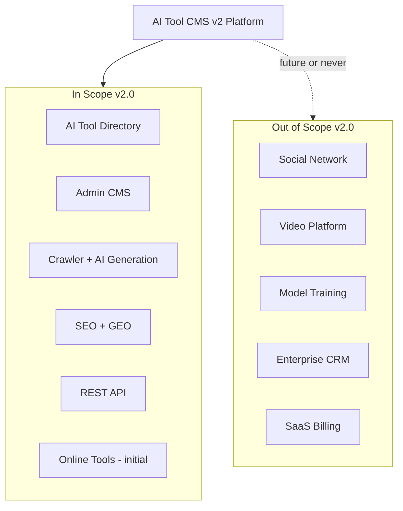
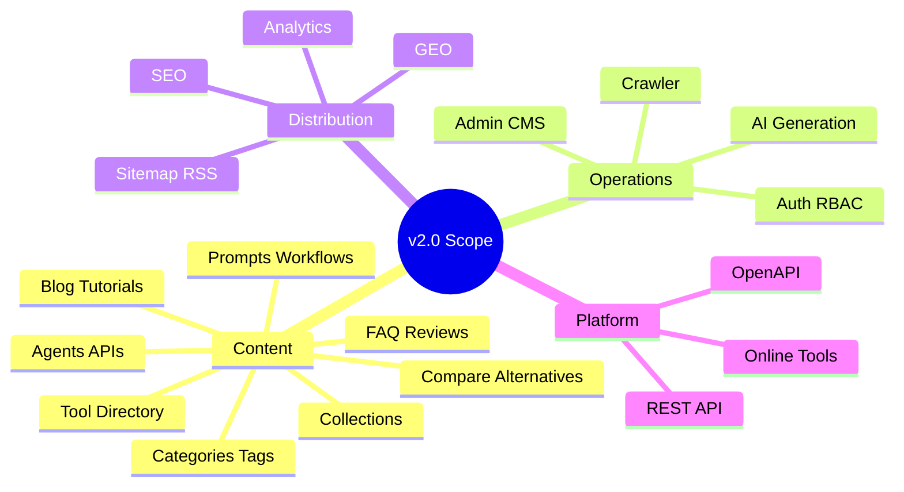
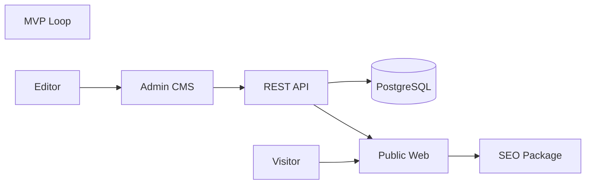
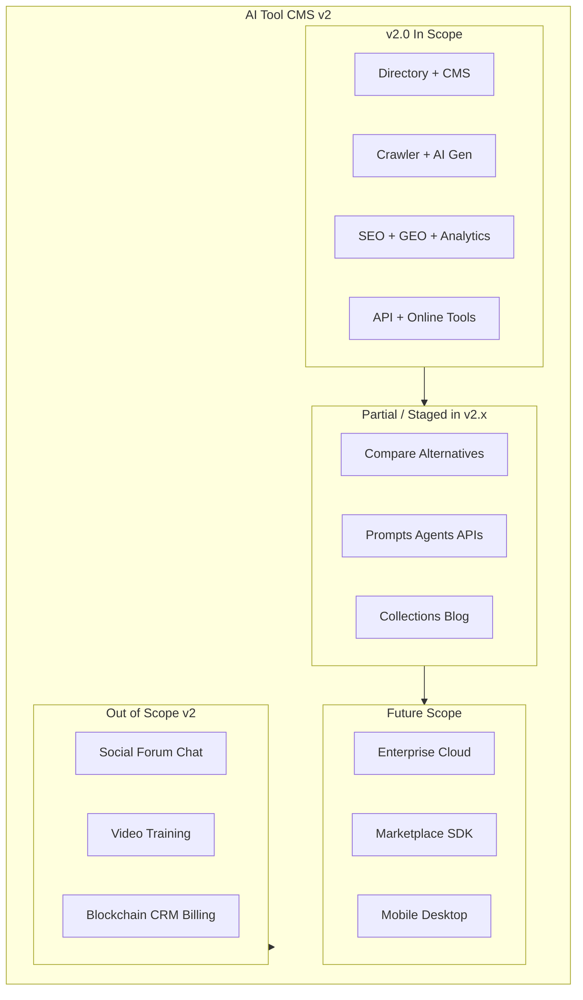
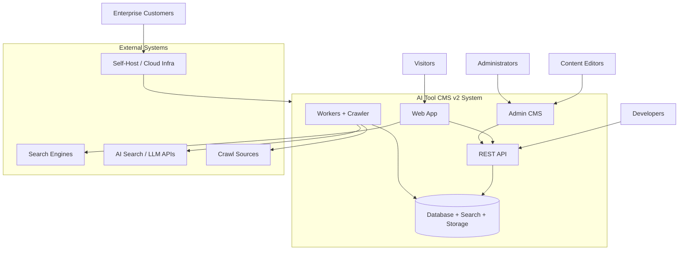
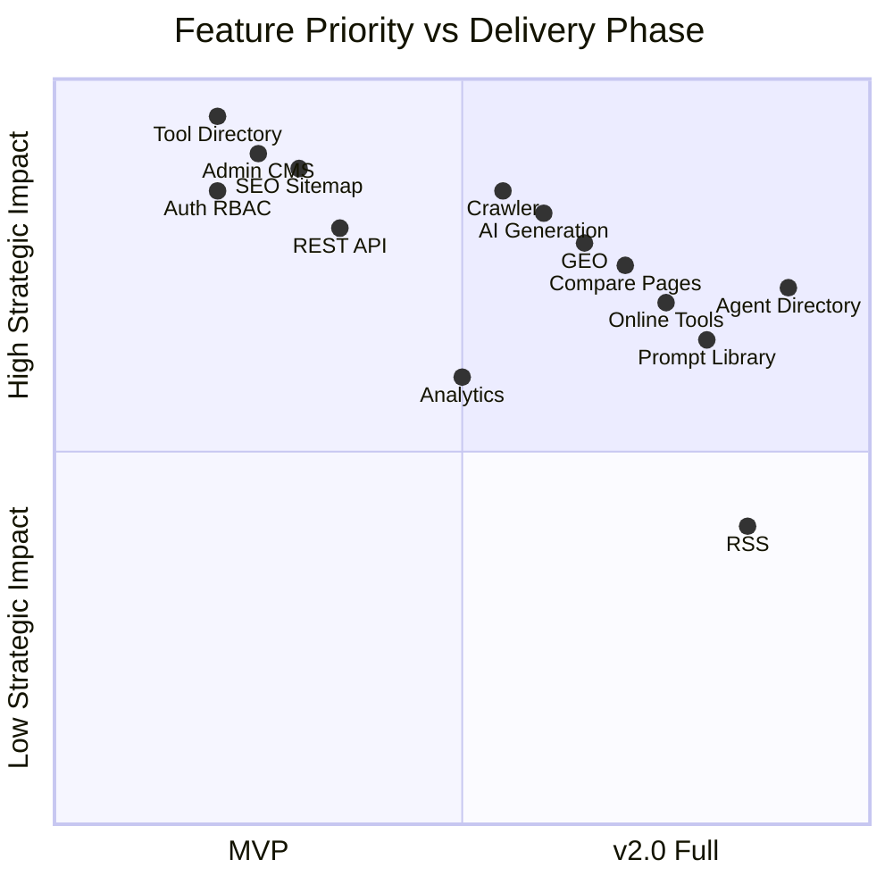

# Project Scope

> **Document Type:** Product Scope Definition  
> **Version:** 2.0.0  
> **Status:** Draft  
> **Owner:** Product Architecture Team  
> **Last Updated:** 2026  
> **Audience:** Product Managers, Software Architects, Developers, Open Source Contributors, AI Coding Assistants

---

## Table of Contents

1. [Purpose](#purpose)
2. [Scope Statement](#1-scope-statement)
3. [In Scope (Version 2)](#2-in-scope-version-2)
4. [Out of Scope](#3-out-of-scope)
5. [MVP Scope](#4-mvp-scope)
6. [Future Scope](#5-future-scope)
7. [Stakeholders](#6-stakeholders)
8. [Constraints](#7-constraints)
9. [Assumptions](#8-assumptions)
10. [Success Criteria](#9-success-criteria)
11. [Mermaid Diagrams](#10-mermaid-diagrams)

---

## Purpose

This document defines the **complete scope** of AI Tool CMS v2. It establishes clear boundaries for what the project includes, what it excludes, what belongs to the current version versus future expansion, and what constitutes minimum viable delivery.

Scope discipline prevents feature creep—the gradual accumulation of capabilities that dilute focus, inflate maintenance cost, and delay core outcomes. Every feature proposal should be evaluated against this document before entering the roadmap.

| This Document Answers | Related Documents |
|---|---|
| What is in v2.0? | [Goals.md](./Goals.md), [README.md](./README.md) |
| What is explicitly excluded? | [Vision.md](./Vision.md) non-goals |
| What is MVP vs future? | [ReleaseStrategy.md](./ReleaseStrategy.md), [ROADMAP.md](../../ROADMAP.md) |
| How is scope delivered? | [FolderStructure.md](./FolderStructure.md), [TechStack.md](./TechStack.md) |

When scope changes, update this document in the same pull request that reflects the decision—scope is a living contract, not a one-time exercise.

---

## 1. Scope Statement

AI Tool CMS v2 is an **AI-native content platform** for discovering, managing, enriching, and distributing knowledge about AI software and related assets at scale. It is **not** a simple AI tool directory—a list of links with static descriptions that go stale within weeks.

The platform unifies:

- **Public discovery surfaces** — directory, detail, compare, alternatives, search, collections, news, tutorials
- **Operational CMS** — editorial workflows, RBAC, content types, review and publish gates
- **Automation layer** — crawlers, workers, schedulers, AI-assisted generation
- **Distribution layer** — SEO, GEO, sitemaps, RSS, structured data
- **Extension layer** — REST API, OpenAPI, future plugins and online tools

Version 2.0 scope prioritizes **self-hosted open source delivery** of the core loop: ingest tool knowledge → enrich with AI → publish indexable pages → measure and iterate—with enterprise and cloud editions deferred as commercial expansions, not blockers for the open core.

### Scope Boundary (Conceptual)

---

## 2. In Scope (Version 2)

The following capabilities are **included** in Version 2.0 product scope. Inclusion means the platform architecture, data model, and roadmap account for these features—not that every item is complete on day one of release. Delivery is staged via [MVP](#4-mvp-scope) and [milestones in Goals.md](./Goals.md).

### Content & Discovery

| Capability | Scope Description | v2.0 Delivery Posture |
|---|---|---|
| **AI Tool Directory** | Canonical catalog of AI software with structured records | Core—required for MVP |
| **Tool Detail Pages** | Public pages per tool: description, pricing, links, metadata | Core—required for MVP |
| **Categories** | Taxonomy for browsing and filtering tools | Core—required for MVP |
| **Tags** | Flexible labeling and intersection filters | Core—required for MVP |
| **Collections** | Curated sets with editorial narrative | Should have—v2.0 target |
| **Compare Pages** | Side-by-side tool comparison surfaces | Should have—programmatic generation |
| **Alternative Pages** | Replacement and similar-tool recommendations | Should have—programmatic generation |
| **Reviews** | Editorial or structured reviews with ratings | Could have—initial schema + admin |
| **Pricing** | Pricing model, tiers, change tracking | Core—enum + fields on Tool |
| **Release Notes** | Product release history linked to tools | Could have—content type |
| **FAQ** | Question/answer blocks; FAQ Schema for SEO/GEO | Should have—per tool and standalone |
| **Blog** | Editorial articles and announcements | Could have—basic news/blog module |
| **Tutorials** | How-to content linked to tools | Could have—content type |
| **AI Prompt Library** | Searchable prompt templates | Could have—v2.0 beta |
| **AI Workflow Library** | Documented multi-step AI processes | Future within v2—schema prep |
| **AI Agent Directory** | Catalog of autonomous/semi-autonomous agents | Future within v2—extends Tool model |
| **AI API Directory** | API product catalog with integration metadata | Future within v2—extends Tool model |
| **Search** | Full-text discovery across catalog and content | Should have—Meilisearch integration |

### Operations & Automation

| Capability | Scope Description | v2.0 Delivery Posture |
|---|---|---|
| **Admin CMS** | Web admin for all in-scope content types | Core—required for MVP |
| **Crawler** | Multi-source ingestion and change detection | Should have—production crawler |
| **AI Content Generation** | Draft descriptions, summaries, FAQs, comparisons | Should have—with review gates |
| **Authentication** | Admin and API identity (JWT) | Core—required for MVP |
| **Role-Based Access Control** | Roles, permissions, guarded operations | Core—required for MVP |

### Distribution & Measurement

| Capability | Scope Description | v2.0 Delivery Posture |
|---|---|---|
| **SEO** | Metadata, canonical, robots, sitemap, JSON-LD | Core—required for MVP |
| **GEO** | Citation-ready structure, entities, FAQ for AI search | Should have—templates and policy |
| **Analytics** | Traffic, popular tools, search queries, indexing health | Should have—dashboards |
| **RSS** | Feeds for tools, news, collections | Could have |
| **Sitemap** | XML sitemap generation and update automation | Core—required for MVP |

### Platform & Integration

| Capability | Scope Description | v2.0 Delivery Posture |
|---|---|---|
| **Online Tools** | Browser-based utilities under CMS management | Should have—initial set (10–25) |
| **REST API** | Versioned HTTP API for all CMS operations | Core—required for MVP |
| **OpenAPI Documentation** | Interactive API docs (`/docs`) | Core—required for MVP |

### In-Scope Feature Map

### Version 2 Scope Summary

Version 2.0 delivers a **production-grade self-hosted platform** where:

1. Operators can manage a growing AI tool catalog without proportional manual labor
2. Public pages are indexable at scale with automated SEO and GEO foundations
3. Integrators can consume a documented REST API
4. Extension paths (plugins, enterprise, cloud) are architecturally预留 without being fully productized

Items marked "Could have" or "Future within v2" may ship in v2.1+ patches or minors without changing the fundamental scope boundary—they are in the product family, not out of scope.

### Content Type Depth (v2.0 Expectations)

| Content Type | Minimum v2.0 Expectation |
|---|---|
| **Tool** | Full record: slug, name, description, website, logo, pricing, status, categories, tags |
| **Category** | Name, slug, description, associated tools listing |
| **Tag** | Name, slug, associated tools listing |
| **Collection** | Title, slug, curated tool list, editorial description |
| **Compare** | Two or more tools; dimension table (pricing, features, fit) |
| **Alternatives** | Source tool + ranked alternatives with rationale |
| **Review** | Rating, pros/cons, author, verification flag |
| **FAQ** | Q/A pairs; attachable to tools or standalone pages |
| **Blog / News** | Title, body, publish date, related entities |
| **Tutorial** | Steps, linked tools, difficulty level |
| **Prompt** | Template body, variables, compatible models |
| **Online Tool** | Runnable utility metadata, CMS-managed route |

Depth refers to **product capability presence**, not completeness of every record at launch.

---

## 3. Out of Scope

The following are **explicitly excluded** from Version 2.0. Proposals in these areas should be rejected or deferred to [Future Scope](#5-future-scope) unless this document is formally amended.

### Excluded Product Categories

| Exclusion | Rationale |
|---|---|
| **Social Network** | User-to-user graphs, feeds, follows—different product category; dilutes CMS focus |
| **Forum** | Large-scale community discussion; link externally if needed |
| **Instant Messaging** | Real-time chat; not required for catalog operations |
| **Video Platform** | Hosting, streaming, transcoding—out of vision non-goals |
| **Model Training** | Fine-tuning or training ML models; platform consumes models, does not train them |
| **Blockchain** | Distributed ledger features unrelated to content mission |
| **Cryptocurrency** | Tokens, wallets, NFT listings—not part of AI tool catalog value |
| **Marketplace (payments)** | Full transaction marketplace with escrow—deferred to v3+ plugin/marketplace scope |
| **Enterprise Billing** | Subscription billing, invoicing, tax—Cloud Edition future scope |
| **Large-scale SaaS CRM** | Sales pipeline, opportunity management—enterprises integrate external CRM |

### Excluded Technical Scope (v2.0)

| Exclusion | Rationale |
|---|---|
| **GraphQL API as primary** | REST + OpenAPI is v2.0 standard; GraphQL optional future |
| **Kubernetes as required deploy** | Docker Compose sufficient for v2.0 self-host |
| **Multi-tenant SaaS in open core** | Cloud Edition separates tenancy concerns |
| **Mobile native apps** | Responsive web only in v2.0 |
| **Desktop client** | Future scope |
| **Built-in email marketing suite** | Transactional notifications only; not Mailchimp replacement |
| **Built-in ad server** | Monetization hooks only; not full ad tech stack |

### Scope Creep Red Flags

Reject or defer proposals that:

- Require 24/7 human moderation at scale without automation path
- Duplicate mature SaaS products (CRM, ERP, full analytics suite) inside the monorepo
- Add real-time social features without clear tie to tool discovery
- Expand scope without updating MVP success criteria and maintainers' capacity

---

## 4. MVP Scope

The **Minimum Viable Product** proves the core value loop: **manage tools → publish public pages → discover via search/browse → operate securely**. MVP is the smallest in-scope subset that validates the platform thesis for early adopters and contributors.

### MVP Required Modules

| Module | Why Required |
|---|---|
| **`apps/web`** | Public proof of value—visitors must see tools |
| **`apps/admin`** | Operators must manage content without raw database access |
| **`apps/api`** | Single backend contract for Web, Admin, future workers |
| **`packages/database`** | Persistent tool, category, tag, user, RBAC models |
| **`packages/auth`** | Secure admin access—non-negotiable for CMS |
| **`packages/seo`** | Indexable pages—SEO is product infrastructure, not optional |
| **`prisma/` + migrations** | Schema as source of truth |
| **Docker Compose (postgres, redis)** | Reproducible self-host for contributors |
| **Authentication + RBAC** | Admin login, roles, permissions |
| **Tool CRUD + publish workflow** | Core CMS loop |
| **Category + Tag** | Minimum taxonomy for browse/filter |
| **Tool detail + listing pages** | Public surfaces |
| **REST API + OpenAPI** | Integration and admin contract |
| **Sitemap + robots + metadata** | Minimum SEO distribution |
| **Documentation (`docs/00-project/`)** | Open source and AI assistant alignment |

### MVP Explicitly Deferred

| Capability | Deferred To |
|---|---|
| Production crawler at scale | v1.0 |
| AI content generation pipelines | v1.0 / v2.0 |
| Compare / alternatives at scale | v1.0+ |
| Meilisearch | v1.0 |
| Online tools library | v1.0+ |
| Multi-language indexable locales | v2.0 |
| Plugin marketplace | v3.0 |
| Enterprise / Cloud editions | Post v2.0 stable |

### MVP Success Definition

MVP is successful when a self-hoster can:

1. Deploy with Docker and seed data
2. Log into Admin, create and publish tools with categories/tags
3. View published tools on the public Web
4. See correct metadata and sitemap entries
5. Call documented API endpoints with authentication

MVP does **not** require millions of pages, full automation, or revenue features.

---

## 5. Future Scope

Capabilities outside MVP and partial v2.0 delivery belong to **future versions**. Future scope is intentional—not rejected forever.

### Version 3.0

| Capability | Description |
|---|---|
| **Plugin marketplace** | Discoverable extensions; revenue share model |
| **Developer SDK** | Client libraries and CLI |
| **Agent + API directories at scale** | Full content domains with dedicated UX |
| **Workflow library** | Published multi-step workflows |
| **10+ languages** | Automated translation pipelines |
| **200+ online tools** | Broad utility library |
| **Advanced analytics** | Cohort, funnel, GEO citation tracking |

### Enterprise Edition

| Capability | Description |
|---|---|
| **SSO / SCIM** | Enterprise identity integration |
| **Audit logs** | Compliance-grade activity trail |
| **Advanced RBAC** | Custom roles and workspace isolation |
| **SLA support tier** | Commercial maintenance window |
| **Air-gapped deployment guides** | Regulated environments |
| **Private plugin registry** | Internal extensions |

### Cloud Edition

| Capability | Description |
|---|---|
| **Managed hosting** | SaaS operation of platform |
| **Multi-tenant isolation** | Separate customer data |
| **Billing integration** | Subscription tiers |
| **Automated upgrades** | Managed migrations and backups |
| **Custom domains** | Per-tenant branding |

### Additional Future Scope

| Item | Target Horizon |
|---|---|
| **Plugin Marketplace** | v3.0 ecosystem |
| **Workflow Builder** | Visual AI workflow design—v3.0+ |
| **Browser Extension** | Quick discovery from any page—v3.0+ |
| **Mobile App** | Native discovery and collections—v4.0+ |
| **Desktop Client** | Offline reading, notifications—v4.0+ exploratory |

Future scope items enter the monorepo only when preceded by scope amendment, architecture review, and maintainer capacity confirmation.

---

## 6. Stakeholders

Stakeholders define who the scope serves. Features must map to at least one stakeholder need or be rejected as scope creep.

| Stakeholder | Scope Expectations | Primary In-Scope Features |
|---|---|---|
| **Visitors** | Discover, compare, use tools; trustworthy information | Directory, detail, search, compare, alternatives, online tools, SEO/GEO pages |
| **Content Editors** | Efficient publish workflow; quality control | Admin CMS, AI drafts, review queues, collections, blog/tutorials |
| **Administrators** | Security, automation health, policy | RBAC, crawler monitoring, analytics, scheduler visibility |
| **Developers** | Extend, integrate, self-host | REST API, OpenAPI, Docker, docs, future plugins |
| **Plugin Authors** | Publish extensions without forking core | Plugin API (alpha v2, marketplace v3) |
| **Enterprise Customers** | Compliance, support, isolation | Enterprise Edition (future); self-host v2 open core |

### Stakeholder vs Scope Matrix

| Feature Area | Visitors | Editors | Admins | Developers | Enterprise |
|---|---|---|---|---|---|
| Tool directory | ● | ● | ● | ○ | ○ |
| Admin CMS | ○ | ● | ● | ○ | ● |
| Crawler + AI | ○ | ● | ● | ○ | ● |
| SEO / GEO | ● | ○ | ● | ○ | ○ |
| REST API | ○ | ○ | ○ | ● | ● |
| Online tools | ● | ● | ○ | ● | ○ |
| RBAC / Auth | ○ | ● | ● | ● | ● |

● = primary beneficiary | ○ = secondary or indirect

---

### Open Source Scope Boundaries

| In Open Core v2.0 | Enterprise / Cloud Only (Future) |
|---|---|
| Full catalog CMS and API | SSO, SCIM, advanced audit |
| Self-hosted Docker deploy | Managed multi-tenant hosting |
| Community plugins (alpha) | Private plugin registry |
| Standard RBAC | Custom permission matrices per workspace |
| Community support (GitHub) | SLA-backed support |

The open source scope must remain **fully usable** without paid tiers—enterprise and cloud add operational convenience and compliance, not hostage features for basic catalog operation.

---

Scope is bounded by real-world constraints. Ignoring them produces unrealistic roadmaps.

### Budget

| Constraint | Impact on Scope |
|---|---|
| Open source core unfunded initially | Prioritize MVP and automation over polish features |
| AI API costs scale with volume | Generation gated by review; batch jobs; model routing |
| Infrastructure costs at million-page scale | CDN, search, and DB sizing planned—not unlimited free hosting |

### Team Size

| Constraint | Impact on Scope |
|---|---|
| Small maintainer team early | MoSCoW discipline; defer marketplace and mobile |
| Contributor-dependent velocity | Documentation and good-first issues in scope |
| AI agents augment but do not replace review | Human approval on scope changes and releases |

### Server Resources

| Constraint | Impact on Scope |
|---|---|
| Self-hosters on modest VPS | Docker Compose default; horizontal scaling documented |
| Crawler and worker CPU/network | Rate limits; polite crawling policies in scope |
| Search index memory | Meilisearch sizing guides; pagination required |

### AI Cost

| Constraint | Impact on Scope |
|---|---|
| Per-token generation cost | Automation rate targets; cache enriched content |
| Multi-provider dependency | Abstraction in scope; vendor lock-in out of scope |
| Quality vs volume tradeoff | Content quality score KPI; override tracking |

### SEO Dependency

| Constraint | Impact on Scope |
|---|---|
| Organic traffic is primary acquisition | SEO in MVP; thin pages out of scope |
| Search engine policy changes | GEO diversification; no single-channel bet |
| Indexation not guaranteed | Quality gates; sitemap hygiene |

### Search Engine & Platform Policies

| Constraint | Impact on Scope |
|---|---|
| Google quality guidelines | No mass low-quality programmatic pages without gates |
| AI search citation norms evolving | GEO as ongoing scope, not one-time feature |
| Robots and rate limits on crawled sites | Crawler ethics in scope; aggressive scraping out |

---

## 8. Assumptions

Product and technical scope rest on documented assumptions. If an assumption fails, scope or timeline must be revisited.

### Market Assumptions

| Assumption | Risk if False |
|---|---|
| Demand exists for open, self-hosted AI tool CMS | Lower adoption; pivot positioning |
| AI tool catalog remains fragmented and fast-moving | Less need for automation platform |
| Organic and AI search remain viable discovery channels | Shift investment to community/partnerships |
| Operators want automation over manual curation | Simplify CMS; reduce AI scope |

### Technical Assumptions

| Assumption | Risk if False |
|---|---|
| PostgreSQL + Prisma scale to target catalog size | Revisit data architecture |
| Meilisearch meets search quality needs | Evaluate Elasticsearch migration path |
| LLM APIs remain available and affordable | Throttle generation; local model fallback research |
| Next.js SSR/SSG meets SEO performance needs | Evaluate rendering strategy |
| Docker Compose sufficient for majority self-hosters | Accelerate Kubernetes guides |

### Operational Assumptions

| Assumption | Risk if False |
|---|---|
| Contributors follow docs and conventions | Strengthen CI and AI rules |
| Crawled sources permit polite indexing | Reduce crawler scope; manual ingest |
| Security issues addressed within patch SLA | Reputational damage; enterprise delay |
| Maintainers can support LTS window committed in releases | Shorten LTS; communicate EOL |

### Legal & Compliance Assumptions

| Assumption | Risk if False |
|---|---|
| Open source MIT license suitable for core | License review for enterprise |
| Affiliate and sponsorship can be disclosed ethically | Adjust monetization scope |
| Generated content liability manageable with review gates | Stricter human approval; regional limits |

---

## 9. Success Criteria

Scope is successful when measurable outcomes align with [Goals.md](./Goals.md) KPIs—not when every "Could have" item ships.

### Version 2.0 Scope Success Criteria

| Criterion | Measurable Outcome |
|---|---|
| **Core loop operational** | Deploy → publish tool → public indexable page < 1 hour for new self-hoster |
| **Catalog scale readiness** | Architecture supports 10K+ tools without redesign |
| **Automation threshold** | ≥ 75% of page updates without manual content edit |
| **SEO foundation complete** | 100% public pages have metadata, canonical, sitemap inclusion |
| **GEO foundation complete** | FAQ + entity structure on tool pages; citation tracking baseline |
| **API completeness** | All Admin operations available via documented REST API |
| **Security baseline** | RBAC on admin; no critical CVEs open > 30 days |
| **Documentation complete** | `docs/00-project/` suite published; contributor can onboard in 1 day |
| **Open source viability** | External contributor merged PR in last quarter |
| **Self-host reproducibility** | Fresh install from tag matches release checklist |

### MVP Scope Success Criteria

| Criterion | Measurable Outcome |
|---|---|
| End-to-end publish | Tool created in Admin appears on Web with SEO metadata |
| Auth enforced | Unauthenticated API mutations return 401 |
| RBAC enforced | Permission denied returns 403 |
| API documented | OpenAPI spec matches implemented endpoints |
| Docker bring-up | New developer starts stack with documented commands |

### Scope Failure Signals

| Signal | Response |
|---|---|
| Features added without stakeholder mapping | Scope review; revert or amend Scope.md |
| MVP expanded repeatedly without release | Freeze scope; ship MVP |
| Out-of-scope modules in monorepo | Extract or remove |
| Automation rate drops as catalog grows | Pause catalog expansion; fix pipelines |
| Maintainer burnout | Reduce scope; extend timelines; call for contributors |

---

## 10. Mermaid Diagrams

### Scope Boundary Diagram

### System Context Diagram

### Feature Map (v2.0)

---

## Scope Change Process

| Step | Action |
|---|---|
| 1 | Proposer opens issue with stakeholder mapping and MoSCoW classification |
| 2 | Architect confirms alignment with [Vision.md](./Vision.md) and [Goals.md](./Goals.md) |
| 3 | If in scope expansion: update this document in implementation PR |
| 4 | If out of scope: defer to Future Scope or reject with reference to Section 3 |
| 5 | Release manager confirms milestone impact per [ReleaseStrategy.md](./ReleaseStrategy.md) |

AI coding assistants must not implement features outside current scope without explicit task authorization and Scope.md update.

---

## Related Documents

- [Product Goals](./Goals.md) — Strategic outcomes scope serves
- [Product Vision](./Vision.md) — Long-term narrative and non-goals
- [Release Strategy](./ReleaseStrategy.md) — How scoped features ship
- [Project Overview](./README.md) — Documentation entry point

---

**Document Version**

| Field | Value |
|---|---|
| Version | 2.0.0 |
| Status | Draft |
| Owner | Product Architecture Team |
| Last Updated | 2026 |
