# Technology Stack

> **Document Type:** Technology Architecture  
> **Version:** 2.0.0  
> **Status:** Draft  
> **Owner:** Project Architecture Team  
> **Last Updated:** 2026

---

## Table of Contents

1. [Introduction](#1-introduction)
2. [Frontend Stack](#2-frontend-stack)
3. [Backend Stack](#3-backend-stack)
4. [Database](#4-database)
5. [Search Engine](#5-search-engine)
6. [AI Layer](#6-ai-layer)
7. [Storage](#7-storage)
8. [DevOps](#8-devops)
9. [Monitoring](#9-monitoring)
10. [Testing](#10-testing)
11. [Internationalization](#11-internationalization)
12. [Security](#12-security)
13. [Performance Targets](#13-performance-targets)
14. [Upgrade Strategy](#14-upgrade-strategy)
15. [Technology Decision Matrix](#15-technology-decision-matrix)

---

## 1. Introduction

AI Tool CMS v2 is architected as a **TypeScript-first, full-stack platform** spanning public web surfaces, administrative CMS, background workers, crawlers, schedulers, and AI enrichment pipelines. A single language across the stack is not a stylistic preference—it is a strategic decision that reduces context switching, enables shared types and validation schemas, and allows contributors to move fluidly between frontend, backend, and infrastructure modules.

TypeScript provides compile-time safety at scale. In a system designed to generate millions of pages, process heterogeneous crawler payloads, and coordinate dozens of micro-modules, implicit contracts fail quickly. Shared types between API DTOs, Prisma models, form schemas, and SEO metadata builders ensure that breaking changes are caught before deployment—not after search engines index malformed pages.

### Design Goals

The technology choices below are evaluated against eight primary design goals:

| Design Goal | Description |
|---|---|
| **Maintainability** | Modules have clear boundaries, documented APIs, and predictable upgrade paths. New contributors can onboard without tribal knowledge. |
| **Scalability** | Architecture supports growth from thousands to millions of records and pages without fundamental rewrites. |
| **Developer Experience** | Fast local iteration, consistent tooling, typed interfaces, and monorepo workflows reduce friction for contributors. |
| **Performance** | Public pages meet aggressive Core Web Vitals targets; APIs respond within defined SLAs; crawlers and workers process high throughput. |
| **SEO** | Rendering, metadata, structured data, and sitemap generation are first-class infrastructure concerns—not afterthoughts. |
| **AI Integration** | Multiple LLM providers are accessible through a unified abstraction with routing, observability, and cost controls. |
| **Cloud Native** | Services are containerized, stateless where possible, and deployable via Docker Compose today and Kubernetes tomorrow. |
| **Modular Architecture** | Apps and packages are independently buildable, replaceable, and extensible through plugins and documented APIs. |

### Stack Overview

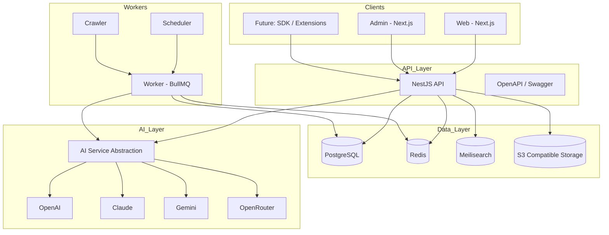

The diagram above illustrates the high-level topology. Each box represents a deployable unit or infrastructure dependency. Cross-cutting concerns—logging, authentication, validation, and observability—span all layers and are described in later sections.

---

## 2. Frontend Stack

The public **Web** application and **Admin** CMS share a common frontend foundation while maintaining separate deployable apps within the monorepo. Both prioritize server-side rendering and static generation where appropriate to meet SEO and performance requirements.

### Frontend Technologies

| Technology | Version | Purpose | Reason for Selection |
|---|---|---|---|
| **Next.js** | 15.x | App Router framework for Web and Admin | Industry-leading React meta-framework with SSR, SSG, ISR, built-in routing, metadata API, sitemap/robots generation, and edge-ready deployment. SEO-first rendering is non-negotiable for a content platform at scale. |
| **React** | 19.x | UI component library | Mature ecosystem, concurrent features, and alignment with Next.js. Largest contributor pool among frontend frameworks. |
| **TypeScript** | 5.x | Static typing across all frontend code | Shared types with backend DTOs and validation schemas. Catches integration errors at build time. |
| **Tailwind CSS** | 3.x | Utility-first styling | Rapid UI development, consistent design tokens, small production bundles when purged correctly. |
| **shadcn/ui** | Latest | Accessible component primitives | Copy-paste component model avoids dependency lock-in. Built on Radix UI for accessibility. Customizable for Admin and Web themes. |
| **TanStack Query** | 5.x | Server state management and caching | Declarative data fetching, cache invalidation, optimistic updates, and stale-while-revalidate patterns for Admin dashboards. |
| **TanStack Table** | 8.x | Headless data tables | Sorting, filtering, pagination, and column visibility for CMS list views without opinionated styling constraints. |
| **React Hook Form** | 7.x | Form state management | Minimal re-renders, excellent DX for complex Admin forms (tool editor, category manager, prompt editor). |
| **Zod** | 3.x | Schema validation | Runtime validation aligned with TypeScript inference. Shared schemas between frontend forms and API contracts. |
| **Framer Motion** | 11.x | Animation library | Subtle UI transitions for Web discovery experiences. Used sparingly to avoid CLS regressions. |
| **Lucide Icons** | Latest | Icon system | Consistent, tree-shakeable SVG icons with React bindings. Lightweight alternative to heavier icon fonts. |

### Frontend Architecture Principles

- **Server Components by default** on public Web pages to minimize client JavaScript and improve TTFB.
- **Client Components only where interactivity is required**—search autocomplete, filters, online tool runtimes, and Admin editing surfaces.
- **Colocated data fetching** via Next.js server components and route handlers; TanStack Query reserved primarily for Admin client-side interactions.
- **Shared packages** (`@ai-tool-cms/ui`, `@ai-tool-cms/seo`, `@ai-tool-cms/types`) prevent duplication between Web and Admin.

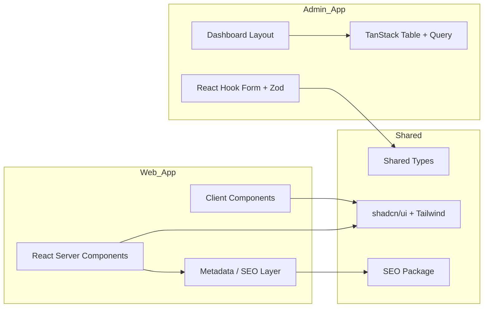

---

## 3. Backend Stack

The **API** application is built on NestJS—a structured, opinionated Node.js framework suited for enterprise-grade services with clear module boundaries, dependency injection, and first-class TypeScript support.

### Backend Technologies

| Technology | Version | Purpose | Reason for Selection |
|---|---|---|---|
| **NestJS** | 10.x | API framework | Modular architecture mirrors domain boundaries (tools, categories, auth, search). Built-in support for guards, interceptors, pipes, and microservice patterns. |
| **Prisma** | 6.x | ORM and schema management | Type-safe database access, migration workflow, introspection, and excellent PostgreSQL support including JSONB and full-text features. |
| **BullMQ** | 5.x | Job queue on Redis | Reliable background job processing for crawlers, AI generation, SEO updates, and email. Supports delayed jobs, retries, and priority queues. |
| **Redis** | 7.x | Cache, session store, queue backend | Low-latency caching for hot data, rate limiting counters, pub/sub for real-time Admin notifications, and BullMQ persistence. |
| **Swagger** | OpenAPI 3.x | API documentation | Auto-generated interactive docs at `/docs`. Contract-first development for internal and external consumers. |
| **Passport** | 0.7.x | Authentication middleware | Strategy-based auth supporting JWT and future OAuth/SSO providers for Enterprise Edition. |
| **JWT** | — | Stateless access tokens | Short-lived access tokens with refresh token rotation. Suitable for Admin API and future mobile/extension clients. |
| **class-validator** | 0.14.x | DTO validation decorators | Declarative request validation aligned with NestJS pipes. |
| **class-transformer** | 0.5.x | DTO transformation | Plain-to-class conversion for validated, typed request bodies and query parameters. |

### Backend Service Topology

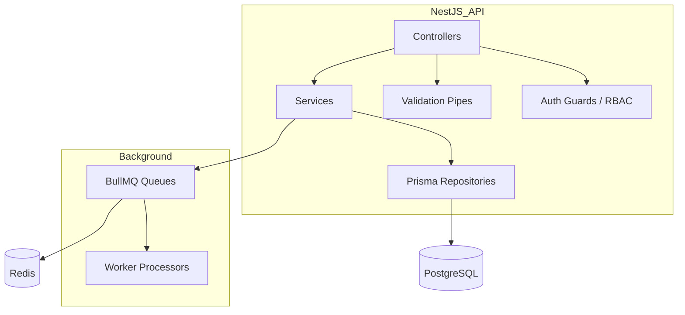

### API Design Conventions

- **REST-first** with resource-oriented URLs, consistent pagination, filtering, and sorting query parameters.
- **OpenAPI-documented** endpoints for every public and Admin capability.
- **RBAC-enforced** routes using permission guards derived from database-stored roles.
- **Idempotent write operations** where applicable (tool upserts, webhook handlers).
- **Webhook support** (planned) for external integrations and plugin event propagation.

---

## 4. Database

**PostgreSQL** is the primary relational database for AI Tool CMS v2. It serves as the system of record for tools, categories, tags, users, permissions, content metadata, crawler state, and analytics aggregates.

### Why PostgreSQL

| Capability | Relevance to AI Tool CMS v2 |
|---|---|
| **ACID compliance** | Content publishing, permission changes, and financial-adjacent pricing data require transactional integrity. Partial writes during crawler ingestion must not corrupt catalog state. |
| **JSONB columns** | Crawler payloads, AI enrichment outputs, flexible metadata blobs, and provider-specific API response caches benefit from indexed JSON storage without schema rigidity. |
| **Advanced indexes** | B-tree, GIN, GiST, and partial indexes support high-cardinality slug lookups, tag intersections, JSONB path queries, and filtered published-content scans. |
| **Full-text search** | Built-in `tsvector` / `tsquery` provides a fallback and hybrid complement to Meilisearch—useful for Admin search and environments without a dedicated search service. |
| **Table partitioning** | Range or list partitioning on high-volume tables (analytics events, crawler logs, job history) keeps query performance stable as data grows into billions of rows. |
| **Extensions** | `pg_trgm` for fuzzy matching, `uuid-ossp` / `pgcrypto` for identifiers, `pg_stat_statements` for query analysis, and optional `TimescaleDB` for time-series analytics. |
| **Future scalability** | Read replicas, connection pooling (PgBouncer), logical replication, and Citus-compatible sharding paths support horizontal growth without abandoning the primary data model. |

### Data Architecture Layers

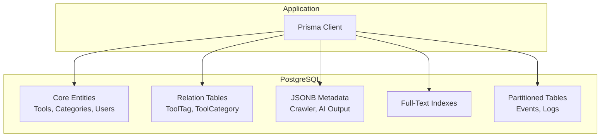

### Schema Design Principles

- **Normalized core entities** with explicit junction tables for many-to-many relationships.
- **Denormalized read models** (materialized views or cached aggregates) for high-traffic listing pages where justified.
- **Soft deletes avoided by default**—prefer status enums (`DRAFT`, `PUBLISHED`, `ARCHIVED`) for auditability.
- **Slug-based public identifiers** with unique indexes for SEO-friendly URLs.
- **Timestamps on every table** (`created_at`, `updated_at`) for freshness scoring and crawler reconciliation.

---

## 5. Search Engine

Search is a primary discovery mechanism for a platform targeting millions of pages. AI Tool CMS v2 uses **Meilisearch** as the dedicated search engine, complemented by PostgreSQL full-text search for Admin and fallback scenarios.

### Meilisearch

| Aspect | Detail |
|---|---|
| **Role** | Primary public search index for tools, agents, APIs, prompts, tutorials, and news. |
| **Strengths** | Sub-50ms typical query latency, typo tolerance, faceted filtering, synonym support, and simple operational model. |
| **Integration** | Index updates triggered by CMS publish events and worker jobs. Incremental sync from PostgreSQL change streams. |
| **Facets** | Category, tag, pricing model, language, status, and custom metadata fields exposed as filterable facets. |
| **Ranking** | Custom ranking rules prioritize exact name matches, popularity signals, and freshness scores. |

### Why Not Elasticsearch

| Factor | Elasticsearch | Meilisearch | Decision |
|---|---|---|---|
| **Operational complexity** | Cluster management, shard tuning, JVM heap | Single binary or small cluster | Meilisearch wins for lean teams and self-hosted deployments |
| **Resource footprint** | Heavy memory and disk requirements | Lightweight, fast startup | Lower infrastructure cost at moderate scale |
| **Developer experience** | Complex query DSL | Simple REST API, instant search UX | Faster iteration for product engineers |
| **Typo tolerance** | Requires configuration | Built-in | Better out-of-box discovery UX |
| **Mature ecosystem** | Extensive aggregations, logging, APM | Focused on search | Elasticsearch better for log analytics—not our primary need |

Elasticsearch remains a credible option if the platform later requires complex aggregations across billions of log events or unified search+log analytics in a single cluster. For **product discovery search**, Meilisearch provides the better cost-to-value ratio.

### Future Migration Possibilities

The search layer is accessed through an internal abstraction (`@ai-tool-cms/search`) that defines a provider interface:

- `indexDocument(collection, document)`
- `deleteDocument(collection, id)`
- `search(collection, query, filters, pagination)`

This allows future migration to Elasticsearch, Typesense, or Algolia without rewriting CMS or Web consumers. Hybrid search strategies—Meilisearch for user-facing queries, PostgreSQL `tsvector` for Admin full-record search—are supported concurrently.

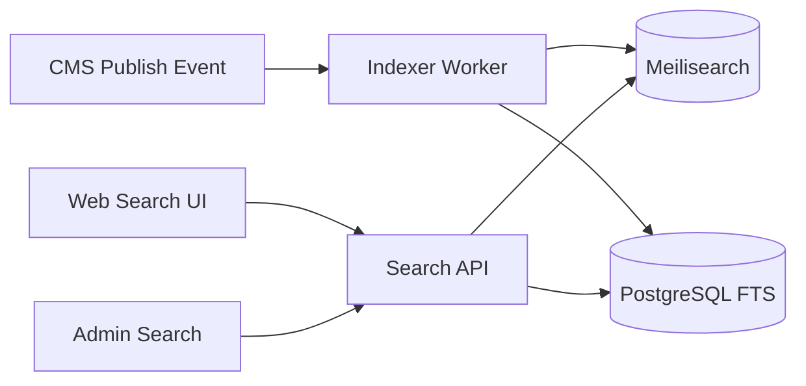

---

## 6. AI Layer

AI is a core capability—not an optional plugin—for content enrichment, classification, summarization, comparison generation, FAQ creation, and quality review. The platform integrates multiple LLM providers through a **unified provider abstraction** in the `@ai-tool-cms/ai` package.

### Supported Providers

| Provider | Typical Use Cases |
|---|---|
| **OpenAI** | General content generation, structured JSON output, embeddings |
| **Claude** | Long-context summarization, nuanced editorial content, safety-sensitive review |
| **Gemini** | Multimodal analysis (screenshots, logos), cost-efficient batch processing |
| **OpenRouter** | Model routing, fallback chains, access to open-weight and specialty models |
| **DeepSeek** | Cost-effective generation for high-volume enrichment pipelines |
| **Qwen** | Chinese-language content generation and localization |
| **GLM** | Chinese-language reasoning and domestic deployment compliance |

### Provider Abstraction Design

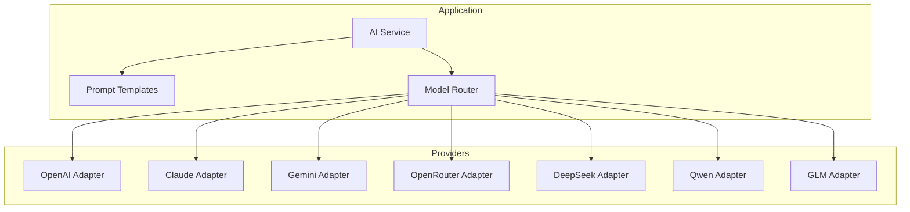

### Abstraction Principles

| Principle | Description |
|---|---|
| **Unified interface** | All providers implement `complete()`, `stream()`, and `embed()` with normalized request/response types. |
| **Prompt templates** | Versioned templates with variable interpolation stored in the database and managed via Admin. |
| **Model routing** | Configurable rules select provider and model by task type, language, cost ceiling, and latency budget. |
| **Fallback chains** | Primary provider failures automatically retry on secondary providers with circuit breaker logic. |
| **Cost tracking** | Token usage and estimated cost logged per request for analytics and budget alerts. |
| **Output validation** | Zod schemas validate structured AI outputs before persistence—invalid JSON never reaches the database. |
| **Human-in-the-loop** | Generated content enters `DRAFT` status by default; publishing requires approval policies. |

Provider API keys are stored as environment variables or secrets manager entries—never in source code or client bundles.

---

## 7. Storage

Binary assets—tool logos, screenshots, uploaded media, generated images, and online tool artifacts—are stored in **S3-compatible object storage** with optional CDN acceleration.

### Storage Tiers

| Tier | Technology | Use Case |
|---|---|---|
| **Local storage** | Filesystem (development) | Local Docker Compose development without external cloud dependencies. |
| **S3 compatible** | AWS S3 API standard | Production default interface—cloud-agnostic by design. |
| **Cloudflare R2** | S3-compatible, zero egress | Cost-effective CDN-backed storage for high-traffic image delivery. |
| **MinIO** | Self-hosted S3-compatible | On-premise and air-gapped Enterprise deployments. |
| **Image CDN** | Cloudflare / imgproxy | On-the-fly resizing, WebP/AVIF conversion, and edge caching for logo/screenshot delivery. |

### Storage Architecture

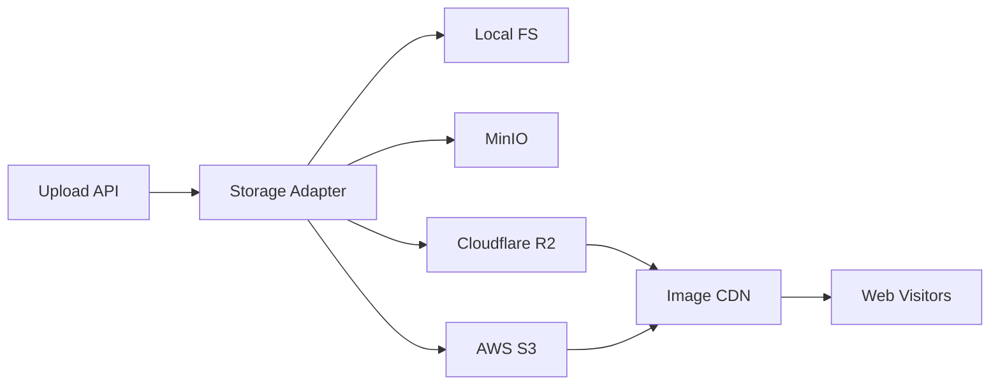

### Storage Conventions

- **Content-addressable paths** where appropriate (`/logos/{toolId}/{hash}.webp`) for cache busting and deduplication.
- **Pre-signed URLs** for secure, time-limited upload and download operations.
- **MIME validation** and file size limits enforced at API layer before storage write.
- **Virus scanning hook** (planned Enterprise feature) before serving user-uploaded binaries.

The `@ai-tool-cms/storage` package exposes a provider-agnostic interface identical across Local, MinIO, R2, and S3 backends.

---

## 8. DevOps

The platform is designed for reproducible builds, consistent local development, and automated CI/CD pipelines.

### DevOps Tooling

| Technology | Purpose | Reason for Selection |
|---|---|---|
| **Docker** | Container runtime | Consistent environments across development, staging, and production. |
| **Docker Compose** | Local multi-service orchestration | Single-command bring-up for PostgreSQL, Redis, Meilisearch, MinIO, API, Web, Admin, Worker, and Scheduler. |
| **GitHub Actions** | CI/CD pipelines | Lint, typecheck, test, build, and deploy workflows triggered on pull requests and main branch merges. |
| **pnpm** | Package manager | Strict dependency resolution, efficient disk usage via content-addressable store, excellent monorepo workspace support. |
| **Turborepo** | Monorepo build orchestration | Task caching, parallel execution, and dependency-aware build ordering across apps and packages. |
| **Biome** | Linter and formatter | Fast, unified linting and formatting with minimal configuration. Primary tool for code style enforcement. |
| **Prettier compatibility** | Formatter interop | Biome formatting coexists with Prettier for file types Biome does not cover (Markdown, YAML). `prettier-ignore` respected where needed. |

### Monorepo Structure

```
apps/           # Deployable applications (web, admin, api, worker, crawler, scheduler)
packages/       # Shared libraries (auth, database, seo, ai, storage, queue, ui, types)
prisma/         # Database schema and migrations
docker/         # Dockerfiles and Compose overrides
.github/        # CI/CD workflows
```

### CI/CD Pipeline Stages

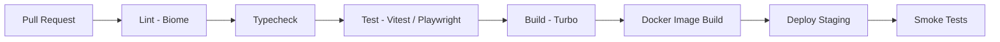

### Deployment Targets

| Environment | Orchestration | Notes |
|---|---|---|
| **Local** | Docker Compose | Full stack with hot reload for development |
| **Staging** | Docker Compose or single VM | Pre-production validation |
| **Production** | Docker Compose → Kubernetes | Kubernetes adoption planned as traffic and team scale justify complexity |

---

## 9. Monitoring

Operational visibility is required from day one—not retrofitted after outages. The monitoring stack prioritizes structured logging, health endpoints, and metrics with a path toward OpenTelemetry.

### Monitoring Components

| Component | Technology | Purpose |
|---|---|---|
| **Structured logging** | Pino | High-performance JSON logging with log levels, request correlation IDs, and low overhead in production. |
| **Health checks** | NestJS Terminus / custom endpoints | `/health` and `/ready` endpoints report database, Redis, Meilisearch, and storage connectivity. |
| **Metrics** | Prometheus-compatible exporters (planned) | Request latency histograms, queue depth gauges, crawler throughput counters, AI token usage totals. |
| **Error tracking** | Sentry (or compatible) | Exception capture with stack traces, release tracking, and alert routing. |
| **Future: OpenTelemetry** | OTel SDK + Collector | Distributed tracing across API, workers, and crawlers. Unified traces, metrics, and logs correlation. |

### Observability Principles

- **Every request has a correlation ID** propagated from API through workers to crawler jobs.
- **Every background job logs start, completion, duration, and failure reason.**
- **Health endpoints are load-balancer ready**—unhealthy instances are removed from rotation automatically.
- **Dashboards** (Grafana or equivalent) visualize queue depth, API p95 latency, crawler success rate, and index freshness.

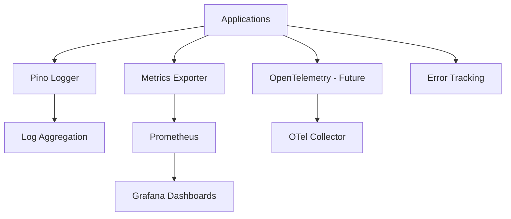

---

## 10. Testing

Testing strategy follows the testing pyramid: **many unit tests, fewer integration tests, and targeted end-to-end tests** for critical user journeys.

### Testing Technologies

| Technology | Scope | Purpose |
|---|---|---|
| **Vitest** | Unit and integration tests | Fast TypeScript-native test runner for packages and API services. Compatible with Vite tooling and ESM. |
| **Playwright** | End-to-end tests | Browser automation for Web and Admin critical paths: search, tool detail rendering, Admin login, tool CRUD. |
| **Supertest** | HTTP integration tests | API endpoint testing against NestJS application instances without network overhead. |

### Testing Strategy

| Layer | What Is Tested | Tools |
|---|---|---|
| **Unit** | Pure functions, validators, SEO builders, AI output parsers, utility modules | Vitest |
| **Integration** | API routes with test database, Prisma migrations, queue job processors | Vitest + Supertest + testcontainers (PostgreSQL, Redis) |
| **End-to-end** | Public page rendering, Admin workflows, authentication flows | Playwright |
| **Contract** | OpenAPI schema compliance, shared Zod schema parity | Vitest + openapi-diff |

### Quality Gates

- All pull requests must pass lint, typecheck, and unit tests before merge.
- Integration tests run on main branch and nightly schedules.
- Playwright E2E tests run on staging deployments before production promotion.
- Minimum coverage targets are defined per package—core packages (`auth`, `database`, `seo`, `ai`) require higher thresholds than UI-only modules.

---

## 11. Internationalization

AI Tool CMS v2 targets a global audience. Internationalization (i18n) is architected from the start—not retrofitted after English-only content accumulates.

### Initial Language Support

| Language | Code | Priority |
|---|---|---|
| **English** | `en` | Primary—default locale for development and documentation |
| **Chinese (Simplified)** | `zh-CN` | Primary localized market |
| **Japanese** | `ja` | High AI tool adoption market |
| **Korean** | `ko` | Growing AI ecosystem coverage |

### i18n Architecture (Planned)

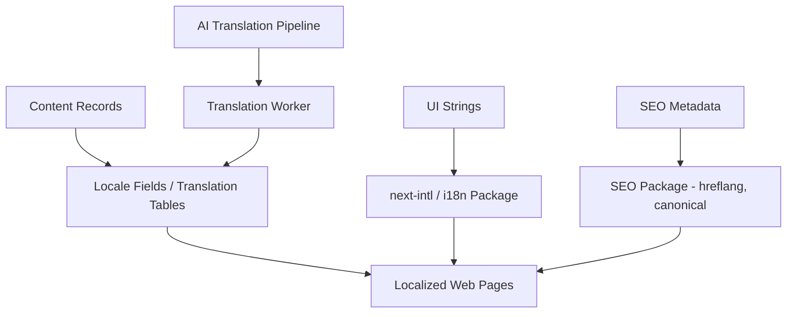

### Multilingual Design Principles

- **Locale in the URL** (`/en/tools/...`, `/zh-CN/tools/...`) for indexable, shareable localized pages.
- **`hreflang` annotations** generated automatically by the SEO package for cross-locale discovery.
- **Fallback chains**—if a translation is missing, fall back to English source content with `content-language` headers set correctly.
- **AI-assisted translation** with human review for high-traffic pages; machine translation for long-tail programmatic pages under quality thresholds.
- **RTL support** (Arabic, Hebrew) planned for Year 3+ without URL structure changes.

---

## 12. Security

Security is enforced at every layer—transport, authentication, authorization, input validation, and output encoding.

### Security Controls

| Control | Technology / Approach | Description |
|---|---|---|
| **Authentication** | JWT (access + refresh tokens) | Short-lived access tokens; refresh token rotation with revocation list in PostgreSQL. |
| **Authorization** | RBAC (Role-Based Access Control) | Permissions stored in database; enforced via NestJS guards on every protected route. |
| **Rate limiting** | Redis-backed throttler | Per-IP and per-user rate limits on authentication, search, and AI generation endpoints. |
| **HTTP security headers** | Helmet | `Content-Security-Policy`, `X-Frame-Options`, `X-Content-Type-Options`, and related headers on all API responses. |
| **CORS** | NestJS CORS configuration | Strict origin allowlist for Admin and Web domains. Credentials permitted only for trusted origins. |
| **Input validation** | class-validator + Zod | All request bodies, query parameters, and path params validated before service layer execution. |
| **SQL injection protection** | Prisma parameterized queries | ORM prevents raw string interpolation. Raw queries (if any) use tagged templates with bound parameters. |
| **XSS protection** | React auto-escaping + CSP | User-generated content sanitized before rendering. Strict CSP limits inline script execution. |
| **CSRF strategy** | SameSite cookies + token validation | Admin mutations require CSRF tokens or SameSite=Strict cookie policies for cookie-based flows. API-only JWT flows are CSRF-resistant by design. |

### Security Architecture

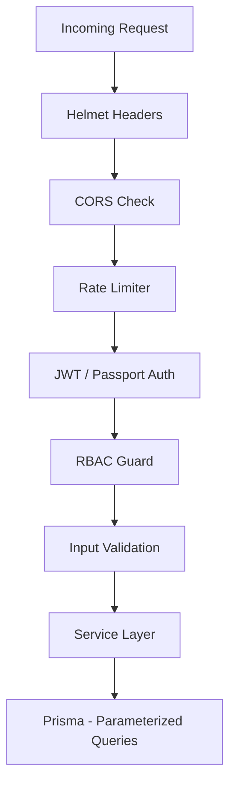

### Secret Management

- API keys, JWT secrets, and database credentials are loaded from environment variables or secrets managers—never committed to source control.
- Production secrets rotate on a defined schedule.
- Admin actions on sensitive resources (user management, API key rotation) require elevated permissions and audit logging.

---

## 13. Performance Targets

Performance is a product feature. Slow pages lose organic traffic; slow APIs block automation pipelines. The following targets define the minimum acceptable bar for production deployments.

### Performance Target Table

| Metric | Target | Context |
|---|---|---|
| **TTFB (Time to First Byte)** | ≤ 200ms (p75), ≤ 500ms (p95) | Public Web pages served from CDN or SSR origin |
| **FCP (First Contentful Paint)** | ≤ 1.2s (p75) | Tool detail and category listing pages on 4G connections |
| **LCP (Largest Contentful Paint)** | ≤ 2.5s (p75) | Core Web Vitals compliance for SEO ranking signals |
| **CLS (Cumulative Layout Shift)** | ≤ 0.1 (p75) | Stable layouts during image and font loading |
| **API Response (read)** | ≤ 100ms (p50), ≤ 300ms (p95) | Cached catalog reads (tool by slug, category listing) |
| **API Response (write)** | ≤ 500ms (p95) | CMS create/update operations excluding async enrichment |
| **Crawler Speed** | ≥ 50 pages/minute per worker | Steady-state HTML crawl with polite rate limiting |
| **Search Response** | ≤ 50ms (p95) | Meilisearch query to first result byte via API |

### Performance Strategies

- **Edge caching** for static and ISR pages via CDN.
- **Redis caching** for hot API reads (popular tools, category trees).
- **Database connection pooling** via PgBouncer in production.
- **Image optimization** via CDN transforms (WebP/AVIF, responsive sizes).
- **Lazy loading** for below-fold images and non-critical client components.
- **Queue-based decoupling** for AI generation and crawler enrichment—never block HTTP responses on LLM calls.

---

## 14. Upgrade Strategy

Sustainable software requires disciplined versioning and dependency management—especially in a monorepo with multiple deployable apps sharing packages.

### Versioning Policy

| Artifact | Scheme | Notes |
|---|---|---|
| **Platform releases** | Semantic Versioning (SemVer) | `MAJOR.MINOR.PATCH`—breaking API changes increment major version. |
| **Database migrations** | Timestamped Prisma migrations | Migrations are forward-only in production; rollbacks require compensating migrations. |
| **API versions** | URL prefix (`/v1/`) | Breaking API changes introduce `/v2/` while `/v1/` remains supported during deprecation window. |
| **Package versions** | Internal `0.0.0` workspace versions | Monorepo packages are not published independently in early phases. |

### LTS Strategy

| Release Type | Support Window | Description |
|---|---|---|
| **Current** | Active development | Latest minor release receives features and fixes. |
| **LTS** | 12 months after next major | Security patches and critical bug fixes only. |
| **EOL** | After LTS window | No patches; upgrade required. |

LTS designation applies to the **platform as a whole** (deployable Docker image tags), not individual npm dependencies.

### Dependency Upgrade Policy

| Category | Upgrade Cadence | Process |
|---|---|---|
| **Security patches** | Immediate | Automated Dependabot PRs; merge after CI passes within 48 hours. |
| **Minor/patch (production deps)** | Monthly batch | Review changelogs, run full test suite, deploy to staging first. |
| **Major versions** | Quarterly evaluation | Dedicated upgrade PR with migration notes; never auto-merged. |
| **Node.js runtime** | Follow Node LTS schedule | Upgrade to new Node LTS within 3 months of release. |

### Breaking Change Communication

- Breaking changes documented in `CHANGELOG.md` with migration guides.
- Database migrations include rollback notes where safe.
- API deprecations announced with `Sunset` headers and minimum 90-day deprecation window.

---

## 15. Technology Decision Matrix

The following matrix documents major technology forks considered during architecture design and explains why the selected option was chosen for AI Tool CMS v2.

### Framework and Runtime Decisions

| Decision | Option A | Option B | Selected | Rationale |
|---|---|---|---|---|
| **Frontend framework** | Next.js (React) | Nuxt (Vue) | **Next.js** | Superior SSR/SSG/ISR metadata APIs for SEO at scale. Larger React contributor ecosystem aligns with hiring and open-source contributions. First-class App Router and `metadata` exports map directly to SEO requirements. |
| **Backend framework** | NestJS | Fastify | **NestJS** | Opinionated module system enforces domain boundaries in a large codebase. Built-in DI, guards, pipes, and Swagger integration reduce boilerplate. Fastify's raw performance advantage is less critical than structural maintainability for this CMS-heavy workload. |
| **Primary database** | PostgreSQL | MySQL | **PostgreSQL** | Superior JSONB support for crawler/AI payloads, advanced full-text search, richer indexing options, and stronger extension ecosystem. MySQL lacks comparable JSONB indexing and FTS flexibility. |
| **Search engine** | Meilisearch | Elasticsearch | **Meilisearch** | Lower operational overhead, faster time-to-value, built-in typo tolerance, and sufficient faceting for product discovery. Elasticsearch reserved as future migration path via abstraction layer. |
| **Message queue** | BullMQ (Redis) | RabbitMQ | **BullMQ** | Redis is already required for caching and rate limiting—adding BullMQ avoids a separate broker infrastructure. Simpler ops for self-hosted deployments. RabbitMQ better for complex routing topologies not required in v2 initial scope. |

### Decision Flow

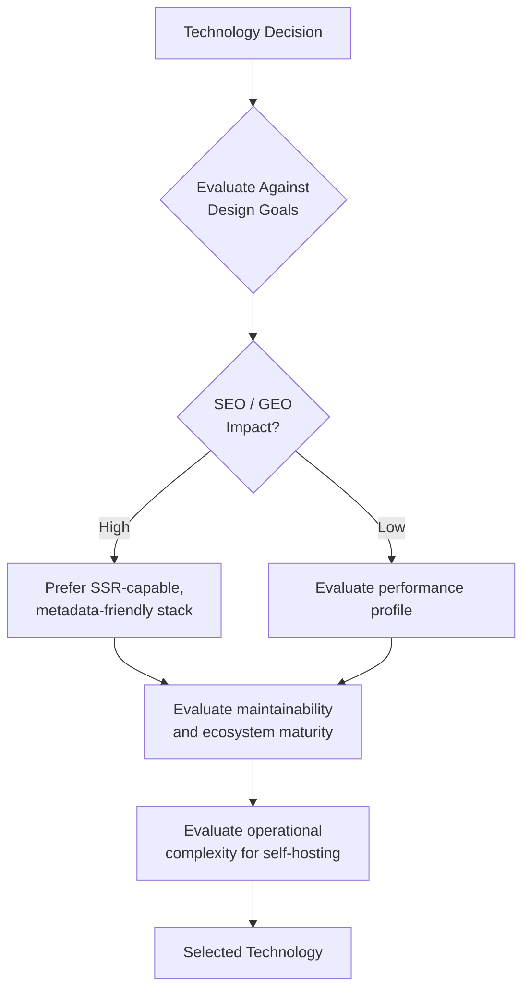

### Selection Principles Applied

1. **Prefer boring, proven technology** for infrastructure layers (PostgreSQL, Redis, Docker).
2. **Prefer ecosystem-aligned technology** for product layers (Next.js, NestJS, Prisma, TypeScript).
3. **Prefer replaceable components** behind abstractions (search, storage, AI providers).
4. **Reject technology that optimizes for benchmarks but increases operational burden** unless scale explicitly demands it (Elasticsearch, Kubernetes, RabbitMQ deferred to later phases).

---

## Related Documents

- [Project Overview](./README.md) — Entry point for AI Tool CMS v2 documentation
- [Product Vision](./Vision.md) — Long-term product vision and guiding principles
- `FolderStructure.md` — Repository layout (planned)
- `docs/01-architecture/` — Detailed system architecture (planned)
- `docs/11-devops/` — Deployment and operations guide (planned)

---

**Document Version**

| Field | Value |
|---|---|
| Version | 2.0.0 |
| Status | Draft |
| Owner | Project Architecture Team |
| Last Updated | 2026 |
