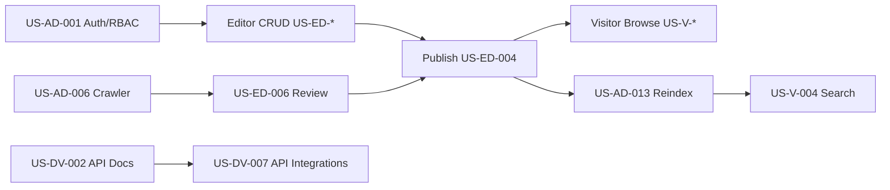
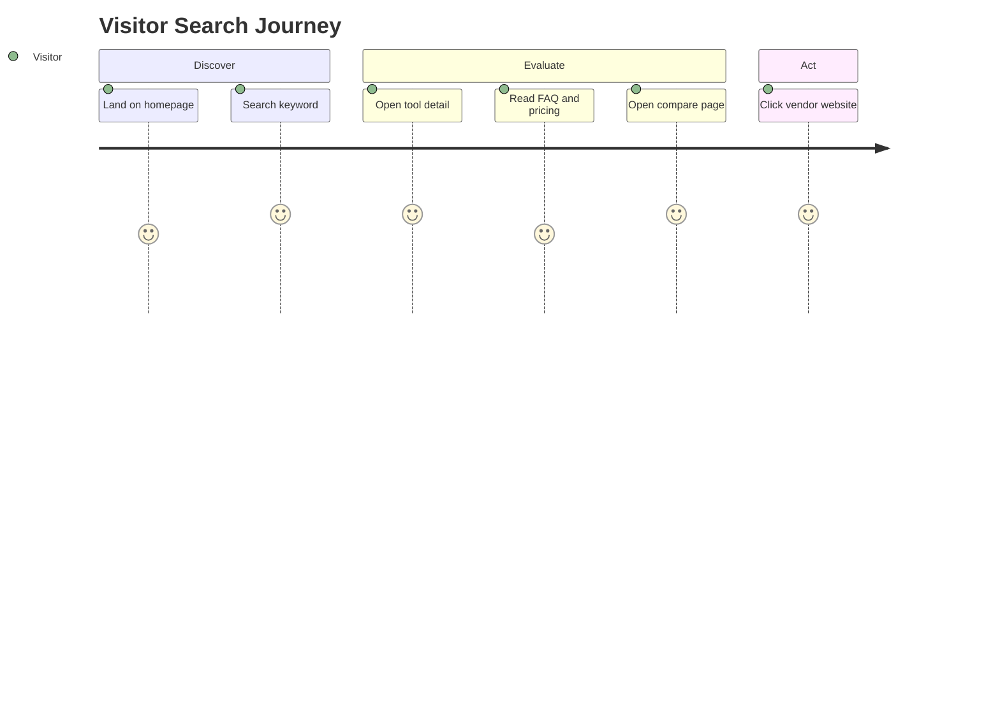
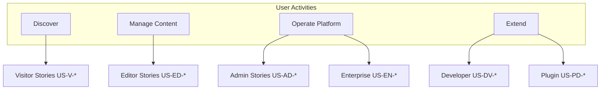
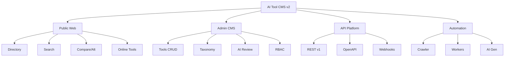
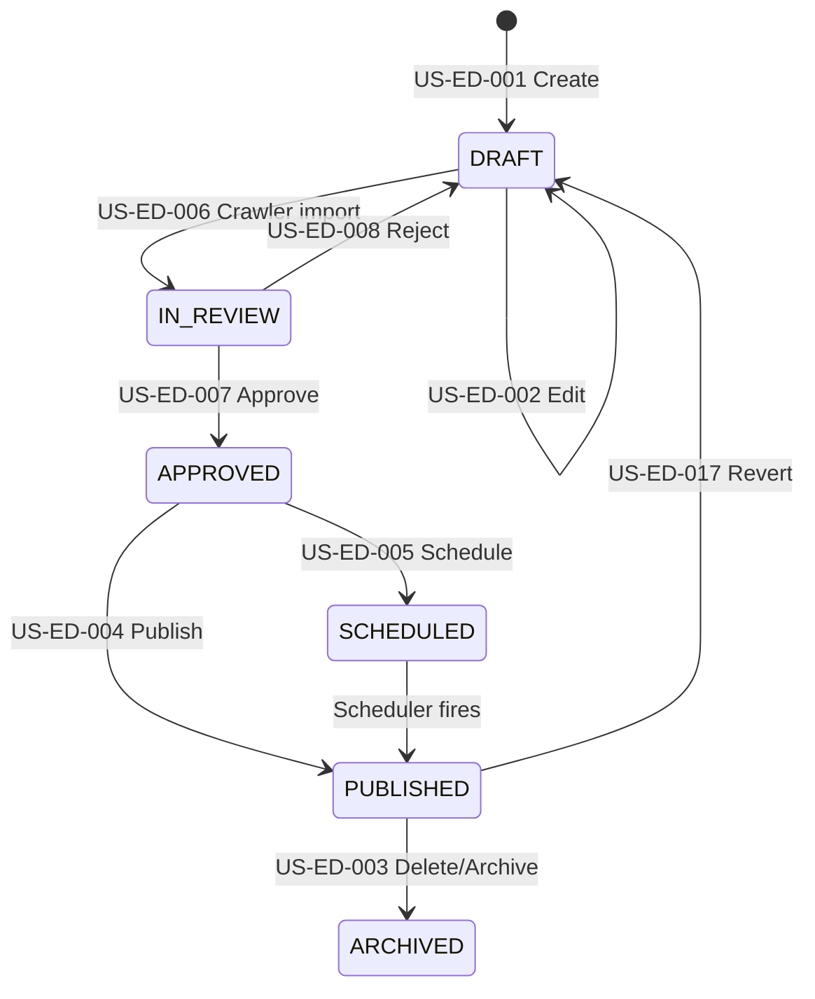

# User Stories

> **Document Type:** Product Requirements (BDD)  
> **Version:** 2.0.0  
> **Status:** Draft  
> **Owner:** Product Architecture Team  
> **Last Updated:** 2026  
> **Audience:** Product Managers, Software Architects, Developers, QA Engineers, Open Source Contributors, AI Coding Assistants

---

## Table of Contents

1. [Purpose](#purpose)
2. [Story Template](#story-template)
3. [Priority Levels](#priority-levels)
4. [Story Index](#story-index)
5. [Visitor Stories](#visitor-stories)
6. [Content Editor Stories](#content-editor-stories)
7. [Administrator Stories](#administrator-stories)
8. [Developer Stories](#developer-stories)
9. [Plugin Developer Stories](#plugin-developer-stories)
10. [Enterprise Stories](#enterprise-stories)
11. [Cross-Cutting Requirements](#cross-cutting-requirements)
12. [Mermaid Diagrams](#mermaid-diagrams)

---

## Purpose

This document defines **major user stories** for AI Tool CMS v2 using Agile user story format and **Behavior-Driven Development (BDD)** Gherkin scenarios. Stories translate [Personas.md](./Personas.md) needs into testable requirements for product, engineering, and QA.

| Audience | Usage |
|---|---|
| **Product Managers** | Prioritize backlog; validate scope against [Goals.md](./Goals.md) |
| **Architects** | Trace features to API and module boundaries |
| **Developers** | Implement against acceptance criteria |
| **QA Engineers** | Derive test cases from BDD scenarios |
| **AI Assistants** | Generate features only within documented stories |

**Business requirements only**—no implementation code. Out-of-scope items reference [NonGoals.md](./NonGoals.md).

---

## Story Template

| Field | Description |
|---|---|
| **Story ID** | Unique identifier (`US-{persona}-{nnn}`) |
| **Title** | Short capability name |
| **Persona** | Primary [Personas.md](./Personas.md) beneficiary |
| **Business Value** | Why this matters commercially or operationally |
| **Priority** | Critical / High / Medium / Low |
| **Description** | Context and scope in prose |
| **User Story** | As a / I want / so that |
| **Acceptance Criteria** | Bullet list of pass/fail conditions |
| **Edge Cases** | Boundary and failure conditions |
| **Dependencies** | Other stories, systems, or data |
| **Future Improvements** | Deferred enhancements |
| **BDD Scenario** | Gherkin Feature/Scenario block |

---

## Priority Levels

| Level | Definition | Release Expectation |
|---|---|---|
| **Critical** | MVP blocker; platform unusable without it | MVP / v1.0 |
| **High** | Core v2.0 value; expected by primary personas | v2.0 |
| **Medium** | Important but deferrable within v2.x | v2.1+ |
| **Low** | Nice-to-have; future or plugin | v3+ / plugin |

---

## Story Index

| ID | Title | Persona | Priority |
|---|---|---|---|
| US-V-001 | Browse Homepage | Visitor | Critical |
| US-V-002 | Browse Categories | Visitor | Critical |
| US-V-003 | Browse Tags | Visitor | High |
| US-V-004 | Search AI Tools | Visitor | Critical |
| US-V-005 | Filter Tools | Visitor | High |
| US-V-006 | Sort Results | Visitor | High |
| US-V-007 | Open Tool Detail | Visitor | Critical |
| US-V-008 | Compare Tools | Visitor | High |
| US-V-009 | View Alternatives | Visitor | High |
| US-V-010 | Read Reviews | Visitor | Medium |
| US-V-011 | Read FAQ | Visitor | High |
| US-V-012 | Bookmark Tool | Visitor | Medium |
| US-V-013 | Share Tool | Visitor | Medium |
| US-V-014 | Subscribe Newsletter | Visitor | Low |
| US-V-015 | Use Online Tools | Visitor | High |
| US-V-016 | Browse Collections | Visitor | Medium |
| US-V-017 | Read Tutorials | Visitor | Medium |
| US-V-018 | Read News | Visitor | Medium |
| US-V-019 | View Pricing on Detail | Visitor | Critical |
| US-V-020 | Switch Locale | Visitor | High |
| US-V-021 | Access RSS Feed | Visitor | Low |
| US-V-022 | Navigate Breadcrumbs | Visitor | Medium |
| US-V-023 | Report Incorrect Info | Visitor | Medium |
| US-V-024 | Paginate Results | Visitor | Critical |
| US-V-025 | View Tool Media | Visitor | High |
| US-ED-001 | Create Tool | Editor | Critical |
| US-ED-002 | Edit Tool | Editor | Critical |
| US-ED-003 | Delete Tool | Editor | High |
| US-ED-004 | Publish Tool | Editor | Critical |
| US-ED-005 | Schedule Publication | Editor | Medium |
| US-ED-006 | Review Crawler Draft | Editor | High |
| US-ED-007 | Approve Content | Editor | High |
| US-ED-008 | Reject Content | Editor | High |
| US-ED-009 | SEO Optimize Page | Editor | High |
| US-ED-010 | Generate AI Content | Editor | High |
| US-ED-011 | Manage FAQ | Editor | High |
| US-ED-012 | Manage Prompt Library | Editor | Medium |
| US-ED-013 | Manage Categories | Editor | Critical |
| US-ED-014 | Manage Tags | Editor | Critical |
| US-ED-015 | Create Collection | Editor | Medium |
| US-ED-016 | Bulk Publish | Editor | Medium |
| US-ED-017 | Revert Revision | Editor | Medium |
| US-ED-018 | Manage Blog Post | Editor | Medium |
| US-ED-019 | Manage Tutorial | Editor | Medium |
| US-ED-020 | Upload Tool Logo | Editor | High |
| US-ED-021 | Set Tool Pricing | Editor | Critical |
| US-ED-022 | Archive Tool | Editor | High |
| US-AD-001 | Manage Users | Admin | Critical |
| US-AD-002 | Manage Roles | Admin | Critical |
| US-AD-003 | Manage Permissions | Admin | Critical |
| US-AD-004 | Configure Crawler | Admin | High |
| US-AD-005 | Configure AI Providers | Admin | High |
| US-AD-006 | Configure SEO Settings | Admin | High |
| US-AD-007 | View Analytics Dashboard | Admin | High |
| US-AD-008 | System Configuration | Admin | Critical |
| US-AD-009 | Backup Database | Admin | High |
| US-AD-010 | Restore Database | Admin | High |
| US-AD-011 | Monitor Job Queue | Admin | High |
| US-AD-012 | Trigger Manual Crawl | Admin | High |
| US-AD-013 | Reindex Search | Admin | High |
| US-AD-014 | View Health Status | Admin | Critical |
| US-AD-015 | Manage API Keys | Admin | High |
| US-AD-016 | Configure Webhooks | Admin | Medium |
| US-AD-017 | View Audit Log | Admin | Medium |
| US-AD-018 | Set Rate Limits | Admin | High |
| US-DV-001 | Generate API Key | Developer | High |
| US-DV-002 | Read API Docs | Developer | Critical |
| US-DV-003 | Build Plugin | Developer | Medium |
| US-DV-004 | Use SDK | Developer | Medium |
| US-DV-005 | Debug API | Developer | High |
| US-DV-006 | Deploy System | Developer | Critical |
| US-DV-007 | List Tools via API | Developer | Critical |
| US-DV-008 | Create Tool via API | Developer | High |
| US-DV-009 | Consume Webhooks | Developer | Medium |
| US-DV-010 | Run Migrations | Developer | Critical |
| US-DV-011 | Contribute to Core | Developer | High |
| US-DV-012 | Customize Theme Tokens | Developer | Low |
| US-PD-001 | Register Plugin | Plugin Developer | Medium |
| US-PD-002 | Publish Crawler Adapter | Plugin Developer | Medium |
| US-PD-003 | Publish Online Tool Module | Plugin Developer | Medium |
| US-PD-004 | Version Compatibility Check | Plugin Developer | High |
| US-PD-005 | List on Marketplace | Plugin Developer | Low |
| US-EN-001 | SSO Login | Enterprise | Medium |
| US-EN-002 | Export Audit Log | Enterprise | Medium |
| US-EN-003 | Private Deployment | Enterprise | High |
| US-EN-004 | Multi-tenancy | Enterprise | Low |
| US-EN-005 | SCIM Provisioning | Enterprise | Low |
| US-EN-006 | Data Residency Config | Enterprise | Medium |
| US-EN-007 | SLA Dashboard Access | Enterprise | Low |
| US-EN-008 | Air-gapped Install | Enterprise | Low |

**Total: 90 user stories**

---

## Visitor Stories

### US-V-001 — Browse Homepage

| Field | Value |
|---|---|
| **Persona** | Visitor (Alex) |
| **Business Value** | First impression drives discovery and trust |
| **Priority** | Critical |

**Description:** Visitor lands on the public homepage and sees featured tools, categories, and entry points to search.

**User Story:** As a **visitor**, I want to **browse the homepage**, so that **I can quickly discover popular AI tools and navigation paths**.

**Acceptance Criteria:**
- Homepage loads with site name, hero, and featured content areas
- Links to categories, search, and recent tools are visible above the fold on desktop
- Page includes valid meta title, description, and canonical URL
- LCP meets performance targets in [TechStack.md](./TechStack.md)
- Homepage is accessible via keyboard navigation

**Edge Cases:** Empty catalog shows onboarding message for operators, not broken layout. Offline CDN falls back to origin content.

**Dependencies:** US-ED-004 (published tools exist); SEO package.

**Future Improvements:** Personalized recommendations; A/B tested hero.

```gherkin
Feature: Browse Homepage
  Scenario: Visitor views homepage with published tools
    Given published tools exist in the catalog
    When the visitor opens the homepage
    Then featured tools or categories are displayed
    And the page title contains the site name
    And navigation to search is available
```

---

### US-V-002 — Browse Categories

| Field | Value |
|---|---|
| **Persona** | Visitor |
| **Business Value** | Taxonomy browse drives long-tail SEO and discovery |
| **Priority** | Critical |

**User Story:** As a **visitor**, I want to **browse tools by category**, so that **I can explore AI software by use case**.

**Acceptance Criteria:**
- Category listing page shows all top-level categories
- Category detail page lists tools in that category with pagination
- Each category page has unique SEO metadata
- Empty category shows clear empty state

**Edge Cases:** Category with zero published tools; deprecated category slug redirects.

**Dependencies:** US-ED-013; US-V-024.

**Future Improvements:** Nested subcategories; category icons.

```gherkin
Feature: Browse Categories
  Scenario: Visitor opens a category page
    Given a published category "text-generation" exists with tools
    When the visitor navigates to "/categories/text-generation"
    Then tools in that category are listed
    And pagination controls appear when tools exceed page size
```

---

### US-V-003 — Browse Tags

| Field | Value |
|---|---|
| **Persona** | Visitor |
| **Priority** | High |

**User Story:** As a **visitor**, I want to **browse tools by tag**, so that **I can find tools with specific attributes**.

**Acceptance Criteria:** Tag listing and tag detail pages with paginated tools; unique metadata per tag page.

**Edge Cases:** Tag synonym collision prevented by unique slugs.

**Dependencies:** US-ED-014.

```gherkin
Feature: Browse Tags
  Scenario: Visitor views tools for a tag
    Given tag "free-tier" has published tools
    When the visitor opens "/tags/free-tier"
    Then only tools with that tag are shown
```

---

### US-V-004 — Search AI Tools

| Field | Value |
|---|---|
| **Persona** | Visitor |
| **Priority** | Critical |

**User Story:** As a **visitor**, I want to **search for AI tools by keyword**, so that **I find relevant products quickly**.

**Acceptance Criteria:**
- Search accepts query string; returns matching tools
- Results ranked by relevance
- Empty query shows validation or popular tools
- No results shows helpful suggestions
- Search works on mobile and desktop

**Edge Cases:** Special characters sanitized; SQL injection prevented; very long query truncated.

**Dependencies:** Search index (Meilisearch); US-V-024.

**Future Improvements:** Autocomplete; hybrid semantic search.

```gherkin
Feature: Search AI Tools
  Scenario: Visitor searches by keyword
    Given tools including "ChatGPT" are indexed
    When the visitor searches for "ChatGPT"
    Then matching AI tools are displayed
    And results are sorted by relevance
```

---

### US-V-005 — Filter Tools

| Field | Value |
|---|---|
| **Persona** | Visitor |
| **Priority** | High |

**User Story:** As a **visitor**, I want to **filter tool listings**, so that **I narrow results by pricing, category, or tag**.

**Acceptance Criteria:** Filters for pricing model, category, tag; multiple filters combine with AND logic; filter state reflected in URL.

**Edge Cases:** Filter combination yields zero results with clear message.

**Dependencies:** US-V-004 or category/tag browse.

```gherkin
Feature: Filter Tools
  Scenario: Visitor filters by free pricing
    Given the search results page is open
    When the visitor applies filter "pricing=FREE"
    Then only free tools are displayed
```

---

### US-V-006 — Sort Results

| Field | Value |
|---|---|
| **Persona** | Visitor |
| **Priority** | High |

**User Story:** As a **visitor**, I want to **sort tool results**, so that **I order by relevance, name, or recency**.

**Acceptance Criteria:** Sort options documented; default sort is relevance on search, name on browse.

**Edge Cases:** Invalid sort parameter falls back to default.

```gherkin
Feature: Sort Results
  Scenario: Visitor sorts by name
    Given a tool listing page
    When the visitor selects sort "name ascending"
    Then tools are ordered alphabetically by name
```

---

### US-V-007 — Open Tool Detail

| Field | Value |
|---|---|
| **Persona** | Visitor |
| **Priority** | Critical |

**User Story:** As a **visitor**, I want to **view a tool detail page**, so that **I understand what the tool does before visiting its website**.

**Acceptance Criteria:**
- Detail page shows name, description, website link, logo, pricing, categories, tags
- Page is indexable with SoftwareApplication JSON-LD
- Unpublished tools return 404 for visitors
- Outbound website link opens in new tab with rel attributes per policy

**Edge Cases:** Missing logo shows placeholder; broken website URL flagged for editors.

**Dependencies:** US-ED-004.

```gherkin
Feature: Open Tool Detail
  Scenario: Visitor views published tool
    Given a published tool with slug "chatgpt"
    When the visitor opens "/tools/chatgpt"
    Then the tool name and description are displayed
    And a link to the official website is present
```

---

### US-V-008 — Compare Tools

| Field | Value |
|---|---|
| **Persona** | Visitor |
| **Priority** | High |

**User Story:** As a **visitor**, I want to **compare two or more tools side by side**, so that **I evaluate differences objectively**.

**Acceptance Criteria:** Compare page shows dimension table (pricing, category, key attributes); generated for valid tool pairs; unique SEO metadata.

**Edge Cases:** Comparing unpublished tool returns 404; single-tool compare redirects.

**Dependencies:** US-V-007; programmatic compare generation.

```gherkin
Feature: Compare Tools
  Scenario: Visitor views comparison page
    Given published tools "chatgpt" and "claude"
    When the visitor opens the compare page for both tools
    Then a side-by-side comparison table is displayed
```

---

### US-V-009 — View Alternatives

| Field | Value |
|---|---|
| **Persona** | Visitor |
| **Priority** | High |

**User Story:** As a **visitor**, I want to **see alternatives to a tool**, so that **I find substitutes if the primary option does not fit**.

**Acceptance Criteria:** Alternatives page lists ranked alternatives with links; metadata optimized for "X alternative" queries.

**Edge Cases:** Tool with no alternatives shows editorial message, not empty SEO spam.

```gherkin
Feature: View Alternatives
  Scenario: Visitor seeks alternatives
    Given tool "expensive-ai" has configured alternatives
    When the visitor opens the alternatives page
    Then alternative tools are listed with short rationale
```

---

### US-V-010 — Read Reviews

| Field | Value |
|---|---|
| **Persona** | Visitor |
| **Priority** | Medium |

**User Story:** As a **visitor**, I want to **read editorial reviews**, so that **I get qualitative assessment beyond feature lists**.

**Acceptance Criteria:** Reviews display rating, pros/cons, author, date; only published reviews visible.

**Edge Cases:** Unverified review labeled accordingly.

**Dependencies:** US-ED-007; review content type.

```gherkin
Feature: Read Reviews
  Scenario: Visitor reads tool review
    Given a published review exists for tool "chatgpt"
    When the visitor views the tool detail page
    Then the review summary or link to full review is visible
```

---

### US-V-011 — Read FAQ

| Field | Value |
|---|---|
| **Persona** | Visitor |
| **Priority** | High |

**User Story:** As a **visitor**, I want to **read FAQs on tool pages**, so that **I get quick answers and GEO-friendly content**.

**Acceptance Criteria:** FAQ blocks render on detail pages; FAQPage schema when applicable; questions match visible content.

**Edge Cases:** Empty FAQ section omitted, not placeholder text.

**Dependencies:** US-ED-011.

```gherkin
Feature: Read FAQ
  Scenario: Visitor expands FAQ on tool page
    Given tool page has FAQ entries
    When the visitor views the FAQ section
    Then questions and answers are readable
```

---

### US-V-012 — Bookmark Tool

| Field | Value |
|---|---|
| **Persona** | Visitor |
| **Priority** | Medium |

**User Story:** As a **visitor**, I want to **bookmark tools**, so that **I return to favorites later**.

**Acceptance Criteria:** Authenticated visitors save bookmarks; anonymous users prompted to login or use browser bookmark (policy per deployment).

**Edge Cases:** Deleted tool removed from bookmarks gracefully.

**Future Improvements:** Sync across devices.

```gherkin
Feature: Bookmark Tool
  Scenario: Logged-in visitor bookmarks tool
    Given the visitor is authenticated
    When the visitor bookmarks tool "chatgpt"
    Then the tool appears in the visitor's saved list
```

---

### US-V-013 — Share Tool

| Field | Value |
|---|---|
| **Persona** | Visitor |
| **Priority** | Medium |

**User Story:** As a **visitor**, I want to **share a tool page**, so that **I recommend tools to colleagues**.

**Acceptance Criteria:** Share provides canonical URL; OpenGraph tags render correct preview on social platforms.

**Edge Cases:** Share of draft URL not possible for visitors.

```gherkin
Feature: Share Tool
  Scenario: Visitor copies share link
    Given a published tool detail page
    When the visitor copies the page URL
    Then the URL is the canonical tool URL
```

---

### US-V-014 — Subscribe Newsletter

| Field | Value |
|---|---|
| **Persona** | Visitor |
| **Priority** | Low |

**User Story:** As a **visitor**, I want to **subscribe to updates**, so that **I learn about new tools**.

**Acceptance Criteria:** Email capture with consent; double opt-in per policy; unsubscribe link in emails.

**Edge Cases:** Duplicate subscription handled idempotently.

**Dependencies:** Worker email integration (future).

```gherkin
Feature: Subscribe Newsletter
  Scenario: Visitor subscribes with valid email
    Given the newsletter form is displayed
    When the visitor submits a valid email
    Then a confirmation message is shown
```

---

### US-V-015 — Use Online Tools

| Field | Value |
|---|---|
| **Persona** | Visitor |
| **Priority** | High |

**User Story:** As a **visitor**, I want to **use browser-based utilities**, so that **I complete tasks without leaving the site**.

**Acceptance Criteria:** Online tool pages load; utility performs stated function; usage does not require admin access.

**Edge Cases:** Rate limiting prevents abuse; clear privacy notice for client-side processing.

**Dependencies:** US-PD-003 or core online tools module.

```gherkin
Feature: Use Online Tools
  Scenario: Visitor uses text utility
    Given online tool "word-counter" is published
    When the visitor enters text and runs the tool
    Then the word count is displayed
```

---

### US-V-016 — Browse Collections

| Field | Value |
|---|---|
| **Persona** | Visitor |
| **Priority** | Medium |

**User Story:** As a **visitor**, I want to **browse curated collections**, so that **I discover tools grouped by theme or use case**.

**Acceptance Criteria:** Collection index and detail pages; tools listed with editorial intro; SEO metadata per collection.

**Edge Cases:** Empty collection not published.

**Dependencies:** US-ED-015.

```gherkin
Feature: Browse Collections
  Scenario: Visitor opens collection
    Given published collection "best-free-ai-writers"
    When the visitor opens the collection page
    Then curated tools and description are shown
```

---

### US-V-017 — Read Tutorials

**User Story:** As a **visitor**, I want to **read tutorials**, so that **I learn how to apply AI tools effectively**.

**Acceptance Criteria:** Tutorial pages with steps, linked tools, publish date; breadcrumb navigation.

```gherkin
Feature: Read Tutorials
  Scenario: Visitor reads tutorial
    Given a published tutorial linked to "chatgpt"
    When the visitor opens the tutorial page
    Then step content and related tools are visible
```

---

### US-V-018 — Read News

| Field | Value |
|---|---|
| **Persona** | Visitor |
| **Business Value** | Fresh news drives return visits and topical SEO |
| **Priority** | Medium |

**User Story:** As a **visitor**, I want to **read AI news**, so that **I stay informed about product launches**.

**Acceptance Criteria:**
- News index lists articles with title, excerpt, publish date, and category
- Article detail renders full body with author attribution when available
- Related tools linked when article references catalog entries
- Pagination on index; RSS feed includes recent news (see US-V-021)

**Edge Cases:** Unpublished or scheduled articles hidden from visitors; broken tool links show graceful fallback.

**Dependencies:** US-ED-018; US-V-024.

**Future Improvements:** Topic filters; newsletter digest integration.

```gherkin
Feature: Read News
  Scenario: Visitor reads a news article
    Given a published news article referencing "midjourney"
    When the visitor opens the article detail page
    Then the full article body is displayed
    And a link to the Midjourney tool page is visible
```

---

### US-V-019 — View Pricing on Detail

| Field | Value |
|---|---|
| **Priority** | Critical |

**User Story:** As a **visitor**, I want to **see pricing model on tool pages**, so that **I assess cost before clicking out**.

**Acceptance Criteria:** Pricing enum displayed (FREE, FREEMIUM, PAID, CONTACT); optional price tiers when data exists.

```gherkin
Feature: View Pricing on Detail
  Scenario: Visitor sees freemium pricing
    Given tool with pricing FREEMIUM
    When the visitor views tool detail
    Then pricing badge shows "Freemium"
```

---

### US-V-020 — Switch Locale

| Field | Value |
|---|---|
| **Persona** | Visitor |
| **Business Value** | International reach and localized SEO |
| **Priority** | High |

**User Story:** As a **visitor**, I want to **view pages in my language**, so that **I understand content natively**.

**Acceptance Criteria:**
- Locale selector or URL prefix (`/en`, `/zh`) switches visible language
- `hreflang` alternate links emitted per [SEO package conventions](./TechStack.md)
- Missing translation falls back to English without broken layout
- User preference persisted in cookie when supported

**Edge Cases:** RTL locales deferred; partial translation shows fallback field-level content.

**Dependencies:** i18n message catalogs; US-ED-009.

**Future Improvements:** Auto-translate via AI with human review queue.

```gherkin
Feature: Switch Locale
  Scenario: Visitor switches to Chinese
    Given Chinese translations exist for the homepage
    When the visitor selects locale "zh"
    Then homepage content renders in Chinese
    And hreflang links include "zh" and "en"
```

---

### US-V-021 — Access RSS Feed

| Field | Value |
|---|---|
| **Persona** | Visitor |
| **Business Value** | Syndication for power users and aggregators |
| **Priority** | Low |

**User Story:** As a **visitor**, I want to **subscribe via RSS**, so that **I follow new tools in my feed reader**.

**Acceptance Criteria:**
- Valid RSS 2.0 or Atom feed at documented URL
- Feed includes recently published tools and/or news with title, link, pubDate, description
- Feed respects cache headers; max items configurable

**Edge Cases:** Empty catalog yields valid feed with zero items; draft content never appears.

**Dependencies:** US-ED-004; US-V-018.

```gherkin
Feature: Access RSS Feed
  Scenario: Visitor subscribes to new tools feed
    Given tools were published in the last 7 days
    When the visitor opens "/feed/tools.xml"
    Then valid RSS XML is returned
    And each item links to a public tool page
```

---

### US-V-022 — Navigate Breadcrumbs

| Field | Value |
|---|---|
| **Persona** | Visitor |
| **Business Value** | Orientation and rich-result SEO |
| **Priority** | Medium |

**User Story:** As a **visitor**, I want **breadcrumbs**, so that **I understand where I am in the site hierarchy**.

**Acceptance Criteria:**
- Breadcrumb trail visible on tool, category, tag, and article pages
- Ancestor segments are clickable links
- `BreadcrumbList` JSON-LD matches visible trail per SEO standards

**Edge Cases:** Deep taxonomy truncates middle segments on mobile with ellipsis.

**Dependencies:** `@ai-tool-cms/seo`; US-V-002.

```gherkin
Feature: Navigate Breadcrumbs
  Scenario: Visitor follows breadcrumb to category
    Given the visitor is on a tool page in category "image-generation"
    When the visitor clicks the category breadcrumb
    Then the category listing page loads
```

---

### US-V-023 — Report Incorrect Information

| Field | Value |
|---|---|
| **Persona** | Visitor |
| **Business Value** | Crowdsourced quality improves catalog trust |
| **Priority** | Medium |

**User Story:** As a **visitor**, I want to **report incorrect data**, so that **editors can fix errors**.

**Acceptance Criteria:**
- Report action available on tool detail (form or external GitHub issue template)
- Submission captures page URL, field in question, and free-text description
- Rate limiting prevents spam; CAPTCHA optional on public form
- Editors receive notification or issue queue entry

**Edge Cases:** Anonymous reports accepted; abusive content filtered.

**Dependencies:** US-V-007; optional GitHub integration.

**Future Improvements:** In-admin report triage dashboard.

```gherkin
Feature: Report Incorrect Information
  Scenario: Visitor reports wrong pricing
    Given the visitor is on a tool detail page
    When the visitor submits a report for incorrect pricing
    Then the report is recorded with page URL and timestamp
```

---

### US-V-024 — Paginate Results

| Field | Value |
|---|---|
| **Priority** | Critical |

**User Story:** As a **visitor**, I want **paginated listings**, so that **pages load quickly**.

**Acceptance Criteria:** Page and limit params; max page size enforced; SEO rel prev/next where applicable.

```gherkin
Feature: Paginate Results
  Scenario: Visitor navigates to page 2
    Given 50 tools match the listing query
    And page size is 20
    When the visitor opens page 2
    Then tools 21 through 40 are displayed
```

---

### US-V-025 — View Tool Media

**User Story:** As a **visitor**, I want to **see logos and screenshots**, so that **I visually recognize tools**.

**Acceptance Criteria:** Optimized images; alt text; placeholder when missing; CLS-safe dimensions.

---

## Content Editor Stories

### US-ED-001 — Create Tool

| Field | Value |
|---|---|
| **Persona** | Content Editor (Morgan) |
| **Priority** | Critical |

**User Story:** As a **content editor**, I want to **create a new tool record**, so that **I add products to the catalog**.

**Acceptance Criteria:**
- Form captures required fields: name, slug, website, pricing, status
- Slug uniqueness validated
- Website URL format validated
- New tool defaults to DRAFT status
- Success redirects to edit view

**Edge Cases:** Duplicate slug rejected; duplicate website rejected.

**Dependencies:** US-AD-003 (permission `tools:create`).

```gherkin
Feature: Create Tool
  Scenario: Editor creates valid tool
    Given the editor is authenticated with create permission
    When the editor submits a new tool with valid fields
    Then the tool is saved as DRAFT
    And the editor sees the tool edit page
```

---

### US-ED-002 — Edit Tool

| Field | Value |
|---|---|
| **Persona** | Content Editor |
| **Priority** | Critical |

**User Story:** As a **content editor**, I want to **edit tool fields**, so that **I keep information accurate**.

**Acceptance Criteria:** All editable fields update; updated_at changes; validation enforced.

**Edge Cases:** Concurrent edit conflict surfaced to user.

```gherkin
Feature: Edit Tool
  Scenario: Editor updates description
    Given a draft tool exists
    When the editor saves a new description
    Then the description is persisted
```

---

### US-ED-003 — Delete Tool

| Field | Value |
|---|---|
| **Persona** | Content Editor |
| **Priority** | High |

**User Story:** As a **content editor**, I want to **delete or archive tools**, so that **I remove invalid entries**.

**Acceptance Criteria:** Delete requires confirmation; archived tools not visible to visitors; prefer ARCHIVED over hard delete per policy.

```gherkin
Feature: Delete Tool
  Scenario: Editor archives tool
    Given a published tool
    When the editor archives the tool
    Then visitors receive 404 on the tool page
```

---

### US-ED-004 — Publish Tool

| Field | Value |
|---|---|
| **Persona** | Content Editor |
| **Priority** | Critical |

**User Story:** As a **content editor**, I want to **publish a tool**, so that **it appears on the public site**.

**Acceptance Criteria:** Status changes to PUBLISHED; publishedAt set; public page live; sitemap includes URL within generation cycle.

**Edge Cases:** Missing required SEO fields block publish or warn per policy.

```gherkin
Feature: Publish Tool
  Scenario: Editor publishes draft tool
    Given a complete draft tool
    When the editor clicks publish
    Then the tool status is PUBLISHED
    And the tool is visible on the public website
```

---

### US-ED-005 — Schedule Publication

| Field | Value |
|---|---|
| **Persona** | Content Editor |
| **Priority** | Medium |

**User Story:** As a **content editor**, I want to **schedule future publication**, so that **I coordinate launches**.

**Acceptance Criteria:** ScheduledAt stored; worker publishes at scheduled time; timezone documented.

**Dependencies:** Scheduler app; worker.

```gherkin
Feature: Schedule Publication
  Scenario: Editor schedules tool for tomorrow
    Given a draft tool
    When the editor sets schedule for next day 09:00 UTC
    Then the tool remains unpublished until that time
```

---

### US-ED-006 — Review Crawler Draft

| Field | Value |
|---|---|
| **Persona** | Content Editor |
| **Priority** | High |

**User Story:** As a **content editor**, I want to **review crawler-imported drafts**, so that **I approve quality before publish**.

**Acceptance Criteria:** Queue lists crawler candidates; source URL and fetch time visible; approve merges into catalog.

```gherkin
Feature: Review Crawler Draft
  Scenario: Editor approves crawler draft
    Given a crawler draft exists in the review queue
    When the editor approves it
    Then the tool becomes a normal draft for editing
```

---

### US-ED-007 — Approve Content

| Field | Value |
|---|---|
| **Persona** | Content Editor |
| **Priority** | High |

**User Story:** As a **content editor**, I want to **approve AI-generated content**, so that **only vetted text goes live**.

**Acceptance Criteria:** Approval transitions generation status; audit who approved.

```gherkin
Feature: Approve Content
  Scenario: Editor approves AI description
    Given AI-generated description pending review
    When the editor approves
    Then the description is eligible for publish
```

---

### US-ED-008 — Reject Content

| Field | Value |
|---|---|
| **Persona** | Content Editor |
| **Priority** | High |

**User Story:** As a **content editor**, I want to **reject AI or crawler content**, so that **low quality does not publish**.

**Acceptance Criteria:** Rejection records reason; triggers regeneration or manual rewrite option.

```gherkin
Feature: Reject Content
  Scenario: Editor rejects AI draft
    Given pending AI content
    When the editor rejects with reason "inaccurate pricing"
    Then content is not published
    And rejection reason is stored
```

---

### US-ED-009 — SEO Optimize Page

| Field | Value |
|---|---|
| **Persona** | Content Editor |
| **Priority** | High |

**User Story:** As a **content editor**, I want to **override SEO metadata**, so that **I optimize high-value pages**.

**Acceptance Criteria:** Override title, description, canonical, noindex; preview snippet shown.

```gherkin
Feature: SEO Optimize Page
  Scenario: Editor sets custom meta title
    Given a published tool
    When the editor sets custom meta title
    Then public page uses custom title in metadata
```

---

### US-ED-010 — Generate AI Content

| Field | Value |
|---|---|
| **Persona** | Content Editor |
| **Priority** | High |

**User Story:** As a **content editor**, I want to **trigger AI content generation**, so that **I accelerate drafting**.

**Acceptance Criteria:** Generate description, summary, FAQ; output saved as draft; token usage logged.

**Edge Cases:** Provider failure shows retry; budget exceeded blocks with message.

```gherkin
Feature: Generate AI Content
  Scenario: Editor generates description
    Given a tool with name and website
    When the editor triggers AI description generation
    Then a draft description appears for review
```

---

### US-ED-011 — Manage FAQ

| Field | Value |
|---|---|
| **Persona** | Content Editor |
| **Priority** | High |

**User Story:** As a **content editor**, I want to **manage FAQ entries**, so that **visitors and search engines get accurate Q&A**.

**Acceptance Criteria:** CRUD FAQ items; attach to tools; order preserved.

```gherkin
Feature: Manage FAQ
  Scenario: Editor adds FAQ item
    Given a tool edit page
    When the editor adds question and answer
    Then FAQ appears on public page after publish
```

---

### US-ED-012 — Manage Prompt Library

| Field | Value |
|---|---|
| **Persona** | Content Editor |
| **Priority** | Medium |

**User Story:** As a **content editor**, I want to **manage prompt templates**, so that **visitors reuse quality prompts**.

**Acceptance Criteria:** CRUD prompts with variables; publish workflow; public listing page.

```gherkin
Feature: Manage Prompt Library
  Scenario: Editor publishes prompt
    Given a draft prompt template
    When the editor publishes it
    Then the prompt appears in the public library
```

---

### US-ED-013 — Manage Categories

**User Story:** As a **content editor**, I want to **manage categories**, so that **taxonomy supports browse and SEO**.

**Acceptance Criteria:** CRUD; unique slug; cannot delete category with tools without reassignment.

```gherkin
Feature: Manage Categories
  Scenario: Editor creates category
    When the editor creates category "image-generation"
    Then it appears in category list and API
```

---

### US-ED-014 — Manage Tags

**User Story:** As a **content editor**, I want to **manage tags**, so that **flexible filtering works**.

**Acceptance Criteria:** CRUD tags; assign/unassign on tool edit.

---

### US-ED-015 — Create Collection

**User Story:** As a **content editor**, I want to **create collections**, so that **I publish curated lists**.

**Acceptance Criteria:** Select tools; order; editorial body; publish workflow.

---

### US-ED-016 — Bulk Publish

**User Story:** As a **content editor**, I want to **bulk publish drafts**, so that **I clear review queues efficiently**.

**Acceptance Criteria:** Multi-select; confirmation; per-item error reporting; permission gated.

```gherkin
Feature: Bulk Publish
  Scenario: Editor bulk publishes selected drafts
    Given 5 complete draft tools selected
    When the editor confirms bulk publish
    Then all 5 tools become PUBLISHED
```

---

### US-ED-017 — Revert Revision

**User Story:** As a **content editor**, I want to **revert to prior version**, so that **I undo bad edits**.

**Acceptance Criteria:** Version history; restore creates new revision; publish required for public.

---

### US-ED-018 — Manage Blog Post

**User Story:** As a **content editor**, I want to **publish blog/news posts**, so that **I announce updates**.

---

### US-ED-019 — Manage Tutorial

**User Story:** As a **content editor**, I want to **manage tutorials**, so that **visitors learn workflows**.

---

### US-ED-020 — Upload Tool Logo

**User Story:** As a **content editor**, I want to **upload logos**, so that **brand assets display correctly**.

**Acceptance Criteria:** Image types validated; size limits; stored in object storage.

---

### US-ED-021 — Set Tool Pricing

**User Story:** As a **content editor**, I want to **set pricing model**, so that **visitors filter by cost**.

---

### US-ED-022 — Archive Tool

**User Story:** As a **content editor**, I want to **archive deprecated tools**, so that **they leave public index but remain in CMS**.

---

## Administrator Stories

### US-AD-001 — Manage Users

| Field | Value |
|---|---|
| **Persona** | Administrator (Jordan) |
| **Priority** | Critical |

**User Story:** As an **administrator**, I want to **manage user accounts**, so that **I control who accesses Admin**.

**Acceptance Criteria:** Create, disable, reset users; email unique; disabled users cannot login.

```gherkin
Feature: Manage Users
  Scenario: Admin disables user
    Given an active editor account
    When the administrator disables the account
    Then the user cannot authenticate
```

---

### US-AD-002 — Manage Roles

| Field | Value |
|---|---|
| **Persona** | Administrator |
| **Priority** | Critical |

**User Story:** As an **administrator**, I want to **define roles**, so that **I group permissions logically**.

**Acceptance Criteria:** CRUD roles; system roles protected from deletion.

```gherkin
Feature: Manage Roles
  Scenario: Admin creates custom role
    Given administrator access
    When the administrator creates role "seo-editor"
    Then the role appears in assignment list
```

---

### US-AD-003 — Manage Permissions

| Field | Value |
|---|---|
| **Persona** | Administrator |
| **Priority** | Critical |

**User Story:** As an **administrator**, I want to **assign permissions to roles**, so that **access follows least privilege**.

**Acceptance Criteria:** Permission matrix UI; changes effective on next request; API enforces same permissions.

```gherkin
Feature: Manage Permissions
  Scenario: Admin revokes publish permission
    Given role "editor" had publish permission
    When the administrator removes it
    Then editors cannot publish tools
```

---

### US-AD-004 — Configure Crawler

| Field | Value |
|---|---|
| **Persona** | Administrator |
| **Priority** | High |

**User Story:** As an **administrator**, I want to **configure crawler sources and schedules**, so that **catalog stays fresh**.

**Acceptance Criteria:** Enable adapters; set concurrency; view last run status.

```gherkin
Feature: Configure Crawler
  Scenario: Admin enables GitHub adapter
    Given crawler settings page
    When the administrator enables GitHub source
    Then scheduled jobs include GitHub crawl
```

---

### US-AD-005 — Configure AI Providers

| Field | Value |
|---|---|
| **Persona** | Administrator |
| **Priority** | High |

**User Story:** As an **administrator**, I want to **configure AI providers and models**, so that **generation works reliably**.

**Acceptance Criteria:** API keys via env; model routing policy; disable provider toggle.

```gherkin
Feature: Configure AI Providers
  Scenario: Admin sets default model
    Given AI settings
    When the administrator selects default model
    Then new generations use that model
```

---

### US-AD-006 — Configure SEO Settings

| Field | Value |
|---|---|
| **Persona** | Administrator |
| **Priority** | High |

**User Story:** As an **administrator**, I want to **set global SEO defaults**, so that **metadata is consistent**.

**Acceptance Criteria:** Site name, default OG image, robots policy, locale defaults.

```gherkin
Feature: Configure SEO Settings
  Scenario: Admin updates site name
    Given SEO settings
    When the administrator changes site name
    Then public metadata reflects new site name
```

---

### US-AD-007 — View Analytics Dashboard

| Field | Value |
|---|---|
| **Persona** | Administrator |
| **Priority** | High |

**User Story:** As an **administrator**, I want an **analytics dashboard**, so that **I monitor traffic and popular tools**.

**Acceptance Criteria:** PV, top tools, search queries, index status summary.

```gherkin
Feature: View Analytics Dashboard
  Scenario: Admin views top tools
    Given analytics data exists
    When the administrator opens dashboard
    Then top tools by views are listed
```

---

### US-AD-008 — System Configuration

| Field | Value |
|---|---|
| **Persona** | Administrator |
| **Priority** | Critical |

**User Story:** As an **administrator**, I want to **view system configuration**, so that **I verify deployment settings**.

**Acceptance Criteria:** Read-only display of non-secret config; links to env documentation.

```gherkin
Feature: System Configuration
  Scenario: Admin views config summary
    Given administrator access
    When the administrator opens system settings
    Then app URL and feature flags are displayed without secrets
```

---

### US-AD-009 — Backup Database

| Field | Value |
|---|---|
| **Persona** | Administrator |
| **Priority** | High |

**User Story:** As an **administrator**, I want to **backup the database**, so that **I recover from data loss**.

**Acceptance Criteria:** Documented backup procedure; optional admin trigger or runbook link.

```gherkin
Feature: Backup Database
  Scenario: Operator runs documented backup
    Given production database
    When the administrator follows backup runbook
    Then a restorable backup artifact exists
```

---

### US-AD-010 — Restore Database

| Field | Value |
|---|---|
| **Persona** | Administrator |
| **Priority** | High |

**User Story:** As an **administrator**, I want to **restore from backup**, so that **I recover after incident**.

**Acceptance Criteria:** Documented restore; warns about data loss window.

```gherkin
Feature: Restore Database
  Scenario: Operator restores staging from backup
    Given valid backup file
    When restore procedure completes on staging
    Then data matches backup point in time
```

---

### US-AD-011 — Monitor Job Queue

**User Story:** As an **administrator**, I want to **monitor background jobs**, so that **I detect failures early**.

**Acceptance Criteria:** Queue depth, failed jobs, retry count; link to logs.

```gherkin
Feature: Monitor Job Queue
  Scenario: Admin views failed jobs
    Given failed crawl jobs exist
    When the administrator opens job monitor
    Then failed jobs are listed with error messages
```

---

### US-AD-012 — Trigger Manual Crawl

| Field | Value |
|---|---|
| **Persona** | Administrator |
| **Business Value** | On-demand freshness without waiting for scheduler |
| **Priority** | High |

**User Story:** As an **administrator**, I want to **trigger crawls manually**, so that **I refresh data on demand**.

**Acceptance Criteria:**
- Admin UI action enqueues crawl job for selected source or full run
- Job status visible in monitor (US-AD-011)
- Rate limits respect source ToS and configured throttling

**Edge Cases:** Concurrent manual crawl deduplicated; source disabled shows clear error.

**Dependencies:** US-AD-006; crawler service; US-AD-011.

```gherkin
Feature: Trigger Manual Crawl
  Scenario: Admin triggers Product Hunt crawl
    Given Product Hunt source is enabled
    When the administrator clicks "Run crawl now"
    Then a crawl job is enqueued
    And job status shows "pending" then "running"
```

---

### US-AD-013 — Reindex Search

| Field | Value |
|---|---|
| **Persona** | Administrator |
| **Business Value** | Search parity after bulk imports or incidents |
| **Priority** | High |

**User Story:** As an **administrator**, I want to **reindex search**, so that **public search matches database**.

**Acceptance Criteria:**
- Full or incremental reindex trigger from Admin
- Progress indicator; failure surfaces index errors
- Public search unavailable or degraded mode documented during full reindex

**Edge Cases:** Partial index failure rolls back or marks failed documents.

**Dependencies:** Meilisearch; US-V-004; US-AD-011.

```gherkin
Feature: Reindex Search
  Scenario: Admin runs full reindex after import
    Given 1000 new tools were imported
    When the administrator triggers full reindex
    Then all published tools appear in search results
```

---

### US-AD-014 — View Health Status

| Field | Value |
|---|---|
| **Priority** | Critical |

**User Story:** As an **administrator**, I want **health endpoints**, so that **I automate uptime monitoring**.

```gherkin
Feature: View Health Status
  Scenario: Admin checks system health
    When the administrator requests /health
    Then dependency status is returned
```

---

### US-AD-015 — Manage API Keys

| Field | Value |
|---|---|
| **Persona** | Administrator |
| **Business Value** | Controlled third-party access |
| **Priority** | High |

**User Story:** As an **administrator**, I want to **issue and revoke API keys**, so that **integrations are controlled**.

**Acceptance Criteria:**
- Create key with label, scopes, and optional expiry
- Revoke immediately invalidates token
- List active keys without exposing full secret after creation
- Audit log records key lifecycle events

**Edge Cases:** Expired keys return 401 with clear message.

**Dependencies:** US-DV-001; US-AD-017.

```gherkin
Feature: Manage API Keys
  Scenario: Admin revokes compromised key
    Given an active API key exists
    When the administrator revokes the key
    Then API requests using that key return 401
```

---

### US-AD-016 — Configure Webhooks

| Field | Value |
|---|---|
| **Persona** | Administrator |
| **Business Value** | Event-driven integrations for partners |
| **Priority** | Medium |

**User Story:** As an **administrator**, I want to **configure webhooks**, so that **external systems react to publishes**.

**Acceptance Criteria:**
- Register endpoint URL, secret, and subscribed event types
- Test delivery with sample payload
- Delivery log with retry status

**Edge Cases:** Invalid SSL cert surfaces error; endpoint timeout retries per policy.

**Dependencies:** US-DV-009; worker queue.

```gherkin
Feature: Configure Webhooks
  Scenario: Admin registers publish webhook
    Given administrator access
    When the administrator saves webhook for "tool.published"
    Then the next tool publish triggers HTTP POST to the endpoint
```

---

### US-AD-017 — View Audit Log

| Field | Value |
|---|---|
| **Persona** | Administrator |
| **Business Value** | Accountability for sensitive operations |
| **Priority** | High |

**User Story:** As an **administrator**, I want to **view audit events**, so that **I trace sensitive changes**.

**Acceptance Criteria:**
- Filterable log: actor, action, resource, timestamp, IP
- Covers auth, RBAC, publish, config, API key, and crawl changes
- Immutable append-only storage

**Edge Cases:** High volume paginated; export for enterprise (US-EN-002).

**Dependencies:** US-AD-001 through US-AD-003; US-EN-002.

```gherkin
Feature: View Audit Log
  Scenario: Admin traces role change
    Given a role permission was modified
    When the administrator filters audit log by "role.update"
    Then the event shows actor, before/after, and timestamp
```

---

### US-AD-018 — Set Rate Limits

| Field | Value |
|---|---|
| **Persona** | Administrator |
| **Business Value** | Abuse prevention and fair resource use |
| **Priority** | High |

**User Story:** As an **administrator**, I want to **configure rate limits**, so that **I prevent abuse**.

**Acceptance Criteria:**
- Per-IP and per-user limits on auth, search, and public API endpoints
- Configurable thresholds via env or Admin (documented)
- 429 responses include `Retry-After` header

**Edge Cases:** Trusted IP allowlist bypasses limits for internal monitors.

**Dependencies:** API gateway or middleware; US-DV-005.

```gherkin
Feature: Set Rate Limits
  Scenario: Visitor exceeds search rate limit
    Given search rate limit is 60 requests per minute per IP
    When the visitor exceeds 60 searches in one minute
    Then subsequent requests return 429
```

---

## Developer Stories

### US-DV-001 — Generate API Key

| Field | Value |
|---|---|
| **Persona** | Developer (Riley) |
| **Priority** | High |

**User Story:** As a **developer**, I want to **generate API credentials**, so that **I integrate securely**.

**Acceptance Criteria:** Admin or self-service key generation; scopes documented; revocation supported.

```gherkin
Feature: Generate API Key
  Scenario: Developer receives API token after login
    Given valid developer credentials
    When the developer authenticates via API login
    Then a JWT access token is returned
```

---

### US-DV-002 — Read API Docs

| Field | Value |
|---|---|
| **Persona** | Developer |
| **Priority** | Critical |

**User Story:** As a **developer**, I want **interactive API documentation**, so that **I integrate without guesswork**.

**Acceptance Criteria:** OpenAPI at `/docs`; schemas match live API; auth documented.

```gherkin
Feature: Read API Docs
  Scenario: Developer opens Swagger UI
    Given API is running
    When the developer navigates to "/docs"
    Then OpenAPI documentation is displayed
```

---

### US-DV-003 — Build Plugin

| Field | Value |
|---|---|
| **Persona** | Developer |
| **Priority** | Medium |

**User Story:** As a **developer**, I want to **build a plugin**, so that **I extend without forking core**.

**Acceptance Criteria:** Plugin manifest; register hooks; load without core modification.

**Dependencies:** Plugin system (v2 alpha).

```gherkin
Feature: Build Plugin
  Scenario: Developer registers crawler adapter plugin
    Given plugin SDK installed
    When the developer registers adapter in manifest
    Then administrator can enable adapter in crawler settings
```

---

### US-DV-004 — Use SDK

| Field | Value |
|---|---|
| **Persona** | Developer |
| **Priority** | Medium |

**User Story:** As a **developer**, I want a **typed SDK**, so that **I reduce integration bugs**.

**Acceptance Criteria:** SDK published; versioned; examples in docs.

```gherkin
Feature: Use SDK
  Scenario: Developer lists tools via SDK
    Given configured SDK client
    When the developer calls listTools()
    Then paginated tools are returned
```

---

### US-DV-005 — Debug API

| Field | Value |
|---|---|
| **Persona** | Developer |
| **Priority** | High |

**User Story:** As a **developer**, I want **clear API errors**, so that **I debug integrations quickly**.

**Acceptance Criteria:** Consistent error JSON; request ID in response; 4xx vs 5xx correct.

```gherkin
Feature: Debug API
  Scenario: Developer receives validation error
    Given invalid create tool payload
    When the developer POSTs to /v1/tools
    Then response is 400 with field errors
    And response includes requestId
```

---

### US-DV-006 — Deploy System

| Field | Value |
|---|---|
| **Persona** | Developer |
| **Priority** | Critical |

**User Story:** As a **developer**, I want to **deploy via Docker**, so that **I run production consistently**.

**Acceptance Criteria:** Documented compose; env example; migration step; health check passes.

```gherkin
Feature: Deploy System
  Scenario: Developer deploys fresh instance
    Given Docker and env configured
    When the developer runs compose and migrations
    Then web and API respond healthy
```

---

### US-DV-007 — List Tools via API

**User Story:** As a **developer**, I want to **list tools via API**, so that **I sync catalog externally**.

```gherkin
Feature: List Tools via API
  Scenario: Developer lists published tools
  Given valid API token
  When GET /v1/tools?status=PUBLISHED
  Then 200 and paginated tool list returned
```

---

### US-DV-008 — Create Tool via API

**User Story:** As a **developer**, I want to **create tools via API**, so that **I automate ingestion**.

```gherkin
Feature: Create Tool via API
  Scenario: Developer creates tool with token
    Given valid API token with tools:create
    When POST valid tool JSON to /v1/tools
    Then 201 Created with tool id
```

---

### US-DV-009 — Consume Webhooks

**User Story:** As a **developer**, I want to **receive webhooks on publish**, so that **downstream systems update**.

**Acceptance Criteria:** Signed payload; retry policy; event types documented.

---

### US-DV-010 — Run Migrations

**User Story:** As a **developer**, I want to **run database migrations**, so that **schema matches release**.

**Acceptance Criteria:** Documented `db:migrate:deploy`; fails safely on conflict.

---

### US-DV-011 — Contribute to Core

**User Story:** As a **developer**, I want to **contribute PRs**, so that **I improve upstream**.

**Acceptance Criteria:** CONTRIBUTING guide; CI passes; conventional commits per [GitWorkflow.md](./GitWorkflow.md).

---

### US-DV-012 — Customize Theme Tokens

**User Story:** As a **developer**, I want to **override design tokens**, so that **I brand my deployment**.

**Priority:** Low | **Future:** Theme plugin.

---

## Plugin Developer Stories

### US-PD-001 — Register Plugin

| Field | Value |
|---|---|
| **Persona** | Plugin Developer (Casey) |
| **Priority** | Medium |

**User Story:** As a **plugin developer**, I want to **register my plugin**, so that **operators can install it**.

**Acceptance Criteria:** Manifest validation; version compatibility check; enable in Admin.

```gherkin
Feature: Register Plugin
  Scenario: Operator enables registered plugin
    Given a valid plugin package
    When the administrator enables it
    Then plugin hooks are active
```

---

### US-PD-002 — Publish Crawler Adapter

**Priority:** Medium | **Persona:** Plugin Developer

**User Story:** As a **plugin developer**, I want to **ship a crawler adapter**, so that **new sources are ingestible**.

```gherkin
Feature: Publish Crawler Adapter
  Scenario: Adapter crawls source and returns normalized tool
    Given enabled crawler adapter plugin
    When a crawl job runs for that source
    Then normalized tool records are produced
```

---

### US-PD-003 — Publish Online Tool Module

| Field | Value |
|---|---|
| **Persona** | Plugin Developer |
| **Business Value** | Extends visitor utility without core fork |
| **Priority** | Medium |

**User Story:** As a **plugin developer**, I want to **add an online tool module**, so that **visitors get new utilities**.

**Acceptance Criteria:**
- Plugin registers tool type, route, and UI bundle
- Admin can enable/disable module per deployment
- Usage respects rate limits and privacy policy

**Edge Cases:** Module crash isolated; core site remains available.

**Dependencies:** US-V-015; plugin runtime.

```gherkin
Feature: Publish Online Tool Module
  Scenario: Visitor uses plugin text tool
    Given online tool plugin "word-counter" is enabled
    When the visitor opens "/tools/word-counter"
    Then the plugin UI loads and processes input client-side or via API
```

---

### US-PD-004 — Version Compatibility Check

**Priority:** High | **Persona:** Plugin Developer

**User Story:** As a **plugin developer**, I want **compatibility validation**, so that **plugins do not break on upgrade**.

**Acceptance Criteria:** Plugin declares `peerDependency` platform version; Admin warns on mismatch.

---

### US-PD-005 — List on Marketplace

**Priority:** Low | **Persona:** Plugin Developer

**User Story:** As a **plugin developer**, I want to **list on marketplace**, so that **users discover my extension**.

**Dependencies:** Marketplace (v3).

---

## Enterprise Stories

### US-EN-001 — SSO Login

| Field | Value |
|---|---|
| **Persona** | Enterprise Customer (Taylor) |
| **Priority** | Medium |

**User Story:** As an **enterprise user**, I want to **login via SSO**, so that **I use corporate identity**.

**Acceptance Criteria:** SAML or OIDC; JIT provisioning optional; fallback local admin documented.

**Dependencies:** Enterprise Edition.

```gherkin
Feature: SSO Login
  Scenario: User authenticates via corporate IdP
    Given SSO is configured
    When the user completes IdP login
    Then an admin session is created with mapped roles
```

---

### US-EN-002 — Export Audit Log

**Priority:** Medium | **Persona:** Enterprise

**User Story:** As an **enterprise administrator**, I want to **export audit logs**, so that **I meet compliance reviews**.

```gherkin
Feature: Export Audit Log
  Scenario: Admin exports last 30 days
    Given audit events exist
    When the administrator requests export
    Then a CSV or JSON file is downloaded
```

---

### US-EN-003 — Private Deployment

| Field | Value |
|---|---|
| **Priority** | High |

**User Story:** As an **enterprise customer**, I want **private deployment in my VPC**, so that **data never leaves my network**.

**Acceptance Criteria:** Self-host guide; optional disable external AI; network diagram in docs.

```gherkin
Feature: Private Deployment
  Scenario: Enterprise deploys without public ingress
    Given VPC deployment following enterprise guide
    When health checks pass internally
    Then admin and API are reachable only via private network
```

---

### US-EN-004 — Multi-tenancy (Future)

| Field | Value |
|---|---|
| **Persona** | Enterprise Operator |
| **Business Value** | Economies of scale for managed cloud operators |
| **Priority** | Low (Future) |

**User Story:** As an **enterprise operator**, I want **multiple tenants on one install**, so that **I operate separate brands**.

**Description:** Cloud Edition capability—not in v2.0 open core. Each tenant has isolated catalog, users, and branding while sharing infrastructure.

**Acceptance Criteria (Future):**
- Tenant-scoped data isolation at database and storage layers
- Per-tenant admin subdomain or path
- Cross-tenant data leakage prevented by automated tests

**Edge Cases:** Tenant deletion with legal hold; migration between tenants.

**Dependencies:** Enterprise Cloud Edition; [Scope.md](./Scope.md).

**Future Improvements:** Tenant-level billing; white-label domains.

**Note:** Documented for roadmap alignment only—not v2.0 MVP.

```gherkin
Feature: Multi-tenancy
  Scenario: Operator creates isolated tenant
    Given multi-tenant mode is enabled
    When the operator provisions tenant "acme"
    Then tenant users see only Acme catalog data
```

---

### US-EN-005 — SCIM Provisioning

| Field | Value |
|---|---|
| **Persona** | Enterprise IT Administrator |
| **Business Value** | Automated user lifecycle reduces IT overhead |
| **Priority** | Medium |

**User Story:** As an **enterprise IT admin**, I want **SCIM user sync**, so that **onboarding is automatic**.

**Acceptance Criteria:**
- SCIM 2.0 endpoints for Users and Groups
- Create, update, deactivate users from IdP
- Role mapping from IdP groups to CMS roles

**Edge Cases:** Deprovision revokes sessions; conflict resolution when email changes.

**Dependencies:** US-EN-001; Enterprise Edition.

```gherkin
Feature: SCIM Provisioning
  Scenario: IdP provisions new user
    Given SCIM is configured with Azure AD
    When Azure AD sends SCIM create user
    Then user exists in CMS with mapped role
```

---

### US-EN-006 — Data Residency Config

| Field | Value |
|---|---|
| **Persona** | Enterprise Customer |
| **Business Value** | Regulatory compliance (GDPR, PIPL, etc.) |
| **Priority** | Medium |

**User Story:** As an **enterprise customer**, I want to **pin data to region**, so that **I comply with local law**.

**Acceptance Criteria:**
- Documentation for region-specific PostgreSQL, Redis, object storage, and search
- Deployment guide lists data flows and optional AI provider regions
- Customer responsibility matrix for cloud provider selection

**Edge Cases:** Cross-region AI inference disclosed; backup replication opt-in only.

**Dependencies:** Private deployment (US-EN-003); DevOps guides.

```gherkin
Feature: Data Residency Config
  Scenario: Customer deploys EU-only stack
    Given EU region resources are configured per guide
    When health checks pass
    Then primary data stores reside in EU region
```

---

### US-EN-007 — SLA Dashboard Access

| Field | Value |
|---|---|
| **Persona** | Enterprise Customer |
| **Business Value** | Contract verification and executive reporting |
| **Priority** | Low |

**User Story:** As an **enterprise customer**, I want **uptime SLA reporting**, so that **I verify contract compliance**.

**Acceptance Criteria:**
- Monthly uptime percentage for web, API, and admin endpoints
- Incident history with root-cause summaries
- Exportable report for procurement reviews

**Edge Cases:** Planned maintenance excluded per contract definition.

**Dependencies:** Managed Cloud / support contract; US-AD-014.

```gherkin
Feature: SLA Dashboard Access
  Scenario: Customer views monthly uptime
    Given enterprise support contract is active
    When the customer opens SLA dashboard
    Then uptime percentage for the billing month is displayed
```

---

### US-EN-008 — Air-gapped Install

**User Story:** As an **enterprise operator**, I want **offline install instructions**, so that **I deploy without internet egress**.

**Acceptance Criteria:** Image import guide; bundled dependencies list; AI provider optional disable.

```gherkin
Feature: Air-gapped Install
  Scenario: Operator installs from offline image bundle
    Given offline image tarball and docs
    When install procedure completes
    Then platform runs without external network calls
```

---

## Cross-Cutting Requirements

Stories above share non-functional expectations applied during acceptance testing:

| Attribute | Requirement | Example Stories |
|---|---|---|
| **Performance** | Public pages LCP &lt; 2.5s on reference hardware; API p95 &lt; 300ms for list endpoints | US-V-001, US-V-024, US-DV-007 |
| **Accessibility** | WCAG 2.1 AA for public web; keyboard navigable search and filters | US-V-004, US-V-005 |
| **Security** | OWASP top-10 mitigations; secrets never in client bundles | US-AD-003, US-DV-001 |
| **SEO** | Every public URL has title, description, canonical, structured data where applicable | US-V-007, US-ED-009 |
| **Observability** | Structured logs, metrics, health checks for all deployable apps | US-AD-014, US-DV-005 |
| **i18n** | User-facing strings externalized; locale routing documented | US-V-020 |

### Release Mapping

| Release | Critical Stories (subset) | Theme |
|---|---|---|
| **MVP / v1.0** | US-V-001, US-V-004, US-V-007, US-ED-001–004, US-AD-001–003, US-DV-002, US-DV-006 | Browse, search, CRUD, deploy |
| **v2.0** | US-V-008–011, US-ED-006–011, US-AD-004–010, US-DV-003–005 | Compare, AI review, SEO, ops |
| **v2.1+** | US-V-012–018, US-ED-012–022, US-AD-011–018 | Engagement, automation, integrations |
| **Enterprise** | US-EN-001–008 | SSO, audit, private cloud |
| **v3 / Plugins** | US-PD-001–005, US-EN-004 | Marketplace, multi-tenant cloud |

### Definition of Done (Story Level)

A story is **Done** when:

1. All acceptance criteria pass in staging
2. BDD scenario(s) automated or manually signed off by QA
3. Public-facing stories include SEO checklist from [Goals.md](./Goals.md)
4. API stories update OpenAPI spec in `docs/03-api`
5. No regression on Critical-priority stories in the same persona group

### Story Dependency Graph (Summary)



---

### User Journey (Visitor — Search to Outbound)



### Story Map



### Feature Hierarchy



### Editor Content Lifecycle



### Priority Heatmap (by Persona)

| Persona | Critical | High | Medium | Low | Total |
|---|---|---|---|---|---|
| Visitor | 6 | 10 | 7 | 2 | 25 |
| Content Editor | 6 | 8 | 8 | 0 | 22 |
| Administrator | 4 | 10 | 4 | 0 | 18 |
| Developer | 3 | 4 | 4 | 1 | 12 |
| Plugin Developer | 0 | 1 | 4 | 0 | 5 |
| Enterprise | 0 | 1 | 5 | 2 | 8 |
| **Total** | **19** | **34** | **32** | **5** | **90** |

---

## Traceability

| Document | Relationship |
|---|---|
| [Personas.md](./Personas.md) | Story persona assignment |
| [Goals.md](./Goals.md) | Business value alignment |
| [Scope.md](./Scope.md) | In/out of scope per story |
| [NonGoals.md](./NonGoals.md) | Rejected story patterns |

---

**Document Version**

| Field | Value |
|---|---|
| Version | 2.0.0 |
| Status | Draft |
| Owner | Product Architecture Team |
| Last Updated | 2026 |
