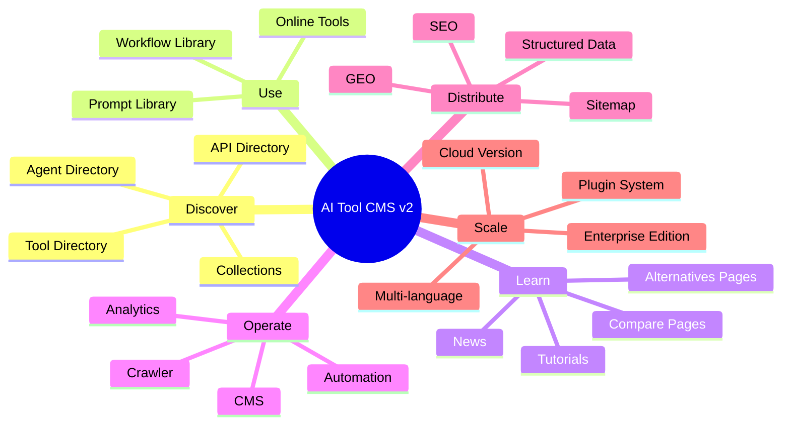
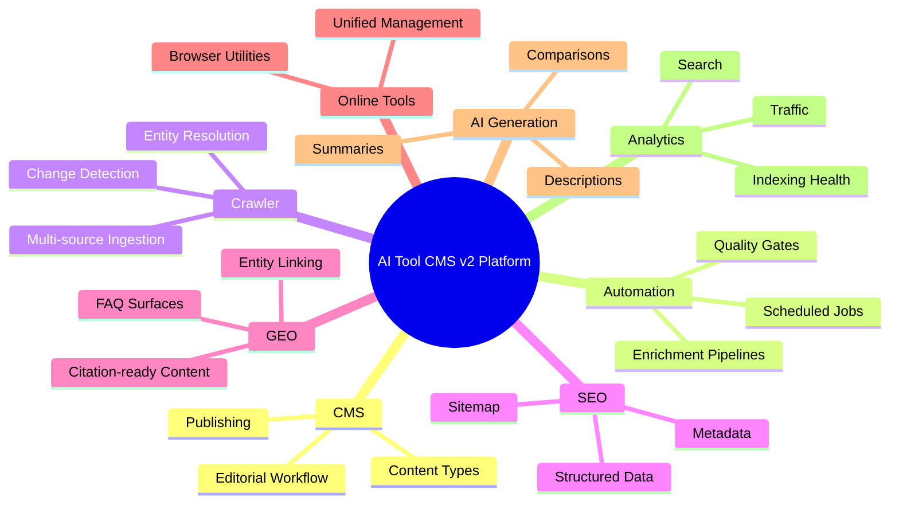

# AI Tool CMS v2 — Product Vision

> **Document Type:** Product Vision  
> **Version:** 2.0.0  
> **Status:** Draft  
> **Owner:** Project Architecture Team  
> **Last Updated:** 2026

---

## Table of Contents

1. [Vision](#vision)
2. [Mission](#mission)
3. [Core Philosophy](#core-philosophy)
4. [Product Positioning](#product-positioning)
5. [Long-term Goals](#long-term-goals)
6. [Success Metrics](#success-metrics)
7. [Future Expansion](#future-expansion)
8. [Guiding Principles](#guiding-principles)

---

# Vision

AI Tool CMS v2 is built on a simple but ambitious premise: **the AI software landscape is too large, too fast-moving, and too fragmented for humans to catalog by hand.** The long-term vision is to operate a self-sustaining AI content platform that discovers, structures, enriches, and distributes knowledge about AI products at scale—without degrading into a static link directory that goes stale within weeks.

This platform is **not** only an AI Tool Directory. Directories are useful entry points, but they are insufficient for the depth of discovery, evaluation, and usage that modern audiences expect. AI Tool CMS v2 is designed as a **complete AI Content Platform**—a unified system where content types, automation pipelines, and distribution channels work together as one coherent product surface.

The platform spans multiple content domains, each serving a distinct user intent while sharing a common data model, automation layer, and quality bar:

| Content Domain | Primary User Intent |
|---|---|
| **AI Tool Directory** | Discover and compare standalone AI products |
| **AI Online Tools** | Use lightweight utilities directly in the browser |
| **AI Prompt Library** | Find, adapt, and reuse high-quality prompts |
| **AI Agent Directory** | Explore autonomous and semi-autonomous AI agents |
| **AI API Directory** | Evaluate programmatic access, pricing, and integration paths |
| **AI Workflow Library** | Learn repeatable multi-step AI processes |
| **AI News** | Stay current on product launches, funding, and industry shifts |
| **AI Tutorials** | Learn how to apply tools effectively in real workflows |
| **AI Collections** | Browse curated sets organized by use case, role, or industry |

Together, these domains form a **living knowledge graph** about the AI ecosystem—not a snapshot, but a continuously refreshed source of truth that powers search, comparison, education, and direct utility.

### Product Vision Mindmap

### What Success Looks Like

At maturity, AI Tool CMS v2 should function as the **operating system for AI product knowledge**:

- **For visitors**, it is the fastest path from "I have a problem" to "I found the right tool, understand the trade-offs, and know how to use it."
- **For operators**, it is a CMS that mostly runs itself—ingesting signals from the open web, enriching records, publishing pages, and optimizing for discovery.
- **For the ecosystem**, it is an open, auditable, and extensible foundation that teams can fork, deploy, and adapt without vendor lock-in.

The vision rejects the idea that AI product information must be manually curated forever. Instead, it embraces **automation with editorial guardrails**: machines do the repetitive work; humans set policy, resolve ambiguity, and approve what matters.

---

# Mission

The mission of AI Tool CMS v2 is to **help people discover, evaluate, compare, and use AI products with confidence**—while ensuring the platform itself requires minimal ongoing manual maintenance.

### Helping People Make Better Decisions

The AI software market suffers from information asymmetry. Marketing pages overpromise. Feature lists go stale. Pricing changes silently. Alternatives multiply faster than any single reviewer can track. AI Tool CMS v2 exists to close that gap by providing:

- **Structured discovery** — Tools, agents, APIs, and workflows organized by intent, not just popularity.
- **Comparative context** — Side-by-side views that surface pricing models, capabilities, limitations, and fit-for-purpose signals.
- **Actionable guidance** — Tutorials, prompts, and workflows that bridge the gap between "knowing a tool exists" and "using it effectively."
- **Trust signals** — Transparent sourcing, update timestamps, and editorial policies that distinguish automated enrichment from verified claims.

### Self-Maintaining by Design

A directory that depends on heroic manual effort does not scale. The platform's mission includes **operational sustainability**:

| Manual Burden (Traditional Directories) | Automated Responsibility (AI Tool CMS v2) |
|---|---|
| Hand-add every new tool | Crawler discovers candidates from trusted sources |
| Manually update pricing pages | Scheduled refresh detects and reconciles changes |
| Rewrite descriptions for SEO | Structured templates + AI-assisted enrichment |
| Build comparison pages one by one | Entity linking generates comparison surfaces automatically |
| Maintain sitemaps and metadata | SEO/GEO layer publishes index-ready pages at scale |

The goal is not zero human involvement—it is **human involvement where judgment matters**, and automation everywhere else.

### Continuous Growth with Minimum Manual Work

Content growth should be **compounding**, not linear. Each new tool should automatically generate not one page, but a **constellation of related surfaces**: detail pages, category placements, tag associations, comparison candidates, alternative suggestions, FAQ blocks, and structured data payloads. Each crawler run should expand coverage rather than merely patching gaps.

Minimum manual work does not mean minimum quality. It means investing upfront in **architecture, documentation, and automation primitives** so that quality scales with volume instead of collapsing under it.

---

# Core Philosophy

The following principles define how AI Tool CMS v2 is conceived, built, and evolved. They are not slogans—they are decision filters. When two approaches conflict, these principles determine which path the project takes.

### Documentation First

Specifications and architecture documents precede implementation. Every module, content type, and integration boundary should be describable in prose before it is coded. Documentation is not an afterthought; it is part of the product's contract with contributors, operators, and future maintainers.

### Architecture First

Structural decisions—boundaries between apps, packages, and services—are made deliberately and early. The system favors clear module ownership over convenience shortcuts that create hidden coupling. Architecture reviews are as important as code reviews.

### Automation First

If a task repeats at scale, it belongs in a pipeline—not in a runbook. Automation covers ingestion, enrichment, publishing, SEO generation, sitemap updates, and health monitoring. Manual workflows exist as exceptions, not defaults.

### SEO First

Every public page is born indexable. Metadata, canonical URLs, structured data, sitemaps, and robots policies are not optional add-ons—they are first-class outputs of the publishing system. SEO is treated as infrastructure, not marketing.

### GEO First

Generative Engine Optimization (GEO) ensures content is structured for AI search engines—ChatGPT, Gemini, Claude, Perplexity, and successors. Pages should be citation-ready: clear entity definitions, FAQ blocks, comparison tables, and unambiguous factual statements that models can quote accurately.

### AI Native

Artificial intelligence is not a bolt-on feature. It is embedded in content generation, classification, summarization, enrichment, and quality review. AI capabilities are accessed through a unified service layer with prompt templates, model routing, and observability—not scattered ad-hoc API calls.

### API First

Every capability exposed to the web or admin UI should also be available through a documented API. Internal consumers and external integrators should share the same interfaces. GraphQL may complement REST where query flexibility justifies it, but OpenAPI-documented REST remains the baseline.

### Open Source Friendly

The project is designed for transparency, forkability, and community contribution. Modules should be separable enough that individual components could be open-sourced independently. Licensing, contribution guidelines, and governance should support long-term community health.

### Plugin Friendly

Extension points—custom crawlers, enrichers, renderers, online tools, and analytics adapters—should be first-class. Teams deploying their own instances must be able to extend behavior without modifying core code.

### Scalable

The platform must support growth from hundreds to **millions of pages** without architectural rewrites. Data models, indexing strategies, caching layers, and background job systems are chosen with an order-of-magnitude growth mindset.

### Maintainable

Long-term maintenance cost matters as much as launch velocity. Code should be readable, modules should have clear ownership, deployments should be reproducible, and operational visibility should be built in from the start—not added after an incident.

---

# Product Positioning

AI Tool CMS v2 enters a crowded landscape of AI directories, review sites, utility platforms, and marketplaces. Understanding what exists—and what is missing—is essential to articulating why this project deserves to exist as an open, enterprise-grade platform rather than yet another curated list.

### Competitive Landscape Overview

| Platform | Primary Strength | Structural Limitation |
|---|---|---|
| **Toolify** | Large AI tool catalog, SEO-heavy landing pages | Primarily a directory; limited CMS, automation, and extensibility for operators |
| **Futurepedia** | Broad discovery and newsletter-driven audience | Content model centered on listings; not a self-maintaining platform |
| **There's An AI For That** | Strong brand recognition in AI discovery | Directory-first; minimal operator tooling or open architecture |
| **AlternativeTo** | Deep alternatives and comparison semantics | General software focus; not AI-native or automation-driven |
| **Product Hunt** | Launch momentum and community signals | Event-driven, not a persistent structured catalog with SEO/GEO depth |
| **TinyWow** | Free online utilities with instant utility | Tool execution without a broader AI product knowledge graph |
| **G2** | Enterprise reviews and buyer intent data | Closed ecosystem; not designed as an open, self-hosted CMS |
| **Capterra** | Software categorization for business buyers | Review marketplace model; not built for automated AI content operations |

These platforms excel within their lanes. None of them combine **all** of the capabilities that AI Tool CMS v2 targets as a single, cohesive, operator-controlled system.

### What Makes AI Tool CMS v2 Different

AI Tool CMS v2 is not positioned as "Toolify but open source." It is an **AI Content Platform** that unifies capabilities typically found across separate products:

| Capability Layer | What It Enables |
|---|---|
| **CMS** | Operators control tools, categories, prompts, collections, news, and editorial policy from a unified admin surface |
| **Automation** | Background systems keep content fresh without proportional headcount growth |
| **Crawler** | The platform discovers and tracks the AI ecosystem proactively, not reactively |
| **SEO** | Every page ships with index-ready metadata and structured data at scale |
| **GEO** | Content is shaped for AI search citation, not just traditional search rankings |
| **Online Tools** | Visitors can act—not just read—through integrated browser-based utilities |
| **AI Generation** | Descriptions, FAQs, comparisons, and summaries are produced consistently via governed templates |
| **Analytics** | Operators measure what works: traffic, indexing, citations, and conversion paths |

### Positioning Statement

> **AI Tool CMS v2 is the open, self-maintaining AI content platform for teams who need more than a directory—a system that discovers, publishes, optimizes, and scales AI product knowledge automatically.**

This positioning targets:

- **Publishers and media teams** building AI-focused properties
- **Developer advocates and OSS communities** cataloging AI tooling
- **SEO and growth teams** needing programmatic page generation with quality controls
- **Enterprises** requiring self-hosted, auditable infrastructure instead of SaaS directory dependencies

---

# Long-term Goals

The roadmap below describes directional targets, not commitments. Numbers represent **design horizons**—the scale the architecture should support without fundamental rework.

### Year 1 — Foundation & Proof of Automation

**Theme:** Build the platform skeleton and prove that automated ingestion plus publishing works end-to-end.

| Dimension | Year 1 Target |
|---|---|
| **Tools** | 5,000 – 10,000 indexed tool records |
| **Pages** | 50,000 – 100,000 public URLs (detail, category, tag, compare, alternatives) |
| **Users** | 100,000 – 250,000 monthly active users (MAU) |
| **Languages** | 2 – 3 (English + primary localized markets) |
| **Online Tools** | 10 – 25 browser-based utilities under CMS management |

**Year 1 outcomes:**

- Core CMS, API, web, crawler, worker, and scheduler modules operational
- Automated tool ingestion from major sources (GitHub, Product Hunt, official sites, RSS)
- SEO and GEO foundations generating metadata and structured data for all page types
- Admin workflows for review, override, and editorial approval
- First production deployment with reproducible Docker-based infrastructure

### Year 2 — Scale Content & Deepen Discovery

**Theme:** Expand content types and improve discovery depth—agents, APIs, prompts, workflows, and collections.

| Dimension | Year 2 Target |
|---|---|
| **Tools** | 25,000 – 50,000 tool records |
| **Pages** | 500,000 – 1,000,000 public URLs |
| **Users** | 500,000 – 1,000,000 MAU |
| **Languages** | 5 – 8 |
| **Online Tools** | 50 – 100 integrated utilities |

**Year 2 outcomes:**

- Full content domain coverage (agents, APIs, prompts, workflows, news, tutorials)
- Hybrid search (Meilisearch + PostgreSQL full text) with relevance tuning
- AI-assisted content generation under editorial governance
- Compare and alternatives pages generated programmatically at scale
- Analytics dashboards for traffic, indexing, and crawler health

### Year 3 — Platform Maturity & Ecosystem

**Theme:** Transition from product to platform—plugins, SDK, and multi-tenant readiness.

| Dimension | Year 3 Target |
|---|---|
| **Tools** | 100,000 – 200,000 tool records |
| **Pages** | 2,000,000 – 5,000,000 public URLs |
| **Users** | 2,000,000 – 5,000,000 MAU |
| **Languages** | 10 – 15 |
| **Online Tools** | 200 – 500 utilities |

**Year 3 outcomes:**

- Plugin system for crawlers, enrichers, renderers, and online tools
- Developer SDK and documented extension API
- Enterprise edition features (SSO, audit logs, advanced RBAC, SLA tooling)
- Cloud-managed offering alongside self-hosted deployment
- AI search citation tracking and GEO optimization feedback loops

### Year 5 — Category-Defining Infrastructure

**Theme:** Become the de facto open infrastructure layer for AI product knowledge.

| Dimension | Year 5 Target |
|---|---|
| **Tools** | 500,000+ tool, agent, and API records |
| **Pages** | 10,000,000+ indexable URLs |
| **Users** | 10,000,000+ MAU across deployed instances |
| **Languages** | 20+ with automated translation pipelines |
| **Online Tools** | 1,000+ utilities across text, image, PDF, SEO, dev, and marketing categories |

**Year 5 outcomes:**

- Marketplace for community plugins, templates, and crawler packs
- AI Workflow Builder enabling visual multi-step automation design
- Browser extension and mobile app for discovery and saved collections
- Federated or multi-region deployment patterns for global operators
- Recognized citation source in major AI search engines

### Growth Trajectory Summary

| Horizon | Tools | Pages | MAU | Languages | Online Tools |
|---|---|---|---|---|---|
| **Year 1** | 5K – 10K | 50K – 100K | 100K – 250K | 2 – 3 | 10 – 25 |
| **Year 2** | 25K – 50K | 500K – 1M | 500K – 1M | 5 – 8 | 50 – 100 |
| **Year 3** | 100K – 200K | 2M – 5M | 2M – 5M | 10 – 15 | 200 – 500 |
| **Year 5** | 500K+ | 10M+ | 10M+ | 20+ | 1,000+ |

---

# Success Metrics

Progress toward the vision is measured through operational and product metrics that reflect **audience reach**, **content scale**, **automation efficiency**, and **ecosystem coverage**. These metrics guide prioritization and architectural investment.

### Primary Metrics

| Metric | Definition | Why It Matters |
|---|---|---|
| **Monthly Active Users (MAU)** | Unique visitors engaging with the platform per month | Validates discovery value and product-market fit |
| **Indexed Pages** | URLs successfully indexed by major search engines | Confirms SEO infrastructure is working at scale |
| **Organic Traffic** | Sessions arriving via unpaid search | Measures sustainable acquisition without ad dependency |
| **AI Search Citations** | References to platform content in AI-generated answers | Validates GEO strategy and content structure quality |
| **Tool Count** | Total active tool, agent, and API records | Tracks catalog breadth and crawler effectiveness |
| **Crawler Coverage** | Percentage of known ecosystem sources actively monitored | Ensures freshness and discovery completeness |
| **Publishing Automation Rate** | Share of pages published or updated without manual intervention | Core indicator of self-maintaining mission progress |

### Secondary Metrics

| Metric | Definition |
|---|---|
| **Compare / Alternatives Page Coverage** | Ratio of tools with generated comparison surfaces |
| **Content Freshness Score** | Average age of last verified update across records |
| **Online Tool Usage** | Sessions completing an in-browser utility action |
| **Prompt / Workflow Reuse Rate** | Downloads, copies, or saves of library assets |
| **Editorial Override Rate** | Percentage of AI-generated content manually edited before publish |
| **API Consumer Count** | External integrations consuming platform APIs |
| **Plugin Adoption** | Active third-party or custom plugins in deployed instances |
| **Time to Publish (New Tool)** | Median time from crawler detection to live public page |

### Metric Targets by Maturity Stage

| Stage | MAU | Indexed Pages | Automation Rate | Crawler Coverage |
|---|---|---|---|---|
| **Early (Year 1)** | 100K+ | 50K+ | ≥ 60% | ≥ 40% of target sources |
| **Growth (Year 2)** | 500K+ | 500K+ | ≥ 75% | ≥ 65% of target sources |
| **Mature (Year 3+)** | 2M+ | 2M+ | ≥ 85% | ≥ 80% of target sources |

Metrics should be reviewed quarterly. A rising tool count with falling freshness scores is a warning sign. Rising indexed pages with flat organic traffic suggests GEO and content quality issues. The platform succeeds when **scale and quality move together**.

---

# Future Expansion

The v2 architecture is designed with optional modules that can be activated as the project matures. None of these are commitments for the initial release—they represent **credible expansion paths** that the core platform should not block.

### Marketplace

A community marketplace for plugins, crawler packs, prompt templates, online tool modules, and editorial themes. Operators could install vetted extensions without forking core code. Revenue sharing models could support sustainable third-party development.

### Plugin System

Formal extension interfaces for:

- Custom data sources and crawlers
- Content enrichers and quality scorers
- Page renderers and template overrides
- Online tool runtimes
- Analytics and notification adapters

Plugins should run in isolated contexts with versioned contracts and upgrade paths.

### Developer SDK

Client libraries and CLI tooling for:

- Publishing and updating records programmatically
- Subscribing to webhooks for content change events
- Building external apps on top of the platform API
- Creating and testing plugins locally

The SDK should mirror the same APIs used internally by web and admin applications.

### Enterprise Edition

Capabilities required by large organizations:

- Single sign-on (SSO) and SCIM provisioning
- Advanced audit logging and compliance exports
- Role-based access control with custom permission sets
- Multi-workspace or multi-brand management
- Priority support and SLA tooling

Enterprise features should remain optional layers, not forks of the open core.

### Cloud Version

A managed SaaS offering for teams who prefer not to operate infrastructure. The cloud version should share the same codebase as self-hosted deployments—differences limited to billing, tenancy, and managed operations.

### AI Workflow Builder

A visual interface for designing multi-step AI workflows: chaining models, tools, and data transformations. Workflows could be published to the Workflow Library and embedded in tutorials or online tools.

### Browser Extension

Quick-access discovery from any webpage: detect mentioned tools, suggest alternatives, save to collections, and surface relevant prompts. The extension connects to the platform API for personalized state.

### Mobile App

Native or cross-platform mobile experience focused on discovery, saved collections, notifications for followed tools, and offline reading of tutorials and news.

### Expansion Roadmap Overview

| Module | Expected Phase | Dependency |
|---|---|---|
| Plugin System | Year 2 – 3 | Stable API contracts, package boundaries |
| Developer SDK | Year 2 – 3 | OpenAPI specs, authentication model |
| Enterprise Edition | Year 3+ | RBAC maturity, audit infrastructure |
| Cloud Version | Year 3+ | Multi-tenant architecture, billing |
| Marketplace | Year 3 – 5 | Plugin system, security review process |
| AI Workflow Builder | Year 3 – 5 | AI service layer, workflow data model |
| Browser Extension | Year 3 – 5 | Public API, user accounts |
| Mobile App | Year 4 – 5 | Content API stability, notification system |

---

# Guiding Principles

The following ten principles serve as the project's north star. They should be referenced during design reviews, prioritization debates, and contributor onboarding. When in doubt, align with these statements.

1. **Every feature should improve automation.** If a new capability increases manual operational burden without a clear exception path, it does not belong in the core platform.

2. **Every module should be replaceable.** Crawlers, search backends, AI providers, and storage adapters must be swappable without rewriting unrelated systems.

3. **Every API should be documented.** If it is not described in OpenAPI (or equivalent) and reachable by integrators, it is not finished.

4. **Every page should be indexable.** Public URLs ship with metadata, canonical links, and structured data—or they do not ship.

5. **Every generated content should be editable.** AI output is a draft, not immutable truth. Operators must always be able to review, override, and revert.

6. **Every background task should be observable.** Jobs expose status, logs, retries, and failure reasons. Silent failures are unacceptable at scale.

7. **Every module should support localization.** User-facing strings, URL strategies, and content models must accommodate multiple languages from the start.

8. **Every feature should support AI.** Where AI adds value—classification, summarization, enrichment—it should be accessible through the unified AI service layer, not one-off integrations.

9. **Every deployment should be reproducible.** Infrastructure is defined as code. A new environment should be bring-up-able by following documented steps without tribal knowledge.

10. **Every design should consider long-term maintenance.** Optimize for the team maintaining the system in three years, not just the team shipping the feature this sprint.

---

## Related Documents

- [Project Overview](./README.md) — Entry point for AI Tool CMS v2 documentation
- `FolderStructure.md` — Repository layout (planned)
- `docs/13-roadmap/` — Detailed implementation roadmap (planned)

---

**Document Version**

| Field | Value |
|---|---|
| Version | 2.0.0 |
| Status | Draft |
| Owner | Project Architecture Team |
| Last Updated | 2026 |
