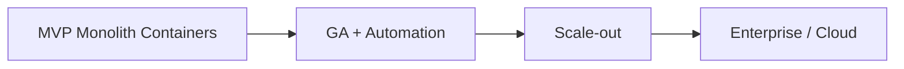

# Architecture Specification

> **Document Type:** Canonical System Architecture  
> **Version:** 2.0.0  
> **Status:** Draft  
> **Owner:** Project Architecture Team

---

## 1. System Overview

AI Tool CMS v2 is an **AI-native content platform** for cataloging, enriching, publishing, and distributing knowledge about AI software. The system serves:

| Actor | Interface |
|---|---|
| Visitors | Public Web (`apps/web`) |
| Editors / Admins | Admin (`apps/admin`) |
| Integrators | REST API (`apps/api`, `/v1/`) |
| Automation | Crawler, Worker, Scheduler |

### Mission (Architectural)

Enable a **self-sustaining catalog loop**:

```
Ingest → Enrich (AI) → Review → Publish → Index → Distribute (SEO/GEO)
```

### Architectural Style

| Attribute | Choice |
|---|---|
| **Pattern** | Modular monolith (multi-container) |
| **Repository** | pnpm + Turborepo monorepo |
| **Integration** | REST API First (`/v1/`, OpenAPI) |
| **Async** | Event-driven workers (BullMQ / Redis) |
| **Data** | Relational system of record (PostgreSQL) |
| **Search** | Derived index (Meilisearch) |

See [ADR/ADR-0001-monorepo.md](./ADR/ADR-0001-monorepo.md) through [ADR/ADR-0005-postgresql.md](./ADR/ADR-0005-postgresql.md).

---

## 2. Quality Attributes

### 2.1 Performance

| Surface | Target (p75 / p95) |
|---|---|
| Public Web LCP | < 2.5s / < 4.0s |
| API list `GET /v1/tools` | — / < 300ms |
| Search `GET /v1/search` | — / < 200ms |
| Publish API response | — / < 500ms (async side effects) |

**Tactics:** SSR/ISR, Redis cache, connection pooling, denormalized search index, pagination.

### 2.2 Scalability

| Dimension | Strategy |
|---|---|
| Catalog records | Millions; partitioned reads via search + pagination |
| Public traffic | Horizontal Web replicas behind CDN |
| API traffic | Stateless API replicas + PgBouncer |
| Background load | Independent Worker/Crawler scaling |

### 2.3 Availability

| Deployment | Expectation |
|---|---|
| Self-host (community) | Documented single-node; optional HA patterns |
| Reference production | 99.5% composite Web+API |
| Enterprise (future) | Contractual SLA |

**Tactics:** Health/readiness probes, graceful shutdown, job retries, backups.

### 2.4 Security

| Layer | Mechanism |
|---|---|
| Transport | TLS termination at reverse proxy |
| Authentication | JWT (Admin/API user), API keys (integrators) |
| Authorization | RBAC permission guards on every mutation |
| Input | DTO validation at API boundary |
| Rate limiting | Per-IP and per-key on auth and search |

See [Sequence/Authentication.md](./Sequence/Authentication.md).

### 2.5 Maintainability

- Shared TypeScript types across apps
- Prisma schema as single data contract
- ADR/RFC for cross-cutting changes
- Module boundaries enforced by dependency graph

### 2.6 Observability

| Signal | Standard |
|---|---|
| Logs | Structured JSON, `requestId` correlation |
| Metrics | Request latency, queue depth, job failures |
| Traces | Request ID propagated API → Worker |
| Health | `GET /health`, `GET /ready` |

---

## 3. System Context

External systems and users—see [ContextDiagram.md](./ContextDiagram.md).

| External System | Interaction |
|---|---|
| LLM providers (OpenAI, Claude, Gemini, OpenRouter) | Outbound HTTPS from Worker/AI package |
| Crawl sources (GitHub, PH, RSS, websites) | Outbound HTTPS from Crawler |
| CDN / DNS | Public Web asset and HTML delivery |
| S3-compatible storage | Media upload/download |
| IdP (Enterprise SSO) | SAML/OIDC (future) |

---

## 4. Containers

Deployable units—see [ContainerDiagram.md](./ContainerDiagram.md).

| Container | Technology | Stateful? |
|---|---|---|
| `web` | Next.js 15 | No |
| `admin` | Next.js 15 | No |
| `api` | NestJS | No |
| `worker` | Node + BullMQ consumer | No |
| `crawler` | Node + adapters | No |
| `scheduler` | Node + cron | No |
| PostgreSQL | RDBMS | Yes |
| Redis | Cache + queue | Yes |
| Meilisearch | Search index | Yes (rebuildable) |
| Object storage | MinIO/S3 | Yes |

---

## 5. Cross-Cutting Concerns

| Concern | Owner | Specification |
|---|---|---|
| Authentication / RBAC | `packages/auth`, `apps/api` | [Sequence/Authentication.md](./Sequence/Authentication.md) |
| SEO / structured data | `packages/seo` | [Sequence/SEO.md](./Sequence/SEO.md) |
| AI generation | `packages/ai`, `apps/worker` | [Sequence/AI.md](./Sequence/AI.md), [RFC/RFC-0003-ai-pipeline.md](./RFC/RFC-0003-ai-pipeline.md) |
| Crawling | `apps/crawler`, `packages/crawler-core` | [Sequence/Crawler.md](./Sequence/Crawler.md), [RFC/RFC-0002-crawler.md](./RFC/RFC-0002-crawler.md) |
| Logging | `packages/logger` | JSON, correlation ID |
| Configuration | `packages/config`, env | 12-factor; `.env.example` |

---

## 6. Architecture Principles

| # | Principle | Enforcement |
|---|---|---|
| 1 | Single Responsibility per module | [Modules.md](./Modules.md) |
| 2 | Dependency Inversion for infra | Packages abstract storage, AI, queue |
| 3 | API First | OpenAPI before UI for new features |
| 4 | Stateless HTTP services | Sessions in Redis |
| 5 | Event-driven side effects | [EventFlow.md](./EventFlow.md) |
| 6 | PostgreSQL authoritative | Search/cache rebuildable |
| 7 | Fail fast with structured errors | `requestId`, error codes |
| 8 | Idempotent workers | Job dedup keys |
| 9 | Human-in-the-loop for AI publish | Review queue |
| 10 | SEO/GEO as infrastructure | `@ai-tool-cms/seo` mandatory on public routes |
| 11 | No app-to-app imports | [DependencyGraph.md](./DependencyGraph.md) |
| 12 | Backward-compatible `/v1/` | Semver policy |
| 13 | Documentation before code | RFC/ADR gates |
| 14 | Least privilege RBAC | Permission per endpoint |
| 15 | Graceful search degradation | PG fallback browse |
| 16 | Immutable audit trail | Append-only `audit_events` |
| 17 | Configuration over code | Feature flags in env |
| 18 | Convention over configuration | [NamingConvention.md](../00-project/NamingConvention.md) |
| 19 | Testable domain logic | Domain services without HTTP |
| 20 | Replaceable vendors | S3-compatible, multi-LLM router |

---

## 7. Constraints

| Constraint | Source |
|---|---|
| TypeScript across stack | [TechStack.md](../00-project/TechStack.md) |
| MIT open core | Self-host without paid tier |
| Docker Compose viable | No mandatory Kubernetes |
| REST primary API | No GraphQL in v2.0 |
| No self-hosted LLM inference | Consume provider APIs |
| English-first docs | i18n content separate concern |

---

## 8. Non-Goals (Architecture)

| Non-Goal | Rationale |
|---|---|
| Microservices on day one | Ops cost > benefit at current scale |
| Shared mutable in-process state | Breaks horizontal scale |
| Web → PostgreSQL direct | Security and coupling |
| Sync LLM in request path | Latency and cost |
| Custom storage engine | PostgreSQL sufficient |
| Multi-tenant in open core | Enterprise edition |

Full list: [NonGoals.md](../00-project/NonGoals.md).

---

## 9. Evolution Roadmap

| Phase | Architecture |
|---|---|
| **v1.0 MVP** | Web + Admin + API + PG + Redis + SEO package |
| **v2.0 GA** | + Worker, Crawler, Scheduler, Meilisearch, AI |
| **v2.x scale** | Read replicas, optional service extraction |
| **Enterprise** | SSO, audit export, air-gapped deploy |
| **Cloud** | Multi-tenant, K8s, managed ops |



---

## 10. Traceability

| Feature Catalog | Architecture |
|---|---|
| `FE-API-*` | `apps/api`, [ComponentDiagram.md](./ComponentDiagram.md) |
| `FE-WEB-*` | `apps/web`, [RequestFlow.md](./RequestFlow.md) |
| `FE-CRW-*` | `apps/crawler`, [Sequence/Crawler.md](./Sequence/Crawler.md) |
| `FE-AI-*` | `packages/ai`, [Sequence/AI.md](./Sequence/AI.md) |
| `FE-SEO-*` | `packages/seo`, [Sequence/SEO.md](./Sequence/SEO.md) |

---

## Related Documents

- [DDD.md](./DDD.md) — domain model
- [Modules.md](./Modules.md) — module catalog
- [DeploymentDiagram.md](./DeploymentDiagram.md) — infrastructure topology
