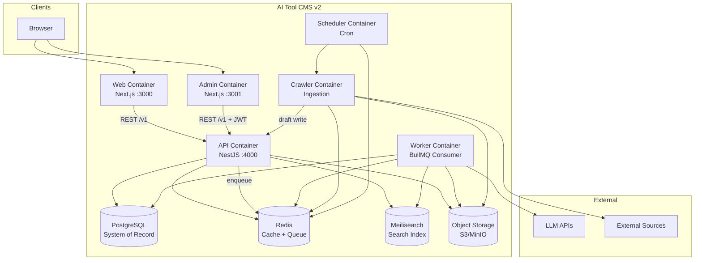

# Container Diagram (C4 Level 2)

> **Document Type:** C4 Container Diagram  
> **Version:** 2.0.0  
> **Status:** Draft

---

## Containers

A **container** is a separately deployable unit (process or data store).

---

## Container Catalog

| Container | Technology | Responsibilities |
|---|---|---|
| **Web** | Next.js 15 | SSR/ISR public pages, SEO metadata, visitor UX |
| **Admin** | Next.js 15 | Authenticated CMS, review queues, settings |
| **API** | NestJS | REST `/v1/`, auth, RBAC, OpenAPI, health |
| **Worker** | Node + BullMQ | AI jobs, reindex, webhooks, sitemap |
| **Crawler** | Node | Source fetch, normalize, draft creation |
| **Scheduler** | Node + cron | Trigger crawls, scheduled publish, sitemap refresh |
| **PostgreSQL** | PostgreSQL 15+ | Authoritative relational data |
| **Redis** | Redis 7+ | Sessions, cache, BullMQ backend |
| **Meilisearch** | Meilisearch | Full-text and faceted search |
| **Object Storage** | MinIO/S3 | Logos, screenshots, uploads |

---

## Communication Protocols

| From | To | Protocol | Sync/Async |
|---|---|---|---|
| Web | API | HTTPS REST | Sync |
| Admin | API | HTTPS REST + JWT | Sync |
| API | PostgreSQL | TCP (Prisma) | Sync |
| API | Redis | TCP | Sync |
| API | Queue | Redis protocol | Async (enqueue) |
| Worker | Queue | Redis protocol | Async (consume) |
| Integrator | API | HTTPS REST + API Key | Sync |

---

## Container Constraints

| Container | Must be stateless? | Scales horizontally? |
|---|---|---|
| Web | Yes | Yes |
| Admin | Yes | Yes |
| API | Yes | Yes |
| Worker | Yes | Yes (pool) |
| Crawler | Yes | Yes |
| Scheduler | Single leader preferred | Limited |
| PostgreSQL | No | Read replicas (future) |
| Redis | Yes (cluster optional) | Yes |
| Meilisearch | Index state | Yes |

---

## Related Documents

- [ComponentDiagram.md](./ComponentDiagram.md)
- [DeploymentDiagram.md](./DeploymentDiagram.md)
- [Modules.md](./Modules.md)
