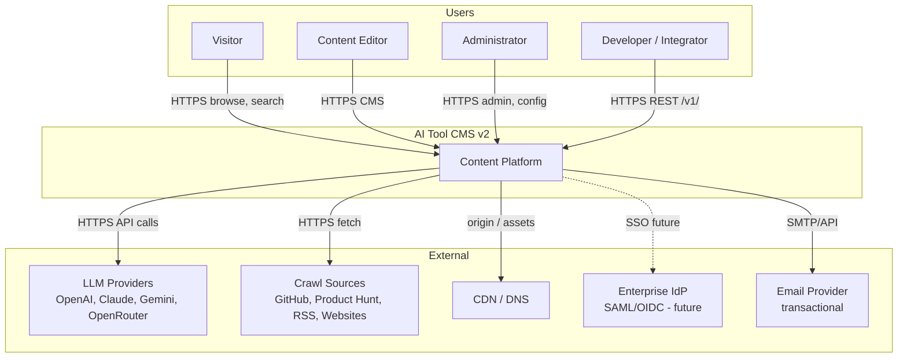

# Context Diagram (C4 Level 1)

> **Document Type:** C4 Context Diagram  
> **Version:** 2.0.0  
> **Status:** Draft

---

## System Context

AI Tool CMS v2 sits at the center of **human users**, **integrators**, and **external services**. This diagram shows trust boundaries and data flows at the highest level.

---

## Actors

| Actor | Goal | Primary Interface |
|---|---|---|
| **Visitor** | Discover and evaluate AI tools | Public Web |
| **Content Editor** | Create, edit, publish catalog content | Admin |
| **Administrator** | Users, roles, crawler, system config | Admin |
| **Developer** | Integrate via API, self-host | REST API, Docker |

---

## External Systems

| System | Direction | Protocol | Purpose |
|---|---|---|---|
| LLM Providers | Outbound | HTTPS REST | Content generation |
| Crawl Sources | Outbound | HTTPS | Tool discovery |
| CDN | Outbound/Inbound | HTTPS | Static assets, cached HTML |
| Object Storage | Outbound | S3 API | Media persistence |
| Enterprise IdP | Inbound (future) | SAML/OIDC | SSO authentication |
| Email Provider | Outbound | SMTP/HTTP | Newsletter, notifications |

---

## Trust Boundaries

| Boundary | Inside | Outside |
|---|---|---|
| **Platform** | Web, Admin, API, Workers, DB | LLM, crawl targets, CDN |
| **Auth** | JWT issued by API | IdP tokens (Enterprise) |
| **Data** | PostgreSQL (PII, content) | Public web pages (published only) |

---

## Related Documents

- [ContainerDiagram.md](./ContainerDiagram.md)
- [Architecture.md](./Architecture.md)
