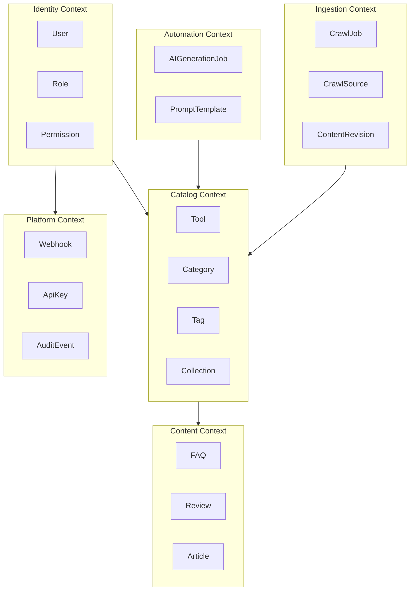
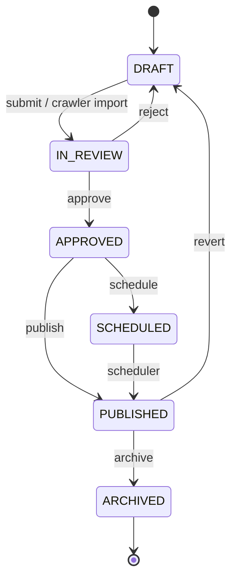

# Domain-Driven Design

> **Document Type:** Domain Architecture  
> **Version:** 2.0.0  
> **Status:** Draft  
> **Owner:** Project Architecture Team

---

## 1. Purpose

This document defines **bounded contexts**, **aggregates**, **entities**, **value objects**, **domain events**, and **invariants** for AI Tool CMS v2. Implementation must reflect these boundaries in `apps/api` domain modules and Prisma schema.

Proposal for Tool aggregate: [RFC/RFC-0001-tool-model.md](./RFC/RFC-0001-tool-model.md).

---

## 2. Bounded Contexts

| Context | Responsibility | Primary Module |
|---|---|---|
| **Catalog** | Tool directory, taxonomy, collections | `apps/api/tools`, `categories`, `tags` |
| **Content** | FAQs, reviews, articles/tutorials/news | `apps/api/content` |
| **Identity** | Users, roles, permissions, auth | `apps/api/auth`, `packages/auth` |
| **Ingestion** | Crawler jobs, drafts, revisions | `apps/crawler`, `apps/api/ingestion` |
| **Automation** | AI jobs, prompts | `packages/ai`, `apps/worker` |
| **Platform** | API keys, webhooks, audit | `apps/api/platform` |

**Integration rule:** Contexts communicate via **application services** and **domain events**—not direct cross-aggregate mutation without going through the owning aggregate root.

---

## 3. Aggregates

### 3.1 Tool (Aggregate Root)

**Context:** Catalog  
**RFC:** [RFC-0001-tool-model.md](./RFC/RFC-0001-tool-model.md)

| Entity / VO | Role |
|---|---|
| `Tool` | Root |
| `ToolCategory` | Association entity (M:N) |
| `ToolTag` | Association entity (M:N) |
| `PricingModel` | Value object (enum: FREE, FREEMIUM, PAID, CONTACT) |
| `ToolStatus` | Value object (enum: DRAFT, IN_REVIEW, PUBLISHED, ARCHIVED) |
| `SeoMetadata` | Value object (title, description, canonical) |

**Invariants:**

- `slug` unique globally
- `website` URL unique among non-archived tools
- `PUBLISHED` requires `publishedAt` and minimum SEO fields
- Only `PUBLISHED` tools visible on public API/Web
- State transitions follow defined lifecycle (see RFC-0001)

**Domain Events:**

| Event | Trigger | Consumers |
|---|---|---|
| `ToolPublished` | status → PUBLISHED | Search reindex, sitemap, webhooks |
| `ToolArchived` | status → ARCHIVED | Deindex, sitemap |
| `ToolUpdated` | meaningful field change | Conditional reindex |

---

### 3.2 Category (Aggregate Root)

| Invariant | Rule |
|---|---|
| Unique `slug` | Per category |
| Hierarchy | v2.0: flat top-level; nested deferred |
| Delete | Cannot delete if tools assigned without reassignment |

---

### 3.3 Tag (Aggregate Root)

| Invariant | Rule |
|---|---|
| Unique `slug` | Globally |
| Normalization | Lowercase slug generation on create |

---

### 3.4 User (Aggregate Root)

**Context:** Identity

| Entity | Role |
|---|---|
| `User` | Root |
| `RefreshToken` | Child (session persistence) |

**Invariants:**

- Email unique
- Password stored as hash only
- Deactivated users cannot authenticate

---

### 3.5 Role (Aggregate Root)

| Entity | Role |
|---|---|
| `Role` | Root |
| `RolePermission` | M:N to Permission |

**Invariants:**

- System roles (`admin`, `editor`) cannot be deleted
- Permission codes stable for API guards

---

### 3.6 CrawlJob (Aggregate Root)

**Context:** Ingestion  
**RFC:** [RFC/RFC-0002-crawler.md](./RFC/RFC-0002-crawler.md)

| Invariant | Rule |
|---|---|
| Status | PENDING → RUNNING → COMPLETED / FAILED |
| Source | Must reference enabled `CrawlSource` |
| Output | Creates/updates Tool in DRAFT or IN_REVIEW only—never auto-publish |

---

### 3.7 AIGenerationJob (Aggregate Root)

**Context:** Automation  
**RFC:** [RFC/RFC-0003-ai-pipeline.md](./RFC/RFC-0003-ai-pipeline.md)

| Invariant | Rule |
|---|---|
| Output | Stored as `ContentRevision` pending review |
| Provider | Routed via `packages/ai` policy |
| Failure | Retry with backoff; no partial publish |

---

## 4. Value Objects

| Value Object | Fields | Validation |
|---|---|---|
| `Slug` | string | kebab-case, unique per entity type |
| `Url` | string | HTTPS preferred, valid URL format |
| `SeoMetadata` | title, description, ogImage | length limits per SEO policy |
| `MoneyTier` | label, price, period | optional on Tool |
| `Locale` | BCP 47 code | supported locale list |

Value objects are **immutable**—changes produce new instances.

---

## 5. Domain Events Catalog

| Event | Payload (summary) | Async Handler |
|---|---|---|
| `ToolPublished` | toolId, slug, publishedAt | `worker:reindex`, `worker:sitemap`, `worker:webhook` |
| `ToolArchived` | toolId, slug | `worker:deindex`, `worker:sitemap` |
| `CrawlJobCompleted` | jobId, toolsCreated, toolsUpdated | `admin:notification` (optional) |
| `AIGenerationCompleted` | jobId, toolId, revisionId | `admin:review-queue` |
| `UserRoleChanged` | userId, roleIds | `audit:log` |

Events are persisted to queue (BullMQ)—see [EventFlow.md](./EventFlow.md).

---

## 6. Application Services (Orchestration)

| Service | Responsibility |
|---|---|
| `ToolApplicationService` | CRUD, publish, schedule, archive |
| `TaxonomyApplicationService` | Category/tag assignment |
| `IngestionApplicationService` | Apply crawler normalized payload |
| `ReviewApplicationService` | Approve/reject drafts |
| `SearchApplicationService` | Query API + index sync triggers |
| `AuthApplicationService` | Login, token issue, permission check |

Application services coordinate aggregates and emit domain events—they contain **no** HTTP or Prisma details (delegated to infrastructure).

---

## 7. Anti-Corruption Layers

| External System | ACL Location |
|---|---|
| LLM provider responses | `packages/ai` normalizes to `GeneratedContent` DTO |
| Crawl source HTML/JSON | `packages/crawler-core` → `NormalizedToolDraft` |
| Meilisearch documents | `apps/worker` indexer maps `Tool` → search document |
| S3 SDK | `packages/storage` → `MediaAsset` references |

---

## 8. Ubiquitous Language

| Term | Meaning |
|---|---|
| **Tool** | Catalog entry for an AI software product |
| **Publish** | Transition to publicly visible state |
| **Draft** | Not visible to visitors |
| **Review** | Human gate before publish |
| **Ingest** | Crawler or API bulk import |
| **Enrich** | AI-generated supplemental content |
| **Index** | Meilisearch document derived from Tool |
| **GEO** | Generative Engine Optimization structure |

---

## Related Documents

- [RFC/RFC-0001-tool-model.md](./RFC/RFC-0001-tool-model.md)
- [DataFlow.md](./DataFlow.md)
- [ComponentDiagram.md](./ComponentDiagram.md)
