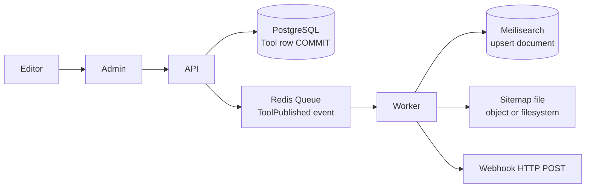
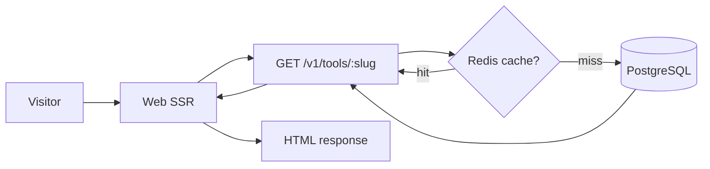
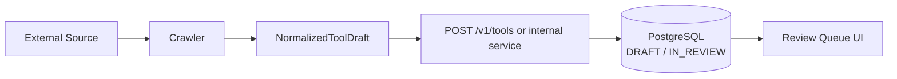
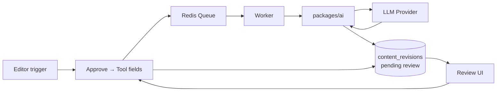

# Data Flow

> **Document Type:** Data Flow Architecture  
> **Version:** 2.0.0  
> **Status:** Draft

---

## 1. Principle

**PostgreSQL is the single source of truth.** All other stores are derived or ephemeral.

| Store | Role | Rebuildable? |
|---|---|---|
| PostgreSQL | Authoritative writes | No (backup required) |
| Redis | Cache, sessions, queues | Yes |
| Meilisearch | Search index | Yes (reindex from PG) |
| Object Storage | Binary media | Yes (if DB refs intact) |

---

## 2. Write Path (Tool Publish)

---

## 3. Read Path (Visitor Tool Page)

---

## 4. Crawl Ingestion Data Flow

No direct Crawler → PostgreSQL bypass of domain validation.

---

## 5. AI Generation Data Flow

---

## 6. Media Data Flow

| Step | Path |
|---|---|
| Upload | Admin → API → Storage (S3) → `media_assets` row in PG |
| Serve | Web → CDN URL or signed URL from API |
| Crawler logo | Crawler → Storage → link on Tool draft |

---

## 7. Search Index Sync

| Trigger | Action |
|---|---|
| `ToolPublished` | Worker upserts Meilisearch doc |
| `ToolArchived` | Worker deletes doc |
| Admin reindex | Full rebuild job scans PG → Meilisearch |
| Drift detection | Scheduled compare (future) |

**Index document fields (conceptual):** `id`, `slug`, `name`, `description`, `pricing`, `categoryIds`, `tagIds`, `status`, `publishedAt`.

---

## 8. Data Classification

| Class | Examples | Storage |
|---|---|---|
| Public content | Published tools, categories | PG + public API |
| Draft content | Unpublished tools | PG; API admin only |
| PII | User email, password hash | PG; encrypted transport |
| Secrets | API keys, LLM keys | Env / secret store |
| Operational | Job logs, audit events | PG / logs |

---

## Related Documents

- [EventFlow.md](./EventFlow.md)
- [DDD.md](./DDD.md)
- [Sequence/SEO.md](./Sequence/SEO.md)
