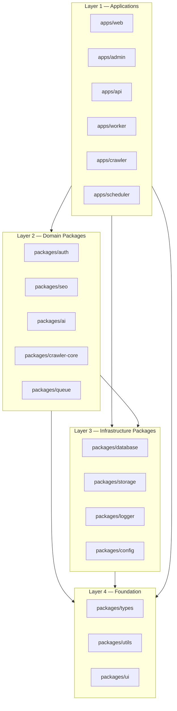
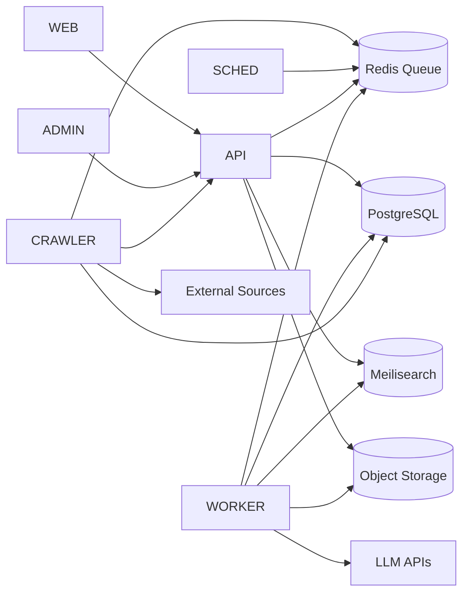

# Dependency Graph

> **Document Type:** Module Dependency Rules  
> **Version:** 2.0.0  
> **Status:** Draft  
> **Owner:** Project Architecture Team

---

## 1. Purpose

Defines **allowed** and **forbidden** dependencies between modules. Violations break buildability, deployment independence, and test isolation.

Enforcement: lint rules (planned), code review, Turborepo `dependsOn` in `turbo.json`.

---

## 2. Layer Model

---

## 3. Allowed Dependencies

### apps → packages

| App | May Import |
|---|---|
| `web` | `ui`, `seo`, `types`, `config`, `utils` |
| `admin` | `ui`, `auth`, `types`, `config`, `utils` |
| `api` | `database`, `auth`, `logger`, `queue`, `storage`, `seo`, `ai`, `types`, `config`, `utils` |
| `worker` | `database`, `queue`, `ai`, `seo`, `logger`, `storage`, `types`, `config` |
| `crawler` | `crawler-core`, `database`, `queue`, `storage`, `logger`, `types`, `config` |
| `scheduler` | `queue`, `logger`, `config`, `types` |

### apps → apps

| From | To | Allowed? |
|---|---|---|
| Any app | Any app | **Forbidden** |

Communication: **HTTP** (to API), **queue jobs**, **shared database** (only via `database` package in owning write paths).

### packages → packages

| Package | May Import |
|---|---|
| `database` | `types`, `utils` |
| `auth` | `types`, `utils` |
| `seo` | `types`, `utils` |
| `ai` | `types`, `utils`, `config`, `logger` |
| `queue` | `types`, `utils` |
| `storage` | `types`, `utils`, `config` |
| `crawler-core` | `types`, `utils` |
| `ui` | `types`, `utils` |
| `logger` | `types`, `config` |
| `config` | `types` |

**Forbidden:** `packages/*` → `apps/*` (inversion violation).

---

## 4. Forbidden Patterns

| Pattern | Reason |
|---|---|
| `web` → `database` | Bypass API; leaks persistence into presentation |
| `admin` → `database` | Same |
| `ui` → `database` | UI package must stay data-agnostic |
| `seo` → `ai` | SEO is deterministic builders; no LLM coupling |
| `crawler-core` → `database` | Crawler app owns persistence orchestration |
| Circular package imports | Build deadlock |

---

## 5. Runtime Dependency Graph

---

## 6. Build Order (Turborepo)

| Phase | Packages |
|---|---|
| 1 | `types`, `utils`, `config` |
| 2 | `logger`, `database`, `auth`, `queue`, `storage`, `seo`, `ai`, `crawler-core`, `ui` |
| 3 | `api`, `web`, `admin`, `worker`, `crawler`, `scheduler` |

`turbo.json` `dependsOn: ["^build"]` ensures topological order.

---

## 7. Dependency Matrix (Apps × Packages)

| Package | web | admin | api | worker | crawler | scheduler |
|---|---|---|---|---|---|---|
| ui | ● | ● | | | | |
| seo | ● | | ● | ● | | |
| auth | | ● | ● | | | |
| database | | | ● | ● | ● | |
| queue | | | ● | ● | ● | ● |
| ai | | | ○ | ● | | |
| crawler-core | | | | | ● | |
| storage | | | ● | ● | ● | |
| logger | | | ● | ● | ● | ● |
| types | ● | ● | ● | ● | ● | ● |
| config | ● | ● | ● | ● | ● | ● |

● = required | ○ = optional

---

## 8. Version and Workspace Policy

- All workspace packages use `workspace:*` protocol
- Single `typescript` and `eslint` version at root
- Breaking package API changes require version note in CHANGELOG

---

## Related Documents

- [Modules.md](./Modules.md)
- [ContainerDiagram.md](./ContainerDiagram.md)
- [ADR/ADR-0001-monorepo.md](./ADR/ADR-0001-monorepo.md)
