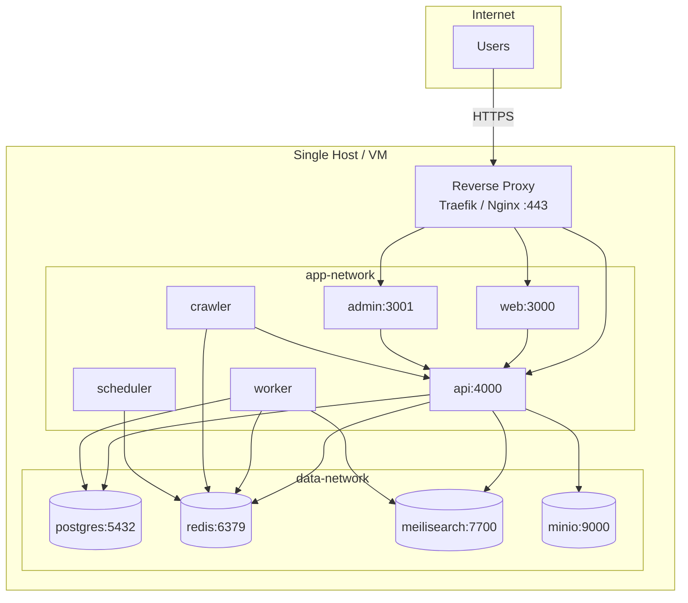
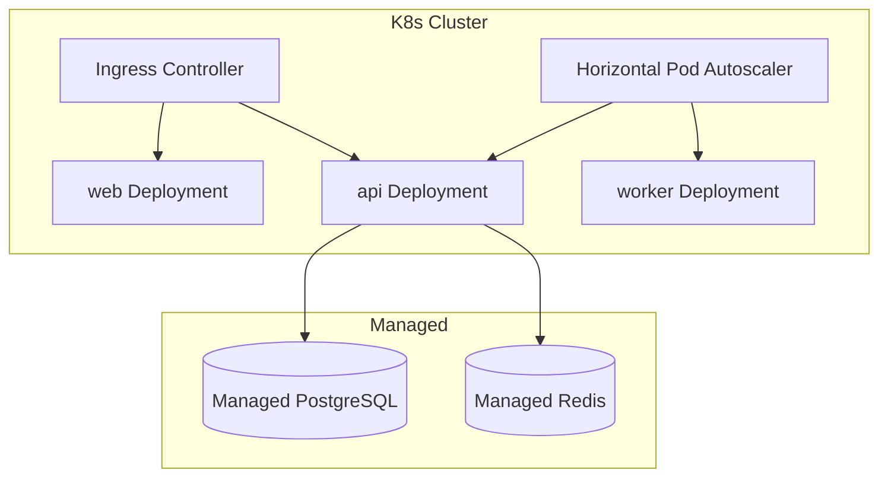

# Deployment Diagram

> **Document Type:** Deployment Architecture  
> **Version:** 2.0.0  
> **Status:** Draft

---

## 1. Reference Topology (Docker Compose)

Default self-hosted deployment for v2.0 open core.

---

## 2. Network Segmentation

| Network | Members | Exposure |
|---|---|---|
| `public` | Reverse proxy | Internet-facing |
| `app-network` | web, admin, api, workers | Internal only |
| `data-network` | postgres, redis, meilisearch, minio | Internal only; no public ports |

**Production rule:** PostgreSQL and Redis never exposed to the internet.

---

## 3. Port Mapping

| Service | Internal | External (dev) |
|---|---|---|
| web | 3000 | 3000 |
| admin | 3001 | 3001 |
| api | 4000 | 4000 |
| postgres | 5432 | 5432 (dev only) |
| redis | 6379 | 6379 (dev only) |
| meilisearch | 7700 | 7700 (dev only) |
| minio | 9000 | 9000 (dev only) |

---

## 4. Environment Configuration

| Variable Class | Examples | Storage |
|---|---|---|
| Public config | `APP_URL`, `LOCALE_DEFAULT` | `.env` |
| Secrets | `DATABASE_URL`, `JWT_SECRET`, `OPENAI_API_KEY` | Secret manager / env |
| Feature flags | `ENABLE_CRAWLER`, `AI_PROVIDER` | `.env` |

See `.env.example` at repository root.

---

## 5. Scaling Patterns

### Horizontal (stateless)

| Container | Scale trigger |
|---|---|
| web | CPU, request rate |
| api | API latency, RPS |
| worker | Queue depth |

### Vertical / dedicated

| Container | Notes |
|---|---|
| postgres | Scale up IOPS; read replicas later |
| meilisearch | RAM for index size |
| redis | Memory for queue depth |

---

## 6. Future: Kubernetes (Enterprise / Cloud)

**Constraint:** Helm charts must not be required for community self-host—Docker Compose remains supported.

---

## 7. Backup and DR

| Asset | Method | RPO target |
|---|---|---|
| PostgreSQL | `pg_dump` / WAL archive | < 24h (self-host doc) |
| Object storage | Bucket replication | Provider-dependent |
| Meilisearch | Rebuild from PostgreSQL | Full reindex acceptable |
| Redis | Ephemeral; queue loss retried | Best effort |

---

## Related Documents

- [ContainerDiagram.md](./ContainerDiagram.md)
- [DataFlow.md](./DataFlow.md)
- [ADR/ADR-0005-postgresql.md](./ADR/ADR-0005-postgresql.md)
