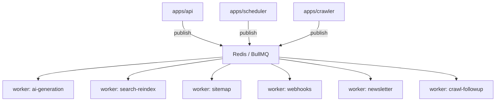

# Event Flow

> **Document Type:** Asynchronous Event Architecture  
> **Version:** 2.0.0  
> **Status:** Draft

---

## 1. Overview

Side effects that are **slow**, **retryable**, or **bursty** are handled asynchronously via **BullMQ** on **Redis**. The API publishes events after successful transactions; workers consume and execute handlers.

**Rule:** HTTP handlers must not await LLM calls, full reindex, or webhook delivery.

---

## 2. Event Bus Topology



---

## 3. Domain Events

| Event | Producer | Queue | Consumer Handler |
|---|---|---|---|
| `ToolPublished` | API (after PG commit) | `search-reindex` | Upsert Meilisearch |
| `ToolPublished` | API | `sitemap` | Regenerate sitemap XML |
| `ToolPublished` | API | `webhooks` | POST subscriber URLs |
| `ToolArchived` | API | `search-reindex` | Delete index doc |
| `AIGenerationRequested` | API / Admin | `ai-generation` | LLM call + revision |
| `CrawlJobScheduled` | Scheduler | `crawl` | Crawler run |
| `NewsletterSubscribe` | API | `newsletter` | Send confirmation |

---

## 4. Publish Event Flow

```mermaid
sequenceDiagram
    participant API as apps/api
    participant PG as PostgreSQL
    participant Q as BullMQ
    participant W as apps/worker
    participant M as Meilisearch

    API->>PG: BEGIN; UPDATE tool SET status=PUBLISHED; COMMIT
    API->>Q: add ToolPublished { toolId, slug }
    API-->>Client: 200 OK
    Q->>W: process job
    W->>M: upsert document
    W->>Q: ack job
```

**Idempotency:** Handlers use `toolId` as dedup key; safe to retry.

---

## 5. Retry and Dead Letter Policy

| Setting | Value |
|---|---|
| Max attempts | 5 |
| Backoff | Exponential, base 2s |
| Dead letter | Failed job retained in Redis + Admin UI |
| Alert | Queue depth > threshold → operator notification |

---

## 6. Scheduler-Triggered Events

| Cron | Event | Target |
|---|---|---|
| `0 */6 * * *` | `CrawlJobScheduled` | All enabled sources |
| `0 * * * *` | `SitemapRefresh` | Full or incremental |
| `* * * * *` | `ScheduledPublishCheck` | Tools with `scheduledAt <= now()` |

---

## 7. Event Payload Schema (Conceptual)

```json
{
  "eventType": "ToolPublished",
  "eventId": "uuid",
  "occurredAt": "ISO-8601",
  "payload": {
    "toolId": "uuid",
    "slug": "chatgpt"
  },
  "correlationId": "requestId"
}
```

Payloads versioned; workers ignore unknown fields.

---

## 8. Ordering Guarantees

| Guarantee | Scope |
|---|---|
| Per-tool ordering | Jobs for same `toolId` use single queue partition key (future) |
| Global ordering | Not guaranteed |
| At-least-once delivery | Yes; handlers must be idempotent |

---

## Related Documents

- [DataFlow.md](./DataFlow.md)
- [Sequence/SEO.md](./Sequence/SEO.md)
- [Sequence/AI.md](./Sequence/AI.md)
- [DDD.md](./DDD.md)
