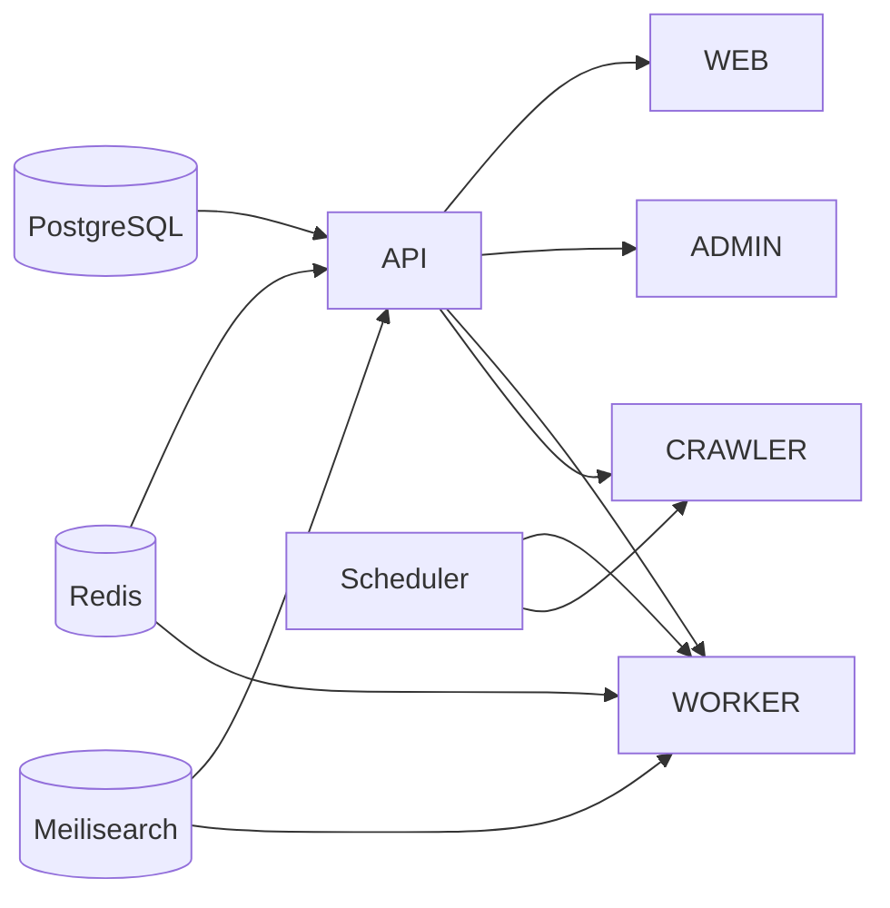

# Modules

> **Document Type:** Module Catalog  
> **Version:** 2.0.0  
> **Status:** Draft  
> **Owner:** Project Architecture Team

---

## 1. Overview

AI Tool CMS v2 is a **pnpm + Turborepo monorepo**. Modules are either **deployable applications** (`apps/`) or **shared libraries** (`packages/`).

**Rule:** `apps/*` orchestrate; `packages/*` encapsulate reusable capabilities. No `apps/*` imports another `apps/*`.

See [DependencyGraph.md](./DependencyGraph.md) and [FolderStructure.md](../00-project/FolderStructure.md).

---

## 2. Applications (`apps/`)

| Module | Port | Status | Purpose |
|---|---|---|---|
| `web` | 3000 | Implemented | Public visitor site (SSR/ISR, SEO) |
| `admin` | 3001 | Implemented | CMS dashboard (RBAC UI) |
| `api` | 4000 | Implemented | REST API, OpenAPI, auth |
| `worker` | — | Planned | BullMQ job processors |
| `crawler` | — | Planned | Multi-source ingestion |
| `scheduler` | — | Planned | Cron triggers |
| `docs` | 3002 | Planned | Documentation site (optional) |

### apps/web

| Attribute | Detail |
|---|---|
| **Stack** | Next.js 15, React 19, Tailwind |
| **Public API** | HTTP routes, pages only—no library export |
| **Depends on** | `@ai-tool-cms/seo`, `@ai-tool-cms/ui`, `@ai-tool-cms/types`, `@ai-tool-cms/config` |
| **Calls** | `apps/api` over HTTP (SSR) |
| **Features** | `FE-WEB-*` in [FeatureCatalog.md](../00-project/FeatureCatalog.md) |

**Routes (conceptual):** `/`, `/tools`, `/tools/[slug]`, `/categories`, `/tags`, `/search`, `/compare`, `/online-tools`.

---

### apps/admin

| Attribute | Detail |
|---|---|
| **Stack** | Next.js 15, shadcn/ui |
| **Depends on** | `@ai-tool-cms/ui`, `@ai-tool-cms/auth`, `@ai-tool-cms/types` |
| **Calls** | `apps/api` with JWT |
| **Features** | `FE-ADM-*` |

**Route groups:** `(dashboard)/*`, `login`, settings, review queue.

---

### apps/api

| Attribute | Detail |
|---|---|
| **Stack** | NestJS, Prisma, Swagger |
| **Public surface** | `/v1/*`, `/health`, `/docs` |
| **Depends on** | `database`, `auth`, `logger`, `queue`, `storage`, `seo`, `ai` (when used) |
| **Features** | `FE-API-*`, `FE-AUTH-*` |

**Nest modules (target):** `auth`, `tools`, `categories`, `tags`, `search`, `collections`, `content`, `media`, `webhooks`, `health`, `admin`.

---

### apps/worker

| Attribute | Detail |
|---|---|
| **Purpose** | Async job execution |
| **Queues** | `ai-generation`, `search-reindex`, `webhook-delivery`, `sitemap`, `newsletter` |
| **Depends on** | `queue`, `database`, `ai`, `seo`, `logger` |
| **Features** | `FE-WRK-*` |

---

### apps/crawler

| Attribute | Detail |
|---|---|
| **Purpose** | Fetch and normalize external sources |
| **Depends on** | `crawler-core`, `database`, `queue`, `storage` |
| **Features** | `FE-CRW-*` |

---

### apps/scheduler

| Attribute | Detail |
|---|---|
| **Purpose** | Cron: crawl schedules, sitemap refresh, scheduled publish |
| **Depends on** | `queue` |
| **Features** | `FE-SCH-*` |

---

## 3. Packages (`packages/`)

| Package | Purpose | Consumers |
|---|---|---|
| `ui` | Shared React components, shadcn primitives | web, admin |
| `config` | Env schema, site URL, feature flags | all apps |
| `database` | Prisma client, repositories | api, worker, crawler |
| `types` | Shared DTOs and enums | all apps |
| `utils` | Pure helpers | all |
| `logger` | Structured logging | api, worker, crawler |
| `auth` | JWT types, RBAC helpers, password utils | api, admin |
| `storage` | S3-compatible abstraction | api, worker, crawler |
| `queue` | BullMQ queue names, job payloads | api, worker, scheduler, crawler |
| `seo` | Metadata builders, JSON-LD, sitemap helpers | web, worker |
| `ai` | LLM provider router, prompt execution | worker, api |
| `crawler-core` | Adapters, parsers, normalization | crawler |
| `common` | Cross-cutting shared code | varies |

---

## 4. Package Public APIs

### @ai-tool-cms/seo

| Export | Responsibility |
|---|---|
| `buildToolMetadata()` | Title, description, canonical |
| `buildJsonLd()` | SoftwareApplication, FAQ, Breadcrumb |
| `SitemapBuilder` | XML sitemap generation |

### @ai-tool-cms/auth

| Export | Responsibility |
|---|---|
| `Permission` enum | RBAC codes |
| `hasPermission()` | Client/server check |
| `JwtPayload` type | Token claims |

### @ai-tool-cms/queue

| Export | Responsibility |
|---|---|
| `QueueName` | Typed queue identifiers |
| `JobPayload` types | Serialized job data |
| `enqueue*()` helpers | Producer functions |

### @ai-tool-cms/ai

| Export | Responsibility |
|---|---|
| `AiRouter` | Provider selection |
| `generate()` | Prompt + model execution |
| `AiProviderConfig` | Routing policy |

---

## 5. Module ↔ Feature Mapping

| Module | Feature IDs (sample) |
|---|---|
| web | FE-WEB-001 – FE-WEB-023 |
| admin | FE-ADM-001 – FE-ADM-017 |
| api | FE-API-001 – FE-API-015 |
| seo | FE-SEO-001 – FE-SEO-008 |
| ai | FE-AI-001 – FE-AI-004 |
| crawler | FE-CRW-001 – FE-CRW-003 |

Full index: [FeatureCatalog.md](../00-project/FeatureCatalog.md).

---

## 6. Startup Order

1. Infrastructure: PostgreSQL, Redis, Meilisearch, MinIO  
2. `api` (migrations applied)  
3. `web`, `admin`  
4. `worker`, `crawler`, `scheduler`

---

## Related Documents

- [ComponentDiagram.md](./ComponentDiagram.md)
- [DeploymentDiagram.md](./DeploymentDiagram.md)
