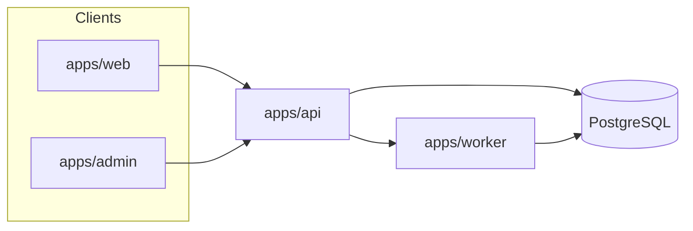

# System Architecture

> **Document Type:** Architecture Specification — Entry Point  
> **Version:** 2.0.0  
> **Status:** Draft  
> **Owner:** Project Architecture Team  
> **Last Updated:** 2026  
> **Audience:** Software Architects, Backend Engineers, Frontend Engineers, DevOps Engineers, AI Engineers, Open Source Contributors

---

## Purpose

This directory contains the **authoritative software architecture specification** for AI Tool CMS v2. These documents define system structure, boundaries, data flows, deployment topology, and decision history—not marketing summaries or aspirational sketches.

| If you need… | Read |
|---|---|
| Overall system definition and quality attributes | [Architecture.md](./Architecture.md) |
| Domain boundaries and aggregates | [DDD.md](./DDD.md) |
| App and package ownership | [Modules.md](./Modules.md) |
| C4 diagrams (context → component → deployment) | [ContextDiagram.md](./ContextDiagram.md) through [DeploymentDiagram.md](./DeploymentDiagram.md) |
| Runtime flows | [RequestFlow.md](./RequestFlow.md), [EventFlow.md](./EventFlow.md), [DataFlow.md](./DataFlow.md) |
| Interaction sequences | [Sequence/](./Sequence/) |
| Why we chose X | [ADR/](./ADR/) |
| Proposed cross-cutting changes | [RFC/](./RFC/) |

Product scope: [Scope.md](../00-project/Scope.md). Features: [FeatureCatalog.md](../00-project/FeatureCatalog.md). Technology: [TechStack.md](../00-project/TechStack.md).

**No implementation code in this tree**—only architecture contracts, diagrams, and decision records.

---

## Document Map

### Core Specification

| Document | Description |
|---|---|
| [Architecture.md](./Architecture.md) | System overview, quality attributes, architectural style, constraints |
| [DDD.md](./DDD.md) | Bounded contexts, aggregates, entities, domain events, invariants |
| [Modules.md](./Modules.md) | `apps/*` and `packages/*` responsibilities and public APIs |
| [DependencyGraph.md](./DependencyGraph.md) | Allowed dependencies, forbidden imports, build order |

### C4 Model Diagrams

| Document | C4 Level | Description |
|---|---|---|
| [ContextDiagram.md](./ContextDiagram.md) | Level 1 | System vs users and external systems |
| [ContainerDiagram.md](./ContainerDiagram.md) | Level 2 | Deployable containers and data stores |
| [ComponentDiagram.md](./ComponentDiagram.md) | Level 3 | Major components inside API and Worker |
| [DeploymentDiagram.md](./DeploymentDiagram.md) | Deployment | Nodes, networks, Docker Compose / future K8s |

### Runtime Flows

| Document | Description |
|---|---|
| [DataFlow.md](./DataFlow.md) | How data moves between stores and services |
| [RequestFlow.md](./RequestFlow.md) | Synchronous HTTP paths (visitor, admin, API client) |
| [EventFlow.md](./EventFlow.md) | Asynchronous jobs, domain events, side effects |

### Sequence Diagrams

| Document | Scenario |
|---|---|
| [Sequence/Authentication.md](./Sequence/Authentication.md) | Login, JWT refresh, API key, RBAC guard |
| [Sequence/Crawler.md](./Sequence/Crawler.md) | Scheduled crawl → draft ingestion → review |
| [Sequence/SEO.md](./Sequence/SEO.md) | Publish → sitemap → JSON-LD → index |
| [Sequence/AI.md](./Sequence/AI.md) | Generation job → provider → review → publish |

### Decision Records

| Document | Decision |
|---|---|
| [ADR/ADR-0001-monorepo.md](./ADR/ADR-0001-monorepo.md) | pnpm + Turborepo monorepo |
| [ADR/ADR-0002-nextjs.md](./ADR/ADR-0002-nextjs.md) | Next.js for Web and Admin |
| [ADR/ADR-0003-nest.md](./ADR/ADR-0003-nest.md) | NestJS for REST API |
| [ADR/ADR-0004-prisma.md](./ADR/ADR-0004-prisma.md) | Prisma ORM and migrations |
| [ADR/ADR-0005-postgresql.md](./ADR/ADR-0005-postgresql.md) | PostgreSQL as system of record |

### Requests for Comments

| Document | Proposal |
|---|---|
| [RFC/RFC-0001-tool-model.md](./RFC/RFC-0001-tool-model.md) | Canonical Tool aggregate and lifecycle |
| [RFC/RFC-0002-crawler.md](./RFC/RFC-0002-crawler.md) | Crawler engine and adapter architecture |
| [RFC/RFC-0003-ai-pipeline.md](./RFC/RFC-0003-ai-pipeline.md) | AI generation pipeline and review gates |

---

## Architectural Style

AI Tool CMS v2 is a **modular monolith** in a **pnpm + Turborepo** repository:

- Multiple **deployable containers** (`web`, `admin`, `api`, `worker`, `crawler`, `scheduler`)
- One **shared domain model** (PostgreSQL via Prisma)
- **API-first** integration surface (`/v1/`)
- **Event-driven** side effects (BullMQ on Redis)

---

## Architecture Principles (Summary)

Full list in [Architecture.md](./Architecture.md).

| Principle | Rule |
|---|---|
| API First | Business logic exposed via `/v1/` before UI-only shortcuts |
| Stateless services | No in-memory session; Redis + JWT |
| Single writer | PostgreSQL is authoritative; indexes are derived |
| Event-driven side effects | Publish, index, webhooks via queue—not HTTP chain |
| Module boundaries | `apps/*` never imports other `apps/*` |
| Documentation First | RFC/ADR before cross-cutting implementation |

---

## Reading Order

### New architect (day 1)

1. [Architecture.md](./Architecture.md)
2. [ContextDiagram.md](./ContextDiagram.md) → [ContainerDiagram.md](./ContainerDiagram.md)
3. [DDD.md](./DDD.md) → [Modules.md](./Modules.md)
4. [DependencyGraph.md](./DependencyGraph.md)

### Backend engineer

1. [ComponentDiagram.md](./ComponentDiagram.md)
2. [RequestFlow.md](./RequestFlow.md) → [EventFlow.md](./EventFlow.md)
3. [Sequence/Authentication.md](./Sequence/Authentication.md)
4. Relevant ADRs

### DevOps engineer

1. [DeploymentDiagram.md](./DeploymentDiagram.md)
2. [DataFlow.md](./DataFlow.md)
3. ADR-0001, ADR-0005

### AI / automation engineer

1. [Sequence/AI.md](./Sequence/AI.md) → [Sequence/Crawler.md](./Sequence/Crawler.md)
2. RFC-0002, RFC-0003

---

## Governance

| Change type | Required artifact |
|---|---|
| New package or app | RFC + ADR if new dependency |
| Tool model change | RFC-0001 amendment or new RFC |
| Breaking API | ADR + version bump policy |
| Infrastructure swap | ADR |

ADR numbering: `ADR-{NNNN}-{kebab}.md` — sequential, never reused.  
RFC numbering: `RFC-{NNNN}-{kebab}.md` — see [RFC/](./RFC/) for open proposals.

---

## Related Documentation

| Path | Contents |
|---|---|
| `docs/00-project/` | Vision, scope, personas, user stories, feature catalog |
| `docs/02-database/` | Detailed schema (planned) |
| `docs/03-api/` | OpenAPI reference (planned) |
| `docs/11-devops/` | Runbooks (planned) |

---

**Document Version**

| Field | Value |
|---|---|
| Version | 2.0.0 |
| Status | Draft |
| Owner | Project Architecture Team |
