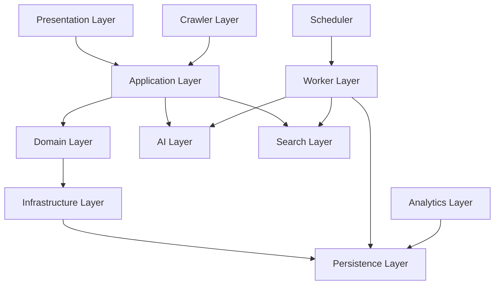
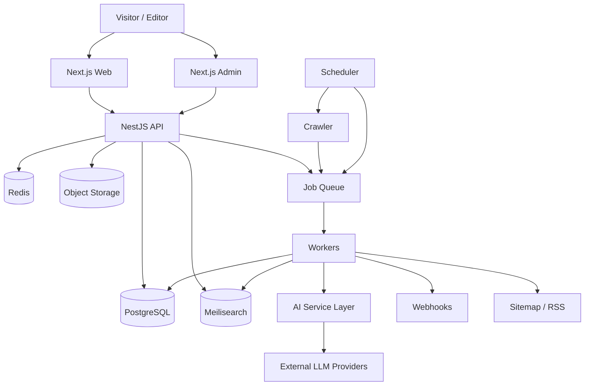
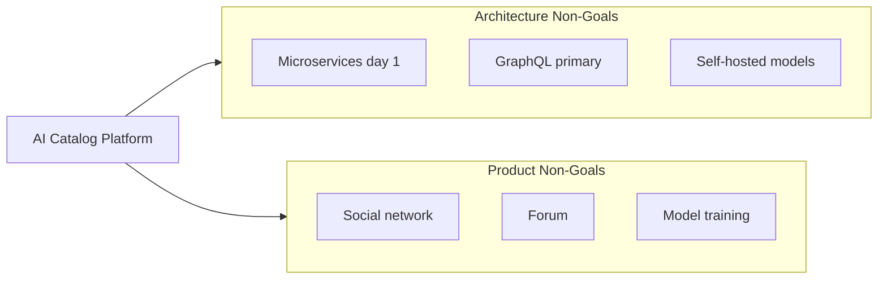
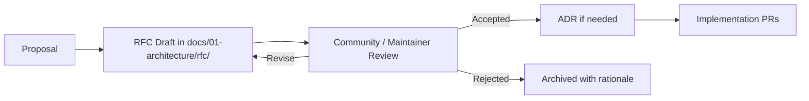
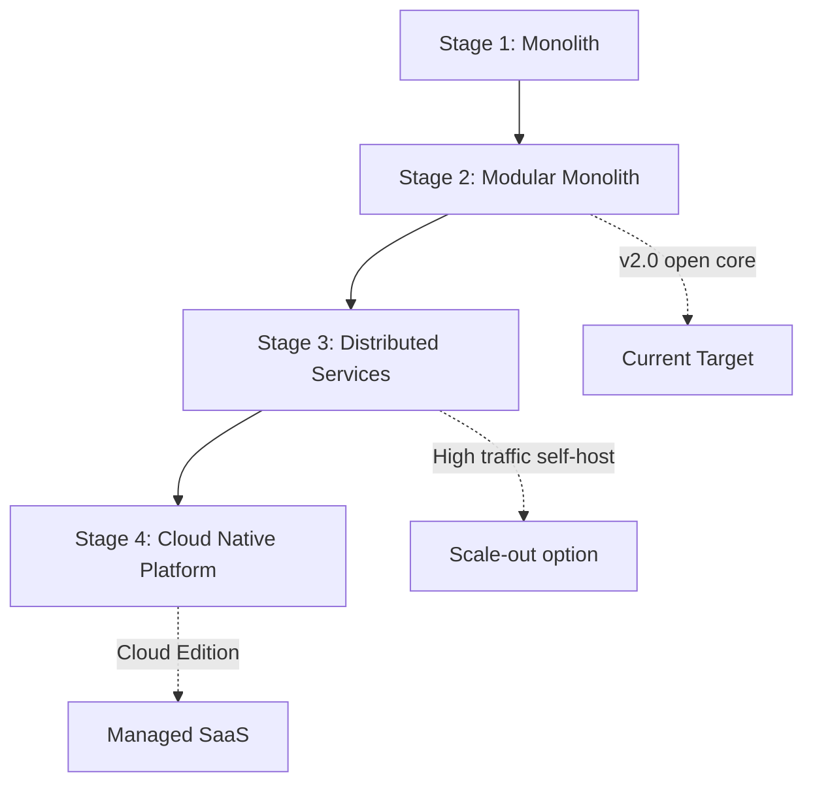
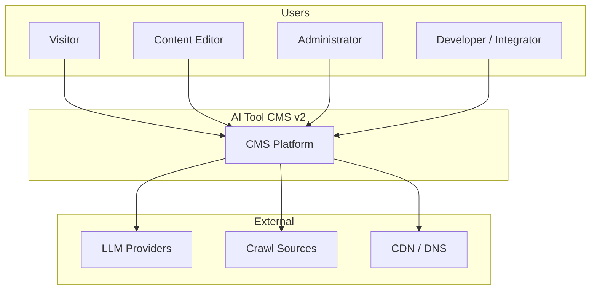
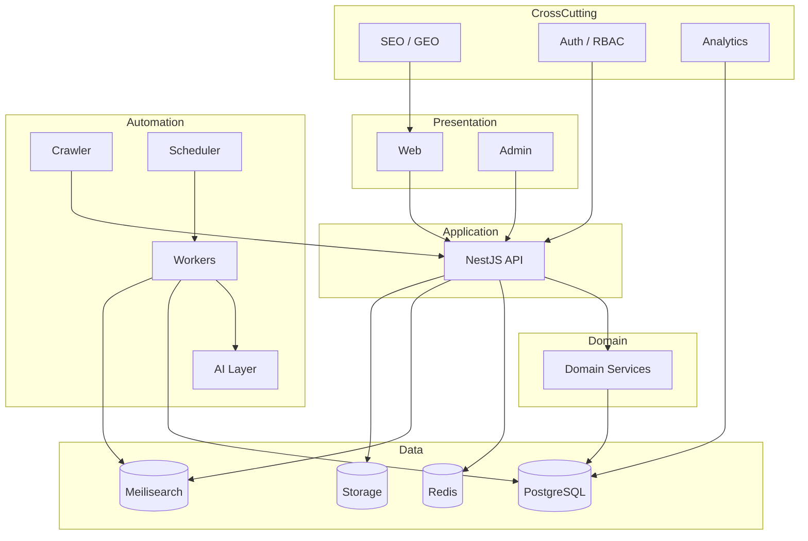
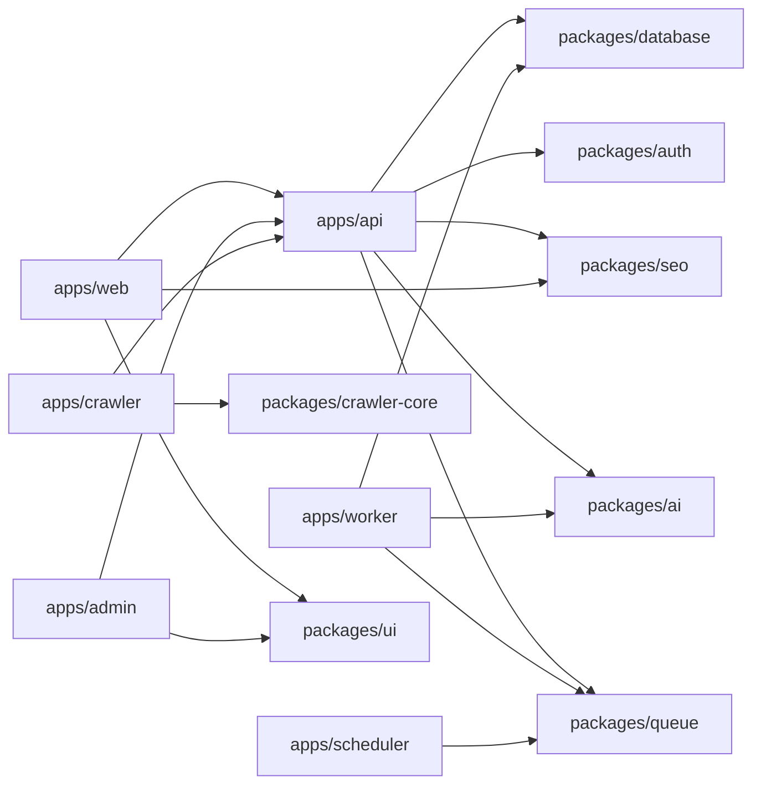
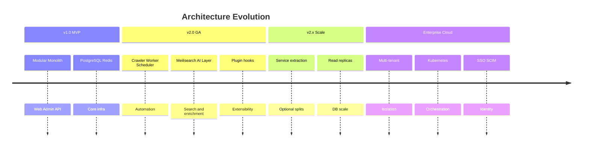
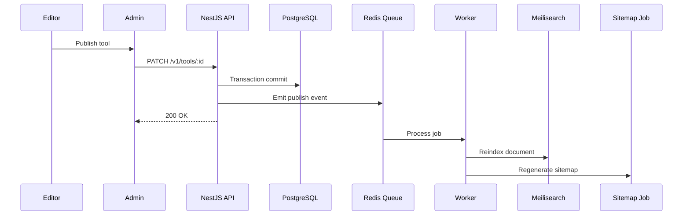

# System Architecture

> **Document Type:** Architecture Documentation Entry Point  
> **Version:** 2.0.0  
> **Status:** Draft  
> **Owner:** Project Architecture Team  
> **Last Updated:** 2026  
> **Audience:** Software Architects, Backend Engineers, Frontend Engineers, DevOps Engineers, AI Engineers, Open Source Contributors

---

## Table of Contents

1. [Purpose](#purpose)
2. [Architecture Vision](#architecture-vision)
3. [Architecture Principles](#architecture-principles)
4. [System Layers](#system-layers)
5. [Architecture Documents](#architecture-documents)
6. [High-Level Architecture](#high-level-architecture)
7. [Architecture Goals](#architecture-goals)
8. [Non-Goals](#non-goals)
9. [Decision Records](#decision-records)
10. [RFC Process](#rfc-process)
11. [Future Evolution](#future-evolution)
12. [Mermaid Diagrams](#mermaid-diagrams)
13. [Related Documents](#related-documents)

---

## Purpose

This document is the **entry point** for all architecture documentation of AI Tool CMS v2. It explains the architectural philosophy, structural layers, governing principles, and how the specialized documents under `docs/01-architecture/` fit together.

AI Tool CMS v2 is not a static directory website. It is an **AI-native content platform** designed to discover, structure, enrich, publish, and distribute knowledge about AI software at scale. Architecture exists to make that mission operable for years—by self-hosters, enterprise operators, and open source contributors—without collapsing under complexity.

| Audience | How to Use This Document |
|---|---|
| **Software Architects** | Validate design decisions against vision, principles, and layer boundaries |
| **Backend Engineers** | Understand API-first contracts, domain boundaries, and infrastructure dependencies |
| **Frontend Engineers** | See how Web and Admin relate to API, SEO, and caching layers |
| **DevOps Engineers** | Trace deployable units, observability, and scalability posture |
| **AI Engineers** | Locate AI layer isolation, provider abstraction, and automation pipelines |
| **Contributors** | Onboard to monorepo structure before reading module-specific docs |

**Architecture overview only**—no implementation code. Product scope references [Scope.md](../00-project/Scope.md); feature traceability references [FeatureCatalog.md](../00-project/FeatureCatalog.md); technology choices reference [TechStack.md](../00-project/TechStack.md).

---

## Architecture Vision

AI Tool CMS v2 is designed around ten foundational philosophies. Each philosophy is a constraint and an enabler: it rejects certain shortcuts while opening long-term paths for growth.

### AI Native

AI is not a bolt-on plugin—it is a **core platform capability**. Content generation, enrichment, classification, comparison drafting, and FAQ synthesis flow through a unified AI service layer (`@ai-tool-cms/ai`). The architecture assumes LLM calls are routine operations with cost controls, observability, human review gates, and provider failover—not exceptional scripts run by operators.

AI Native means: prompts are versioned assets, generation jobs are queued and auditable, and no AI output reaches the public web without an explicit publish transition.

### Cloud Native

Every deployable application is **containerized**, **horizontally scalable**, and **configuration-driven**. Services declare health endpoints, tolerate restarts, and externalize secrets. Docker Compose is the v2.0 baseline; Kubernetes is a supported evolution path—not a day-one requirement.

Cloud Native means: state lives in PostgreSQL, Redis, Meilisearch, and object storage—not in application memory. Processes are disposable; data is durable.

### API First

All capabilities exposed to Web, Admin, workers, crawlers, and third-party integrators flow through a **versioned REST API** (`/v1/`) documented with OpenAPI. UI is a client of the API—not a parallel source of business logic. New features ship API contracts before or alongside UI.

API First means: integrations do not require forking the monorepo; mobile clients, partner systems, and automation scripts share the same contract as the Admin dashboard.

### Event Driven

Long-running, bursty, or retryable work is **decoupled** from request/response paths. Publish events trigger sitemap regeneration, search reindexing, webhook delivery, and analytics aggregation via message queues (BullMQ on Redis). The API acknowledges quickly; workers complete asynchronously.

Event Driven means: crawlers and AI pipelines do not block HTTP threads; failures retry with backoff; operators inspect job queues instead of tailing API logs.

### Modular

The monorepo separates **deployable apps** (`apps/*`) from **shared packages** (`packages/*`). Each module has a single primary responsibility, explicit dependency rules, and a documented public surface. Plugins extend the platform without modifying core source.

Modular means: Web can scale independently of Crawler; SEO metadata builders are shared libraries—not duplicated string templates in every app.

### Scalable

Architecture supports growth from thousands to **millions** of catalog records and indexable pages. Read paths favor caching, denormalized search indexes, pagination, and SSR/ISR. Write paths batch where possible. Schema design anticipates partition strategies and read replicas—even if v2.0 runs on a single PostgreSQL instance initially.

Scalable means: performance targets are defined per layer; bottlenecks are identified by measurement, not assumption.

### Observable

Every service emits **structured logs**, **metrics**, and **distributed trace context** (request IDs propagated from API through workers). Health endpoints expose dependency status. Operators diagnose failures without SSH guesswork.

Observable means: "works on my machine" is insufficient—production behavior must be inspectable by design.

### Replaceable

Infrastructure dependencies are accessed through **abstractions**: S3-compatible storage, interchangeable LLM providers, swappable search backends. No module imports vendor SDKs directly except through package boundaries.

Replaceable means: migrating from MinIO to AWS S3, or from one LLM vendor to another, is a configuration change—not a rewrite.

### SEO First

Search engine discoverability is **infrastructure**, not marketing. Metadata, canonical URLs, robots rules, XML sitemaps, RSS feeds, and JSON-LD structured data are generated systematically via `@ai-tool-cms/seo`. Public routes are crawlable; rendering strategy (SSR/SSG/ISR) is chosen per page type for indexability and Core Web Vitals.

SEO First means: no public page ships without title, description, canonical, and applicable schema; sitemap updates are automated on publish.

### GEO First

**Generative Engine Optimization** prepares content for AI search engines (ChatGPT, Gemini, Claude, Perplexity). Architecture favors citation-ready structure: clear entity naming, FAQ blocks, comparison tables, structured headings, and schema that matches visible content—never schema spam.

GEO First means: page templates encode semantic structure; content is machine-parseable without sacrificing human readability.

### Vision Summary

| Philosophy | Primary Benefit | Primary Risk if Ignored |
|---|---|---|
| AI Native | Automated enrichment at scale | Manual catalog decay |
| Cloud Native | Predictable deploy and scale | Snowflake environments |
| API First | Integration without fork | Duplicated business logic |
| Event Driven | Resilient async pipelines | API timeouts and data loss |
| Modular | Team parallelization | Monolithic spaghetti |
| Scalable | Million-page readiness | Costly re-architecture |
| Observable | Fast incident resolution | Blind production failures |
| Replaceable | Vendor independence | Lock-in and migration pain |
| SEO First | Organic traffic growth | Invisible content |
| GEO First | AI search citations | Obsolete discovery channels |

---

## Architecture Principles

The following **24 principles** govern design decisions across all modules. When two principles conflict, document the trade-off in an ADR (see [Decision Records](#decision-records)).

| # | Principle | Description |
|---|---|---|
| 1 | **Single Responsibility** | Each module owns one primary concern. `apps/crawler` ingests; `apps/api` serves HTTP; `packages/seo` builds metadata. |
| 2 | **Dependency Inversion** | High-level modules depend on abstractions (interfaces, ports), not concrete vendors. AI, storage, and search are behind package facades. |
| 3 | **High Cohesion** | Related behavior lives together. Tool publish logic, status transitions, and audit hooks belong in the domain layer—not scattered across controllers. |
| 4 | **Low Coupling** | Modules communicate through documented APIs, events, and shared types—not direct imports across app boundaries. |
| 5 | **Stateless Services** | API and Web instances hold no session state in memory. Sessions and cache live in Redis; persistence in PostgreSQL. |
| 6 | **Event-Driven Communication** | Side effects (index, sitemap, webhooks) are asynchronous events—not synchronous chains in HTTP handlers. |
| 7 | **Immutable Data (where applicable)** | Audit logs and analytics events are append-only. Published content revisions are retained for rollback. |
| 8 | **Configuration over Code** | Feature flags, provider keys, rate limits, and environment URLs live in configuration—not hardcoded constants. |
| 9 | **Automation First** | Prefer scheduled jobs and workers over manual operator procedures. Document manual runbooks only when automation is unsafe. |
| 10 | **Convention over Configuration** | REST paths, table names, and folder layout follow [NamingConvention.md](../00-project/NamingConvention.md) defaults to reduce decision fatigue. |
| 11 | **Documentation First** | Architecture and API specs precede implementation. Undocumented modules are incomplete. |
| 12 | **API First Delivery** | Ship OpenAPI contract and integration tests before UI polish for new capabilities. |
| 13 | **Fail Fast, Fail Loud** | Validate at boundaries. Return structured errors with request IDs. Do not swallow exceptions in workers. |
| 14 | **Defense in Depth** | Authentication, authorization, input validation, and rate limiting are layered—not single checkpoints. |
| 15 | **Idempotency** | Crawler imports, webhook deliveries, and index jobs must tolerate retries without duplicate side effects. |
| 16 | **Backward Compatibility** | Minor releases preserve `/v1/` contracts. Breaking changes require major version and migration guide. |
| 17 | **Schema as Source of Truth** | Prisma schema drives database structure, migrations, and generated types. No manual drift. |
| 18 | **Separation of Read and Write (selective)** | Hot read paths may use denormalized search indexes and caches; writes go through authoritative PostgreSQL. |
| 19 | **Progressive Enhancement** | Public Web functions without JavaScript for core content; enhanced UX loads progressively. |
| 20 | **Least Privilege** | API keys, roles, and service accounts receive minimum required scopes. |
| 21 | **Explicit Boundaries** | `apps/*` never import other `apps/*`. Shared code lives in `packages/*`. |
| 22 | **Testability** | Domain logic is unit-testable without booting HTTP servers or databases where possible. |
| 23 | **Graceful Degradation** | If Meilisearch is unavailable, browse and category paths still work; search shows degraded state—not 500 errors. |
| 24 | **Human-in-the-Loop for AI** | AI-generated content requires review or publish gate unless explicitly classified as low-risk automation. |

### Principle Application by Layer

| Layer | Top Principles Applied |
|---|---|
| Presentation (Web, Admin) | Progressive Enhancement, SEO First, Stateless Services |
| Application (API) | API First, Fail Fast, Defense in Depth |
| Domain | Single Responsibility, High Cohesion, Human-in-the-Loop |
| Infrastructure | Replaceable, Configuration over Code, Observable |
| Workers | Event-Driven, Idempotency, Automation First |

---

## System Layers

AI Tool CMS v2 organizes runtime responsibilities into **logical layers**. Layers are not always separate deployables—some coexist in one process—but the separation enforces thinking about dependencies and test boundaries.

### Presentation Layer

**Owner:** `apps/web`, `apps/admin`, `packages/ui`

Renders HTML and client interfaces for visitors and operators. Web prioritizes SSR/SSG/ISR for SEO; Admin prioritizes authenticated dashboard UX. Both consume the REST API and shared UI primitives.

| Responsibility | Technology |
|---|---|
| Public tool directory, detail, search UI | Next.js 15 (App Router) |
| Admin CMS, RBAC-gated screens | Next.js 15 + shadcn/ui |
| Shared components and design tokens | `@ai-tool-cms/ui` |

**Depends on:** Application Layer (API), SEO package for metadata components.

---

### Application Layer

**Owner:** `apps/api`

Orchestrates HTTP requests: authentication, authorization, validation, DTO mapping, and delegation to domain services. Controllers are thin; business rules do not live in route handlers.

| Responsibility | Technology |
|---|---|
| REST API `/v1/*` | NestJS |
| OpenAPI documentation | Swagger / `@nestjs/swagger` |
| Request validation | class-validator, shared DTOs |

**Depends on:** Domain Layer, Infrastructure Layer (via dependency injection).

---

### Domain Layer

**Owner:** Domain modules within `apps/api` and shared `packages/*`

Encapsulates business rules: tool lifecycle (draft → review → publish), taxonomy invariants, permission checks, content revision policy. Framework-agnostic where possible.

| Core Aggregates | Rules Examples |
|---|---|
| Tool | Unique slug; publish requires valid SEO fields |
| Category / Tag | Unique slugs; no orphan cycles |
| User / Role | RBAC permission matrix |
| CrawlJob | Source-specific rate limits; dedup by URL |

**Depends on:** Persistence Layer through repository interfaces—not raw SQL in controllers.

---

### Infrastructure Layer

**Owner:** `packages/database`, `packages/storage`, `packages/queue`, `packages/logger`, `packages/config`

Provides technical capabilities to domain and application layers: database clients, object storage, message queues, structured logging, and environment configuration.

| Component | Role |
|---|---|
| `@ai-tool-cms/database` | Prisma client, connection pooling |
| `@ai-tool-cms/storage` | S3-compatible upload/download |
| `@ai-tool-cms/queue` | BullMQ queue definitions |
| `@ai-tool-cms/logger` | JSON structured logs |

**Depends on:** External services (PostgreSQL, Redis, MinIO/S3).

---

### Persistence Layer

**Owner:** `prisma/`, PostgreSQL

Authoritative **source of truth** for catalog content, users, roles, jobs metadata, and audit events. Migrations are version-controlled; seeds bootstrap development.

| Store | Data Characteristics |
|---|---|
| PostgreSQL | Relational, ACID, authoritative writes |
| Redis | Ephemeral cache, sessions, queue backing |
| Meilisearch | Denormalized search index (derived) |
| Object Storage | Binary media (logos, screenshots) |

**Principle:** PostgreSQL is always authoritative; indexes and caches are rebuildable.

---

### AI Layer

**Owner:** `packages/ai`, AI workers in `apps/worker`

Unified abstraction over LLM providers with routing, retries, token accounting, and prompt template resolution.

| Capability | Flow |
|---|---|
| Description generation | Worker → AI package → provider API |
| FAQ / compare drafts | Prompt template → generation → review queue |
| Provider failover | Config-driven routing policy |

**Depends on:** External LLM APIs (OpenAI, Claude, Gemini, OpenRouter, etc.). Does **not** host or train models.

---

### Crawler Layer

**Owner:** `apps/crawler`, `packages/crawler-core`

Ingests external sources (Product Hunt, GitHub, RSS, vendor sites), normalizes payloads, and creates or updates **draft** tool records.

| Concern | Approach |
|---|---|
| Source adapters | Plugin-ready adapter interface |
| Rate limiting | Per-source throttling |
| Deduplication | Canonical website URL matching |

**Depends on:** API or direct DB write path for drafts; Worker queue for job execution.

---

### Search Layer

**Owner:** Search integration (Meilisearch), `apps/worker` reindex jobs

Full-text and faceted discovery across tools and content. Index documents are denormalized from PostgreSQL; reindex triggered on publish and on admin demand.

| Path | Behavior |
|---|---|
| Public search | `GET /v1/search` → Meilisearch |
| Browse fallback | PostgreSQL pagination when index stale |

**Depends on:** Persistence Layer for source data; Worker for async reindex.

---

### Background Worker Layer

**Owner:** `apps/worker`, `packages/queue`

Processes queued jobs: AI generation, webhook delivery, search reindex, media processing, newsletter sends.

| Property | Requirement |
|---|---|
| Retry policy | Exponential backoff with max attempts |
| Dead letter | Failed jobs visible in Admin monitor |
| Idempotency | Safe replays |

**Depends on:** Redis (BullMQ), PostgreSQL, AI Layer, Search Layer.

---

### Analytics Layer

**Owner:** Analytics module (planned `packages/analytics` or API submodule)

Aggregates page views, search queries, outbound clicks, and indexing health for Admin dashboards.

| Event Type | Storage |
|---|---|
| Page view | `analytics_events` table or time-series store |
| Search query | Aggregated rollups |

**Depends on:** Web tracking hooks, API ingestion endpoints, Persistence Layer.

---

### Layer Dependency Rule



**Rule:** Presentation never talks directly to PostgreSQL or Meilisearch. Crawler never bypasses domain validation rules.

---

## Architecture Documents

The `docs/01-architecture/` directory contains specialized documents. Each extends this overview with depth appropriate to its topic. Documents marked **Planned** are specified here; create them before implementing the corresponding module.

| Document | Status | Description |
|---|---|---|
| [Architecture.md](./Architecture.md) | Planned | Canonical system context diagram, container diagram (C4 Level 2), and runtime interaction narratives |
| [Monorepo.md](./Monorepo.md) | Planned | pnpm workspace, Turborepo pipelines, package dependency graph, build order |
| [DDD.md](./DDD.md) | Planned | Domain-Driven Design: bounded contexts, aggregates, entities, value objects, domain events |
| [Modules.md](./Modules.md) | Planned | Per-module responsibilities for every `apps/*` and `packages/*` entry |
| [API.md](./API.md) | Planned | REST design standards, versioning, auth, error model, pagination—extends `docs/03-api` |
| [Database.md](./Database.md) | Planned | ERD, table design, indexing strategy, migration policy—extends `docs/02-database` |
| [Search.md](./Search.md) | Planned | Meilisearch index schema, ranking rules, reindex strategy, fallback behavior |
| [Cache.md](./Cache.md) | Planned | Redis usage patterns: session, rate limit, query cache, cache invalidation on publish |
| [Queue.md](./Queue.md) | Planned | BullMQ queue topology, job types, retry/DLQ policy, concurrency tuning |
| [Crawler.md](./Crawler.md) | Planned | Crawler engine, adapter contract, source configuration, normalization pipeline |
| [Worker.md](./Worker.md) | Planned | Worker processes, job handlers, idempotency keys, observability |
| [Scheduler.md](./Scheduler.md) | Planned | Cron definitions, scheduled crawl, sitemap refresh, publish scheduling |
| [AI.md](./AI.md) | Planned | Provider abstraction, prompt management, cost controls, safety filters |
| [SEO.md](./SEO.md) | Planned | Metadata pipeline, sitemap, robots, JSON-LD types—aligns with `packages/seo` |
| [GEO.md](./GEO.md) | Planned | Generative engine optimization templates, entity linking, citation structure |
| [Storage.md](./Storage.md) | Planned | Object storage abstraction, media lifecycle, CDN integration |
| [Deployment.md](./Deployment.md) | Planned | Docker Compose, production topology, env configuration—aligns with `docs/11-devops` |
| [Monitoring.md](./Monitoring.md) | Planned | Logs, metrics, traces, alerting, SLO definitions |
| [Security.md](./Security.md) | Planned | Threat model, auth flows, RBAC matrix, secrets management |
| [Scalability.md](./Scalability.md) | Planned | Horizontal scaling, read replicas, caching tiers, million-page strategy |

### Reading Order for New Architects

1. **This document** — vision, layers, goals
2. [Architecture.md](./Architecture.md) — containers and interactions
3. [Monorepo.md](./Monorepo.md) + [Modules.md](./Modules.md) — code organization
4. [DDD.md](./DDD.md) + [Database.md](./Database.md) — domain and data
5. [API.md](./API.md) — integration contract
6. Topic docs (Search, Queue, Crawler, AI, SEO) as needed for your workstream

### Cross-References to Other Doc Trees

| Path | Contents |
|---|---|
| `docs/00-project/` | Product vision, scope, personas, user stories, feature catalog |
| `docs/02-database/` | Detailed schema specs (planned) |
| `docs/03-api/` | OpenAPI specs and endpoint reference (planned) |
| `docs/11-devops/` | Runbooks and CI/CD (planned) |

---

## High-Level Architecture

At runtime, AI Tool CMS v2 forms a **pipeline** from visitor request through API and data stores to background automation and external AI providers.

### Request Flow (Visitor)

1. Visitor requests a public URL on **Next.js Web**
2. Web fetches data from **NestJS API** (SSR) or serves cached ISR page
3. API reads authoritative data from **PostgreSQL**
4. API may read **Redis** cache for hot keys
5. Search queries route to **Meilisearch**
6. Media URLs resolve to **S3-compatible storage**
7. On content publish, API enqueues events to **Redis/BullMQ**
8. **Workers** process jobs: reindex, sitemap, webhooks, AI generation
9. **AI Layer** calls external **LLM providers** when generation jobs run
10. **Scheduler** triggers periodic crawls and maintenance jobs

### Deployable Units

| Unit | Role | Default Port |
|---|---|---|
| `apps/web` | Public website | 3000 |
| `apps/admin` | Admin CMS | 3001 |
| `apps/api` | REST API | 4000 |
| `apps/worker` | Job processor | — |
| `apps/crawler` | Ingestion service | — |
| `apps/scheduler` | Cron orchestrator | — |

### Infrastructure Services

| Service | Role |
|---|---|
| PostgreSQL | Primary database |
| Redis | Cache, sessions, queues |
| Meilisearch | Full-text search |
| MinIO / S3 | Object storage |

### High-Level Topology



### Admin and Integration Flow

Editors authenticate via Admin → API → JWT. Mutations write to PostgreSQL and emit domain events. Workers react asynchronously. Third-party integrators call the same API with API keys—no special internal paths.

---

## Architecture Goals

Architecture decisions are evaluated against six quality attributes. Each has measurable targets defined in [TechStack.md](../00-project/TechStack.md) and [Scalability.md](./Scalability.md) (planned).

### Performance

| Target Area | Goal |
|---|---|
| Public Web LCP | < 2.5s on reference hardware (p75) |
| API list endpoints | p95 < 300ms at nominal load |
| Search queries | p95 < 200ms via Meilisearch |
| Worker throughput | Crawl and index jobs complete within defined SLAs |

**Strategies:** SSR/ISR, Redis caching, denormalized search index, pagination, image optimization, connection pooling.

### Scalability

| Dimension | Approach |
|---|---|
| Catalog size | Millions of tools and pages via pagination, indexing, ISR |
| Traffic | Horizontal scaling of stateless Web and API replicas |
| Background load | Worker pool scaling independent of API |
| Storage | Object storage for media; DB growth via indexing and archival policy |

### Availability

| Tier | Target |
|---|---|
| Self-hosted (community) | Best-effort; documented HA patterns |
| Production reference | 99.5%+ for Web + API composite |
| Enterprise (future) | Contractual SLA with redundant topology |

**Strategies:** Health checks, graceful shutdown, retry policies, database backups, zero-downtime migrations where feasible.

### Reliability

Data integrity is non-negotiable. Publish operations are transactional. Queue jobs are idempotent. Failed AI or crawl jobs surface in Admin—not silent drops.

| Mechanism | Purpose |
|---|---|
| ACID transactions | Consistent publish state |
| Job retries | Transient failure recovery |
| Audit log | Trace sensitive mutations |
| Content revisions | Rollback capability |

### Maintainability

| Practice | Benefit |
|---|---|
| Monorepo with shared types | Refactor safety across apps |
| ADRs and RFCs | Decision traceability |
| Modular packages | Isolated testing and ownership |
| Documentation First | Reduced onboarding time |

### Extensibility

| Extension Point | Version |
|---|---|
| REST API + OpenAPI | MVP |
| Plugin manifest (crawler, online tools) | GA |
| Webhooks | GA |
| SDK / marketplace | v3+ |

Plugins load through documented hooks—core remains fork-free for operators.

### Goals Summary Table

| Goal | Primary Layers | Key Metric |
|---|---|---|
| Performance | Presentation, API, Search | LCP, API p95 |
| Scalability | All | Records, RPS, worker lag |
| Availability | Ops, API, Web | Uptime, health check pass rate |
| Reliability | Domain, Persistence, Worker | Data loss incidents, job success rate |
| Maintainability | All | Time-to-onboard, defect density |
| Extensibility | API, Plugin | Integration count without core changes |

---

## Non-Goals

Architecture intentionally **avoids** certain patterns that conflict with mission focus or operational reality. Full product non-goals are in [NonGoals.md](../00-project/NonGoals.md); architectural non-goals include:

| Non-Goal | Rationale |
|---|---|
| **Microservices on day one** | Operational overhead exceeds team size; modular monolith first |
| **GraphQL as primary API** | REST + OpenAPI is v2.0 standard; GraphQL adds complexity without clear win |
| **Self-hosted LLM inference** | Platform consumes provider APIs; does not operate GPU fleets |
| **Custom database engine** | PostgreSQL is sufficient; no reinventing storage |
| **Synchronous AI in request path** | LLM latency blocks UX; generation is async |
| **Shared mutable state in app memory** | Breaks horizontal scale |
| **Direct DB access from Web** | Violates API First and security boundaries |
| **Tight vendor coupling** | SDK imports only through abstraction packages |
| **Schema-less content core** | Tool catalog requires structured schema for SEO and automation |
| **Multi-tenant in open core** | Tenancy is Enterprise/Cloud edition concern |
| **Built-in message broker beyond Redis** | Kafka/RabbitMQ deferred until proven necessary |
| **Mandatory Kubernetes** | Docker Compose must remain viable for self-hosters |

### Architecture vs Product Non-Goals



When a proposal touches a non-goal, reject it or route to plugin, enterprise edition, or external system integration.

---

## Decision Records

Every significant architecture decision is captured as an **Architecture Decision Record (ADR)**. ADRs provide historical context: why a choice was made, what alternatives were considered, and what consequences follow.

### ADR Location

```
docs/01-architecture/adr/
├── ADR-0001-monorepo-turborepo.md
├── ADR-0002-rest-api-versioning.md
├── ADR-0003-postgresql-primary-store.md
└── ...
```

### ADR Numbering

| Format | `ADR-{NNNN}-{short-kebab-title}.md` |
|---|---|
| **Sequence** | Zero-padded four digits: `0001`, `0002`, … |
| **Immutable ID** | Number never reused; superseded ADRs link forward |
| **Status** | Proposed → Accepted → Deprecated → Superseded |

### ADR Template (Summary)

Each ADR contains: **Title**, **Status**, **Date**, **Context**, **Decision**, **Consequences**, **Alternatives Considered**.

### When to Write an ADR

| Trigger | Example |
|---|---|
| New infrastructure dependency | Adopt Meilisearch over PG full-text |
| Breaking API change | Introduce `/v2/` |
| Security model change | API key scope redesign |
| Major library adoption | NestJS, Prisma, BullMQ |
| Rejected alternative worth documenting | Why not GraphQL primary |

### Seed ADR Index (Planned)

| ID | Title | Status |
|---|---|---|
| ADR-0001 | Adopt pnpm + Turborepo monorepo | Accepted |
| ADR-0002 | REST `/v1/` as primary integration API | Accepted |
| ADR-0003 | PostgreSQL as authoritative data store | Accepted |
| ADR-0004 | Meilisearch for full-text search | Accepted |
| ADR-0005 | BullMQ on Redis for job queues | Accepted |
| ADR-0006 | Next.js App Router for Web and Admin | Accepted |
| ADR-0007 | Prisma as ORM and migration tool | Accepted |
| ADR-0008 | AI provider abstraction package | Accepted |
| ADR-0009 | SEO as shared package not per-app logic | Accepted |
| ADR-0010 | Human review gate for AI-generated publish | Accepted |

---

## RFC Process

Larger changes—new modules, cross-cutting refactors, protocol changes—require a **Request for Comments (RFC)** before implementation.

### When RFC Is Required

| Change Size | Process |
|---|---|
| Single-module bug fix | PR only |
| New API endpoint (additive) | PR + OpenAPI update |
| New deployable app or package | RFC required |
| Breaking API or schema change | RFC + ADR required |
| New external dependency (DB, broker) | RFC + ADR required |

### RFC Workflow



### RFC Document Structure

| Section | Content |
|---|---|
| **Summary** | One paragraph problem and proposal |
| **Motivation** | User/business/technical drivers |
| **Detailed Design** | Modules affected, APIs, data model changes |
| **Drawbacks** | Cost, complexity, migration pain |
| **Alternatives** | Options considered |
| **Rollout Plan** | Phases, feature flags, migration |
| **Unresolved Questions** | Open items for discussion |

### RFC Numbering

`RFC-{NNNN}-{short-title}.md` — same sequential discipline as ADRs. RFCs live in `docs/01-architecture/rfc/`.

### RFC Lifecycle States

| State | Meaning |
|---|---|
| **Draft** | Author iterating; not ready for review |
| **Review** | Open for comment (GitHub Discussion or PR) |
| **Accepted** | Approved for implementation |
| **Implemented** | Merged and released |
| **Withdrawn** | Rejected or abandoned with documented reason |

---

## Future Evolution

Architecture evolves deliberately through documented stages—not accidental complexity accumulation.

### Evolution Stages

| Stage | Characteristics | AI Tool CMS v2 Position |
|---|---|---|
| **Monolith** | Single deployable, shared database | Early MVP experiments only |
| **Modular Monolith** | Separate apps, shared packages, single repo | **Current v2.0 target** |
| **Distributed Services** | Independent deploy, async boundaries hardened | v2.x+ as scale demands |
| **Cloud Native Platform** | K8s, service mesh, multi-region, managed ops | Enterprise / Cloud edition |

### Evolution Path



### Stage 2 — Modular Monolith (Current)

- Multiple `apps/*` processes, one monorepo
- PostgreSQL single primary; Redis and Meilisearch as specialized stores
- API remains integration hub
- Workers scale horizontally

### Stage 3 — Distributed Services (Future)

Triggers: sustained API/worker load beyond single-cluster comfort, team ownership per service, independent release cadence needs.

| Candidate Split | Condition |
|---|---|
| Crawler as isolated service | Crawl load impacts API SLOs |
| Search as managed sidecar | Custom ranking pipelines |
| AI worker pool | GPU-adjacent scheduling (still external LLM) |

**Constraint:** API contract stability preserved; splits are deployment concerns—not integration rewrites.

### Stage 4 — Cloud Native Platform (Future)

- Kubernetes Helm charts or operator
- Multi-region read replicas
- Managed tenant isolation (Cloud Edition)
- GitOps deployment pipelines

Open core **must remain deployable via Docker Compose** even as Cloud Edition advances.

### Migration Principles Between Stages

1. Extract only after measured pain—not speculation
2. Maintain backward-compatible APIs across splits
3. Document each transition in ADR
4. Never require Kubernetes for basic self-hosting

---

## Mermaid Diagrams

### Architecture Overview (C4 Context — Simplified)



### Layer Diagram



### Dependency Diagram (Apps and Packages)



**Forbidden:** `apps/web` → `apps/admin`, `apps/*` → `apps/*` (direct import). Use API or shared packages.

### Future Evolution Diagram



### Data Flow on Publish



---

## Related Documents

| Document | Relationship |
|---|---|
| [Vision.md](../00-project/Vision.md) | Product vision aligned with architecture mission |
| [Scope.md](../00-project/Scope.md) | In-scope modules and delivery phases |
| [FeatureCatalog.md](../00-project/FeatureCatalog.md) | Feature IDs mapped to modules (`FE-*`) |
| [TechStack.md](../00-project/TechStack.md) | Technology choices supporting this architecture |
| [FolderStructure.md](../00-project/FolderStructure.md) | Repository layout implementing layers |
| [CodingStandards.md](../00-project/CodingStandards.md) | Implementation conventions |
| [ReleaseStrategy.md](../00-project/ReleaseStrategy.md) | How architecture ships in releases |

---

**Document Version**

| Field | Value |
|---|---|
| Version | 2.0.0 |
| Status | Draft |
| Owner | Project Architecture Team |
| Last Updated | 2026 |
