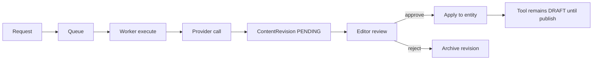

# RFC-0003: AI Generation Pipeline and Review Gates

> **Status:** Accepted  
> **Authors:** Project Architecture Team  
> **Created:** 2026

---

## Summary

Define the **AI content pipeline**: job types, provider routing, prompt templates, revision storage, human review, and explicit prohibition of auto-publish from LLM output.

---

## Motivation

AI generation is core to the product vision ([Vision.md](../../00-project/Vision.md)) but unconstrained LLM output risks:

- Factual errors on public catalog
- SEO/GEO penalties for low-quality or misleading content
- Uncontrolled API cost

Architecture must enforce **human-in-the-loop** by default.

---

## Detailed Design

### Job Types

| Job Type | Output | Target field |
|---|---|---|
| `GENERATE_DESCRIPTION` | Markdown description | `tool.description` |
| `GENERATE_SUMMARY` | Short text | `tool.summary` |
| `GENERATE_FAQ` | Faq[] | `faqs` table |
| `GENERATE_COMPARE` | Article body | compare page content |
| `GENERATE_ALTERNATIVES` | Article body | alternatives page |

### Pipeline Stages

### AIGenerationJob Entity

| Field | Purpose |
|---|---|
| `id` | UUID |
| `toolId` | Target |
| `jobType` | Enum |
| `status` | PENDING, RUNNING, COMPLETED, FAILED |
| `provider` | Resolved provider |
| `model` | Resolved model |
| `tokenUsage` | Cost tracking |
| `revisionId` | Output link |

### Provider Router (`packages/ai`)

| Config | Source |
|---|---|
| `defaultProvider` | Admin settings |
| `fallbackProviders[]` | Ordered list |
| `maxTokensPerJob` | Cost guard |
| `disabledProviders[]` | Kill switch |

### Safety Filters

- PII regex scrubbing on output
- Max length enforcement
- Optional moderation API hook (future)

---

## Drawbacks

- Human review limits fully autonomous operation
- Multi-provider routing adds config complexity
- Token costs require monitoring

---

## Alternatives Considered

| Alternative | Rejected because |
|---|---|
| Sync LLM in API handler | Latency, timeout, cost spikes |
| Auto-publish high-confidence output | Trust and SEO risk |
| Single provider lock-in | Vendor risk |

---

## Rollout Plan

1. `packages/ai` with OpenAI adapter only
2. `AIGenerationJob` + `ContentRevision` schema
3. Worker handler for `GENERATE_DESCRIPTION`
4. Admin review UI
5. Additional job types and providers
6. Cost dashboard in analytics

---

## Unresolved Questions

- Batch generation for backfill — separate low-priority queue
- Locale-aware generation — pass `locale` in job payload v2.1

---

## Related

- [Sequence/AI.md](../Sequence/AI.md)
- [ADR/ADR-0003-nest.md](../ADR/ADR-0003-nest.md) (API triggers only)
- Feature IDs FE-AI-*, US-ED-010
