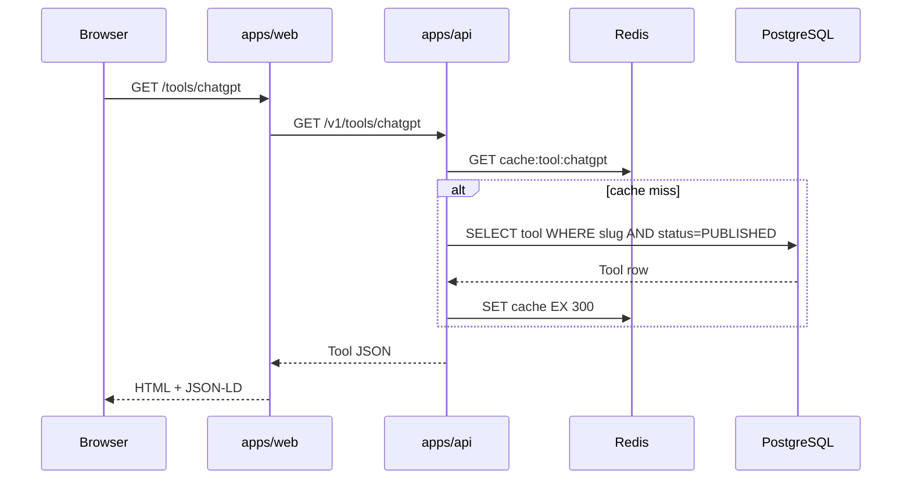
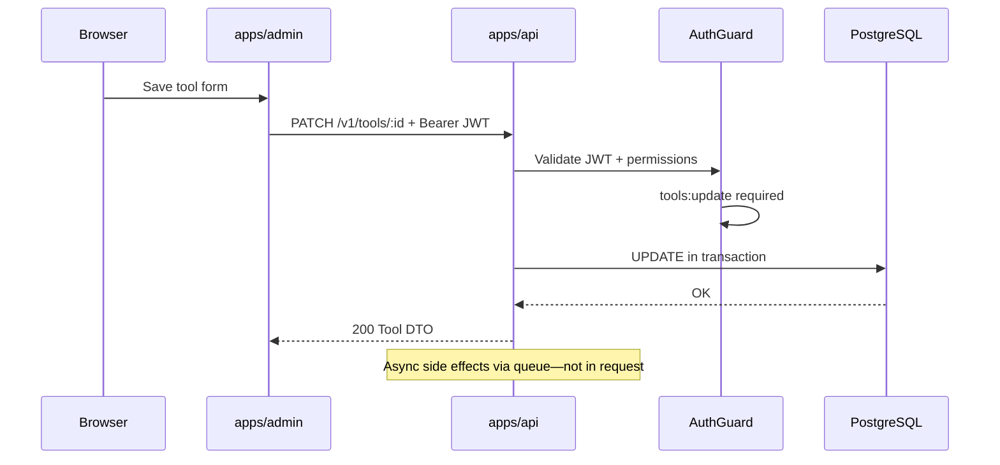

# Request Flow

> **Document Type:** Synchronous Request Architecture  
> **Version:** 2.0.0  
> **Status:** Draft

---

## 1. Overview

Synchronous flows use **HTTPS REST** between clients and `apps/api`. No client talks directly to PostgreSQL or Meilisearch (except API as proxy for search).

---

## 2. Visitor Page Request (SSR)

**Latency budget:** Web TTFB dominated by API + SSR; target p95 < 800ms.

---

## 3. Admin Mutation Request

---

## 4. Public API Client (Integrator)

| Step | Detail |
|---|---|
| Auth | `Authorization: Bearer <api_key_or_jwt>` |
| List | `GET /v1/tools?status=PUBLISHED&page=1&limit=20` |
| Create | `POST /v1/tools` requires `tools:create` |
| Errors | JSON `{ error, code, requestId, details? }` |

See [Sequence/Authentication.md](./Sequence/Authentication.md).

---

## 5. Search Request

**Fallback:** If Meilisearch unhealthy, API returns `503` with `SEARCH_UNAVAILABLE` or degrades to `GET /v1/tools?search=` PG fallback (policy per deployment).

---

## 6. Health Check Request

| Endpoint | Checks |
|---|---|
| `GET /health` | Process alive |
| `GET /ready` | PostgreSQL, Redis, Meilisearch connectivity |

Used by Docker `HEALTHCHECK` and load balancers.

---

## 7. Request Middleware Chain (API)

| Order | Middleware |
|---|---|
| 1 | Request ID generation |
| 2 | Structured logging |
| 3 | Rate limit (auth routes) |
| 4 | CORS |
| 5 | JWT / API key auth (protected routes) |
| 6 | RBAC guard |
| 7 | Validation pipe (DTO) |
| 8 | Controller handler |

---

## 8. Error Response Contract

| HTTP | When |
|---|---|
| 400 | Validation failure |
| 401 | Missing/invalid auth |
| 403 | Insufficient permission |
| 404 | Resource not found |
| 409 | Conflict (duplicate slug) |
| 429 | Rate limited |
| 500 | Unexpected server error |

All include `requestId` for log correlation.

---

## Related Documents

- [Sequence/Authentication.md](./Sequence/Authentication.md)
- [DataFlow.md](./DataFlow.md)
- [ComponentDiagram.md](./ComponentDiagram.md)
