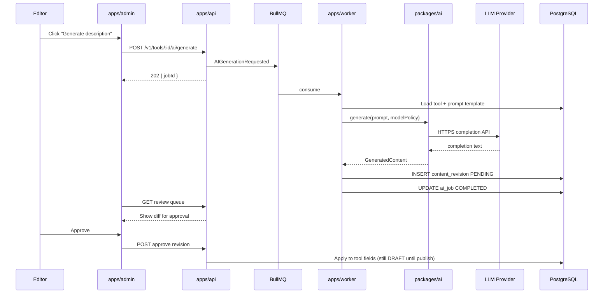
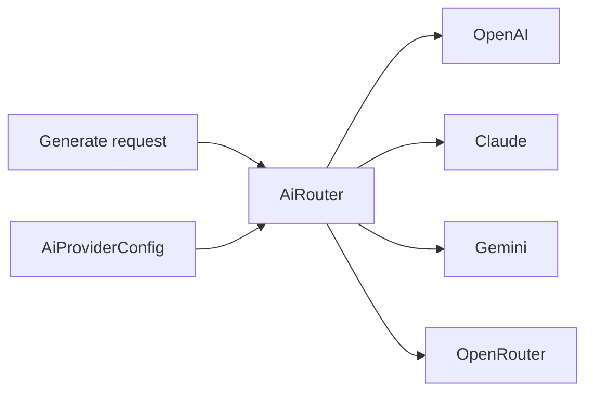
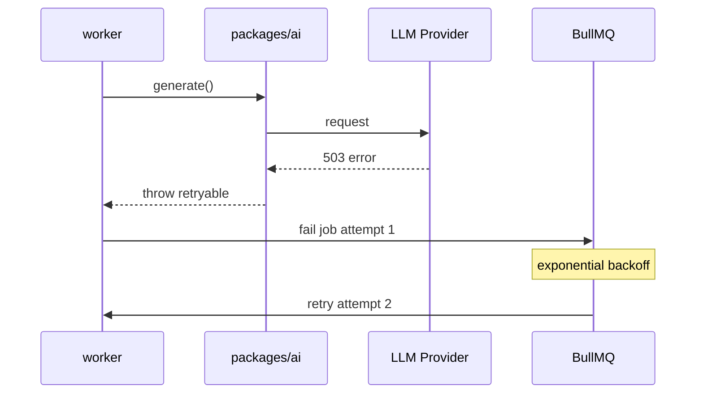

# Sequence: AI Pipeline

> **Document Type:** Interaction Sequence  
> **Version:** 2.0.0  
> **Status:** Draft

---

## 1. AI Content Generation (Happy Path)

---

## 2. Provider Routing

| Policy | Behavior |
|---|---|
| Default model | From Admin settings |
| Failover | Try secondary provider on 5xx |
| Disable provider | Admin toggle skips provider |

---

## 3. Prompt Template Resolution

| Input | Source |
|---|---|
| System prompt | `prompt_templates` table |
| Tool context | name, website, category, existing fields |
| Output schema | JSON or markdown per job type |

---

## 4. Human Review Gate

**Architecture rule:** No worker path may set `Tool.status = PUBLISHED` from AI output alone.

| Step | Actor |
|---|---|
| Generate | Worker (automated) |
| Review | Editor (human) |
| Publish | Editor explicit action |

See [RFC/RFC-0003-ai-pipeline.md](../RFC/RFC-0003-ai-pipeline.md).

---

## 5. Failure and Retry

| Failure type | Action |
|---|---|
| Rate limit 429 | Backoff per provider headers |
| Content policy violation | Fail job; no retry; log |
| Invalid JSON output | Retry up to N with repair prompt |
| Max attempts exceeded | Dead letter + Admin alert |

---

## 6. Cost and Observability

| Metric | Logged |
|---|---|
| `provider` | per job |
| `model` | per job |
| `inputTokens` / `outputTokens` | per job |
| `latencyMs` | per job |
| `estimatedCost` | optional |

---

## Related Documents

- [RFC/RFC-0003-ai-pipeline.md](../RFC/RFC-0003-ai-pipeline.md)
- [EventFlow.md](../EventFlow.md)
- [DDD.md](../DDD.md) — Automation context
