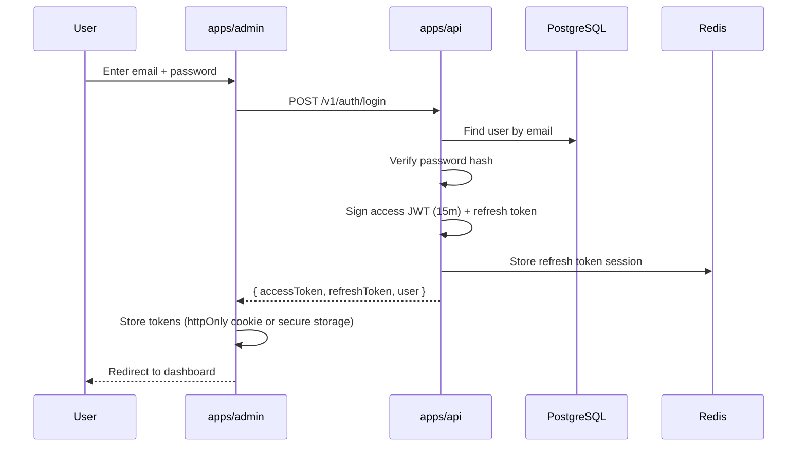
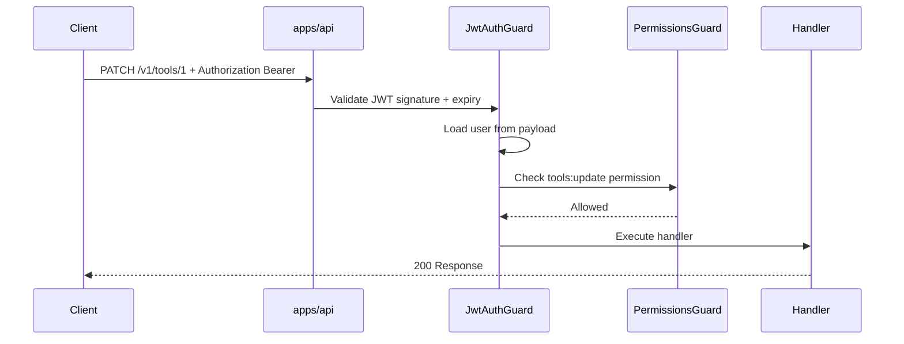
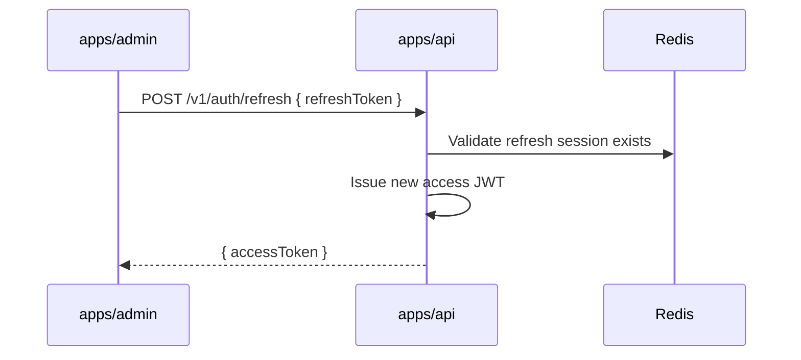
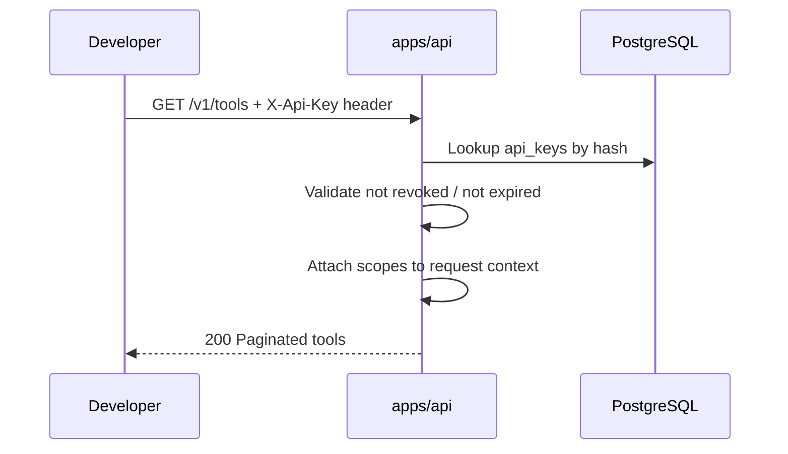

# Sequence: Authentication

> **Document Type:** Interaction Sequence  
> **Version:** 2.0.0  
> **Status:** Draft

---

## 1. Admin Login (JWT)

---

## 2. Authenticated API Request

---

## 3. Token Refresh

---

## 4. API Key Authentication (Integrator)

---

## 5. RBAC Permission Matrix (Conceptual)

| Permission | admin | editor | viewer |
|---|---|---|---|
| `tools:create` | ● | ● | |
| `tools:update` | ● | ● | |
| `tools:publish` | ● | ● | |
| `tools:delete` | ● | | |
| `users:manage` | ● | | |
| `roles:manage` | ● | | |
| `crawler:run` | ● | | |
| `settings:manage` | ● | | |

● = granted

---

## 6. Security Controls

| Control | Implementation |
|---|---|
| Password storage | bcrypt or argon2 via `packages/auth` |
| JWT secret | `JWT_SECRET` env, rotation documented |
| Refresh token | Stored server-side in Redis; revocable |
| API key | Stored as hash; plaintext shown once on create |
| Rate limit | `POST /v1/auth/login` per IP |

---

## 7. Failure Scenarios

| Condition | Response |
|---|---|
| Invalid credentials | 401 `INVALID_CREDENTIALS` |
| Expired JWT | 401 `TOKEN_EXPIRED` → client refresh |
| Missing permission | 403 `FORBIDDEN` |
| Revoked API key | 401 `API_KEY_REVOKED` |

---

## Related Documents

- [RequestFlow.md](./RequestFlow.md)
- [DDD.md](./DDD.md) — Identity context
- [ADR/ADR-0003-nest.md](./ADR/ADR-0003-nest.md)
