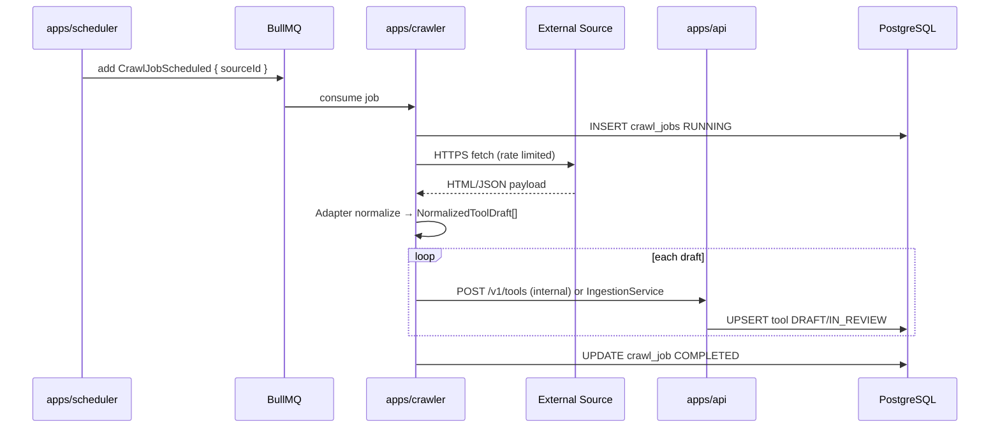
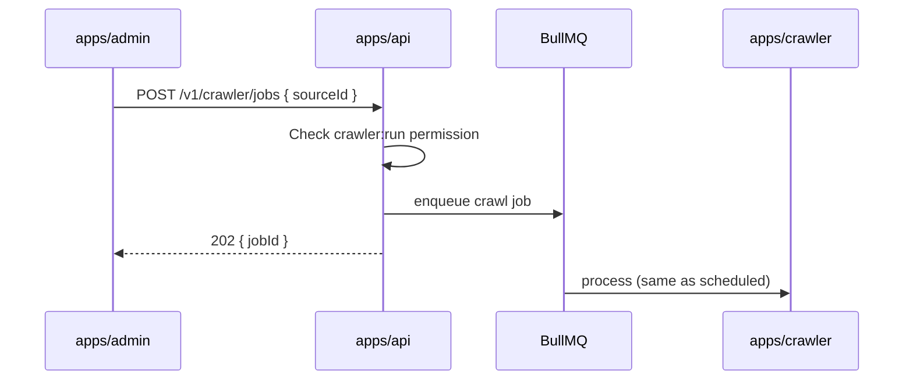
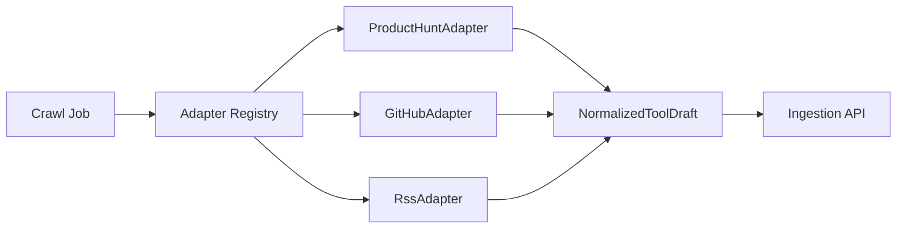
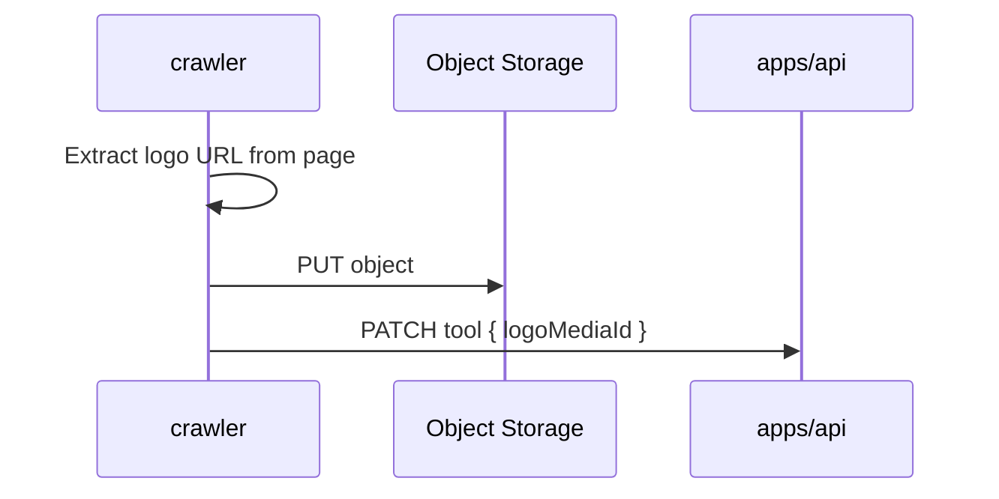

# Sequence: Crawler

> **Document Type:** Interaction Sequence  
> **Version:** 2.0.0  
> **Status:** Draft

---

## 1. Scheduled Crawl

**Invariant:** Crawler never sets `status=PUBLISHED`.

---

## 2. Manual Crawl (Admin)

---

## 3. Adapter Plugin Flow

See [RFC/RFC-0002-crawler.md](../RFC/RFC-0002-crawler.md).

---

## 4. Deduplication

| Key | Rule |
|---|---|
| `website` URL | Canonical host + path; update existing draft |
| `slug` | Generated from name; conflict → suffix |
| Source ID | Stored on tool for traceability |

---

## 5. Error Handling

| Failure | Behavior |
|---|---|
| HTTP 429 from source | Backoff, retry job |
| Parse error | Log + skip record; job partial success |
| Total failure | Job FAILED; visible in Admin monitor |
| robots.txt disallow | Respect; skip source |

---

## 6. Media Download (Logo)

---

## Related Documents

- [RFC/RFC-0002-crawler.md](../RFC/RFC-0002-crawler.md)
- [DataFlow.md](../DataFlow.md)
- [EventFlow.md](../EventFlow.md)
