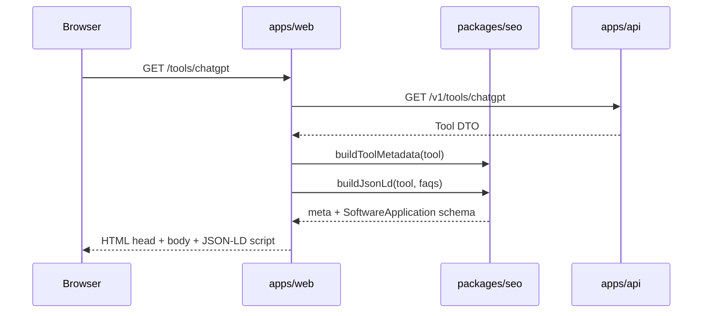
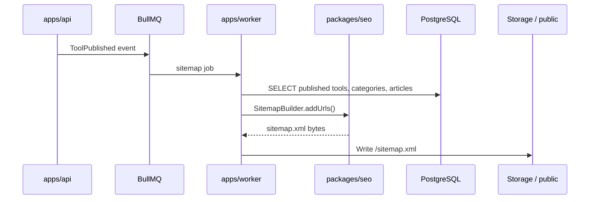
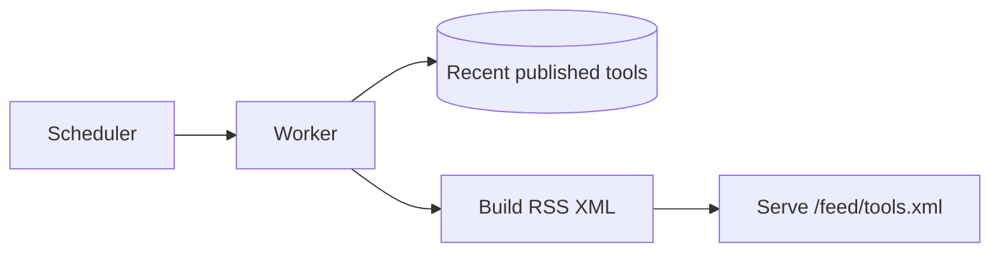

# Sequence: SEO

> **Document Type:** Interaction Sequence  
> **Version:** 2.0.0  
> **Status:** Draft

---

## 1. Page Render (SSR Metadata)

---

## 2. Publish → Sitemap Update

---

## 3. robots.txt and Canonical

| Asset | Owner | Rule |
|---|---|---|
| `robots.txt` | `apps/web` route | Allow public; disallow `/admin` paths |
| Canonical URL | `packages/seo` | `APP_URL + path`; no duplicate params |
| hreflang | `packages/seo` | Per locale routes when i18n enabled |

---

## 4. Structured Data Types

| Page Type | JSON-LD Type |
|---|---|
| Tool detail | `SoftwareApplication` |
| FAQ block | `FAQPage` |
| Breadcrumbs | `BreadcrumbList` |
| Organization | `WebSite` on homepage |

**Policy:** JSON-LD must match visible content—no schema spam ([NonGoals.md](../../00-project/NonGoals.md)).

---

## 5. RSS Feed Generation

---

## 6. SEO Validation Checklist (Publish Gate)

| Check | Block publish? |
|---|---|
| `metaTitle` present | Yes (configurable) |
| `metaDescription` length 50–160 | Warn |
| `slug` valid kebab-case | Yes |
| `canonical` resolvable | Yes |
| Logo alt text | Warn |

---

## Related Documents

- [EventFlow.md](../EventFlow.md)
- [DataFlow.md](../DataFlow.md)
- [ADR/ADR-0002-nextjs.md](../ADR/ADR-0002-nextjs.md)
