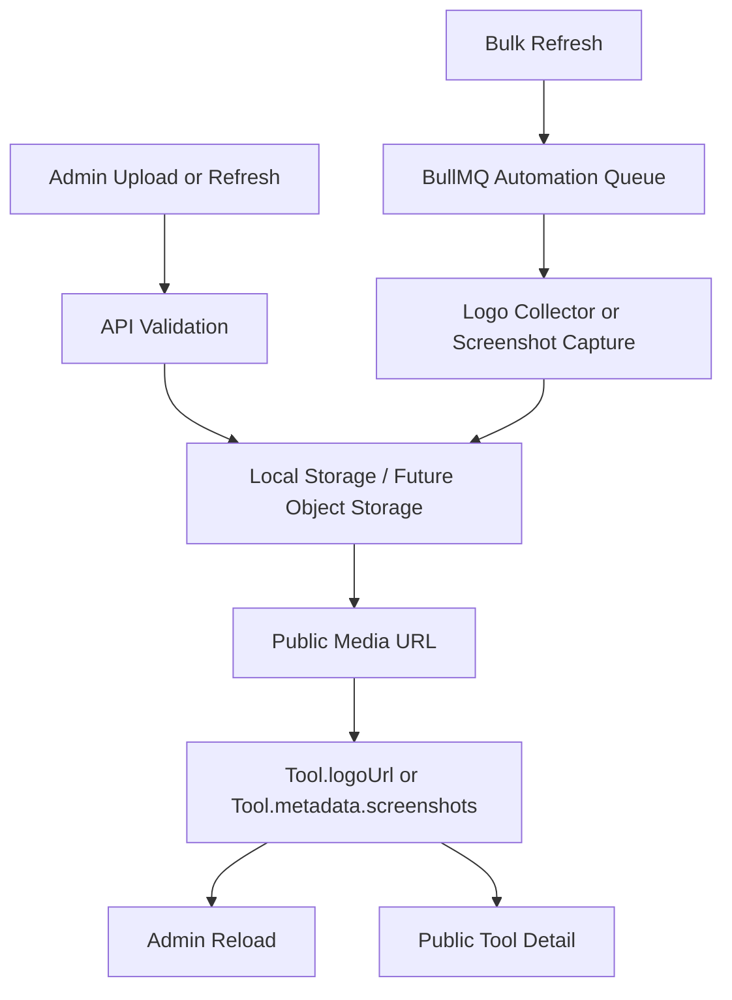

# Release Candidate Sprint 2 Batch 2 - Media Pipeline

## Executive Summary

This batch establishes the production media pipeline for the AI Tool CMS directory without changing the database schema. It reuses the existing `Tool.logoUrl`, `Tool.metadata`, `ToolScreenshot`, local storage, public media routes, automation queues, and admin upload flows.

The pipeline now supports a complete logo resolution strategy, admin upload, screenshot upload by URL or file, background screenshot refresh, CDN-ready media URLs, broken image fallback, retryable queue jobs, and bulk refresh operations.

## Scope

Implemented in this batch:

- Logo pipeline strategy aligned to production priority order.
- Screenshot refresh queue endpoint for bulk admin operations.
- Upload response metadata for CDN readiness, cache policy, storage key, optimization status, and screenshot variants.
- Production media pipeline documentation.

Explicitly not changed:

- No Prisma schema migration.
- No public page redesign.
- No scraping of copyrighted page content.
- No fake logos or screenshots.
- No new storage provider lock-in.

## Logo Pipeline

### Priority Order

1. Stored logo from `Tool.logoUrl`.
2. Website favicon from `/favicon.ico` and declared icon links.
3. Apple Touch Icon from `/apple-touch-icon.png` and `/apple-touch-icon-precomposed.png`.
4. SVG icon from declared icon links.
5. Simple Icons CDN candidate.
6. Generated initials avatar in UI fallback components.
7. Default AI icon fallback.

### Existing Implementation

Logo discovery is implemented in `packages/automation/src/tool-logo.ts`.

Capabilities:

- Reads current `Tool.logoUrl` first and skips collection unless forced.
- Uses cached `metadata.collectedLogoUrl` when available.
- Fetches public homepage HTML only to discover referenced icon assets.
- Discovers favicon, declared icon links, SVG icons, Apple Touch icons, Simple Icons, OpenGraph image, Twitter image, and visible logo images.
- Validates image response type, byte size, dimensions where detectable, non-empty content, and HTML false positives.
- Stores collected logos under `storage/logos`.
- Saves normalized public URL to `Tool.logoUrl` when no stored logo exists.
- Records collection status under `Tool.metadata.logoCollection`.

### Manual and Bulk Refresh

Manual refresh:

- `POST /v1/automation/logos/:toolId`
- Queues `automation-tool-logo-collect`.

Preview:

- `GET /v1/automation/logos/:toolId/preview`
- Returns candidate validation details before applying.

Bulk refresh:

- `POST /v1/tools/bulk/logo-refresh`
- Accepts `toolIds` and optional `force`.
- Queues one retryable job per tool.

## Screenshot Pipeline

### Supported Sources

- Admin upload through `POST /v1/tools/assets/upload?kind=screenshot`.
- Remote screenshot URL stored in `Tool.metadata.screenshots` from the Tool Editor.
- Background capture from tool website through `automation-screenshot-capture`.
- Public detail fallback reads `Tool.metadata.screenshots` when relational screenshots are unavailable.

### Background Capture

Screenshot capture is implemented in `packages/screenshot/src/capture.ts`.

Capabilities:

- Captures `DESKTOP`, `MOBILE`, and `DARK` variants.
- Uses Playwright where available.
- Stores files under `storage/screenshots`.
- Upserts relational records in `ToolScreenshot` by `toolId` and `variant`.
- Falls back to placeholder image only when capture engine fails, preventing job crashes.

### Bulk Refresh Endpoint

New endpoint:

- `POST /v1/tools/bulk/screenshot-refresh`

Request:

```json
{
  "toolIds": ["uuid"],
  "variants": ["DESKTOP", "MOBILE", "DARK"]
}
```

Response:

```json
{
  "queued": 1,
  "jobIds": ["job-id"]
}
```

This endpoint uses existing Tool permissions and queues one screenshot capture job per tool.

### Upload Metadata

Upload endpoint:

- `POST /v1/tools/assets/upload?kind=logo`
- `POST /v1/tools/assets/upload?kind=screenshot`

The response now includes:

- `url`
- `filename`
- `mimeType`
- `size`
- `storageKey`
- `kind`
- `cdnReady`
- `cacheControl`
- `optimized`
- `thumbnailUrl` for screenshots
- `variants` for screenshot original and thumbnail references

Current thumbnail behavior uses the original uploaded screenshot URL as a safe compatibility thumbnail reference. This keeps the API CDN-ready without requiring a new image-processing dependency or schema migration. A future optimization pass can replace this with generated WebP thumbnails.

## Media Storage and CDN Readiness

Current storage paths:

- Logos: `storage/logos`
- Screenshots: `storage/screenshots`

Public routes:

- `/logos/:filename`
- `/screenshots/:filename`

Both routes sanitize filenames and return cache headers:

```http
cache-control: public, max-age=86400, stale-while-revalidate=604800
```

This makes the pipeline compatible with nginx, Cloudflare, S3-compatible storage, MinIO, or any CDN that can cache public media URLs.

## Broken Image Detection and Fallback

Backend validation:

- Logo collector rejects non-image responses.
- Logo collector rejects HTML responses masquerading as image assets.
- Logo collector rejects empty or oversized files.
- Upload service validates MIME type and size before writing.

Frontend fallback:

- Admin ToolLogo component avoids broken image icons.
- Public ToolLogo component avoids broken image icons.
- Fallback order is stored logo, collected logo, generated initials, category icon, default icon.

## Retry Queue

The queue layer uses BullMQ default retry behavior:

- `attempts: 3`
- exponential backoff starting at `5000ms`
- completed and failed job retention for operational inspection

Queues involved:

- `automation-tool-logo-collect`
- `automation-screenshot-capture`

## Admin Operations

Admin-supported operations:

- Upload logo from Tool Editor.
- Upload screenshot from Tool Editor.
- Keep screenshot URL input for remote URL workflows.
- Preview logo candidates.
- Refresh a single tool logo.
- Bulk refresh tool logos.
- Bulk refresh tool screenshots through the new API client function.

## Public Rendering

Public pages should render media through normalized URLs and resilient fallback components.

Expected behavior:

- Tool cards display an icon for every tool.
- Tool detail displays an icon for every tool.
- Tool detail displays screenshots from relational screenshots or metadata screenshots.
- Empty screenshot sections are hidden.
- Broken image icons are not shown to users.

## Data Flow



## Validation Checklist

- Logo upload accepts PNG, JPG, WEBP, SVG, and ICO.
- Screenshot upload accepts PNG, JPG, WEBP, SVG, and ICO.
- Upload rejects unsupported MIME types.
- Upload rejects files larger than 5 MB.
- Logo refresh queues a retryable job.
- Bulk logo refresh queues one job per tool.
- Bulk screenshot refresh queues one job per tool.
- Public `/logos/:filename` returns image content with cache headers.
- Public `/screenshots/:filename` returns image content with cache headers.
- Admin and public ToolLogo components do not expose broken image icons.

## Future Hardening

Recommended next improvements:

1. Add real thumbnail generation with `sharp` or an existing image service.
2. Add remote object storage adapter for MinIO/S3 writes instead of local filesystem writes.
3. Add media inventory table only if operational reporting outgrows `Tool.metadata` and `ToolScreenshot`.
4. Add scheduled broken media audit using existing link-check or website-monitor jobs.
5. Add Cloudflare image resizing or CDN transform integration for screenshots.
6. Add admin media history view with last refresh status and failure reason.

## Acceptance Status

| Requirement | Status | Evidence |
| --- | --- | --- |
| Stored logo priority | PASS | `Tool.logoUrl` checked before collection. |
| Website favicon | PASS | Logo collector discovers `/favicon.ico` and declared icons. |
| Apple Touch Icon | PASS | Logo collector discovers Apple Touch icon paths. |
| SVG icon | PASS | Logo collector detects SVG declared icons. |
| Simple Icons | PASS | Logo collector builds Simple Icons candidate. |
| Generated initials | PASS | Admin/Public ToolLogo fallback components. |
| Default icon | PASS | Admin/Public ToolLogo fallback components. |
| Screenshot upload | PASS | `POST /v1/tools/assets/upload?kind=screenshot`. |
| Remote screenshot URL | PASS | Tool Editor stores URLs in `Tool.metadata.screenshots`. |
| Compression metadata | WARN | Upload reports optimization status; actual compression is deferred. |
| Thumbnail metadata | WARN | Thumbnail reference is API-compatible but currently aliases original. |
| Preview | PASS | Admin screenshot previews and logo candidate preview. |
| CDN ready | PASS | Public media routes include cache headers and stable URLs. |
| Broken image detection | PASS | Backend validation plus frontend fallback. |
| Retry queue | PASS | BullMQ automation queues use retry/backoff. |
| Admin bulk refresh | PASS | Logo bulk refresh existed; screenshot bulk refresh added. |

## Files Changed

- `apps/api/src/tools/dto/content-ops.dto.ts`
- `apps/api/src/tools/tools.controller.ts`
- `apps/api/src/tools/tools.service.ts`
- `apps/api/src/tools/tool-assets.service.ts`
- `apps/admin/src/lib/api.ts`
- `docs/14-production/MediaPipeline.md`
