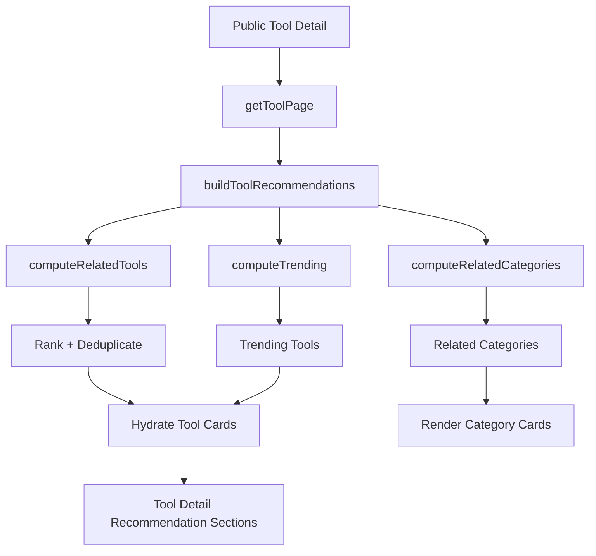

# Recommendation Engine

Release Candidate Sprint 2 Batch 5

## Summary

This batch replaces the basic public tool alternatives logic with a reusable recommendation engine that can rank and group recommendations for production AI tool discovery pages.

The implementation keeps the existing Prisma schema and uses current catalog signals:

- Shared tags
- Shared categories
- Pricing model
- Platforms from `Tool.metadata`
- Popularity signals from metadata, search clicks, favorites, and approved reviews
- Recently updated freshness
- Existing semantic embeddings when available

## Implemented Scope

### Recommendation Package

Updated `packages/recommendation` to expose a richer tool recommendation set:

- `computeRelatedTools(prisma, toolId, limit)`
- `buildToolRecommendations(prisma, toolId, limit)`
- `RelatedTool.breakdown`
- `RelatedCategory`
- `ToolRecommendationSet`

`buildToolRecommendations` returns:

- `similarTools`
- `alternatives`
- `moreLikeThis`
- `trendingTools`
- `relatedCategories`

### Ranking Factors

| Factor | Source | Use |
| --- | --- | --- |
| Shared Tags | `ToolTag` | Strongest relevance signal |
| Shared Categories | `ToolCategory` | Category-level similarity |
| Pricing | `Tool.pricingModel` | Boosts tools with similar buying model |
| Platforms | `Tool.metadata.aiPlatforms` or `Tool.metadata.platforms` | Boosts tools available on similar platforms |
| Popularity | `metadata.popularityScore`, search clicks, favorites, reviews | Boosts known demand and trust signals |
| Recently Updated | `Tool.updatedAt` | Freshness boost for recently maintained tools |
| Semantic Similarity | `metadata.searchEmbedding` | Optional embedding-based boost when present |

### Duplicate Prevention

The engine excludes the source tool and deduplicates candidates by:

- Normalized website hostname
- Normalized tool name
- Recommendation section-level `toolId` tracking

This prevents the same tool from appearing repeatedly across `similarTools`, `alternatives`, and `moreLikeThis` within one response.

### Public Tool Detail Integration

Updated `apps/web/src/lib/tool-page.ts` so public tool detail pages use `buildToolRecommendations` instead of the old local `computeToolAlternatives` implementation.

The page now hydrates lightweight recommendation results into UI cards with:

- slug
- name
- summary
- logoUrl
- collectedLogoUrl
- categoryIconUrl
- pricingModel
- reason

### Public Display Sections

Updated `apps/web/src/components/seo/tool-detail-page.tsx` to render recommendation sections only when data exists:

- Similar Tools
- Alternatives
- More Like This
- Trending
- Related Categories

No empty placeholder blocks are rendered.

## Data Flow



## Files Changed

- `packages/recommendation/src/related-tools.ts`
- `packages/recommendation/src/types.ts`
- `packages/recommendation/src/index.ts`
- `packages/recommendation/src/home-sections.ts`
- `apps/web/src/lib/tool-page.ts`
- `apps/web/src/components/seo/tool-detail-page.tsx`
- `apps/web/package.json`
- `pnpm-lock.yaml`

## Acceptance Mapping

| Requirement | Status | Notes |
| --- | --- | --- |
| Replace basic Alternatives | PASS | Public tool page now uses `buildToolRecommendations`. |
| Shared Tags ranking | PASS | Strong boost in `scoreCandidate`. |
| Shared Categories ranking | PASS | Category overlap boost. |
| Pricing ranking | PASS | Same pricing model boost. |
| Platforms ranking | PASS | Uses metadata platform arrays. |
| Popularity ranking | PASS | Uses popularity score, clicks, favorites, reviews. |
| Recently Updated ranking | PASS | Freshness boost by `updatedAt`. |
| Do not recommend duplicates | PASS | Source exclusion plus website/name/section dedupe. |
| Display Similar Tools | PASS | Added public section. |
| Display Related Categories | PASS | Added public section. |
| Display More Like This | PASS | Added public section. |
| Display Trending | PASS | Added public section from weekly trending. |
| No schema migration | PASS | Existing schema only. |

## Verification

Attempted commands:

```bash
pnpm typecheck
pnpm install --lockfile-only
CI=true pnpm install --frozen-lockfile
```

Result:

- Initial `pnpm typecheck` reached real TypeScript checks and exposed issues in `packages/recommendation` and `apps/web`; those code issues were fixed.
- After adding the new workspace dependency to `apps/web/package.json`, pnpm attempted to rebuild `node_modules`.
- Dependency install repeatedly failed due to external registry/socket timeouts while downloading existing project dependencies such as Prisma, Next.js, Turbo, and TypeScript packages.
- Full `pnpm typecheck` and `pnpm lint` could not be completed in this environment after `node_modules` was left incomplete by timed-out installs.

Recommended follow-up once network is stable:

```bash
CI=true pnpm install --frozen-lockfile
pnpm typecheck
pnpm lint
```

## Operational Notes

- The engine currently computes recommendations at request time. For 10,000+ tools, add cached recommendation snapshots or background precomputation.
- Platform matching depends on normalized metadata arrays. Import and editor flows should keep `aiPlatforms` or `platforms` clean and consistent.
- Semantic similarity only applies when `metadata.searchEmbedding` exists.
- Trending tools use the existing ranking package and weekly period.

## Future Improvements

- Add per-category recommendation caching.
- Add click-through feedback loop for recommendation quality.
- Store recommendation snapshots for popular tools.
- Add admin analytics for recommendation CTR.
- Add A/B testing for ranking weights.
