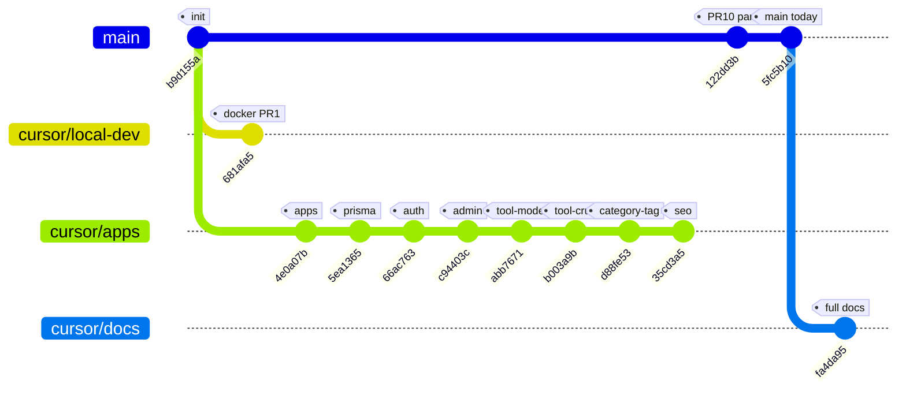
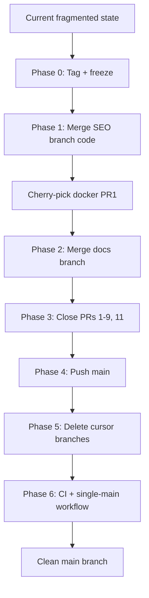

# Repository Audit Report

> **Document Type:** Repository Health Audit  
> **Version:** 1.0.0  
> **Status:** Active  
> **Audit Date:** 2026-06-28  
> **Repository:** [zhshg/ai-tool-cms](https://github.com/zhshg/ai-tool-cms)  
> **Auditor Role:** Lead Git Maintainer  
> **Policy Reference:** [GitWorkflowUpdate.md](../00-project/GitWorkflowUpdate.md)

---

## Executive Summary

AI Tool CMS v2 suffers from **split-brain development**: application code, infrastructure, and documentation live on **disjoint Cursor-generated branches**, while **`main` contains only 17 files** (docker skeleton + two project docs). Ten open **Draft Pull Requests** remain unmerged. No CI/CD pipeline exists.

| Metric | Current State | Target State |
|---|---|---|
| Files on `main` | 17 | Full monorepo (100+ files) |
| Open Draft PRs | 10 | 0 (consolidated or closed) |
| Active `cursor/*` branches | 11 | 0 after migration |
| `apps/` on `main` | Absent | Present |
| Architecture docs on `main` | Partial | Complete |
| CI/CD | None | GitHub Actions (future) |

**Overall health grade: C−** (strong documentation effort on a branch; weak integration on `main`).

---

## Table of Contents

1. [Current Branches](#current-branches)
2. [Pull Requests](#pull-requests)
3. [Repository Health](#repository-health)
4. [Recommended Actions](#recommended-actions)
5. [Appendix](#appendix)

---

## Current Branches

### Summary Table

| Branch | Commits Ahead of `main` | Top-Level Dirs | Merged to `main`? | Obsolete? |
|---|---|---|---|---|
| `main` | — | `docker`, `docs` | — | **No** (default) |
| `cursor/local-dev-environment-c760` | 1 (from `b9d155a`) | `docker` | No | **Yes** (after docker merged) |
| `cursor/initialize-applications-c760` | 1 | `apps`, `docker` | No | **Yes** (superseded) |
| `cursor/initialize-prisma-c760` | 2 | `apps`, `docker`, `packages`, `prisma` | No | **Yes** (superseded) |
| `cursor/implement-authentication-c760` | 3 | `apps`, `packages`, `prisma` | No | **Yes** (superseded) |
| `cursor/admin-dashboard-layout-c760` | 4 | `apps`, `packages`, `prisma` | No | **Yes** (superseded) |
| `cursor/design-tool-entity-c760` | 5 | `apps`, `packages`, `prisma` | No | **Yes** (superseded) |
| `cursor/implement-tool-crud-c760` | 8 | `apps`, `packages`, `prisma` | No | **Yes** (superseded) |
| `cursor/implement-category-tag-crud-c760` | 9 | `apps`, `packages`, `prisma` | No | **Yes** (superseded) |
| `cursor/implement-seo-foundation-c760` | 10 (code) | `apps`, `packages`, `prisma` | No | **No** (code integration source) |
| `cursor/add-project-docs-c760` | 0 | `docker`, `docs` | **Partial** (PR #10) | **Yes** |
| `cursor/add-techstack-docs-c760` | 16 (docs) | `.cursor`, `docker`, `docs` | No | **No** (docs integration source) |

*Commit counts for code branches are measured from merge-base `b9d155a` (initial project structure). Doc branch count is from `main` tip `5fc5b10`.*

---

### `main`

| Attribute | Detail |
|---|---|
| **Purpose** | Default branch; intended production line |
| **Tip commit** | `5fc5b10` — `docs: 新增产品愿景文档 docs/00-project/Vision.md` |
| **Merged** | N/A |
| **Obsolete** | No |
| **Contents** | `docker/`, `docker-compose.yml`, `docs/00-project/README.md`, `docs/00-project/Vision.md`, root config stubs |
| **Missing** | `apps/`, `packages/`, `prisma/`, `docs/01-architecture/`, CI, most project docs |

---

### `cursor/local-dev-environment-c760`

| Attribute | Detail |
|---|---|
| **Purpose** | Commit-0002 — Docker Compose for PostgreSQL, Redis, Nginx (PR #1) |
| **Tip commit** | `681afa5` — `feat(docker): 搭建本地开发基础设施环境` |
| **Merged to `main`** | **No** |
| **Obsolete** | **Yes** after docker-compose env-var and healthcheck improvements are integrated |
| **Notes** | Forked from `b9d155a` **in parallel** with `initialize-applications`; not an ancestor of the code stack |

---

### `cursor/initialize-applications-c760`

| Attribute | Detail |
|---|---|
| **Purpose** | Commit-0003 — Scaffold `apps/web`, `apps/admin`, `apps/api` (PR #2) |
| **Tip commit** | `4e0a07b` |
| **Merged to `main`** | **No** |
| **Obsolete** | **Yes** — included in later linear stack |
| **Notes** | Base of the sequential feature branch chain |

---

### `cursor/initialize-prisma-c760`

| Attribute | Detail |
|---|---|
| **Purpose** | Commit-0004 — Prisma schema, RBAC models, migrations (PR #3) |
| **Tip commit** | `5ea1365` |
| **Merged to `main`** | **No** |
| **Obsolete** | **Yes** — superseded by `implement-seo-foundation-c760` |

---

### `cursor/implement-authentication-c760`

| Attribute | Detail |
|---|---|
| **Purpose** | Commit-0005 — JWT auth, RBAC guards (PR #4) |
| **Tip commit** | `66ac763` |
| **Merged to `main`** | **No** |
| **Obsolete** | **Yes** — superseded |

---

### `cursor/admin-dashboard-layout-c760`

| Attribute | Detail |
|---|---|
| **Purpose** | Commit-0006 — Admin dashboard layout shell (PR #5) |
| **Tip commit** | `c94403c` |
| **Merged to `main`** | **No** |
| **Obsolete** | **Yes** — superseded |

---

### `cursor/design-tool-entity-c760`

| Attribute | Detail |
|---|---|
| **Purpose** | Commit-0007 — Tool Prisma model and migration (PR #6) |
| **Tip commit** | `abb7671` |
| **Merged to `main`** | **No** |
| **Obsolete** | **Yes** — superseded (Tool CRUD branch includes this) |

---

### `cursor/implement-tool-crud-c760`

| Attribute | Detail |
|---|---|
| **Purpose** | Commit-0008 — Tool REST CRUD API (PR #7) |
| **Tip commit** | `63f9034` |
| **Merged to `main`** | **No** |
| **Obsolete** | **Yes** — superseded by category/tag and SEO branches |

---

### `cursor/implement-category-tag-crud-c760`

| Attribute | Detail |
|---|---|
| **Purpose** | Commit-0009 — Category, Tag CRUD and Tool relations (PR #8) |
| **Tip commit** | `d88fe53` |
| **Merged to `main`** | **No** |
| **Obsolete** | **Yes** — superseded by SEO branch |

---

### `cursor/implement-seo-foundation-c760`

| Attribute | Detail |
|---|---|
| **Purpose** | Commit-0010 — `@ai-tool-cms/seo` package + Web integration (PR #9) |
| **Tip commit** | `35cd3a5` |
| **Merged to `main`** | **No** |
| **Obsolete** | **No** — **most complete application branch** |
| **Contents** | `apps/web`, `apps/admin`, `apps/api`, `packages/auth`, `packages/database`, `packages/seo`, `prisma/` |
| **Linear history** | 10 commits from apps init through SEO (see Appendix) |
| **Gap** | Does **not** include `cursor/local-dev-environment-c760` docker-compose commit (`681afa5`) |

---

### `cursor/add-project-docs-c760`

| Attribute | Detail |
|---|---|
| **Purpose** | Early project docs (README entry, Vision) |
| **Tip commit** | `5fc5b10` (same as `main`) |
| **Merged to `main`** | **Yes** (via PR #10, 2026-06-28) |
| **Obsolete** | **Yes** — fully absorbed into `main` |

---

### `cursor/add-techstack-docs-c760`

| Attribute | Detail |
|---|---|
| **Purpose** | Full project + architecture documentation, Feature Catalog, User Stories, Git workflow policy |
| **Tip commit** | `fa4da95` — `docs: standardize git workflow for single-main development` |
| **Merged to `main`** | **No** |
| **Obsolete** | **No** — **most complete documentation branch** |
| **Contents** | 39 doc files, `.cursor/rules/git-workflow.mdc`, `docs/01-architecture/` (24 files), ADR, RFC |
| **Commits ahead of `main`** | 16 |

---

### Branch Topology (Conceptual)



---

## Pull Requests

### Summary Table

| PR | Title | Branch | State | Draft | Recommendation |
|---|---|---|---|---|---|
| [#1](https://github.com/zhshg/ai-tool-cms/pull/1) | feat(docker): 本地开发基础设施 | `cursor/local-dev-environment-c760` | OPEN | Yes | **Close** after cherry-pick docker improvements to `main` |
| [#2](https://github.com/zhshg/ai-tool-cms/pull/2) | feat(apps): 初始化 Web、Admin、API | `cursor/initialize-applications-c760` | OPEN | Yes | **Close** — superseded by #9 stack |
| [#3](https://github.com/zhshg/ai-tool-cms/pull/3) | feat(prisma): 初始化数据库与 RBAC | `cursor/initialize-prisma-c760` | OPEN | Yes | **Close** — superseded |
| [#4](https://github.com/zhshg/ai-tool-cms/pull/4) | feat(auth): JWT 与 RBAC | `cursor/implement-authentication-c760` | OPEN | Yes | **Close** — superseded |
| [#5](https://github.com/zhshg/ai-tool-cms/pull/5) | feat(admin): Dashboard 布局 | `cursor/admin-dashboard-layout-c760` | OPEN | Yes | **Close** — superseded |
| [#6](https://github.com/zhshg/ai-tool-cms/pull/6) | feat(prisma): Tool 实体模型 | `cursor/design-tool-entity-c760` | OPEN | Yes | **Close** — superseded |
| [#7](https://github.com/zhshg/ai-tool-cms/pull/7) | feat(api): Tool CRUD | `cursor/implement-tool-crud-c760` | OPEN | Yes | **Close** — superseded |
| [#8](https://github.com/zhshg/ai-tool-cms/pull/8) | feat(api): Category、Tag CRUD | `cursor/implement-category-tag-crud-c760` | OPEN | Yes | **Close** — superseded |
| [#9](https://github.com/zhshg/ai-tool-cms/pull/9) | feat(seo): SEO 基础设施 | `cursor/implement-seo-foundation-c760` | OPEN | Yes | **Merge** (or merge via `main` locally per migration plan) |
| [#10](https://github.com/zhshg/ai-tool-cms/pull/10) | docs: 项目总入口 README | `cursor/add-project-docs-c760` | **MERGED** | Was Draft | **None** — already merged |
| [#11](https://github.com/zhshg/ai-tool-cms/pull/11) | docs: 技术栈与架构文档 | `cursor/add-techstack-docs-c760` | OPEN | Yes | **Merge** (or integrate docs per migration plan) |

---

### Per-PR Detail

#### PR #1 — Docker local dev (OPEN, Draft)

| Field | Value |
|---|---|
| **Status** | Open, Draft, not merged |
| **Value** | Env-var-driven `docker-compose.yml`, documented ports |
| **Conflict** | Parallel to apps branch; not in SEO branch |
| **Recommendation** | **Close** after manually merging docker delta into `main` during consolidation |

#### PR #2–#8 — Incremental features (OPEN, Draft)

| Field | Value |
|---|---|
| **Status** | Open, Draft, not merged |
| **Value** | Historical increments; all contained in PR #9 branch |
| **Recommendation** | **Close** with comment: "Superseded by consolidation to main via implement-seo-foundation-c760" |

#### PR #9 — SEO foundation (OPEN, Draft)

| Field | Value |
|---|---|
| **Status** | Open, Draft, not merged |
| **Value** | **Full application monorepo** through Commit-0010 |
| **Recommendation** | **Merge** to `main` as primary code integration — or land equivalent commits on `main` directly (preferred under [GitWorkflowUpdate.md](../00-project/GitWorkflowUpdate.md)) |

#### PR #10 — Project README (MERGED)

| Field | Value |
|---|---|
| **Status** | Merged 2026-06-28 |
| **Recommendation** | None |

#### PR #11 — Full documentation (OPEN, Draft)

| Field | Value |
|---|---|
| **Status** | Open, Draft, not merged |
| **Value** | 16 commits: TechStack, architecture spec, UserStories, FeatureCatalog, GitWorkflowUpdate |
| **Recommendation** | **Merge** to `main` after or with code integration — docs reference architecture and features not yet on `main` |

#### Future PR strategy

After migration: **do not recreate** Draft PRs. Use **direct commits to `main`** per GitWorkflowUpdate until v1.0.0.

---

## Repository Health

### Directory Structure

| Aspect | Score | Assessment |
|---|---|---|
| **Planned layout** | A | [FolderStructure.md](../00-project/FolderStructure.md) defines clear `apps/`, `packages/`, `docs/`, `prisma/` |
| **On `main`** | D | Only `docker/` + minimal `docs/` — **does not match documented layout** |
| **On `implement-seo-foundation-c760`** | B+ | Core apps + 3 packages + prisma; missing `crawler`, `worker`, `ui`, `types`, etc. |
| **Consistency** | C | README describes full monorepo; `main` clone is misleading |

**Finding:** Documented structure is sound; **implementation is stranded off `main`**.

---

### Documentation

| Aspect | Score | Assessment |
|---|---|---|
| **Volume** | A | 39 files on `cursor/add-techstack-docs-c760` |
| **On `main`** | D | 2 files in `docs/00-project/` |
| **Architecture** | A | Full `docs/01-architecture/` with C4, ADR, RFC, sequences |
| **Product** | A | Vision, Scope, UserStories (90), FeatureCatalog (88) |
| **Accuracy vs code** | B | Docs describe modules not present on `main`; aligned with SEO branch |

**Finding:** Documentation is **enterprise-grade on a branch**; **`main` readers see an empty project**.

---

### Monorepo

| Aspect | Score | Assessment |
|---|---|---|
| **Tooling** | B | `pnpm-workspace.yaml`, `turbo.json`, `tsconfig.base.json` on `main` |
| **Workspace packages** | F on `main` | No `apps/*` or `packages/*` tracked |
| **On SEO branch** | B | web, admin, api, auth, database, seo; Prisma scripts in root `package.json` |
| **Build pipeline** | Unknown | Not verified on CI; local turbo config exists |

**Finding:** Monorepo **scaffold exists**; **workspace members only on feature branches**.

---

### Git Workflow

| Aspect | Score | Assessment |
|---|---|---|
| **Documented process** | A | GitWorkflow.md + **GitWorkflowUpdate.md** (single-main policy) |
| **Actual process** | D | 11 `cursor/*` branches, 10 open Draft PRs, fragmented `main` |
| **Cursor rules** | A | `.cursor/rules/git-workflow.mdc` on docs branch |
| **Alignment** | F | Practice contradicts policy until migration completes |

**Finding:** Policy is defined; **execution must catch up** (see migration plan).

---

### Docker

| Aspect | Score | Assessment |
|---|---|---|
| **On `main`** | C | Basic `docker-compose.yml`, Dockerfile, nginx/postgres/redis config |
| **PR #1 branch** | B+ | Improved compose with env vars |
| **SEO branch** | B | Compose with healthchecks; different env style than PR #1 |
| **Production readiness** | C | No multi-stage app images in compose on `main` |

**Finding:** Docker **foundation exists**; needs **single merged compose** on `main`.

---

### CI/CD

| Aspect | Score | Assessment |
|---|---|---|
| **GitHub Actions** | F | **No `.github/workflows/`** |
| **Branch protection** | F | Not configured (inferred) |
| **Automated test** | F | No CI running lint/test/build |
| **Release automation** | F | Manual only |

**Finding:** **Critical gap** — add CI after `main` consolidation.

---

### Architecture

| Aspect | Score | Assessment |
|---|---|---|
| **Specification** | A | 24 architecture docs, ADRs, RFCs (on docs branch) |
| **Implementation** | C | Partial on SEO branch (API modules, auth, seo package) |
| **Traceability** | A | FeatureCatalog maps FE-* to modules |
| **On `main`** | F | No architecture docs under `docs/01-architecture/` |

**Finding:** Architecture is **well-documented**; **code lags documentation**.

---

### Developer Experience

| Aspect | Score | Assessment |
|---|---|---|
| **Clone and run** | F on `main` | `pnpm install` / `dev` scripts reference missing packages |
| **On SEO branch** | B | `dev:web`, `dev:admin`, `dev:api`, Prisma scripts present |
| **Onboarding docs** | B+ | README, GitWorkflowUpdate, architecture reading order |
| **Agent confusion** | D | Cloud agents created branches/PRs against outdated policy |

**Finding:** **New contributors cloning `main` cannot run the project.**

---

### Health Summary Matrix

| Area | Grade | Blocker? |
|---|---|---|
| Directory Structure | C | Yes — `main` incomplete |
| Documentation | B− | Yes — split across branch |
| Monorepo | D | Yes — no apps on `main` |
| Git Workflow | D | Yes — branch sprawl |
| Docker | C | No — mergeable |
| CI/CD | F | Yes — no automation |
| Architecture | B | No — docs ready |
| Developer Experience | D | Yes — `main` not runnable |

---

## Recommended Actions

### Migration Goal

**One clean `main` branch** containing:

1. Full application code (through SEO foundation / Commit-0010)
2. Merged docker-compose best practices (from PR #1 + SEO branch)
3. Complete documentation + `.cursor/rules/`
4. Zero open Draft PRs for superseded increments
5. Deleted obsolete remote branches

### Step-by-Step Migration Plan

> **Executor:** Lead maintainer (human). **Not** automated by Cursor agents unless explicitly tasked.

#### Phase 0 — Preparation (30 min)

| Step | Action |
|---|---|
| 0.1 | Announce freeze on new `cursor/*` branches ([GitWorkflowUpdate.md](../00-project/GitWorkflowUpdate.md)) |
| 0.2 | `git checkout main && git pull origin main` |
| 0.3 | Tag current `main` for safety: `git tag archive/pre-consolidation-2026-06-28` |
| 0.4 | Push tag: `git push origin archive/pre-consolidation-2026-06-28` |

#### Phase 1 — Integrate application code (1–2 hours)

| Step | Action |
|---|---|
| 1.1 | Merge code tip into `main`: `git merge origin/cursor/implement-seo-foundation-c760` |
| 1.2 | Resolve conflicts (expect `README.md`, `docker-compose.yml`, `.env.example`) |
| 1.3 | Cherry-pick PR #1 docker commit if needed: `git cherry-pick 681afa5` — resolve compose to use **env vars + healthchecks** |
| 1.4 | Run locally: `pnpm install`, `docker compose up -d`, `pnpm db:migrate`, `pnpm build` |
| 1.5 | Fix merge fallout only — **no new features** |
| 1.6 | Commit: `chore: consolidate application stack onto main` |

#### Phase 2 — Integrate documentation (30 min)

| Step | Action |
|---|---|
| 2.1 | Merge docs branch: `git merge origin/cursor/add-techstack-docs-c760` |
| 2.2 | Resolve conflicts (likely `README.md`, `docs/00-project/README.md`) |
| 2.3 | Verify links: `docs/01-architecture/`, `GitWorkflowUpdate.md`, `.cursor/rules/` |
| 2.4 | Commit if merge commit not used: `docs: consolidate project and architecture documentation onto main` |

#### Phase 3 — Close Pull Requests (15 min)

| Step | PR | Action |
|---|---|---|
| 3.1 | #9 | **Close** with note "Merged to main in consolidation" (if merged locally) OR **Merge** via GitHub if using PR UI |
| 3.2 | #11 | Same as #9 for docs |
| 3.3 | #1–#8 | **Close** as superseded — link to consolidation commit on `main` |
| 3.4 | #10 | Already merged — no action |

#### Phase 4 — Push and verify `main` (15 min)

| Step | Action |
|---|---|
| 4.1 | `git push origin main` |
| 4.2 | Verify GitHub `main` shows `apps/`, `packages/`, `prisma/`, full `docs/` |
| 4.3 | Update default branch settings if needed (already `main`) |

#### Phase 5 — Delete obsolete branches (15 min)

| Step | Action |
|---|---|
| 5.1 | Delete remote branches (maintainer manual): |
| | `git push origin --delete cursor/local-dev-environment-c760` |
| | `git push origin --delete cursor/initialize-applications-c760` |
| | … (all `cursor/*` except optionally keep until verified) |
| 5.2 | Delete local tracking branches: `git fetch --prune` |
| 5.3 | **Do not delete** until Phase 4 verified |

#### Phase 6 — Establish ongoing workflow (1 hour)

| Step | Action |
|---|---|
| 6.1 | Enforce [GitWorkflowUpdate.md](../00-project/GitWorkflowUpdate.md) — direct commits to `main` |
| 6.2 | Add `.github/workflows/ci.yml` — lint, typecheck, build (future task) |
| 6.3 | Enable branch protection on `main` when CI is green (optional until v1.0) |
| 6.4 | Add `CHANGELOG.md` entry for consolidation release `v0.1.0` |

#### Phase 7 — Post-migration validation

| Check | Expected |
|---|---|
| `git clone` + `pnpm install` | Success |
| `docker compose up` | Postgres + Redis healthy |
| `pnpm dev:api` | API on :4000 |
| `docs/01-architecture/README.md` | Present on `main` |
| Open PR count | 0 |
| Remote `cursor/*` branches | 0 |

---

### Migration Flow Diagram



---

### Risk Register

| Risk | Mitigation |
|---|---|
| Merge conflicts in `docker-compose.yml` | Manual merge; keep env vars from PR #1 + healthchecks from SEO branch |
| Broken build after merge | Phase 1.4 local verification before push |
| Lost history | Tags `archive/pre-consolidation-*`; branches deletable only after push verified |
| Docs/code mismatch | Merge docs branch in Phase 2 after code stable |

---

## Appendix

### A. Linear Code Branch History (from `b9d155a`)

```
4e0a07b feat(apps): 初始化 Web、Admin、API 三个应用
5ea1365 feat(prisma): 初始化 PostgreSQL 数据库与 RBAC 模型
66ac763 feat(auth): 实现 JWT 认证与 RBAC 授权
c94403c feat(admin): 创建管理后台 Dashboard 布局
abb7671 feat(prisma): 新增 Tool 实体模型与迁移
b003a9b feat(api): 实现 Tool CRUD 接口
d107fa5 fix(api): 添加 GET / 根路径响应
63f9034 fix(api): 从 monorepo 根目录加载 .env 配置
d88fe53 feat(api): 实现 Category、Tag CRUD 及 Tool 关联
35cd3a5 feat(seo): 实现 SEO 基础设施包并集成到 web 应用
```

### B. Documentation Branch Commits (from `main`)

16 commits from `6f0f57f` (TechStack) through `fa4da95` (GitWorkflowUpdate).

### C. Files on `main` (audit snapshot)

```
.env.example, .gitignore, LICENSE, README.md, ROADMAP.md,
docker-compose.yml, docker/*, docs/00-project/README.md,
docs/00-project/Vision.md, package.json, pnpm-workspace.yaml,
tsconfig.base.json, turbo.json
```

**Total: 17 tracked files.**

### D. Related Documents

| Document | Path |
|---|---|
| Git workflow policy | [GitWorkflowUpdate.md](../00-project/GitWorkflowUpdate.md) |
| Full Git reference | [GitWorkflow.md](../00-project/GitWorkflow.md) |
| Release strategy | [ReleaseStrategy.md](../00-project/ReleaseStrategy.md) |
| Folder structure | [FolderStructure.md](../00-project/FolderStructure.md) |

---

**Report Version**

| Field | Value |
|---|---|
| Version | 1.0.0 |
| Audit Date | 2026-06-28 |
| Next Review | After Phase 7 completion |
